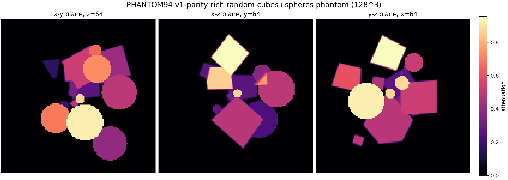

# TomoJAX

TomoJAX is a compact tomography and laminography toolbox for projection IO,
preprocessing, reconstruction, and alignment.



TomoJAX works with synthetic and real projection data. It provides a grouped CLI
for loading projection stacks, applying detector corrections, reconstructing
volumes, aligning geometry, and writing verification artifacts.

The command-line surface is the grouped `tomojax` command:

```bash
tomojax inspect scan.nxs
tomojax ingest ./projections --angles angles.csv --du 0.65 --dv 0.65 --out scan.nxs
tomojax preprocess raw.nxs corrected.nxs
tomojax recon --data corrected.nxs --out recon.nxs
tomojax align --data corrected.nxs --out aligned.nxs --mode cor
tomojax simulate --out synthetic.nxs --nx 64 --ny 64 --nz 64 --nu 64 --nv 64 --n-views 64
```

`tomojax preprocess` writes reconstruction-ready absorption/log-attenuation
projections by default. Use `--transmission` only when you intentionally need
normalized transmission output.

## Examples

The article visual pack shows the two main validation paths: controlled
synthetic misalignment studies with known truth, and reconstruction/alignment
outputs that can be compared visually.

| Synthetic misalignment set | Alignment before and after |
| --- | --- |
|  |  |

The older animated examples remain in `images/` for external links and profile
README references, but the project README focuses on the current v2 article
examples.

## Public package surface

Use these package facades:

- `tomojax.io` for projection payloads, NXtomo IO, validation,
  preprocessing, and quicklooks.
- `tomojax.geometry` for geometry metadata, axes, calibration state, and
  field-of-view helpers.
- `tomojax.forward` for differentiable forward projection and residual helpers.
- `tomojax.recon` for FBP, FISTA-TV, and SPDHG-TV reconstruction.
- `tomojax.align` for `AlignConfig`, `align`, and `align_multires`.
- `tomojax.datasets` for deterministic synthetic datasets.

The tests cover the public API, CLI routing, import boundaries,
IO/preprocessing workflows, deterministic simulation contracts, and tiny
numerical reconstruction workflows.

## Workflow docs

Start with the workflow guide that matches the data you want to process.

- [`docs/quickstart.md`](docs/quickstart.md)
- [`docs/synthetic-tomography.md`](docs/synthetic-tomography.md)
- [`docs/real-laminography.md`](docs/real-laminography.md)
- [`docs/support-matrix.md`](docs/support-matrix.md)
- [`docs/known-limitations.md`](docs/known-limitations.md)

## Development checks

Run the bounded product checks before sending changes for review.

```bash
just surface-check
just check
```

`just surface-check` is the bounded product feedback loop. It checks
formatting/lint configuration, private-import guardrails, and product tests.
