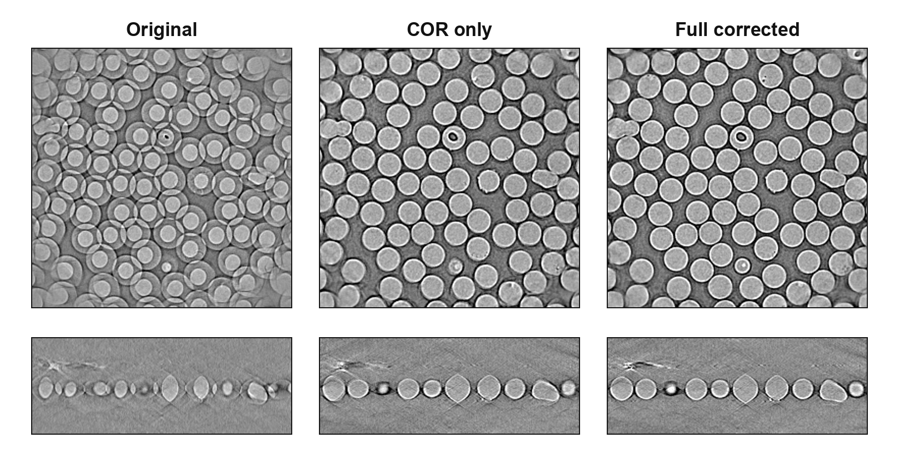
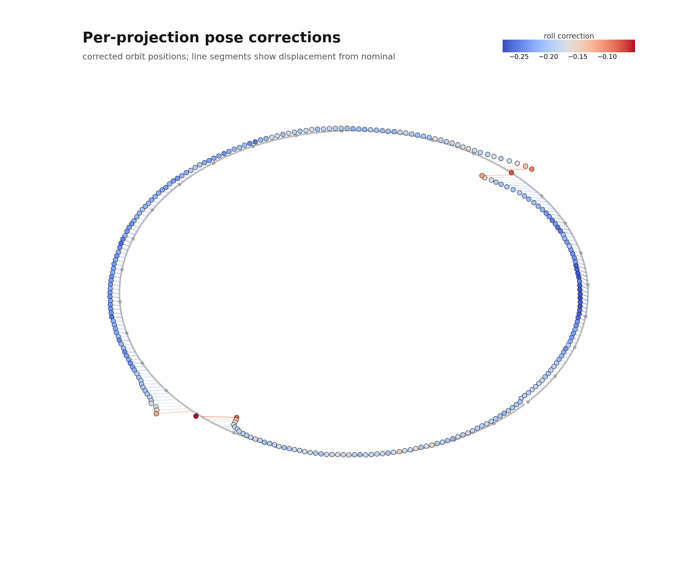
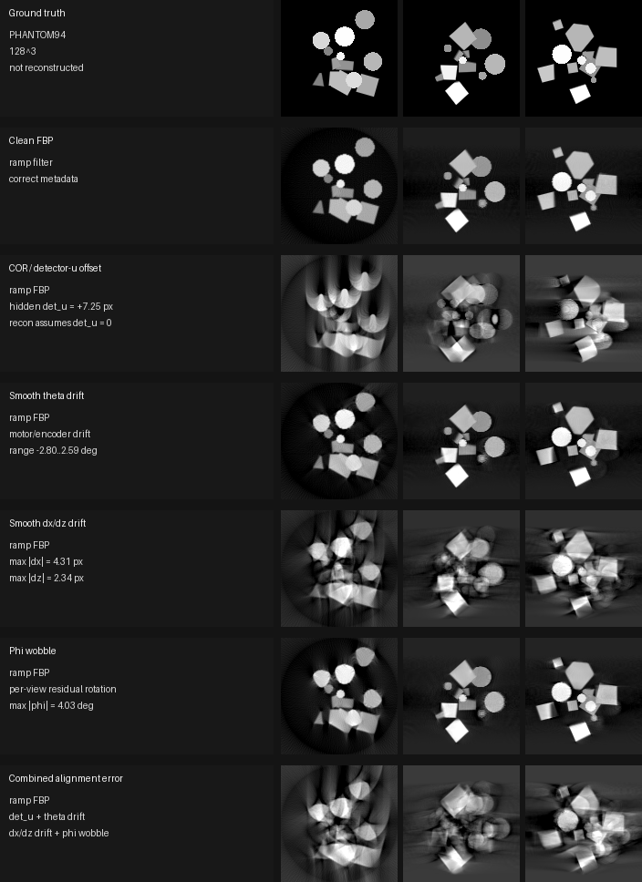
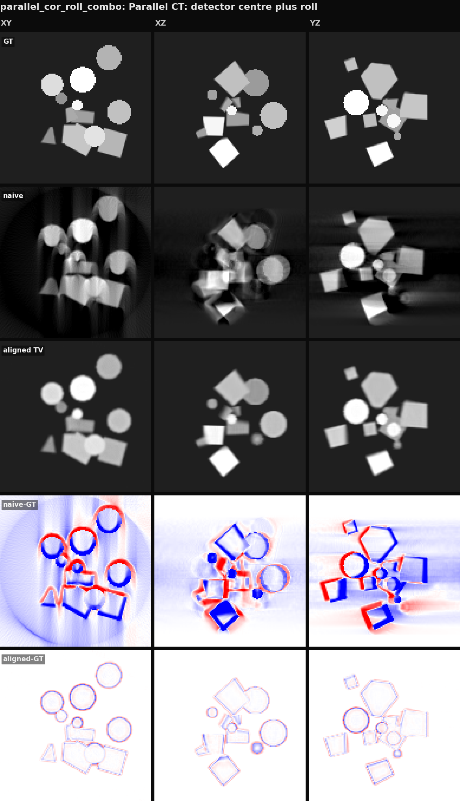

# TomoJAX

TomoJAX turns tomography and laminography projection data into reconstructed
volumes. It loads NeXus/HDF5 or TIFF stacks, applies dark/flat correction,
reconstructs with FBP or TV solvers, and can estimate per-projection pose or
detector-centre/COR alignment from the data.

| Laminography data alignment | Per-projection pose adjustments |
| --- | --- |
|  |  |


Use it when you have projections and approximate geometry and want to go from
raw detector frames to a reproducible reconstruction.

## What comes out

TomoJAX writes `.nxs` datasets that keep projections, reconstructed volume,
geometry metadata, preprocessing provenance, and alignment metadata together.

Three common starting points:

- raw NeXus/HDF5 scans with sample, flat, and dark frames;
- TIFF projection stacks with an angle sidecar;
- synthetic datasets for testing reconstruction and alignment settings.

## What you can do

Supported workflows:

| Task | Command |
| --- | --- |
| Inspect a scan | `tomojax inspect scan.nxs` |
| Validate a dataset | `tomojax validate scan.nxs` |
| Convert a TIFF stack into a TomoJAX dataset | `tomojax ingest ./projections --angles angles.csv --du 0.65 --dv 0.65 --out scan.nxs` |
| Apply dark/flat correction | `tomojax preprocess raw.nxs corrected.nxs` |
| Reconstruct a volume | `tomojax recon --data corrected.nxs --out recon.nxs` |
| Extract labelled PNG slices from a reconstruction | `tomojax slices --data recon.nxs --out quicklooks` |
| Correct per-projection sample motion | `tomojax align --data corrected.nxs --out aligned.nxs --mode pose` |
| Correct detector-centre/COR geometry | `tomojax align --data corrected.nxs --out aligned.nxs --mode cor` |
| Generate a synthetic test scan | `tomojax simulate --out synthetic.nxs --nx 64 --ny 64 --nz 64 --nu 64 --nv 64 --n-views 64` |

`tomojax preprocess` writes absorption/log-attenuation projections by default.
Use `--transmission` when you need normalized transmission output instead.

## Get started

Install the CPU development environment and check the CLI.

```bash
uv sync --locked --extra cpu --dev
uv run tomojax --help
```

On a Linux CUDA host, use the CUDA extra instead:

```bash
uv sync --locked --extra cuda12 --dev
just accelerator-smoke-cuda
```

`just accelerator-smoke-cuda` verifies the optional accelerator projector path.

If you do not have scan data yet, generate a small synthetic dataset and
reconstruct it:

```bash
uv run tomojax simulate \
  --out synthetic_scan.nxs \
  --nx 64 --ny 64 --nz 64 \
  --nu 64 --nv 64 \
  --n-views 64 \
  --phantom random_shapes

uv run tomojax recon --data synthetic_scan.nxs --out synthetic_recon.nxs
```

For a real NX/HDF5 scan, start by inspecting and validating it:

```bash
uv run tomojax inspect /path/to/scan.nxs
uv run tomojax validate /path/to/scan.nxs
uv run tomojax preprocess /path/to/raw.nxs corrected.nxs
uv run tomojax recon --data corrected.nxs --out recon.nxs
```

For TIFF projection stacks, ingest the stack first:

```bash
uv run tomojax ingest ./projections \
  --angles angles.csv \
  --du 0.65 \
  --dv 0.65 \
  --out scan.nxs
```

Then preprocess or reconstruct the resulting `.nxs` dataset.

## Examples

These use a synthetic phantom so the expected volume is known.

| Synthetic misalignment set | Alignment before and after |
| --- | --- |
|  |  |

Older animated examples remain in `images/`.

## Alignment

Start with `--mode pose` when the sample moves during acquisition, and use
`--mode cor` when you need a detector-centre or centre-of-rotation correction.

```bash
uv run tomojax align \
  --data corrected.nxs \
  --out aligned.nxs \
  --mode pose
```

The aligned dataset stores the reconstruction and alignment metadata together,
so you can inspect it later with `tomojax inspect aligned.nxs`.

Mixed setup and pose correction requires an explicit gauge policy because setup
and pose parameters can share gauge ambiguity:

```bash
uv run tomojax align \
  --data corrected.nxs \
  --out aligned_auto.nxs \
  --mode auto \
  --gauge-policy anchor_mean
```

## Python API

Main modules:

- `tomojax.io` for loading/saving datasets, NXtomo validation, preprocessing,
  and quicklooks.
- `tomojax.geometry` for geometry metadata, axes, calibration state, and
  field-of-view helpers.
- `tomojax.forward` for differentiable forward projection and residual helpers.
- `tomojax.recon` for FBP, FISTA-TV, and SPDHG-TV reconstruction.
- `tomojax.align` for `AlignConfig`, `align`, and `align_multires`.
- `tomojax.datasets` for deterministic synthetic datasets.

Tests cover CLI routing, IO and preprocessing, deterministic simulation, and
numerical reconstruction cases.

## Workflow docs

Start with the guide that matches your data.

- [`docs/quickstart.md`](docs/quickstart.md)
- [`docs/alignment-guide.md`](docs/alignment-guide.md)
- [`docs/synthetic-tomography.md`](docs/synthetic-tomography.md)
- [`docs/real-laminography.md`](docs/real-laminography.md)
- [`docs/support-matrix.md`](docs/support-matrix.md)
- [`docs/known-limitations.md`](docs/known-limitations.md)

## Current scope

Covers dataset inspection, validation, TIFF ingest, NX/HDF5 preprocessing,
reconstruction, labelled slice extraction, synthetic data generation, 5-DOF pose
alignment, detector-centre/COR alignment, and mixed setup and pose alignment.
Object-frame drift recovery, nuisance fitting, abrupt-jump handling, bad-view
handling, and detector-v reference-shift recovery are research or diagnostic
workflows. See
[`docs/known-limitations.md`](docs/known-limitations.md) for details.

## Development checks

Run before submitting changes.

```bash
just ci
just surface-check
just check
```

`just ci` is the full local release gate. `just surface-check` runs the faster
formatting, lint, import guardrail, smoke, and test subset.
