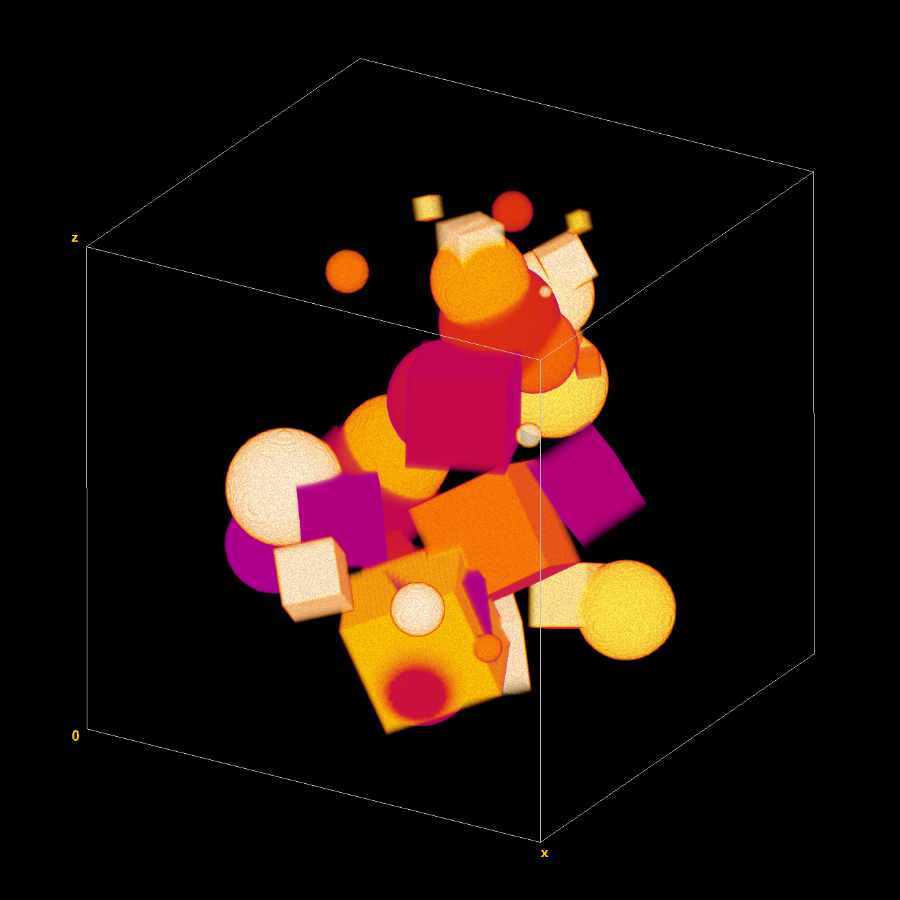
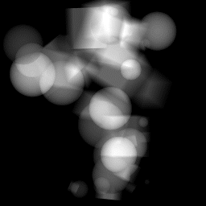
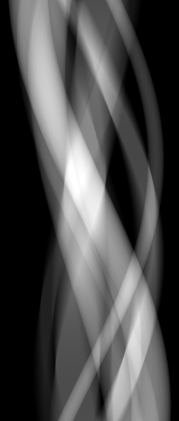
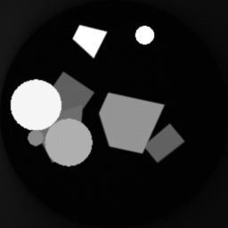
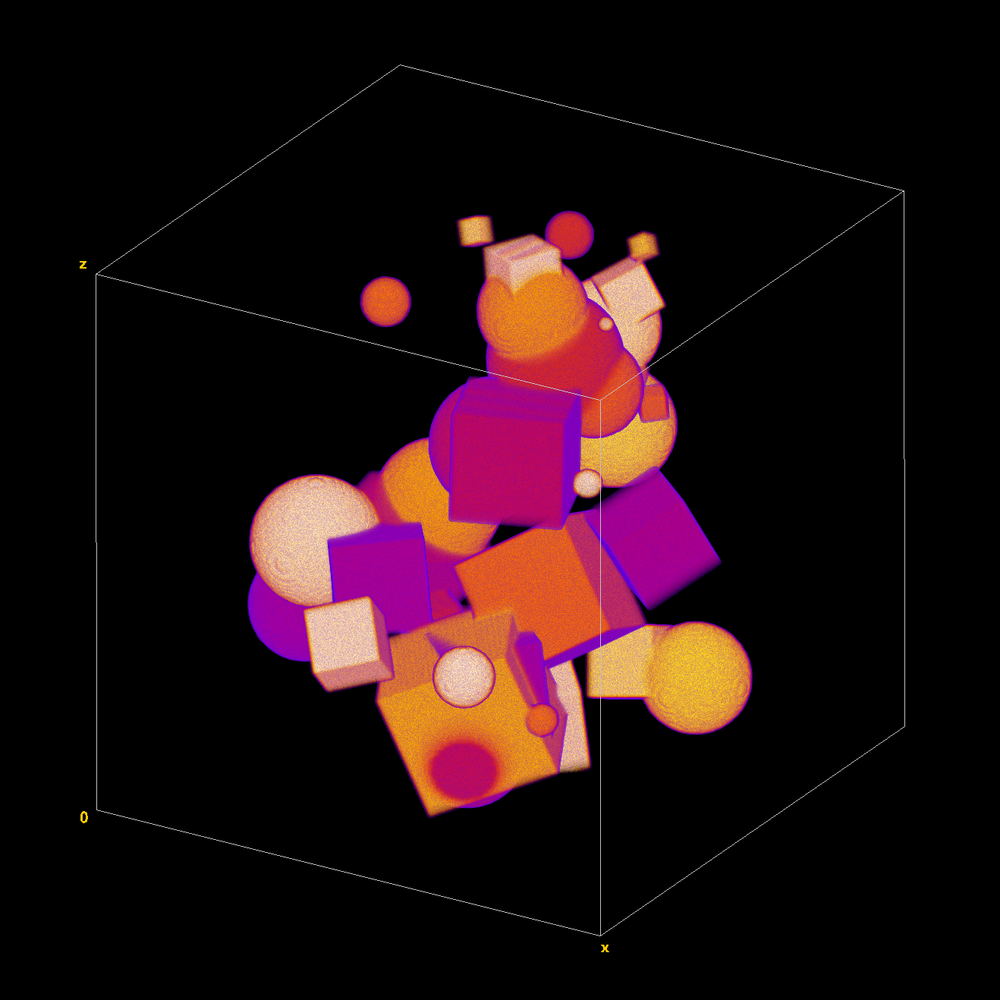
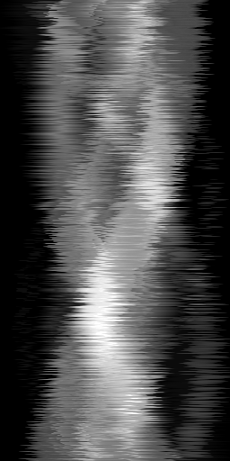
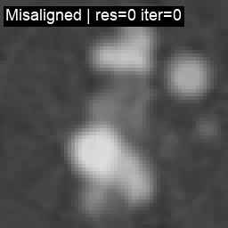
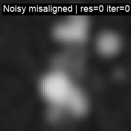

# TomoJAX: Differentiable CT Projector with Alignment

TomoJAX is a fully differentiable, memory‑efficient parallel‑beam CT projector implemented in JAX. It provides exact gradients for 5‑DOF rigid‑body alignment, making it useful for CT reconstruction, per‑view alignment, and deep learning workloads that require data consistency.

#### Alignment demonstration


Left → Right: Ground truth phantom → Naive reconstructions (misaligned & noisy) → Aligned reconstructions


## Installation

```bash
# 1) Install uv (https://docs.astral.sh/uv/)
# 2) Sync the project environment
uv sync --extra cuda12 --group dev

# 3) Verify JAX / GPU is visible
uv run tomojax-test-gpu
```

CPU-only setup:

```bash
uv sync --extra cpu --group dev
JAX_PLATFORM_NAME=cpu uv run tomojax-test-cpu
```

Notes
- CUDA 12 on Linux is required for GPU; the `cuda12` extra installs `jax[cuda12]`.
- To force CPU runs: `JAX_PLATFORM_NAME=cpu uv run tomojax-test-cpu`.
- Optional JAX persistent cache (speeds up re‑runs): set `TOMOJAX_JAX_CACHE_DIR` or rely on the default at `~/.cache/tomojax/jax_cache`.
- Benchmark-harness runs under `bench/` need `uv sync --extra bench --group dev` in addition to the normal CPU/GPU extra.
- `random_shapes` sphere rasterisation uses an ROI-bounded pure-Python implementation by default.


## Key Features

### Core Projector
- Differentiable forward projection with exact gradients via JAX autodiff
- 5‑DOF rigid‑body parameterization: `T x = R_y(β) R_x(α) R_z(φ) x + t`, with `t = (Δx, 0, Δz)`
- Memory‑efficient streaming integration via `lax.scan` — O(detector pixels) memory usage
- Trilinear interpolation with analytical derivatives
- CPU/GPU support via JIT

### Laminography (Parallel‑Beam)
- Tilted rotation‑axis geometry (x/z tilt) with consistent sample‑frame parametrization
- Simulation helpers for thin‑slab phantoms aligned to the sample rotation axis
- Default 360° rotation span (configurable via `--rotation-deg`)
- Reconstructions saved in the sample frame by default (FBP and FISTA‑TV)
- Tutorial: `docs/tutorial_laminography.md`

### Joint Reconstruction & Alignment
- Multi‑resolution: hierarchical optimisation (e.g., 4× → 2× → 1×)
- Alternating steps: FISTA‑TV reconstruction + per‑view alignment
- Optimisers: gradient descent or Gauss–Newton (LM damping)
- 4‑DOF or 5‑DOF: choose whether to optimise φ

### Reconstruction
- FISTA‑TV regularization (Chambolle‑Pock proximal)
- Automatic Lipschitz estimation (power method) for step sizing
- Alignment‑aware reconstruction with exact gradients
- FBP baseline and initialisation


## Quick Start

```bash
# Explore CLIs inside the uv-managed environment
python -m tomojax.cli.simulate --help
python -m tomojax.cli.misalign --help
python -m tomojax.cli.preprocess --help
python -m tomojax.cli.recon    --help
python -m tomojax.cli.align    --help

# Or use the installed console scripts
uv run tomojax-simulate ...
uv run tomojax-misalign ...
uv run tomojax-preprocess ...
uv run tomojax-recon    ...
uv run tomojax-align    ...
uv run tomojax-loss-bench --help

# Full step‑by‑step tutorial
less docs/tutorial_end_to_end.md

# Laminography tutorial
less docs/tutorial_laminography.md

# CLI reference
less docs/cli_reference.md
```

Common examples

```bash
# Simulate a 256³ phantom and projections (parallel CT)
uv run tomojax-simulate \
  --out data/sim_aligned.nxs \
  --nx 256 --ny 256 --nz 256 \
  --nu 256 --nv 256 --n-views 200 \
  --phantom random_shapes --n-cubes 40 --n-spheres 40 \
  --min-size 4 --max-size 64 --min-value 0.01 --max-value 0.1 --seed 42

# Simulate laminography (tilt about x, 360°)
uv run tomojax-simulate \
  --out runs/lamino_demo.nxs \
  --nx 128 --ny 128 --nz 128 \
  --nu 128 --nv 128 --n-views 360 \
  --geometry lamino --tilt-deg 35 --tilt-about x \
  --phantom lamino_disk --lamino-thickness-ratio 0.15 \
  --n-cubes 60 --n-spheres 60 --min-size 4 --max-size 14 --seed 3

# Create misaligned (and optionally noisy) projections
uv run tomojax-misalign --data data/sim_aligned.nxs --out data/sim_misaligned.nxs \
  --rot-deg 1.0 --trans-px 10 --seed 0
uv run tomojax-misalign --data data/sim_aligned.nxs --out data/sim_misaligned_poisson5k.nxs \
  --rot-deg 1.0 --trans-px 10 --poisson 100 --seed 0

# Preprocess raw NXtomo sample/flat/dark frames before reconstruction
uv run tomojax-preprocess raw.nxs data/corrected_absorption.nxs \
  --log --epsilon 1e-6 --clip-min 1e-6

# Drop known bad sample views and crop detector ROI before reconstruction
uv run tomojax-preprocess raw.nxs data/corrected_cropped.nxs \
  --log --reject-views 12,57:61 --crop 120:900,64:960

# Naive reconstructions (FBP)
uv run tomojax-recon --data data/sim_misaligned.nxs \
  --algo fbp --filter ramp --gather-dtype bf16 \
  --checkpoint-projector --out out/fbp_misaligned.nxs \
  --save-manifest out/fbp_misaligned.manifest.json

# Iterative alignment + reconstruction (multires)
uv run tomojax-align --data data/sim_misaligned.nxs \
  --levels 4 2 1 --outer-iters 4 --recon-iters 25 --lambda-tv 0.003 \
  --opt-method gn --gn-damping 1e-3 \
  --gather-dtype bf16 --checkpoint-projector \
  --checkpoint out/align_misaligned.checkpoint.npz --checkpoint-every 1 \
  --log-summary --out out/align_misaligned.nxs \
  --save-params-json out/align_misaligned.params.json \
  --save-params-csv out/align_misaligned.params.csv \
  --save-manifest out/align_misaligned.manifest.json

# Resume the same alignment after interruption or pre-emption
uv run tomojax-align --data data/sim_misaligned.nxs \
  --levels 4 2 1 --outer-iters 4 --recon-iters 25 --lambda-tv 0.003 \
  --opt-method gn --gn-damping 1e-3 \
  --gather-dtype bf16 --checkpoint-projector \
  --resume out/align_misaligned.checkpoint.npz \
  --out out/align_misaligned.nxs

# Deterministic misalignment schedules (see docs/misalign_modes.md)
# Linear angle drift 0→+5° across the scan
uv run tomojax-misalign --data data/sim_aligned.nxs --out runs/mis_angle_lin.nxs \
  --pert angle:linear:delta=5deg
# Sinusoidal dx drift peaking +5 px at mid‑scan
uv run tomojax-misalign --data data/sim_aligned.nxs --out runs/mis_dx_sin.nxs \
  --pert dx:sin-window:amp=5px
```

## Python API (Short Tour)

```python
import jax.numpy as jnp
from tomojax.core.geometry import Grid, Detector, ParallelGeometry
from tomojax.core.projector import forward_project_view, forward_project_view_T
from tomojax.recon.fbp import fbp
from tomojax.recon.fista_tv import fista_tv
from tomojax.align.pipeline import align, AlignConfig

# Define grid, detector, geometry
grid = Grid(nx=128, ny=128, nz=128, vx=1.0, vy=1.0, vz=1.0)
det  = Detector(nu=128, nv=128, du=1.0, dv=1.0)
thetas = jnp.linspace(0, 180, 128, endpoint=False)
geom = ParallelGeometry(grid=grid, detector=det, thetas_deg=thetas)

vol = jnp.ones((grid.nx, grid.ny, grid.nz), jnp.float32)

# Single-view projection (pose from geometry)
p0 = forward_project_view(geom, grid, det, vol, view_index=0)

# FBP and FISTA reconstructions
x_fbp = fbp(geom, grid, det, p0[None, ...])
x_fista, info = fista_tv(
    geom,
    grid,
    det,
    p0[None, ...],
    iters=10,
    lambda_tv=0.001,
    recon_rel_tol=1e-4,
    recon_patience=3,
)

# Alignment (toy 1-view example; use many views in practice)
cfg = AlignConfig(
    outer_iters=1,
    recon_iters=5,
    lambda_tv=0.001,
    recon_rel_tol=1e-4,
    recon_patience=3,
)
x_aligned, params5, info = align(geom, grid, det, p0[None, ...], cfg=cfg)
```

See `docs/schema_nxtomo.md` for the HDF5/NXtomo format used by the CLIs.

Validate an NXtomo file with `uv run tomojax-validate data/sim.nxs`.

Inspect projection shape, metadata, stats, NaN/Inf counts, and memory estimates with
`uv run tomojax-inspect data/sim.nxs`; add `--json report.json` for automation or
`--quicklook projection.png` for a central-projection preview.

Viewer tip: saved reconstructions write volumes in `(nz, ny, nx)` order with `@volume_axes_order="zyx"`, so most NX/HDF5 tools display slice counts matching `nz`. `load_nxtomo()` always returns `(nx, ny, nz)` arrays for compute, and `/entry/instrument/detector/data` stores absorption (`-log` transmission) projections.

## Memory and Performance

- Keep `--checkpoint-projector` enabled to reduce activation memory at small extra compute.
- Mixed precision gather (`--gather-dtype bf16`) reduces bandwidth while accumulating in fp32.
- To avoid JAX preallocation spikes: `export XLA_PYTHON_CLIENT_PREALLOCATE=false`.
- For noisy data, increase `--lambda-tv` and consider raising `--tv-prox-iters` to 20–30 to strengthen the TV proximal step.
- When the FISTA loss stabilizes, set `AlignConfig.recon_rel_tol` / `recon_patience` (or pass the same kwargs to `fista_tv`) to
  terminate reconstructions early and skip redundant iterations.

Troubleshooting tips live in `docs/faq_troubleshooting.md`.


## Alignment Algorithm (Overview)

1. Multi‑resolution pyramid (e.g., 4× → 2× → 1×)
2. Alternating steps each outer iteration:
   - Fix alignment → FISTA‑TV reconstruction
   - Fix reconstruction → optimise alignment parameters (GD or GN)
3. Transfer parameters across levels and rescale
4. Monitor objective and parameter deltas for convergence/early stop

Alignment optimises per-view parameters in `[alpha, beta, phi, dx, dz]` order by default.
Use `--optimise-dofs dx,dz` for translation-only 2-DOF runs, `--freeze-dofs phi`
for a common 4-DOF run, or omit DOF flags for full 5-DOF alignment. Outputs still
store all five columns; inactive columns are held fixed at their initial values.
Use bounds such as `--bounds dx=-20:20,dz=-20:20,alpha=-0.05:0.05` to keep active
DOFs inside physical limits; rotations are radians and translations are world units.
For translation-only coarse-to-fine alignment, start with
`--optimise-dofs dx,dz --loss-schedule 4:phasecorr,2:ssim,1:l2_otsu`;
for full 5-DOF alignment, start more conservatively with `--loss ssim` or
`--loss charbonnier` before trying sharper GN-compatible losses.


## Notes

- Use the new CLIs and Python APIs under `tomojax.*`. Legacy ad‑hoc scripts were removed.
- Reusable benchmark datasets and scoring helpers live under `tomojax.bench.*`; the
  controller-facing benchmark harness stays in `bench/`.
- Tests: `uv run pytest -q tests` (small CPU‑friendly sizes).
- Test surface ownership and placement rules live in `tests/README.md`; use that guide when
  deciding whether a change needs a unit, workflow, CLI, or benchmark-harness regression.

## Testing Strategy

The suite is organized around owned contracts instead of raw coverage percentages:

- math or validation changes should land in focused unit tests near the owning module;
- pipeline or config behavior should get targeted regression tests around the public workflow;
- CLI changes should prefer real file-backed smoke tests over heavy monkeypatch layers;
- benchmark and controller behavior should stay covered in the harness-specific tests under
  `tests/` and `bench/`.

This keeps new regression coverage aligned with the surface that actually owns the behavior,
instead of accumulating generic integration tests that are hard to reason about.


## Visual Examples

### Basic Projector Workflow
| Phantom | Projections | Sinogram | Reconstruction |
|---------|-------------|----------|----------------|
| <br> |  |  | <br> |
| Top: slice<br>Bottom: volume projection | Animated over 360° | Angle vs detector | Top: slice<br>Bottom: volume projection |

### Alignment & Reconstruction Workflow

#### Misaligned Input Data
| Clean Misaligned Projections | Noisy Misaligned Projections |
|------------------------------|------------------------------|
|  |  |
| Random rigid‑body misalignments | Same misalignments + Poisson noise |

#### Sinogram Analysis
| Clean Misaligned Sinogram | Noisy Misaligned Sinogram |
|---------------------------|---------------------------|
|  |  |
| Clear view‑to‑view inconsistencies | Inconsistencies + noise artifacts |

#### Multi‑Resolution Alignment Process
| Clean Data Alignment | Noisy Data Alignment |
|---------------------|---------------------|
|  |  |
| 4× → 2× → 1× resolution refinement | Robust alignment despite noise |
