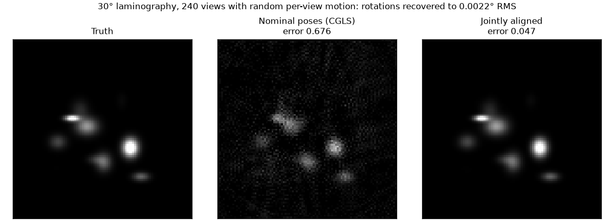

# TomoJAX

Reconstruct parallel-beam tomography, laminography and lab cone-beam CT with JAX. TomoJAX
provides differentiable projectors, fast FBP and iterative reconstruction,
joint volume-and-pose alignment, and a CLI for taking NeXus/HDF5 or TIFF data
through correction, reconstruction, and slice export.

TomoJAX is an early research library. Its strongest fit is scientists who need
control over geometry and differentiation in a Python workflow. Synchrotron
geometries use parallel rays; lab scans use a point source and flat detector
(`ConeGeometry`), reconstructed with FDK or the iterative solvers. Alignment
needs scan-specific validation. See the
[support matrix](docs/support-matrix.md) and [known limitations](docs/known-limitations.md)
before choosing it for an experiment.


64³ voxels, 90 parallel views, 40 CGLS iterations. This example uses the same
Joseph model for simulation and reconstruction; it demonstrates the API, not
independent reconstruction accuracy. [Reproduce the figure](examples/README.md#reproduce-the-readme-figure).



`tomojax align` and `tomojax.align` solve the volume and each view's pose
together. Here a 96³ laminography scan with ±1° and ±2 px of random per-view
motion goes from 0.57 to 0.063 relative error, with rotations recovered to
0.0027°, in 14 s on a laptop GPU. The measurements are analytic integrals of
continuous objects. [Reproduce it](examples/README.md#align-a-scan-with-per-view-motion).

## First reconstruction

You need Git and [uv](https://docs.astral.sh/uv/getting-started/installation/).
The package currently requires **Python 3.12**; uv can install it. These commands
install this checkout with CPU dependencies, generate a small scan, and write
three central slices. No scan data or GPU is required.

```bash
git clone https://github.com/tristanmanchester/tomojax.git
cd tomojax
uv sync --locked --extra cpu --no-dev

uv run --no-sync tomojax simulate --out synthetic.nxs \
  --nx 32 --ny 32 --nz 32 --nu 32 --nv 32 --n-views 60
uv run --no-sync tomojax recon --data synthetic.nxs --out recon.nxs \
  --algo fbp --roi off
uv run --no-sync tomojax validate recon.nxs
uv run --no-sync tomojax slices --data recon.nxs --out quicklooks
```

Open `quicklooks/slice_x0016.png`, `slice_y0016.png`, and `slice_z0016.png`.
`recon.nxs` contains the projections, volume, and geometry metadata. The PNGs
are display-scaled previews; use the stored volume for quantitative analysis.
This CLI example uses FBP; the figure above uses the Python CGLS example.

For CUDA installation, wheel installation, and device checks, see
[installation](docs/installation.md). For your own scan, start with
[the quickstart](docs/quickstart.md).

## Choose a workflow

| Task | Start here |
| --- | --- |
| Inspect, preprocess, and reconstruct a scan | [Quickstart](docs/quickstart.md) |
| Supply measured geometry and process TIFF or laminography data | [Real scan guide](docs/real-laminography.md) |
| Simulate data or use the Python API | [Synthetic workflow](docs/synthetic-tomography.md), [runnable examples](examples/README.md) |
| Estimate motion or detector-centre corrections | [Alignment guide](docs/alignment-guide.md) — experimental; review recovered geometry |
| Check supported models and limitations | [Support matrix](docs/support-matrix.md), [limitations](docs/known-limitations.md) |
| Assess accuracy, speed, and memory | [Measurement guide](docs/measurements.md) |

The CLI provides FBP, CGLS, FISTA-TV, and SPDHG-TV reconstruction. FBP and
FISTA-TV stream projections from host memory, so scans larger than the GPU
need only their volumes on it; `fbp_host` in the Python API also keeps the
volume on the host. On an 8 GB laptop GPU, a 1024³ laminography FBP from and to
disk takes 37 s. The Python API adds an opt-in Fourier inverse for uniform
parallel scans. CPU paths use JAX; optional Pallas kernels accelerate selected
operations on CUDA. Volumes use `(x, y, z)` and projections `(view, v, u)` in
Python. Detector and voxel spacings must use the same physical length unit.

Public modules are `tomojax.io`, `tomojax.geometry`, `tomojax.forward`,
`tomojax.recon`, `tomojax.align`, and `tomojax.datasets`. Start with the
[complete projection/reconstruction example](examples/simulate_and_reconstruct.py)
or browse the [documentation index](docs/README.md).

## Evidence and current limits

The [reconstruction comparison](docs/research/system-matrix-2026-10-05-memory.md) covers
smooth, sharp, and noisy objects across parallel, anisotropic, and tilted scans,
against the fastest accepted ASTRA workflow in each cell (TIGRE was never the
fastest). Over the 26 cells with accepted results on both sides, TomoJAX is 2.8
times faster warm (geometric mean; 0.59 to 20 times) and on par from a fresh
process (1.00; 0.44 to 2.8). Small laminography scans remain slower, dominated by JAX start-up and
backprojection cost. Published GPU measurements use one RTX 4070 Laptop GPU.

`tomojax align --mode pose` solves the volume and every view's pose together.
On analytic 128³ scans of continuous objects it recovers per-view rotations to
0.003–0.009° in 40–45 s; at coarse resolution, discretisation limits accuracy.
A global shift search first finds per-view stage shifts of up to a quarter of
the detector.
See the [alignment guide](docs/alignment-guide.md). This is not a demonstrated large-motion or 99% recovery capability.
The [alignment comparison](docs/research/public-free-voxel-schur-2026-10-04.md) retains
failures, cold/warm times, quality, and process GPU memory.

Historical [DIAD laminography images](images/README.md#historical-real-data-illustrations)
show qualitative use on real data. Their raw acquisition and full reproduction
configuration are not bundled, so they are not a reproducible validation set.

## Development and license

See [CONTRIBUTING.md](CONTRIBUTING.md) for environment setup, engineering
conventions, tests, and package checks. Changes on this branch are recorded in
the [changelog](CHANGELOG.md).

TomoJAX is licensed under [GPL-3.0-only](LICENSE).
