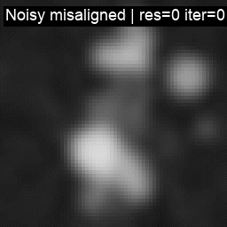

# TomoJAX: Differentiable CT Projector with Alignment

TomoJAX is a fully differentiable, memory‑efficient parallel‑beam CT projector implemented in JAX. It provides exact gradients for 5‑DOF rigid‑body alignment, making it useful for CT reconstruction, per‑view alignment, and deep learning workloads that require data consistency.

#### Alignment demonstration


Left → Right: Ground truth phantom → Naive reconstructions (misaligned & noisy) → Aligned reconstructions


## Installation

```bash
# 1) Install pixi (https://pixi.sh) if you don't have it
# 2) Create the environment and enter it
pixi install
pixi shell

# 3) Verify JAX / GPU is visible
pixi run test-gpu

# 4) Install this package in editable mode (once per env)
pixi run install-root
```

Notes
- CUDA 12 is required for GPU; the pixi env pins `jax[cuda12]`.
- To force CPU runs: `JAX_PLATFORM_NAME=cpu pixi run test-cpu`.
- Optional JAX persistent cache (speeds up re‑runs): set `TOMOJAX_JAX_CACHE_DIR` or rely on the default at `~/.cache/tomojax/jax_cache`.


## Key Features

### Core Projector
- Differentiable forward projection with exact gradients via JAX autodiff
- 5‑DOF rigid‑body parameterization: `T x = R_y(β) R_x(α) R_z(φ) x + t`, with `t = (Δx, 0, Δz)`
- Memory‑efficient streaming integration via `lax.scan` — O(detector pixels) memory usage
- Trilinear interpolation with analytical derivatives
- CPU/GPU support via JIT

### Joint Reconstruction & Alignment
- Multi‑resolution: hierarchical optimisation (e.g., 4× → 2× → 1×)
- Alternating steps: FISTA‑TV reconstruction + per‑view alignment
- Optimisers: gradient descent or Gauss–Newton (LM damping)
- 4‑DOF or 5‑DOF: choose whether to optimise φ

### Reconstruction
- FISTA‑TV regularization (Chambolle‑Pock proximal)
- Automatic Lipschitz estimation (power method) for step sizing
- Alignment‑aware reconstruction with exact gradients
- FBP baseline and initialisation


## Quick Start

```bash
# Explore CLIs (inside pixi shell)
python -m tomojax.cli.simulate --help
python -m tomojax.cli.misalign --help
python -m tomojax.cli.recon    --help
python -m tomojax.cli.align    --help

# Or use pixi tasks that forward args
pixi run simulate ...
pixi run misalign ...
pixi run recon    ...
pixi run align    ...

# Full step‑by‑step tutorial
less docs/tutorial_end_to_end.md

# CLI reference
less docs/cli_reference.md
```

Common examples

```bash
# Simulate a 256³ phantom and projections
pixi run simulate \
  --out data/sim_aligned.nxs \
  --nx 256 --ny 256 --nz 256 \
  --nu 256 --nv 256 --n-views 200 \
  --phantom random_shapes --n-cubes 40 --n-spheres 40 \
  --min-size 4 --max-size 64 --min-value 0.01 --max-value 0.1 --seed 42

# Create misaligned (and optionally noisy) projections
pixi run misalign --data data/sim_aligned.nxs --out data/sim_misaligned.nxs \
  --rot-deg 1.0 --trans-px 10 --seed 0
pixi run misalign --data data/sim_aligned.nxs --out data/sim_misaligned_poisson5k.nxs \
  --rot-deg 1.0 --trans-px 10 --poisson 100 --seed 0

# Naive reconstructions (FBP)
pixi run recon --data data/sim_misaligned.nxs \
  --algo fbp --filter ramp --views-per-batch auto --gather-dtype bf16 \
  --checkpoint-projector --out out/fbp_misaligned.nxs

# Iterative alignment + reconstruction (multires)
pixi run align --data data/sim_misaligned.nxs \
  --levels 4 2 1 --outer-iters 4 --recon-iters 25 --lambda-tv 0.003 \
  --opt-method gn --gn-damping 1e-3 \
  --views-per-batch auto --gather-dtype bf16 --checkpoint-projector --projector-unroll 4 \
  --log-summary --out out/align_misaligned.nxs
```


## Python API (Short Tour)

```python
import jax.numpy as jnp
from tomojax.core.geometry import Grid, Detector, ParallelGeometry
from tomojax.core.projector import forward_project_view, forward_project_view_T
from tomojax.recon.fbp import fbp
from tomojax.recon.fista_tv import fista_tv
from tomojax.align.pipeline import align, AlignConfig

# Define grid, detector, geometry
grid = Grid(nx=128, ny=128, nz=128, vx=1.0, vy=1.0, vz=1.0)
det  = Detector(nu=128, nv=128, du=1.0, dv=1.0)
thetas = jnp.linspace(0, 180, 128, endpoint=False)
geom = ParallelGeometry(grid=grid, detector=det, thetas_deg=thetas)

vol = jnp.ones((grid.nx, grid.ny, grid.nz), jnp.float32)

# Single-view projection (pose from geometry)
p0 = forward_project_view(geom, grid, det, vol, view_index=0)

# FBP and FISTA reconstructions
x_fbp = fbp(geom, grid, det, p0[None, ...])
x_fista, info = fista_tv(geom, grid, det, p0[None, ...], iters=10, lambda_tv=0.001)

# Alignment (toy 1-view example; use many views in practice)
cfg = AlignConfig(outer_iters=1, recon_iters=5, lambda_tv=0.001)
x_aligned, params5, info = align(geom, grid, det, p0[None, ...], cfg=cfg)
```

See `docs/schema_nxtomo.md` for the HDF5/NXtomo format used by the CLIs.


## Memory and Performance

- Use `--views-per-batch auto` to automatically choose a safe batch size; set `TOMOJAX_MAX_VIEWS_PER_BATCH` to clamp the auto choice (default 8).
- Reduce `--projector-unroll` (1–2) when close to memory limits.
- Keep `--checkpoint-projector` enabled to reduce activation memory at small extra compute.
- Mixed precision gather (`--gather-dtype bf16`) reduces bandwidth while accumulating in fp32.
- To avoid JAX preallocation spikes: `export XLA_PYTHON_CLIENT_PREALLOCATE=false`.
- For noisy data, increase `--lambda-tv` and consider raising `--tv-prox-iters` to 20–30 to strengthen the TV proximal step.

Troubleshooting tips live in `docs/faq_troubleshooting.md`.


## Alignment Algorithm (Overview)

1. Multi‑resolution pyramid (e.g., 4× → 2× → 1×)
2. Alternating steps each outer iteration:
   - Fix alignment → FISTA‑TV reconstruction
   - Fix reconstruction → optimise alignment parameters (GD or GN)
3. Transfer parameters across levels and rescale
4. Monitor objective and parameter deltas for convergence/early stop


## Notes

- Use the new CLIs and Python APIs under `tomojax.*`. Legacy ad‑hoc scripts were removed.
- Tests: `pixi run test` (small CPU‑friendly sizes).


## Visual Examples

### Basic Projector Workflow
| Phantom | Projections | Sinogram | Reconstruction |
|---------|-------------|----------|----------------|
| <br> |  |  | <br> |
| Top: slice<br>Bottom: volume projection | Animated over 360° | Angle vs detector | Top: slice<br>Bottom: volume projection |

### Alignment & Reconstruction Workflow

#### Misaligned Input Data
| Clean Misaligned Projections | Noisy Misaligned Projections |
|------------------------------|------------------------------|
|  |  |
| Random rigid‑body misalignments | Same misalignments + Poisson noise |

#### Sinogram Analysis
| Clean Misaligned Sinogram | Noisy Misaligned Sinogram |
|---------------------------|---------------------------|
|  |  |
| Clear view‑to‑view inconsistencies | Inconsistencies + noise artifacts |

#### Multi‑Resolution Alignment Process
| Clean Data Alignment | Noisy Data Alignment |
|---------------------|---------------------|
|  |  |
| 4× → 2× → 1× resolution refinement | Robust alignment despite noise |
