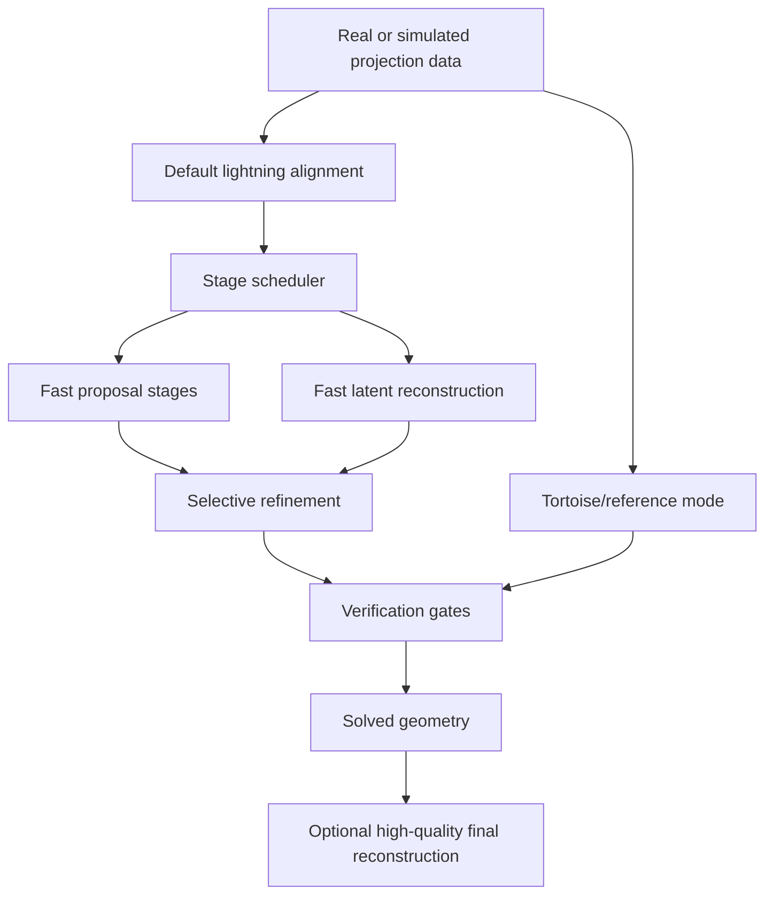

# Lightning Alignment Engine

## Summary

TomoJAX should become a lightning-fast geometry and alignment engine by default. The main alignment
path should use stage-specific algorithms, Pallas acceleration, mixed precision, proposal search,
physical motion models, and adaptive reconstruction quality to minimize time-to-good-geometry, while
retaining a slow reference lane and high-quality final reconstruction path.

---

## Problem Frame

TomoJAX is experimental software for a primary user who values fast geometry recovery over broad
backwards-compatible behavior. Recent acceleration work has shown that important hot paths can be
made much faster, but the cautious supported-API framing still treats Pallas and approximate paths as
secondary opt-ins rather than the center of the product.

The current alignment workflow also risks spending too much time making intermediate reconstructions
look numerically or visually respectable when their real job is to expose enough stable structure for
geometry solving. Some stages do need quality, but that quality should be spent adaptively where it
improves geometry, not applied uniformly as a global tax.

The old stance was "preserve the reference behavior unless an accelerator can be proven safe." The
new stance is "recover good geometry as fast as possible, prove the geometry with targeted checks,
and keep the reference behavior available when it is useful."

---

## Actors

- A1. TomoJAX user: runs alignment, inspects geometry, and decides when a result is useful enough
  for downstream reconstruction or article evidence.
- A2. Lightning solver: the default TomoJAX alignment engine that chooses fast stage-specific
  tactics to recover geometry.
- A3. Tortoise/reference solver: the slower, stricter path used for debugging, numerical comparison,
  verification, and high-confidence runs.
- A4. Optimization agent: an autonomous or assisted coding agent trying to improve TomoJAX speed
  without gaming narrow benchmarks.
- A5. Final reconstructor: the high-quality reconstruction lane, whether TomoJAX's own quality mode
  or an external reconstructor used after geometry is solved.

---

## Key Flows

- F1. Lightning geometry solve
  - **Trigger:** The user runs alignment without explicitly selecting the reference path.
  - **Actors:** A1, A2, A5
  - **Steps:** The solver chooses an aggressive stage schedule, uses cheap proposal or coarse stages
    to enter the right basin, spends reconstruction quality only where useful, refines geometry,
    verifies the result, and optionally hands solved geometry to a high-quality reconstruction lane.
  - **Outcome:** The user gets geometry, provenance, verification results, and enough artifacts to
    decide whether the solve is trustworthy.
  - **Covered by:** R1, R3, R4, R5, R8, R11, R12

- F2. Tortoise/reference comparison
  - **Trigger:** The user requests a careful reference run, debugging run, or verification pass.
  - **Actors:** A1, A3
  - **Steps:** TomoJAX runs a slower, stricter path with reference-oriented numerical behavior,
    records comparable outputs, and makes differences against lightning visible.
  - **Outcome:** The user can diagnose failures, validate a fast result, or generate conservative
    evidence without making tortoise behavior the default.
  - **Covered by:** R2, R11, R13, R14

- F3. Agent optimization loop
  - **Trigger:** An optimization agent changes TomoJAX internals and needs to know whether the
    change made the system better.
  - **Actors:** A4, A2, A3
  - **Steps:** The agent runs benchmark surfaces centered on alignment wall time and geometry
    outcome, checks fast-path provenance and quality gates, and compares against reference or prior
    tracked results.
  - **Outcome:** A speedup is accepted only when it improves the alignment workflow without failing
    the relevant geometry or quality checks.
  - **Covered by:** R15, R16, R17

---

## Requirements

**Product posture**

- R1. The default alignment posture must be aggressive: `lightning` behavior is the center of
  TomoJAX alignment, not an obscure expert flag.
- R2. TomoJAX must retain an explicit `tortoise` or reference-style mode for slow, careful,
  debuggable, mostly reference-oriented behavior.
- R3. TomoJAX must retain a high-quality final reconstruction lane after geometry is solved; fast
  alignment reconstruction is not a replacement for final image-quality reconstruction.

**Stage-adaptive alignment**

- R4. Lightning alignment must be allowed to change algorithms by stage rather than preserving one
  fixed algorithm with faster kernels underneath it.
- R5. Early and middle stages may use non-differentiable proposal methods when those methods recover
  geometry faster or more robustly than gradient-based optimization.
- R6. Differentiability must be treated as an implementation tactic, not a user-facing promise of
  the lightning path.
- R7. The solver should prefer low-dimensional physical motion models when the data supports them,
  and expand toward per-view five-DOF freedom only when residuals or verification indicate that the
  reduced model is insufficient.
- R8. Reconstruction quality inside alignment must be adaptive by stage: lower resolution, lower
  precision, masks, crops, reduced iteration counts, feature volumes, or biased latent estimates are
  acceptable when they improve time-to-good-geometry.

**Acceleration and precision**

- R9. Pallas acceleration should be treated as the engine room for supported hot paths in lightning
  mode, especially residual scoring, forward projection, backprojection, fused loss/gradient work,
  and reconstruction kernels.
- R10. JAX should remain available as an oracle, fallback, and tortoise/reference path, but should
  not define the default alignment center of gravity when a faster path solves the geometry.
- R11. BF16 and mixed precision must be first-class lightning tools. INT8 may be explored for early
  feature-volume or coarse scoring stages; INT4 is not a first milestone for ordinary continuous
  reconstruction data.
- R12. Every lightning stage must record enough provenance for a reader to know what class of
  backend, precision, algorithm family, and verification status actually ran.

**Correctness and acceptance**

- R13. Fast paths are accepted because they solve geometry and pass verification gates, not because
  their intermediate reconstructions are visually attractive or strictly equivalent to a reference
  reconstruction.
- R14. The full workflow must guard against fast-but-wrong geometry by checking reprojection,
  geometry outcome, and final high-quality reconstruction quality where those checks are available.
- R15. Suspicious or unsupported cases must have an escape path into tortoise/reference behavior,
  stricter refinement, or explicit unsupported status rather than silently reporting a misleading
  lightning success.

**Benchmark and optimization contract**

- R16. Optimization benchmarks must center on time-to-good-geometry, alignment wall time,
  reprojection residual, final reconstruction quality, and stage provenance, not only standalone
  operator throughput.
- R17. Standalone kernel benchmarks remain useful only when they are tied back to an alignment
  workflow hypothesis or regression guard.
- R18. Agent-facing benchmark outputs must make it hard to claim fake progress: results should
  distinguish optimization guards from stronger evidence, label specialized helpers honestly, and
  include enough metadata to explain which path actually ran.

---

## Acceptance Examples

- AE1. **Covers R1, R2, R12.** Given a normal alignment command with no explicit mode, when TomoJAX
  runs on a supported GPU, the run uses the lightning posture by default and records the fast-path
  algorithms, backend class, precision class, and verification status.
- AE2. **Covers R2, R10, R15.** Given a user requests tortoise/reference behavior, when the same
  dataset is aligned, TomoJAX favors reference-oriented behavior and makes the output comparable to
  lightning without pretending to be the fastest path.
- AE3. **Covers R5, R6, R13.** Given a non-differentiable proposal stage recovers a better coarse
  geometry faster than a gradient stage, when downstream verification passes, the result is valid
  lightning behavior rather than a compromise.
- AE4. **Covers R7, R14.** Given a low-dimensional motion model leaves structured residuals that
  indicate unmodeled per-view motion, when lightning reaches the relevant stage, it expands or
  escalates rather than forcing the reduced model to fit badly.
- AE5. **Covers R8, R14.** Given a lower-quality inner reconstruction produces acceptable geometry
  but the final high-quality reconstruction degrades materially, when verification runs, the fast
  path is not accepted as a clean improvement.
- AE6. **Covers R16, R17, R18.** Given an agent improves a standalone Pallas kernel benchmark, when
  it reports progress, the benchmark artifacts must show whether the change improved alignment
  wall time or merely improved an isolated helper.

---

## Success Criteria

- Default alignment runs reach useful geometry faster than the current conservative pipeline on
  representative synthetic and real laminography workflows.
- The user can still obtain a high-quality final reconstruction after geometry is solved.
- Fast-path successes include enough provenance to explain what ran without reading code.
- Tortoise/reference behavior remains available for debugging, verification, and numerical
  comparison.
- Optimization agents have clear targets that reward full workflow speedups and penalize
  benchmark-only tricks.
- Downstream planning can proceed without inventing the product identity, default posture, quality
  policy, or benchmark acceptance criteria.

---

## Scope Boundaries

### Deferred for later

- Full autotuning that tries multiple strategies on every dataset before selecting a stage schedule.
- Publication-evidence packaging beyond the benchmark and provenance requirements needed to avoid
  misleading internal claims.
- INT8 as a broad reconstruction dtype, and INT4 as anything more than a research feature-volume
  experiment.
- Broad multi-user compatibility, stable backwards-compatible defaults, or enterprise-style API
  caution.
- Automatic handoff to external reconstructors as a polished user workflow.
- General-purpose reconstruction performance work that does not support faster or more trustworthy
  geometry solving.

### Outside this product's identity

- Treating TomoJAX primarily as a cautious general reconstructor with alignment as a secondary
  feature.
- Requiring every lightning stage to be differentiable.
- Requiring intermediate alignment reconstructions to match the visual or numerical quality of the
  final reconstruction lane.
- Making JAX/FP32/reference behavior the default center of gravity when a faster verified path works.
- Accepting specialized helper timings as product progress when they do not improve the alignment
  workflow.

---

## Key Decisions

- **Alignment-first identity:** TomoJAX's main value is fast geometry solving; reconstruction quality
  serves that goal during alignment and remains available as a separate final lane.
- **Lightning by default:** The default path should use the fastest credible staged strategy; users
  can opt into tortoise/reference behavior when they need caution.
- **Stage scheduler over single algorithm:** The solver should be allowed to mix proposal methods,
  physical motion models, fast reconstruction, differentiable refinement, and verification by stage.
- **Differentiability where needed:** Gradients are valuable tools, especially for local refinement,
  but non-differentiable methods are valid when they recover geometry faster.
- **Adaptive quality:** Reconstruction quality, precision, and resolution are resources to spend
  where they improve geometry, not global invariants.
- **Provenance as a correctness tool:** Every fast result should report what actually ran so speed
  claims and failures can be interpreted honestly.

---

## Dependencies / Assumptions

- Pallas-backed hot paths will remain important for supported GPU workflows, even if some geometry
  configurations require fallback or special handling.
- Existing JAX paths are good enough to serve as reference behavior for tortoise mode and numerical
  oracles.
- Representative real-data workflows are available for measuring time-to-good-geometry.
- Final reconstruction quality can be measured well enough to guard against fast-but-wrong geometry.
- Physical motion models are likely to describe a useful fraction of real stage errors before
  per-view five-DOF polish is needed.

---

## Outstanding Questions

### Deferred to Planning

- [Affects R1, R2][Technical] What exact user-facing mode names and defaults should expose
  lightning, tortoise, quality, and verification behavior?
- [Affects R5, R7][Technical] Which non-differentiable proposal stages should be first: projection
  shifts, coordinate search, SPSA-style perturbations, physical motion model fitting, or Pallas
  residual candidate search?
- [Affects R9, R12][Technical] Which Pallas support boundaries should become hard unsupported
  statuses versus automatic fallbacks?
- [Affects R11][Needs research] Where does BF16/mixed precision improve speed without destabilizing
  geometry, and where should FP32 remain mandatory?
- [Affects R14, R16][Technical] What exact metrics and thresholds define "good geometry" for the
  default guard suite and for real-data workflows?
- [Affects R18][Technical] How should benchmark artifacts present stage-level provenance so agents
  cannot conflate helper speedups with workflow speedups?
