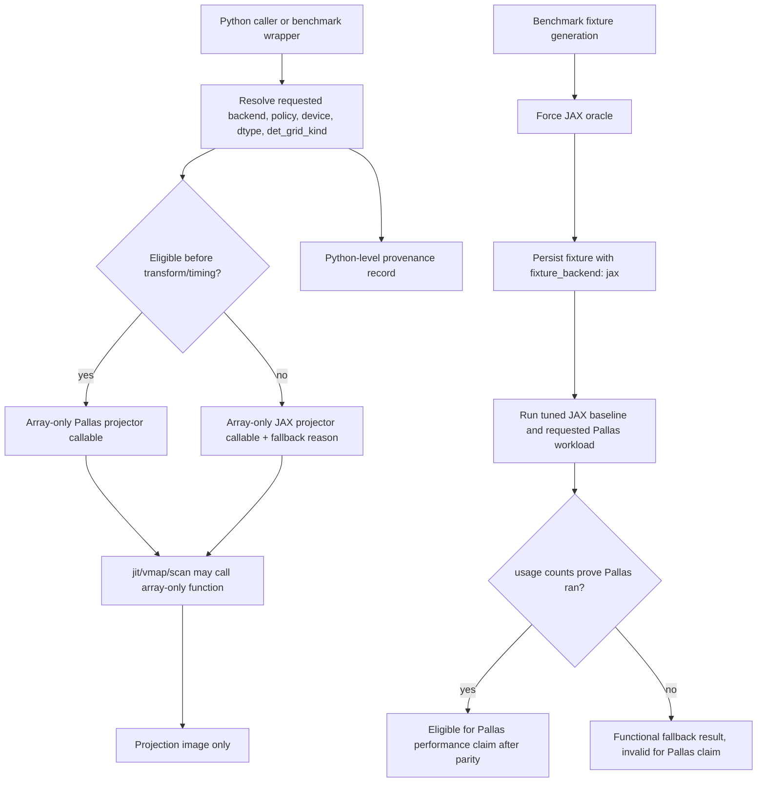

# feat: Add Experimental Pallas Forward Projector

## Overview

Add a narrow, opt-in Pallas implementation for the pose-aware single-view
forward projector while preserving the current JAX implementation as the
default behavior, correctness oracle, and fallback. The first goal is not to
make Pallas production-default; it is to answer whether a detector-tiled
ray-major kernel can beat the current `lax.scan` + trilinear gather path on
realistic TomoJAX forward-projection shapes without compromising geometry
semantics, differentiated callers, or benchmark evidence.

The work should land as an experimental backend with explicit provenance in
tests and benchmarks. A Pallas microbenchmark win is not enough by itself:
profile-level results must show that the improvement survives at least one
eligible downstream workload. Alignment claims require usage metadata proving
the hot objective path actually used Pallas; otherwise alignment is a
fallback/provenance check, not a workflow-speedup claim.

---

## Problem Frame

`src/tomojax/core/projector.py` is a shared hot path for simulation,
reconstruction, alignment, validation, and loss benchmarking. The current
single-view implementation computes traversal state, then scans over ray
samples while `_trilinear_gather` performs eight clipped flat volume reads per
ray step. That shape is a plausible target for Pallas because each detector
pixel has clean output ownership and can accumulate locally without scatter
races.

The constraint is that the projector is also a correctness-sensitive geometry
contract. `T` means `world_from_object`, rays travel along world `+y`, sampling
happens in object-frame voxel coordinates, output is shaped `(nv, nu)`, and
current JAX behavior is differentiable. The Pallas path must therefore be
experimental, explicit, and easy to reject if it fails parity, backend support,
or workflow benchmarks.

---

## Requirements Trace

- R1. Add an experimental Pallas path for the same conceptual operation as
  `forward_project_view_T`: one pose, one volume, one detector image.
- R2. Keep the existing JAX projector as the default behavior, correctness
  oracle, and fallback.
- R3. Make Pallas opt-in; unsupported devices, unsupported shapes, unsupported
  dtype modes, caller-declared JAX-only/autodiff contexts, and
  compile/runtime failures must resolve to explicit fallback metadata at a
  Python or benchmark boundary rather than silent Pallas claims. Array-returning
  projector functions used inside JAX transforms must stay array-only.
- R4. Start with a narrow supported contract: GPU fast path, static shape
  family, `float32` accumulation, and `fp32` gather first; `bf16` support is
  required before native selected-profile claims because the target profiles
  use `gather_dtype: bf16`.
- R5. Preserve the current geometric contract for pose convention, ray
  direction, object-frame sampling, detector orientation, volume origin, and
  trilinear support bounds.
- R6. Use detector-tile ownership: each Pallas program owns disjoint output
  pixels and writes them once after local accumulation.
- R7. Recompute cheap traversal state locally in the first kernel, but treat
  traversal placement as a bounded A/B decision before rejecting Pallas:
  if local recompute is slow because of compile cost, register pressure, or
  occupancy, run one precomputed-traversal benchmark before stopping.
- R8. Do not add custom autodiff in this spike. Differentiated projector calls
  stay on the JAX oracle unless a later plan designs a derivative path.
- R9. Require numerical parity against the current JAX projector before any
  performance claim.
- R10. Cover uniform path length, localized voxel origin, `vol_center`,
  non-cubic rotated volumes, finite output, shape/dtype parity, and `fp32`
  baseline parity.
- R11. Count lower-precision gather support only after explicit `bf16`/`fp16`
  parity checks against existing tolerances.
- R12. Benchmarks must separate host/device transfer, compile or first-call
  cost, first execution, and warm execution, with explicit
  `block_until_ready` synchronization.
- R13. Compare JAX and Pallas on the same fixture, pose, detector grid,
  volume, `n_steps`, shape, dtype mode, and device.
- R14. Benchmark tiny correctness sizes, smoke sizes around `32^3` or `64^3`,
  and at least one profile-like `128` or `160` shape.
- R15. Use the existing profiles before claiming real workflow impact:
  `bench/profiles/screen_memory_parallel_fista_128.yaml`,
  `bench/profiles/canary_iterative_parallel_160.yaml`, and
  `bench/profiles/canary_align_parallel_3d_128_noisy.yaml`. Treat the
  alignment profile as a negative-control/provenance check unless its hot
  differentiated objective path is explicitly made Pallas-capable in later work.
- R16. Benchmark output must report device/backend metadata, requested backend,
  actual backend, Pallas lowering backend, fallback reason, tile shape, dtype
  mode, fixture backend, usage counts, compile/cold timing, warm timing,
  max absolute error, relative error, RMSE, and peak memory where available.
- R17. Continue only if Pallas shows a clear repeated warm-run win on at least
  one profile-like forward benchmark with no parity regression.
- R18. Treat microbenchmark-only wins as inconclusive unless at least one
  downstream profile moves or the result justifies a separate fused-residual
  benchmark plan.
- R19. Stop or defer if Pallas requires broad backend-specific complexity
  before showing a measurable win.

**Origin actors:** A1 TomoJAX developer, A2 benchmark harness, A3 existing JAX
projector, A4 Pallas runtime/backend.

**Origin flows:** F1 forward-kernel parity check, F2 quick microbenchmark, F3
profile-level benchmark.

**Origin acceptance examples:** AE1 parity on a small uniform fixture, AE2 clean
fallback on unsupported hardware, AE3 benchmark metadata and timings, AE4
microbenchmark-only wins remain inconclusive.

---

## Scope Boundaries

- Do not replace `backproject_view_T`, `_trilinear_scatter_add`, or
  `sum_backproject_views_T` in this spike.
- Do not implement voxel-driven backprojection.
- Do not implement fused residual/loss kernels until standalone forward
  projection has been measured.
- Do not implement custom VJP/custom JVP.
- Do not make Pallas the default backend.
- Do not use Pallas to generate benchmark fixtures for this spike; fixture
  generation remains JAX-oracle-backed unless a future plan explicitly changes
  fixture provenance.
- Do not claim FBP workflow speedup from a forward-only kernel; FBP is
  backprojection-heavy.
- Do not claim alignment workflow speedup when the hot differentiated objective
  falls back to JAX.
- Do not optimize FFT filtering, TV stencils, phase correlation, or generic
  loss functions as part of this work.
- Do not attempt broad geometry support before proving one common profile-like
  shape.

### Deferred to Follow-Up Work

- Pallas backprojection or scatter-add kernels: separate plan after the forward
  experiment proves value.
- Fused project-residual-loss kernels: separate plan if forward-only projection
  wins microbenchmarks but fails to move end-to-end profiles.
- Custom autodiff for Pallas projection: separate derivative-design plan after
  the forward kernel has proven worth carrying.
- Hopper-specific pipelining, shared-memory staging, `core_map`, lower-level
  Mosaic GPU APIs, or explicit async copies: later optimization only if the
  basic `pallas_call` kernel is promising.

---

## Context & Research

### Relevant Code and Patterns

- `src/tomojax/core/projector.py` owns the current projector contract.
  `forward_project_view_T` validates inputs, prepares gather dtype, computes
  traversal state, scans over samples, gathers eight trilinear neighbors, and
  returns `(detector.nv, detector.nu)`.
- `_projector_traversal_state` is the geometry oracle for detector grid,
  `object_from_world`, ray-box entry/exit, start coordinates, increments,
  `n_steps_ray`, and `n_rays`.
- `_trilinear_gather` is the numerical oracle for floor/ceil neighbor indices,
  clipped flat gathers, explicit in-bounds masks, weights, and accumulation
  semantics.
- `get_detector_grid_device` and the `det_grid` argument matter for current
  performance and for calibration/alignment behavior. `det_grid` must be either
  supported or explicitly rejected with fallback metadata.
- `src/tomojax/recon/fista_tv.py` and related reconstruction paths can
  plausibly use a non-differentiable Pallas forward path when their explicit
  JAX adjoint remains the gradient path.
- `src/tomojax/align/objectives.py` differentiates through pose and detector
  grid projection. These paths should expect JAX fallback until custom
  derivative work exists.
- `bench/fitness.py` already has first-run/warm-run timing, tree blocking,
  memory sampling, fixture generation, benchmark validity fields, and a JSON
  schema with `additionalProperties: true`.
- `bench/README.md` places reusable benchmark building blocks under
  `src/tomojax/bench/`, fixed controller/profile policy under `bench/`, and
  ad hoc manual experiments under `scripts/`.
- Current profile targets use `gather_dtype: bf16`, so native profile claims
  need `bf16` support or clearly documented dtype override metadata.

### Institutional Learnings

- `docs/solutions/architecture-patterns/reuse-align-multires-for-geometry-calibration-2026-04-25.md`
  shows that TomoJAX performance work can fail when private solver paths,
  optional-looking chunking, weak provenance, or local-only evidence hide
  workflow-scale memory and objective-shape problems.
- Preserve streamed/chunked caller contracts. Pallas should operate at the
  single-view or existing fixed chunk boundary, not materialize all-view
  prediction stacks.
- Treat benchmark provenance as part of correctness. Fallback status, dtype,
  device, cache policy, memory, and quality fields must be recorded so a JAX
  fallback run cannot be mistaken for a Pallas result.

### External References

- JAX Pallas is experimental in current official docs. Use `pallas_call`,
  `BlockSpec`, `program_id`, and refs for the first spike; avoid lower-level
  Mosaic-specific APIs unless later profiling justifies them.
- Official Pallas guidance says Mosaic GPU is the serious GPU path and targets
  Hopper/newer GPUs; Triton GPU backend is best-effort. Runtime gating and a
  smoke compile are part of the design, not operational polish.
- Official JAX benchmarking guidance requires accounting for JIT compilation
  and asynchronous dispatch. Timings without `block_until_ready` are invalid
  for this decision.
- Pallas autodiff can transpose memory access patterns poorly; custom VJP also
  changes forward-mode autodiff behavior. The first spike should avoid custom
  derivatives and route differentiated calls to JAX.

---

## Key Technical Decisions

- **Use an experimental backend seam, not a replacement projector.** The public
  default remains JAX. Pallas is requested explicitly and resolved through a
  support predicate that records actual backend and fallback reason.
- **Keep transformed projector APIs array-only.** `forward_project_view_T` and
  `forward_project_view` must keep returning detector images, not metadata
  tuples or result objects. Provenance belongs in Python-level backend
  resolution helpers, benchmark wrappers, profile metadata, and usage counters
  resolved before entering `jit`, `vmap`, `lax.scan`, `grad`, or JVP/VJP paths.
- **Route autodiff at call-site boundaries.** Do not try to infer enclosing
  autodiff transformations from inside the projector. Alignment objectives,
  validation JVP paths, and optimizer-facing helpers are JAX-only for this
  spike unless a caller explicitly proves a non-differentiated Pallas path.
- **Keep Pallas imports guarded and lazy.** Unsupported machines, CPU-only CI,
  Apple Silicon, and unsupported GPUs should not fail at import time.
- **Use `pallas_call` before lower-level Mosaic APIs.** This keeps the spike
  close to official JAX guidance and avoids committing to unstable
  backend-specific optimization surfaces before evidence exists.
- **Use detector-tile output ownership.** Each program owns disjoint output
  pixels, performs local ray accumulation, and writes its tile once. This avoids
  atomics and scatter races.
- **Support `fp32` first; gate native profile claims on `bf16`.** Because the
  selected profiles use `bf16`, a `fp32`-only Pallas result can guide tuning but
  should not be presented as a native replacement for those profiles.
- **Distinguish static and dynamic detector grids.** The first supported
  contract must not reject every non-`None` `det_grid`, because FISTA currently
  precomputes the canonical detector grid. Support or normalize canonical static
  detector grids and reserve fallback for calibrated, traced, or differentiated
  detector-grid variants.
- **Support masked detector-tile remainders or reject them explicitly.** Public
  detector shapes are not guaranteed to divide by tile shape; silent edge
  corruption is unacceptable.
- **Benchmark fixture generation stays JAX-oracle-backed.** Measured workload
  backend and fixture-generation backend are separate concepts.
- **Benchmark fallback is not a successful Pallas performance run.** Functional
  fallback can succeed, but benchmark output with requested Pallas and actual
  JAX must be marked invalid for Pallas claims unless an explicit fallback
  benchmark mode is requested.
- **Use a clear decision threshold.** Continue beyond the spike only with
  repeated warm-time improvement against the fastest reasonable JAX baseline,
  parity within tolerance, no material peak-memory regression, and a credible
  path to profile-level movement.

---

## Open Questions

### Resolved During Planning

- **Capability predicate:** Require explicit opt-in, GPU backend, known
  Hopper-or-newer/Mosaic-compatible device where detectable, and a tiny Pallas
  smoke compile. Use `interpret=True` only for tiny debug/correctness paths, not
  performance claims.
- **Provenance API:** Keep array-producing projector functions unchanged. Add a
  Python-level resolver or metadata wrapper for benchmarks and direct
  experiments; resolve support and smoke-compile failures before performance
  timing or transformed execution starts.
- **Tile shape:** Make detector tile shape explicit and benchmark-tunable in the
  experimental backend/benchmark metadata. The exact first tile size is an
  implementation-time tuning choice; the plan requires disjoint ownership and
  edge handling.
- **Traversal state:** Recompute traversal state inside the first kernel to
  reduce memory traffic and keep the design self-contained. If local recompute
  loses on speed, compile cost, or occupancy, run one precomputed-traversal
  benchmark before rejecting Pallas.
- **Precision:** Implement `fp32` gather/accumulation first. Add `bf16` parity
  before native selected-profile claims; otherwise report `gather_dtype`
  override or fallback explicitly.
- **Benchmark profile selection:** Add explicit benchmark/backend metadata to
  the harness rather than relying on a hidden global environment flag. Keep
  fixture generation pinned to JAX.
- **Alignment profile interpretation:** Expect JAX fallback in differentiated
  alignment objective paths. Alignment profile movement cannot be claimed as a
  Pallas forward-kernel win unless metrics show the hot path actually used
  Pallas.
- **FISTA/profile prerequisite:** Existing profile-level claims require the
  benchmark harness and FISTA solver config to agree on the current
  `FistaConfig` API and projector backend routing. If the harness path is out of
  sync with `FistaConfig`, fix that before any profile-level Pallas claim.

### Deferred to Implementation

- **Exact Pallas tile dimensions:** Depends on first compile/perf feedback and
  target device occupancy.
- **Whether dynamic `det_grid` is cheap enough to support immediately:** The
  first implementation may support it or may reject it with a named fallback.
  The plan requires explicit behavior and tests either way.
- **Exact numeric tolerances for lower precision:** Should mirror existing
  projector precision tests and be tightened/loosened only based on observed
  parity and current dtype behavior.
- **Whether profile-level backend plumbing should reach all reconstruction and
  alignment configs:** Start with minimal explicit benchmark support; broaden
  only after quick benchmarks justify the maintenance cost.

---

## High-Level Technical Design

> *This illustrates the intended approach and is directional guidance for
> review, not implementation specification. The implementing agent should treat
> it as context, not code to reproduce.*

The Pallas kernel should be organized around detector tiles. For each output
pixel in the tile, it computes the same ray-box traversal semantics as the JAX
oracle, samples the raveled volume using equivalent trilinear interpolation,
accumulates in `float32`, masks inactive steps and tile remainders, and writes
the tile output once.

---

## Decision Gates

The baseline committed spike is U1 through U4 plus U7 result capture. U5 and U6
are conditional continuation units, not automatic next steps.

| Gate | Timing | Pass Criteria | If It Fails |
|------|--------|---------------|-------------|
| Gate 0: Target Hardware Preflight | Before U2 | Target hardware is available or scheduled; Pallas imports lazily; a tiny performance-path smoke compile can run on the intended backend, or the work is explicitly limited to fallback/provenance scaffolding. | Stop before kernel work, or land only U1 fallback/provenance scaffolding and record the spike as blocked/deferred. |
| Gate A: Build Lower-Precision Work? | After U4 | `actual_backend == pallas`, fp32 parity passes, at least 5 warm repeats show `median_pallas_warm <= 0.85 * median_tuned_jax_warm` outside the measured JAX noise band, peak memory regresses by no more than the agreed guard (default target: <=5%), compile economics are plausible, and a profile-level path is credible. | Record the negative or inconclusive result in U7; choose stop/defer, tune the fp32 kernel, or plan a different target such as fused residual/backprojection. |
| Gate B: Build Profile Integration? | After U5 | Lower-precision support needed by selected profiles is either implemented and parity-checked, or the profile run is explicitly scoped as an fp32 override experiment. Profile plumbing prerequisites are clear. | Do not touch profile-level harness/solver routing; keep evidence at the forward-microbenchmark level. |
| Gate C: Claim Workflow Impact? | After U6 | Selected profile metrics prove actual Pallas usage in eligible hot paths, quality remains within tolerance, memory remains within guard, and repeated measurements move the relevant profile objective. | Classify as inconclusive. Pick one follow-up direction: fused residual, backprojection, further Pallas tuning, or stop/defer. |

---

## Implementation Units

- U1. **Isolate the JAX Oracle and Add Backend Provenance**

**Goal:** Preserve current behavior while creating a minimal, explicit seam for
experimental backend selection and fallback reporting.

**Requirements:** R1, R2, R3, R5, R8, AE2.

**Flows:** Supports F1 and F2 by establishing the safe backend-resolution
boundary used by parity and benchmark flows.

**Dependencies:** None.

**Files:**
- Modify: `src/tomojax/core/projector.py`
- Create: `src/tomojax/core/projector_backends.py` or
  `src/tomojax/core/pallas_projector.py`
- Test: `tests/test_projector.py`
- Test: `tests/test_importability.py`
- Test: `tests/test_runtime.py`

**Approach:**
- Keep the current `forward_project_view_T` behavior as the JAX oracle path.
  If the implementation introduces a private helper for the existing body, do
  that as a mechanical isolation without changing public defaults.
- Keep `forward_project_view_T` and `forward_project_view` array-only. They
  must not return `(image, metadata)` tuples or result objects because they are
  used inside JAX transforms.
- Add a Python-level backend-resolution surface, such as a resolver or
  metadata wrapper, that can represent requested backend, actual backend,
  lowering backend, fallback reason, and eligibility. The default requested
  backend is JAX.
- Resolve support, static policy, and smoke-compile failures before entering
  `jit`, `vmap`, `lax.scan`, `grad`, or JVP/VJP paths. Inside transformed code,
  call only the already-selected array-producing implementation.
- Keep Pallas imports guarded so CPU-only environments can import TomoJAX.
- Mark alignment objectives, validation JVP paths, and optimizer-facing
  differentiated helpers as JAX-only for this spike at the caller/config
  boundary. Do not try to infer autodiff from inside the projector.
- Avoid broad config/CLI propagation in this unit; direct API and benchmark
  callers are enough to prove the seam.
- Include Gate 0 preflight metadata: whether target hardware was available,
  whether a tiny performance-path smoke compile succeeded, and whether the
  kernel work is blocked/deferred.

**Execution note:** Start with characterization tests that prove default JAX
outputs and import behavior remain unchanged before adding Pallas dispatch.

**Patterns to follow:**
- Existing validation and default-argument behavior in
  `src/tomojax/core/projector.py`.
- Runtime/platform guard patterns in `tests/test_runtime.py` and
  `tests/test_runtime_checks.py`.

**Test scenarios:**
- Happy path: default `forward_project_view_T` call on a small uniform volume
  returns the same image as before the seam.
- Happy path: explicit JAX backend returns the same output and dtype as the
  default path.
- Error path: requesting Pallas on CPU or an unsupported backend falls back to
  JAX without import-time failure and records an unsupported-backend reason.
- Error path: failed guarded Pallas import leaves the default projector usable.
- Error path: a requested-Pallas differentiated caller resolves to JAX or a
  controlled policy error before tracing, not by catching a Pallas failure
  after tracing starts.
- Integration: existing direct callers in `tests/test_projector.py` and
  benchmark direct wrappers continue to pass without changing the array-only
  return contract.

**Verification:**
- Default behavior, public validation, and importability remain unchanged.
- Pallas can be requested without becoming default or breaking unsupported
  environments.
- Backend provenance is available to tests and later benchmarks.
- Gate 0 has a recorded outcome before U2 begins.

---

- U2. **Implement the Narrow Pallas Forward Kernel**

**Goal:** Add the first detector-tiled `pallas_call` implementation for
`forward_project_view_T` under a deliberately narrow support predicate.

**Requirements:** R1, R3, R4, R5, R6, R7, R8, R9, R10, AE1, AE2.

**Flows:** Implements F1 forward-kernel parity check.

**Dependencies:** U1 and Gate 0 target-hardware preflight.

**Files:**
- Create or modify: `src/tomojax/core/pallas_projector.py`
- Modify: `src/tomojax/core/projector.py`
- Test: `tests/test_projector_pallas.py`

**Approach:**
- Use `jax.experimental.pallas.pallas_call` with basic refs, grid, and
  `BlockSpec`; avoid lower-level Mosaic APIs in v1.
- Each program owns a detector tile and writes disjoint output pixels.
- Recompute cheap traversal state in-kernel using the same geometry contract as
  `_projector_traversal_state`.
- Match `_trilinear_gather` semantics: flat volume indexing, floor/ceil
  neighbors, clipped loads, explicit in-bounds mask, weighted sum, and
  `float32` accumulation.
- Support `fp32` gather first. Treat unsupported dtype modes as named fallback
  reasons until U5 or a later lower-precision unit adds support.
- Define detector-grid categories in the support contract:
  `implicit_static`, `precomputed_static_default`, `calibrated_static`, and
  `traced_or_differentiated_dynamic`. Support or normalize canonical static
  detector grids so default FISTA-style precomputed grids do not fall back
  solely because `det_grid` is non-`None`; reserve dynamic-grid fallback for
  calibrated/traced/differentiated grids that the kernel does not implement.
- Handle detector tile remainders with masks or reject non-divisible detector
  sizes explicitly. Prefer masked remainders if it does not materially
  complicate the first kernel.
- Use `interpret=True` only for tiny debug/correctness tests. Normal
  performance path must require a real supported GPU backend.

**Patterns to follow:**
- `_projector_traversal_state` and `_trilinear_gather` in
  `src/tomojax/core/projector.py`.
- Existing detector-grid semantics covered by
  `tests/test_calibration_detector_grid.py`.

**Test scenarios:**
- Covers AE1. Happy path: `16^3` uniform volume with aligned detector produces
  the same path-length image as the JAX oracle within the existing fp32
  tolerance.
- Happy path: localized voxel centered by default origin matches the JAX oracle
  for the existing fixture shape.
- Happy path: localized voxel with `Grid.vol_center` matches the JAX oracle.
- Happy path: non-cubic rotated volume matches JAX shape and numerical output
  within tolerance.
- Edge case: detector dimensions not divisible by tile shape either match JAX
  through masked remainders or fall back with a named non-divisible-tile reason.
- Edge case: dynamic `det_grid` either matches the JAX oracle for a calibrated
  detector-grid fixture or falls back with `dynamic_detector_grid_unsupported`.
- Edge case: canonical precomputed static `det_grid` is accepted or normalized
  and does not cause fallback merely because it was passed explicitly.
- Error path: explicit `step_size` or explicit `n_steps`, if not supported by
  the first kernel, falls back rather than changing projector semantics.
- Error path: unsupported lower-precision `gather_dtype` falls back until U5 or
  a later lower-precision unit.
- Integration: requesting Pallas in a tiny CPU test path can exercise
  `interpret=True`, but benchmark metadata cannot mark it as a fast Pallas run.

**Verification:**
- Supported Pallas cases match JAX projector parity gates.
- Unsupported public options have deterministic fallback reasons.
- No differentiated caller is routed to a non-autodiff Pallas path.
- Default static detector grids do not make the useful FISTA/profile path
  unreachable.

---

- U3. **Add Correctness and Fallback Contract Coverage**

**Goal:** Make the experimental backend safe to evaluate by hardening parity,
fallback, and non-regression coverage around the current projector invariants.

**Requirements:** R2, R3, R5, R8, R9, R10, R11, AE1, AE2.

**Flows:** Completes F1 forward-kernel parity check.

**Dependencies:** U1, U2.

**Files:**
- Modify: `tests/test_projector.py`
- Modify: `tests/test_projector_precision.py`
- Create or modify: `tests/test_projector_pallas.py`

**Approach:**
- Mirror the current projector invariants against the Pallas path where
  supported and against fallback metadata where unsupported.
- Keep existing adjoint and gradient tests JAX-path focused unless a later plan
  adds Pallas autodiff.
- Make fallback tests assert both output equivalence and provenance, so a
  fallback does not look like a Pallas run.
- Add lower-precision tests only once lower-precision support is implemented;
  until then, unsupported dtype fallback is the expected behavior.

**Patterns to follow:**
- Current projector tests in `tests/test_projector.py`.
- Existing precision tolerance structure in `tests/test_projector_precision.py`.
- Detector-grid calibration behavior in `tests/test_calibration_detector_grid.py`.

**Test scenarios:**
- Covers AE1. Happy path: Pallas-supported fp32 fixtures match JAX in value,
  shape, dtype, and finite output checks.
- Covers AE2. Error path: unsupported backend/device falls back to JAX and
  records a reason without failing import or execution.
- Happy path: existing JAX adjoint and gradient tests continue to use the JAX
  path and preserve their current tolerances.
- Edge case: unsupported `det_grid`, explicit `n_steps`, explicit `step_size`,
  unsupported `gather_dtype`, or unsupported tile shape each produces a
  distinct fallback reason.
- Edge case: canonical static `det_grid` is differentiated from calibrated or
  traced dynamic detector-grid variants in fallback metadata.
- Integration: `forward_project_view` continues to pass through view pose and
  backend behavior consistently with `forward_project_view_T`.

**Verification:**
- Correctness gates fail before benchmarks can claim speed.
- Fallback behavior is tested as an explicit contract, not as an incidental
  branch.
- Existing JAX gradient and adjoint behavior remains unchanged.

---

- U4. **Build a Forward-Only Microbenchmark**

**Goal:** Provide a fast, reproducible way to compare JAX oracle and requested
Pallas backend on identical single-view fixtures with rigorous timing and
backend provenance.

**Requirements:** R6, R7, R12, R13, R14, R16, R17, AE3.

**Flows:** Implements F2 quick microbenchmark.

**Dependencies:** U1, U2, U3.

**Files:**
- Create: `src/tomojax/bench/forward_projector.py`
- Create or modify: `bench/forward_projector.py` or
  `scripts/bench_forward_projector.py`
- Test: `tests/test_bench_forward_projector.py`
- Modify: `bench/README.md`

**Approach:**
- Put reusable fixture and timing helpers under `src/tomojax/bench/`.
- Add a thin script or bench entry point for local experiments, keeping it
  explicit that this is a spike harness rather than a production CLI.
- Generate one deterministic JAX-oracle-backed fixture, then run both the JAX
  baseline and requested Pallas workload against that identical fixture. Record
  `fixture_backend: jax`.
- Add bounded JAX baseline calibration for existing knobs that materially affect
  this benchmark (`gather_dtype`, `unroll`, checkpointing where relevant, and
  any fixture-local view batching). Compare Pallas against both the default JAX
  path and the fastest parity-preserving JAX baseline.
- Record environment metadata: JAX/JAXLIB versions, default backend, devices,
  selected device kind, compute capability where available, dtype policy, tile
  shape, Pallas mode, Pallas lowering backend (`mosaic_gpu`, `triton`,
  `interpret`, or `none`), compiler params, cache policy, and whether fallback
  was used.
- Resolve backend support and shape-specific smoke compile before performance
  timing starts. If validation fails, emit a fallback-reporting result and skip
  the Pallas performance trial. Record failed Pallas compile time separately.
- Separate host-to-device time, compile/lowering time, first execution, and
  repeated warm execution. Use at least five warm repeats per backend, report
  median and IQR or min/max, and block outputs deliberately after each timed
  section.
- Report max absolute error, max relative error, RMSE, finite-output status,
  requested backend, actual backend, fallback reason, and speedup versus JAX.
- If local traversal recompute loses on speed, compile cost, or occupancy,
  run one precomputed-traversal benchmark before deciding Pallas is not viable.
- Treat requested Pallas with actual JAX fallback as a successful functional
  fallback but invalid for Pallas performance claims unless the benchmark was
  explicitly run in fallback-reporting mode.

**Patterns to follow:**
- `_timed_call` and `_block_tree_ready` behavior in `bench/fitness.py`.
- Benchmark ownership guidance in `bench/README.md`.
- Memory metadata patterns in `tests/test_bench_memory.py`.

**Test scenarios:**
- Covers AE3. Happy path: a synthetic timing result includes requested backend,
  actual backend, fallback reason, timing fields, error fields, and device
  metadata.
- Happy path: repeated warm timings block the returned output before recording
  elapsed time.
- Happy path: benchmark output includes default JAX, tuned JAX, and Pallas
  timings, and Gate A compares Pallas against the tuned JAX baseline.
- Edge case: `actual_backend: jax` with requested Pallas marks the result
  ineligible for Pallas speed claims.
- Edge case: CPU-only environment can run the benchmark in fallback/reporting
  mode without importing Pallas at module import time.
- Error path: parity failure marks the benchmark invalid for speed comparison.
- Integration: tiny correctness size, smoke size, and profile-like size share
  the same fixture-generation path and output schema.

**Verification:**
- A developer can run one forward-only benchmark and see whether Pallas actually
  ran, whether it matched JAX, and whether warm-time savings clear the spike
  threshold.
- Gate A can be applied without relying on selected profiles that have
  `warm_runs: 1`.
- Benchmark output cannot silently confuse fallback JAX timings with Pallas
  timings.

---

- U5. **Conditionally Add Lower-Precision Pallas Support**

**Goal:** Add `bf16` or other lower-precision gather support only after Gate A
shows fp32 Pallas is worth continuing toward native selected-profile claims.

**Requirements:** R4, R11, R16, R17, AE3.

**Flows:** Extends F1 and F2 for lower-precision eligibility.

**Dependencies:** U1, U2, U3, U4, Gate A pass.

**Files:**
- Modify: `src/tomojax/core/pallas_projector.py`
- Modify: `src/tomojax/bench/forward_projector.py`
- Test: `tests/test_projector_precision.py`
- Test: `tests/test_bench_forward_projector.py`

**Approach:**
- Add `bf16` gather support only after fp32 parity is stable. If `bf16` support
  is not implemented, any profile-like run must record that the selected
  `gather_dtype` fell back or was explicitly overridden to `fp32`.
- Mirror existing `tests/test_projector_precision.py` tolerances rather than
  inventing a new precision standard.
- Repeat the forward-only benchmark matrix for lower precision with the same
  fixture, timing discipline, tuned JAX baseline, and backend metadata.
- Keep lower-precision work separate from profile-harness integration so a
  failed fp32 or failed bf16 kernel does not drag in broader benchmark plumbing.

**Patterns to follow:**
- Existing `gather_dtype` profile fields in selected benchmark YAML files.
- Existing lower-precision checks in `tests/test_projector_precision.py`.

**Test scenarios:**
- Happy path: `bf16` Pallas output matches the JAX lower-precision projector
  within documented tolerances for the supported fixture matrix.
- Edge case: unsupported lower-precision modes continue to fall back with named
  reasons and remain invalid for native profile claims.
- Integration: lower-precision benchmark output carries dtype mode, tuned JAX
  baseline, actual backend, and eligibility fields.

**Verification:**
- Lower-precision support is either proven with parity and benchmark metadata or
  remains explicitly unsupported.
- Gate B can decide whether profile integration is warranted.

---

- U6. **Conditionally Add Profile-Level Benchmark Integration**

**Goal:** Connect the experimental backend to existing benchmark profiles only
after Gate B passes, while keeping fixture generation, solver routing, and
mixed-backend provenance safe.

**Requirements:** R3, R15, R16, R17, R18, AE3, AE4.

**Flows:** Implements F3 profile-level benchmark.

**Dependencies:** U1, U2, U3, U4, U5, Gate B pass.

**Files:**
- Modify: `bench/fitness.py`
- Modify: `bench/metrics_schema.json`
- Modify: `src/tomojax/recon/fista_tv.py`
- Modify: `src/tomojax/align/pipeline.py` only for explicit JAX-only/fallback
  metadata, not for Pallas autodiff support
- Test: `tests/test_bench_convergence.py`
- Test: `tests/test_bench_forward_projector.py`
- Test: `tests/test_projector_precision.py`

**Approach:**
- First reconcile `bench/fitness.py` with the current `FistaConfig` API if that
  harness path is still out of sync. Profile-level Pallas claims cannot proceed
  until the selected FISTA profiles are runnable through the intended harness.
- Add optional profile-level backend selection as additive config. Do not
  require existing profiles to change for default JAX behavior.
- Thread backend routing through the solver/config files that actually call the
  projector. For FISTA, route only explicitly non-autodiff forward data-term
  calls to Pallas; keep explicit adjoint/backprojection on JAX.
- For alignment, record JAX-only fallback for differentiated objective paths.
  Treat `bench/profiles/canary_align_parallel_3d_128_noisy.yaml` as a
  negative-control/provenance check unless a later derivative plan changes the
  hot path.
- Keep benchmark data generation JAX-oracle-backed and add fixture provenance
  fields such as `fixture_projector_backend`, `fixture_projector_version`, and
  `fixture_schema_version`. Legacy fixtures without provenance should be
  regenerated or marked `unknown_legacy` and ineligible for Pallas
  performance/quality claims.
- Make backend usage accounting mandatory for Pallas claims:
  `projector_forward_calls_total`, `projector_forward_calls_pallas`,
  `projector_forward_calls_fallback`, `fallback_reasons_by_count`, and
  `usage_accounting_available`. If usage accounting is unavailable, mark the
  result invalid for Pallas claims regardless of timing.
- For profile-level claims, use repeated measurement or fresh-process trials
  rather than the selected profiles' default `warm_runs: 1`. Interpret results
  according to profile objective, quality, and memory guard.

**Patterns to follow:**
- `ReconProfileConfig` and profile metrics structure in `bench/fitness.py`.
- `FistaConfig` and projector-call routing in `src/tomojax/recon/fista_tv.py`.
- Existing `benchmark_valid` and `invalid_reason` pattern in the benchmark
  harness.

**Test scenarios:**
- Covers AE3. Happy path: metrics JSON for a requested Pallas profile includes
  requested backend, actual backend, Pallas lowering backend, fallback reason,
  fixture backend, dtype mode, usage counts, and timing/error fields.
- Covers AE4. Edge case: microbenchmark win with no actual Pallas usage in
  FISTA/alignment profile metrics is reported as inconclusive rather than a
  workflow win.
- Happy path: profile fixture generation reports JAX oracle backend even when
  measured workload requests Pallas.
- Edge case: legacy cached fixture without provenance is regenerated or marks
  the run ineligible for Pallas performance/quality claims.
- Error path: requested Pallas with fallback during a benchmark marks the result
  invalid for Pallas claims unless fallback benchmarking was explicitly allowed.
- Integration: selected FISTA profile can report mixed Pallas-forward/JAX-adjoint
  metadata without changing default JAX profile behavior.
- Integration: selected alignment profile reports expected JAX fallback in the
  differentiated objective path and does not count as Pallas workflow impact.

**Verification:**
- Existing benchmark profiles still run as JAX by default.
- Pallas profile runs have enough metadata to prove whether Pallas was used,
  where it fell back, and whether profile-level results are meaningful.
- Native selected-profile claims require parity, backend usage, dtype validity,
  repeated timing movement, memory safety, and quality safety.

---

- U7. **Record the Experiment Decision**

**Goal:** Make the spike reproducible and preserve the continue/tune/stop
decision even when Gate A fails and U5/U6 do not run.

**Requirements:** R12, R14, R16, R17, R18, R19, AE4.

**Flows:** Captures the outcome of F2 and, conditionally, F3.

**Dependencies:** U4; U5 and U6 only if those conditional gates run.

**Files:**
- Modify: `bench/README.md`
- Create: `docs/solutions/performance-patterns/pallas-forward-projector-spike-2026-04-27.md`
  after results exist, or another `docs/solutions/` path matching repo
  conventions
- Modify: `docs/ideation/2026-04-27-pallas-kernel-targets-ideation.md` only if
  final evidence changes the target ranking
- Test expectation: none -- this unit is documentation and evidence capture.

**Approach:**
- Document how to interpret microbenchmark fields, fallback metadata, cache
  policy, tuned JAX baseline, traversal strategy, and any profile-level
  evidence.
- Record the gate outcome:
  - Gate 0 hardware preflight status.
  - Whether Pallas actually ran on target hardware.
  - Whether fp32 parity passed.
  - Whether `bf16` parity was tested or deferred.
  - Whether repeated warm measurements beat the tuned JAX baseline under the
    threshold and memory guard.
  - Whether profile integration ran and whether eligible profiles moved.
  - Which next action was chosen: stop/defer, tune kernel, fused-residual plan,
    backprojection plan, profile integration, or productionization plan.
- Capture negative results as a `docs/solutions/` learning if Pallas is stopped
  or deferred, because that outcome prevents future rediscovery of the same
  backend/hardware limitations.

**Patterns to follow:**
- `docs/solutions/architecture-patterns/reuse-align-multires-for-geometry-calibration-2026-04-25.md`
  frontmatter and evidence style.
- Existing benchmark docs in `bench/README.md`.

**Test scenarios:**
- Test expectation: none -- documentation/evidence capture has no direct code
  behavior. The evidence itself is validated by U4, U5, and U6 benchmark
  contracts.

**Verification:**
- A future developer can tell exactly what hardware/backend was tested, whether
  Pallas actually ran, how correctness was established, and why the decision was
  continue, tune, fuse, or stop.

---

## System-Wide Impact

- **Interaction graph:** The core projector sits under simulation,
  reconstruction, alignment, validation, loss benchmarking, and benchmark
  fixture generation. The experimental backend must be visible to benchmark
  call sites without changing normal default callers.
- **Error propagation:** Functional code may fall back to JAX on unsupported
  configurations. Benchmark code must distinguish clean fallback from a valid
  Pallas performance result. Compile/runtime failures should be classified
  before timed execution; failed Pallas compile time is separate metadata, not
  part of a warm JAX fallback run.
- **State lifecycle risks:** Persistent benchmark fixtures must not be generated
  with the experimental Pallas path for this spike, or quality metrics can hide
  projection bugs. Legacy cached fixtures without projector provenance are
  ineligible for Pallas performance/quality claims unless regenerated. JAX
  compilation cache state and run order must be recorded for cold/compile
  claims.
- **API surface parity:** `forward_project_view_T` and `forward_project_view`
  must preserve current geometry, default behavior, and array-only return
  contracts. CLI and profile config surfaces should remain JAX-default and only
  grow additive optional controls after microbenchmark evidence justifies them.
- **Integration coverage:** Unit parity tests are necessary but insufficient.
  Profile-level benchmarks must prove Pallas usage counts, memory behavior, and
  quality behavior in eligible FISTA contexts before workflow claims. Alignment
  is a fallback/provenance check unless a later derivative path exists.
- **Unchanged invariants:** JAX remains the default differentiable projector and
  the oracle for tests, fixtures, adjoints, and unsupported paths.

---

## Risks & Dependencies

| Risk | Mitigation |
|------|------------|
| Pallas backend support is hardware-sensitive and experimental. | Gate behind explicit opt-in, lazy imports, GPU/Hopper/Mosaic support checks where available, smoke compile, and fallback metadata. |
| No target GPU is available to produce evidence. | Require Gate 0 before U2; if unavailable, stop at fallback/provenance scaffolding and record the spike as blocked/deferred. |
| Metadata breaks JAX-transformed callers. | Keep projector functions array-only and carry provenance only through Python-level wrappers, benchmark metadata, static routing, and usage counters. |
| Fallback timings get mistaken for Pallas wins. | Require requested/actual backend, fallback reason, and benchmark-validity fields; mark fallback runs invalid for Pallas claims by default. |
| Geometry parity fails at ray-box boundaries or voxel origins. | Mirror current tests for uniform path length, localized voxel origin, `vol_center`, non-cubic rotation, detector orientation, and dynamic `det_grid` behavior. |
| First kernel supports only fp32 while target profiles use bf16. | Treat fp32 as first parity target; add bf16 before native selected-profile claims or report dtype override/fallback explicitly. |
| Alignment profile does not exercise Pallas because the objective is differentiated. | Record differentiated backend separately and treat alignment movement as inconclusive unless hot-path usage proves Pallas ran. |
| Pallas compile cost dominates practical usage. | Separate compile/first-execution/warm timings and calculate whether warm savings amortize in realistic repeated-loop workloads. |
| Pallas increases memory pressure while improving isolated runtime. | Include peak memory and profile objective interpretation in acceptance; reject speedups that break streamed memory envelopes. |
| The spike grows into broad backend plumbing before evidence exists. | Treat U5 and U6 as conditional continuation units; baseline scope is U1-U4 plus U7 result capture. |

---

## Success Metrics

### Spike Exit Criteria

- Default JAX projector behavior and existing tests remain unchanged.
- Pallas-supported fp32 fixtures pass parity against the JAX oracle.
- Unsupported devices, options, dtypes, dynamic geometry modes, and JAX-only
  caller policies produce explicit fallback metadata at Python/benchmark
  boundaries without changing array-only projector returns.
- The forward-only benchmark reports actual backend, fallback reason, timing
  separation, Pallas lowering backend, device metadata, fixture backend, error
  metrics, tuned JAX baseline, and memory where available.
- Gate A can classify the spike as continue, tune, stop/defer, or redirect to a
  different kernel target using repeated warm measurements and a documented
  memory guard.

### Conditional Continuation Criteria

- Lower-precision support is implemented only after fp32 Pallas clears Gate A,
  and native selected-profile claims require lower-precision parity or an
  explicit dtype override.
- Profile integration runs only after Gate B, selected FISTA profiles are
  runnable through the current solver config path, fixture provenance is known,
  usage accounting is available, and repeated profile measurements are used for
  claims.
- Existing selected profiles show real movement in eligible hot paths, or the
  result is explicitly classified as inconclusive and directed toward one of:
  fused-residual follow-up, backprojection follow-up, further Pallas tuning, or
  stop/defer.

---

## Documentation / Operational Notes

- CPU-only CI should validate default behavior, import safety, fallback
  contracts, and `interpret=True` tiny correctness where practical. It should
  not be expected to validate GPU Pallas performance.
- GPU parity/performance evidence should record device kind, backend,
  JAX/JAXLIB versions, cache policy, dtype, tile shape, fixture provenance,
  warm-run count, and result eligibility.
- Generated benchmark artifacts belong under existing generated-data surfaces
  such as `bench/data/`, `bench/out/`, `data/`, or `runs/`.
- A negative result is still a useful outcome. Capture why Pallas was stopped or
  deferred so future performance work can target fused residuals,
  backprojection, or other kernels with better evidence.

---

## Alternative Approaches Considered

- **Replace the projector wholesale with Pallas:** Rejected because current JAX
  behavior is differentiable, widely shared, and already the correctness oracle.
- **Start with fused project-residual-loss:** Deferred because it has a stronger
  memory story for objectives but a narrower consumer surface and would obscure
  whether standalone forward projection is worth carrying.
- **Start with a generic backend interface across all projector consumers:**
  Deferred because broad config/CLI plumbing is maintenance cost before a
  kernel win exists.
- **Use lower-level Mosaic GPU APIs immediately:** Deferred because the first
  evidence should come from the simplest official Pallas surface; lower-level
  APIs belong to a later optimization pass if the basic kernel is promising.
- **Use a global environment variable for all backend selection:** Rejected for
  benchmark claims because hidden global flags can contaminate fixture
  generation and differentiated paths. Explicit benchmark metadata is safer.

---

## Sources & References

- Origin document: `docs/brainstorms/2026-04-27-pallas-forward-projector-requirements.md`
- Prior ideation: `docs/ideation/2026-04-27-pallas-kernel-targets-ideation.md`
- Core projector: `src/tomojax/core/projector.py`
- Benchmark harness: `bench/fitness.py`
- Benchmark ownership guide: `bench/README.md`
- Existing projector tests: `tests/test_projector.py`
- Existing precision tests: `tests/test_projector_precision.py`
- Detector-grid tests: `tests/test_calibration_detector_grid.py`
- Institutional learning:
  `docs/solutions/architecture-patterns/reuse-align-multires-for-geometry-calibration-2026-04-25.md`
- JAX Pallas overview: `https://docs.jax.dev/en/latest/pallas/index.html`
- JAX Pallas quickstart: `https://docs.jax.dev/en/latest/pallas/quickstart.html`
- `pallas_call` API: `https://docs.jax.dev/en/latest/_autosummary/jax.experimental.pallas.pallas_call.html`
- Pallas grids and `BlockSpec`: `https://docs.jax.dev/en/latest/pallas/grid_blockspec.html`
- Mosaic GPU Pallas reference: `https://docs.jax.dev/en/latest/pallas/gpu/reference.html`
- JAX benchmarking guide: `https://docs.jax.dev/en/latest/benchmarking.html`
- JAX asynchronous dispatch: `https://docs.jax.dev/en/latest/async_dispatch.html`
- JAX AOT compilation: `https://docs.jax.dev/en/latest/aot.html`
- JAX persistent compilation cache:
  `https://docs.jax.dev/en/latest/persistent_compilation_cache.html`
