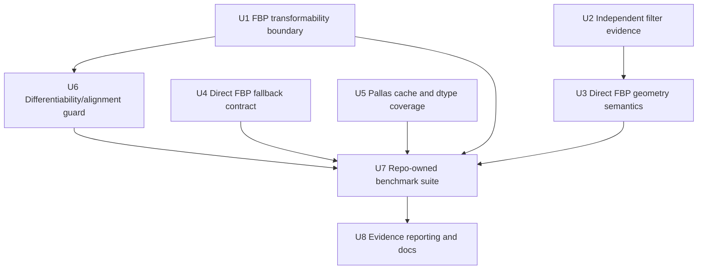

# fix: Harden benchmark fast paths and evidence

## Summary

This plan hardens the TomoJAX fast-path benchmark work by separating library semantics from
benchmark timing, adding adversarial correctness and transformability coverage for FBP/Pallas,
and moving durable ASTRA comparison logic into repo-owned benchmark modules. The result should let
agents optimize TomoJAX speed while preserving differentiability where the alignment workflow needs
it and producing evidence that distinguishes quick guards from publication-grade claims.

---

## Problem Frame

The current branch shows large TomoJAX speedups, but Oracle's review identified several gaps that
could make those numbers misleading: `fbp()` synchronizes inside library code, direct FBP has weak
geometry adversaries, the shared RFFT filter path lacks an independent reference test, Pallas
cache checks are mostly interpreter-mode, and benchmark output does not yet separate setup/compile
from steady-state execution. The upstream benchmark requirements already require clean,
commit-stamped, hard-to-game evidence that catches differentiability breakage, stale outputs,
quality regressions, and alignment workflow failures (see origin:
`docs/brainstorms/2026-05-01-comprehensive-benchmark-requirements.md`).

---

## Requirements

- R1. Preserve clean-worktree, branch, commit, note, timestamp, and environment metadata for every
  tracked benchmark run.
- R2. Keep quick/guard/publication benchmark modes distinct, and make it mechanically clear that
  quick and guard runs are optimization guards, not publication evidence.
- R3. Do not use FDK or cone-beam assumptions; all ASTRA comparisons remain parallel-beam.
- R4. Do not call ASTRA from TomoJAX implementation paths; ASTRA remains a benchmark/reference
  backend only.
- R5. Preserve JAX transformability for differentiable TomoJAX library paths that may participate
  in reconstruction or alignment objectives.
- R6. Prove the direct parallel FBP path against adversarial geometry, filter, detector, and
  fallback cases instead of relying on centered symmetric phantoms.
- R7. Prove shared filter optimizations independently of direct-vs-generic FBP comparisons.
- R8. Prove Pallas cached batched setup does not cache outputs across changed volume, pose,
  static geometry config, or gather dtype; include GPU/lowered coverage where available.
- R9. Report benchmark timing in a way that separates cold/setup/compile cost from warm steady-state
  execution and synchronizes timed JAX values at the benchmark boundary.
- R10. Add direct-vs-generic TomoJAX FBP quality metadata to benchmark evidence so speedups are not
  confused with silent semantic changes.
- R11. Keep the optional alignment smoke as a workflow/differentiability guard, not a pose-recovery
  accuracy claim.

**Origin acceptance examples:** Existing origin acceptance examples remain active for guard and
publication suite artifact creation, Pallas changed-input sanity, and optional alignment smoke
summary output.

---

## Scope Boundaries

- No cone-beam, FDK, or ASTRA implementation integration inside TomoJAX code paths.
- No universal hardware performance claim; publication mode is evidence for the tested machine and
  environment only.
- No pose-recovery metric claim from the 24^3 alignment smoke until gauge handling and comparison
  conventions are designed.
- No requirement that direct voxel-domain FBP exactly match the generic ray-walking adjoint at
  machine precision for every anisotropic discretization. The plan requires explicit adversarial
  tolerances, metadata, and documentation of any accepted differences.
- No requirement that Pallas become the differentiable alignment path. The plan requires a documented
  differentiability stance and tests that enforce whichever contract is chosen.

### Deferred to Follow-Up Work

- Full pose-recovery scoring for alignment benchmarks: defer until gauge conventions are settled.
- Non-parallel ASTRA benchmark matrices beyond built-in parallel geometry: defer until comparison
  semantics and supported geometries are defined.
- Cross-machine benchmark aggregation service or dashboard: defer until repo-owned artifacts are
  stable.

---

## Context & Research

### Relevant Code and Patterns

- `src/tomojax/recon/fbp.py` owns FBP filtering, generic backprojection, direct parallel FBP, and
  the current internal synchronization behavior.
- `tests/test_fbp_batching.py` already compares direct and generic FBP, checks fallback for
  non-parallel geometry and explicit detector grids, and provides the natural home for FBP
  transformability, filter, geometry, and fallback tests.
- `src/tomojax/core/pallas_projector.py` owns the cached batched Pallas sinogram callable and
  residual SSE helper.
- `tests/test_projector_pallas.py` already covers interpreter-mode Pallas correctness, stale-input
  regressions, variant metadata, and cache-shape changes.
- `src/tomojax/bench/forward_projector.py`, `bench/memory.py`, and existing
  `tests/test_bench_*.py` show the repo's pattern for benchmark dataclasses, artifact metadata,
  timing helpers, optional GPU/NVML dependencies, and mocked contract tests.
- The current ASTRA suite logic lives outside the repo in the laptop benchmark workspace. The
  repo-owned implementation should absorb the durable Python logic and leave machine-local shell
  scripts as thin wrappers.
- JAX documentation on asynchronous dispatch and benchmarking recommends `block_until_ready()` for
  accurate timing, but at the timing boundary rather than hidden inside reusable numerical
  functions.

### Institutional Learnings

- `docs/solutions/architecture-patterns/reuse-align-multires-for-geometry-calibration-2026-04-25.md`
  reinforces that setup/alignment validation should reuse the alignment system, keep `l2_otsu`
  loss semantics visible, and avoid reconstruction-heavy scalar optimizer shapes. The benchmark
  alignment smoke should therefore validate workflow health and differentiability posture without
  overclaiming setup or pose recovery accuracy.

### External References

- JAX asynchronous dispatch documentation: https://docs.jax.dev/en/latest/async_dispatch.html
- JAX benchmarking documentation: https://docs.jax.dev/en/latest/benchmarking.html

---

## Key Technical Decisions

- Synchronization moves out of `fbp()` and into benchmark/timing helpers. This preserves JAX
  transformability while still allowing benchmark code to time completed device work.
- FBP hardening is characterization-first. Before changing direct FBP behavior further, tests should
  pin the intended current semantics and explicitly expose tolerated direct-vs-generic differences.
- Direct FBP gets an OOM fallback before larger structural rewrites. Falling back to the existing
  generic/backoff path is lower risk than designing chunked direct FBP immediately.
- The ASTRA comparison suite should become repo-owned benchmark code under `src/tomojax/bench/`,
  with optional runtime imports and contract tests that do not require ASTRA/GPU in the default CPU
  suite.
- Benchmark output reports both speed and evidence class. Quick and guard summaries should make
  their "not publication evidence" status explicit even when they include speedup ratios.
- Pallas differentiability is treated as an explicit contract decision, not an assumption. If Pallas
  residual SSE is not meant to be autodiff-compatible, tests should assert a clear unsupported path
  and alignment smoke should continue to exercise the differentiable JAX path.

---

## Open Questions

### Resolved During Planning

- Should ASTRA benchmark logic remain in the laptop workspace? No. Durable Python logic belongs in
  the repo so benchmark behavior is versioned with the code under test; laptop scripts can remain
  local wrappers.
- Should quick/guard output be allowed to report speedups? Yes, but the output should mark them as
  guard metrics rather than publication evidence.
- Should direct and generic FBP be required to match exactly? No. They use different discretization
  shapes; the plan requires adversarial tests and explicit tolerances instead of exact equivalence
  everywhere.

### Deferred to Implementation

- Final direct-FBP anisotropic tolerances: derive from adversarial characterization tests and record
  rationale in test names/comments or benchmark metadata.
- Whether Pallas residual SSE can support useful autodiff on the current JAX/Pallas stack: determine
  via implementation-time tests on CPU interpreter mode and GPU lowered mode.
- Exact ASTRA optional dependency setup: keep imports optional and decide whether docs should
  recommend system/conda installation versus Python package installation based on the current laptop
  environment.

---

## High-Level Technical Design

> *This illustrates the intended approach and is directional guidance for review, not implementation
> specification. The implementing agent should treat it as context, not code to reproduce.*

The sequencing keeps library semantics and unit-level evidence ahead of benchmark publication
changes. Benchmark harness updates should consume already-tested library contracts instead of
encoding correctness assumptions only in benchmark scripts.

---

## Implementation Units

- U1. **Move FBP synchronization to timing boundaries**

**Goal:** Preserve JAX transformability by removing hidden `block_until_ready()` calls from
`fbp()` while keeping benchmarks responsible for explicit synchronization.

**Requirements:** R5, R9

**Dependencies:** None

**Files:**
- Modify: `src/tomojax/recon/fbp.py`
- Modify: `tests/test_fbp_batching.py`
- Modify: `src/tomojax/bench/forward_projector.py`
- Test: `tests/test_fbp_batching.py`
- Test: `tests/test_bench_forward_projector.py`

**Approach:**
- Remove internal readiness blocking from both direct and generic FBP paths.
- Keep progress iteration behavior outside JAX-transformed internals as much as possible; if progress
  reporting proves incompatible with transformed execution, gate it through an explicit option whose
  default preserves transformability.
- Ensure benchmark helpers synchronously block returned JAX values after each warmup, measured run,
  and cold/setup timing region.

**Execution note:** Start with failing transformability tests before changing `fbp()`.

**Patterns to follow:**
- `_block_tree_ready` and `_time_blocked_call` in `src/tomojax/bench/forward_projector.py`.
- Existing gradient smoke style in `tests/test_grad_modes.py`.

**Test scenarios:**
- Happy path: direct FBP called normally returns the same numerical reconstruction as before for the
  small parallel fixture.
- Happy path: generic FBP forced with `det_grid` returns the same numerical reconstruction as before.
- Integration: gradient of `sum(fbp(..., scale=1.0))` with respect to projections is finite and has
  the projection stack shape for the direct path.
- Integration: gradient of `sum(fbp(..., scale=1.0, det_grid=...))` with respect to projections is
  finite and has the projection stack shape for the generic path.
- Integration: a small jitted wrapper around FBP either succeeds for supported static geometry inputs
  or fails with a documented, intentional unsupported error; no incidental tracer attribute error is
  acceptable.
- Benchmark contract: timing helpers still block asynchronous JAX work before recording elapsed time.

**Verification:**
- FBP tests prove no hidden synchronization breaks `grad`/`jit` smoke coverage.
- Benchmark timing helpers remain the only place where readiness blocking is required for timing.

---

- U2. **Add independent filter correctness coverage**

**Goal:** Prove `_fft_filter_rows` against an independent reference so direct-vs-generic FBP tests
cannot hide shared filter regressions.

**Requirements:** R6, R7

**Dependencies:** U1 is independent but can land before or after this unit.

**Files:**
- Modify: `tests/test_fbp_batching.py`
- Modify: `src/tomojax/recon/fbp.py` only if tests reveal a filter bug
- Test: `tests/test_fbp_batching.py`

**Approach:**
- Add parameterized tests for odd/even detector widths, non-unit detector spacing, and all supported
  FBP filters used by the benchmark.
- Compare `_fft_filter_rows` to a reference that does not reuse the RFFT slicing assumption. If
  `get_filter_np` is already the full FFT-order transfer function, use a full FFT reference. If it is
  not, derive a spatial-domain convolution reference and document that decision in the test.
- Keep rows small and CPU-friendly.

**Execution note:** Characterization-first: write the independent reference test before changing any
  filter code.

**Patterns to follow:**
- Parameterized numerical tests in `tests/test_fbp_batching.py`.
- Filter lookup through `src/tomojax/recon/filters.py`.

**Test scenarios:**
- Happy path: ramp, Shepp, and Hann filters match the independent reference for even detector widths.
- Edge case: the same filters match for odd detector widths.
- Edge case: non-unit detector spacing produces the same scaled result as the independent reference.
- Error path: unsupported filter names still fail through the existing filter lookup path with a
  useful error.

**Verification:**
- A wrong one-sided RFFT coefficient mapping would fail even if direct and generic FBP still matched
  each other.

---

- U3. **Strengthen direct FBP geometry semantics**

**Goal:** Make sign, axis, detector-center, interpolation, and asymmetric-volume errors visible in
direct FBP tests and benchmark metadata.

**Requirements:** R3, R6, R10

**Dependencies:** U2

**Files:**
- Modify: `tests/test_fbp_batching.py`
- Modify: `src/tomojax/recon/fbp.py` only if adversarial tests expose an implementation bug
- Test: `tests/test_fbp_batching.py`

**Approach:**
- Replace reliance on centered cuboids with asymmetric volumes and asymmetric synthetic sinograms.
- Include tests that bypass filtering when isolating backprojection geometry, while keeping separate
  end-to-end FBP tests with real filtering.
- Add direct-vs-generic comparisons that record intentionally looser tolerances for cases where the
  discretization mismatch is known and justified.
- Keep the direct path guard narrow: built-in `ParallelGeometry` with canonical detector grid only.

**Execution note:** Characterize expected direct-vs-generic differences before tightening or changing
  direct FBP implementation.

**Patterns to follow:**
- Existing direct-vs-generic helper in `tests/test_fbp_batching.py`.
- Existing asymmetric alignment fixture construction in `tests/test_alignment_objectives.py`.

**Test scenarios:**
- Happy path: asymmetric off-center volume forward-projected and reconstructed through direct FBP
  remains within explicit error bounds versus the generic path.
- Edge case: detector center offsets in both detector axes produce bounded direct-vs-generic error.
- Edge case: non-square detector dimensions produce bounded direct-vs-generic error.
- Edge case: anisotropic voxel and detector spacing produce bounded error with a tolerance that is
  explicitly separate from isotropic cases.
- Integration: synthetic asymmetric detector images with identity filtering catch u/v swaps, sign
  inversions, and detector-axis flips by comparing direct and generic backprojection behavior.
- Error path: a `ParallelGeometry` call with explicit non-`None` `det_grid` continues to use the
  generic path.

**Verification:**
- The test suite can catch common direct-FBP semantic mistakes that a centered cuboid would hide.
- Any accepted direct-vs-generic difference is named and bounded rather than hidden in a broad
  default tolerance.

---

- U4. **Restore FBP memory fallback semantics**

**Goal:** Ensure direct FBP does not silently remove the memory-safety behavior users expect from
generic FBP batching/backoff.

**Requirements:** R5, R6

**Dependencies:** U1

**Files:**
- Modify: `src/tomojax/recon/fbp.py`
- Modify: `tests/test_fbp_batching.py`
- Test: `tests/test_fbp_batching.py`

**Approach:**
- Catch direct-path OOM/resource-exhaustion failures and fall back to the existing generic fast
  path/backoff logic.
- Decide whether `views_per_batch` should remain ignored on successful direct FBP or become a direct
  chunking control. Prefer fallback first; direct chunking can be deferred if fallback is sufficient.
- Document any direct-path batching limitation in the FBP config docstring or user-facing docs if
  the option remains ignored for successful direct runs.

**Execution note:** Add failure-path tests before changing the exception handling branch.

**Patterns to follow:**
- `_is_fbp_oom_error` and `_run_fbp_with_backoff` in `src/tomojax/recon/fbp.py`.
- Existing OOM retry tests in `tests/test_fbp_batching.py`.

**Test scenarios:**
- Error path: simulated direct-path `RESOURCE_EXHAUSTED` falls back to generic FBP and returns the
  expected reconstruction.
- Error path: non-OOM direct-path exceptions still propagate instead of being swallowed.
- Integration: fallback honors `views_per_batch` through the existing generic/backoff path.
- Documentation expectation: if successful direct FBP ignores `views_per_batch`, tests or docs make
  that behavior explicit.

**Verification:**
- A large direct-FBP run can fail over to the pre-existing memory-safe path rather than turning a
  user memory-control setting into a no-op failure.

---

- U5. **Harden Pallas cached batched projection contracts**

**Goal:** Extend Pallas cache coverage beyond interpreter-mode stale-output checks so benchmark
claims are protected against runtime input, static config, gather dtype, and GPU lowering mistakes.

**Requirements:** R8, R9

**Dependencies:** None

**Files:**
- Modify: `tests/test_projector_pallas.py`
- Modify: `src/tomojax/core/pallas_projector.py` only if tests expose cache-key bugs
- Test: `tests/test_projector_pallas.py`

**Approach:**
- Keep existing interpreter-mode tests as CPU-friendly default coverage.
- Add gather-dtype cache-change tests that call the cached batched path with one dtype and then
  another under the same static geometry.
- Add GPU-marked lowered-mode tests that run only when `jax.default_backend()` is GPU and Pallas is
  available.
- Add invalid pose-stack shape tests for public batched Pallas APIs to prevent incidental errors from
  leaking through validation.

**Patterns to follow:**
- Existing `_relative_l2` helper and `interpret=True` tests in `tests/test_projector_pallas.py`.
- Existing `PallasProjectorUnsupported` validation style in the same file.

**Test scenarios:**
- Happy path: changing `gather_dtype` after a cached batched call still matches the JAX oracle for
  the second dtype.
- Edge case: dtype order is varied, including fp32 to lower precision and lower precision back to
  fp32 where supported.
- GPU integration: lowered Pallas batched projection changes output when the volume changes.
- GPU integration: lowered Pallas batched projection changes output when the pose stack changes.
- Error path: rank-2, empty, and wrongly-shaped pose stacks fail with clear validation errors.

**Verification:**
- Cached Pallas setup is proven to cache only static launch configuration, not runtime inputs or
  stale dtype assumptions.

---

- U6. **Define and test differentiability posture**

**Goal:** Protect the alignment-relevant differentiability contract without assuming every fast path
must be an autodiff path.

**Requirements:** R5, R8, R11

**Dependencies:** U1, U5

**Files:**
- Modify: `tests/test_fbp_batching.py`
- Modify: `tests/test_projector_pallas.py`
- Modify: `tests/test_alignment_objectives.py`
- Modify: `docs/brainstorms/2026-05-01-comprehensive-benchmark-requirements.md` only if the
  requirement wording needs clarification
- Test: `tests/test_fbp_batching.py`
- Test: `tests/test_projector_pallas.py`
- Test: `tests/test_alignment_objectives.py`

**Approach:**
- Treat FBP projection-gradient smoke as required because FBP is mathematically linear in
  projections and should not fail due to hidden host synchronization.
- Test Pallas residual SSE autodiff only if intended for optimization objectives. If Pallas autodiff
  is unsupported, assert a clear unsupported behavior and keep alignment smoke on the known
  differentiable JAX path.
- Keep the tiny alignment/differentiability guard focused on workflow health: loss drops, gradients
  are finite, and no stale/cached projection output contaminates optimization.

**Patterns to follow:**
- `tests/test_alignment_objectives.py` for fixed-volume objective and validation residual JVP tests.
- `docs/solutions/architecture-patterns/reuse-align-multires-for-geometry-calibration-2026-04-25.md`
  for avoiding overclaimed setup/pose recovery metrics.

**Test scenarios:**
- Happy path: direct and generic FBP gradients with respect to projections are finite.
- Happy path: existing alignment objective gradients/JVPs remain finite after FBP synchronization
  changes.
- Integration: tiny alignment smoke continues to produce a finite loss drop with the configured
  differentiable projector path.
- Pallas contract: residual SSE either has a gradient matching the JAX oracle in interpreter mode or
  raises a clear unsupported error that the alignment path does not rely on.
- Error path: benchmark or alignment code does not silently select a non-differentiable Pallas path
  for gradient-based recovery unless that contract is later explicitly supported.

**Verification:**
- "Differentiability where relevant" is enforced by tests around actual alignment and FBP usage, not
  only by value comparisons.

---

- U7. **Move ASTRA comparison suite into repo-owned benchmark code**

**Goal:** Version the durable benchmark suite with TomoJAX and make laptop scripts thin wrappers
around repo-owned modules.

**Requirements:** R1, R2, R3, R4, R9, R10, R11

**Dependencies:** U1, U3, U4, U5, U6

**Files:**
- Create: `src/tomojax/bench/astra_parallel.py`
- Create: `src/tomojax/bench/benchmark_suite.py`
- Create: `src/tomojax/bench/pallas_sanity.py`
- Create or modify: `src/tomojax/bench/alignment_smoke.py`
- Modify: `src/tomojax/bench/__init__.py`
- Modify: `pyproject.toml`
- Create: `tests/test_bench_astra_parallel.py`
- Create: `tests/test_bench_benchmark_suite.py`
- Create: `tests/test_bench_pallas_sanity.py`
- Test: `tests/test_bench_astra_parallel.py`
- Test: `tests/test_bench_benchmark_suite.py`
- Test: `tests/test_bench_pallas_sanity.py`

**Approach:**
- Port the current laptop Python suite into `src/tomojax/bench/` as importable, testable modules.
- Keep ASTRA optional: default tests should mock or skip ASTRA/GPU-dependent execution while testing
  schema, mode selection, artifact writing, claim classification, and command/config plumbing.
- Preserve current quick, guard, and publication case presets, but add explicit evidence-class
  metadata to suite JSON and Markdown.
- Add first-call/cold timing fields and warm steady-state fields for JAX forward, Pallas forward,
  ASTRA forward, TomoJAX FBP, and ASTRA FBP where applicable.
- Add direct-vs-generic TomoJAX FBP relative L2 and max error to per-case quality metrics.
- Keep machine-local shell scripts outside the repo as wrappers that call the repo-owned module or
  console script.

**Execution note:** Contract-test the artifact schema before porting the full runner behavior.

**Patterns to follow:**
- Dataclass and suite case patterns in `src/tomojax/bench/forward_projector.py`.
- GPU memory monitor tests in `tests/test_bench_memory.py`.
- Test placement guidance in `tests/README.md`.

**Test scenarios:**
- Happy path: quick, guard, and publication modes expand to the expected case names, sizes, view
  counts, warmups, and repeats.
- Happy path: suite JSON includes branch, commit, note, timestamp, environment, mode, evidence class,
  case summaries, Pallas sanity, and optional alignment smoke keys.
- Happy path: summary Markdown includes cold/setup and warm timing sections without conflating them.
- Happy path: per-case quality includes Pallas-vs-JAX, ASTRA-vs-JAX, TomoJAX FBP-vs-truth, ASTRA
  FBP-vs-truth, and direct-vs-generic TomoJAX FBP metrics.
- Error path: dirty-worktree enforcement remains outside the library module but the suite receives
  and records clean commit metadata from the wrapper.
- Error path: missing ASTRA produces a clear skip/unsupported result for ASTRA-specific execution,
  not an import-time crash for unrelated benchmark tests.
- Integration: optional alignment smoke writes JSON/Markdown/image artifact references and is labeled
  as workflow evidence, not pose-recovery evidence.

**Verification:**
- Benchmark behavior is reviewable and testable inside the TomoJAX repository.
- Laptop benchmark wrappers can be updated without changing benchmark semantics.

---

- U8. **Update evidence reporting and experiment guidance**

**Goal:** Make benchmark outputs and docs communicate what can and cannot be claimed from each run.

**Requirements:** R1, R2, R9, R10, R11

**Dependencies:** U7

**Files:**
- Modify: `docs/brainstorms/2026-05-01-comprehensive-benchmark-requirements.md`
- Create or modify: `docs/benchmarks/astra-comparison.md`
- Modify: `README.md` if benchmark entry points are documented there
- Test: `tests/test_bench_benchmark_suite.py`

**Approach:**
- Extend the benchmark requirements doc with cold-vs-warm timing policy, direct-vs-generic FBP
  metrics, and claim-class labels.
- Add a user-facing benchmark doc that explains quick, guard, and publication modes, strict clean
  worktree workflow, expected artifacts, optional alignment smoke, and how to interpret speedup
  ratios.
- Ensure quick/guard output includes a caveat such as "optimization guard only" in structured JSON
  and Markdown, while publication output states the machine/environment scope.
- Add a small FBP changed-input sanity requirement or check so reconstruction outputs cannot be
  accidentally reused across projection changes.

**Patterns to follow:**
- Current brainstorm requirements style in
  `docs/brainstorms/2026-05-01-comprehensive-benchmark-requirements.md`.
- Existing benchmark artifact table style in the laptop-generated summaries, migrated into tests.

**Test scenarios:**
- Happy path: guard summary includes speedup ratios and the guard-only caveat.
- Happy path: publication summary includes environment-scoped evidence language.
- Edge case: quick/guard summary generation does not label itself publication evidence.
- Integration: JSON and Markdown both expose cold/setup and warm timing fields.
- Integration: JSON and Markdown both expose direct-vs-generic FBP error metrics.
- Error path: failed Pallas or FBP changed-input sanity marks the suite as failed or invalid for
  speed claims.

**Verification:**
- A reader can tell from artifacts alone whether a result is exploratory, guard evidence, or
  publication evidence for a specific machine.

---

## System-Wide Impact

- **Interaction graph:** FBP library behavior affects reconstruction CLI, alignment workflows,
  benchmark scripts, and any downstream JAX transforms that call FBP. Benchmark suite changes affect
  both repo-owned tests and laptop wrapper scripts.
- **Error propagation:** Direct FBP OOM should fall back only for recognized resource-exhaustion
  failures; semantic exceptions should propagate. Pallas unsupported cases should surface clear
  `PallasProjectorUnsupported`-style errors.
- **State lifecycle risks:** Cached Pallas callables must keep runtime volume/pose data dynamic and
  only cache static launch metadata. Benchmark artifact symlinks and experiment logs must remain
  commit-stamped and clean-worktree guarded.
- **API surface parity:** FBP config options, benchmark mode names, and optional alignment smoke
  flags should behave consistently across Python modules, console scripts, and laptop wrappers.
- **Integration coverage:** Unit tests protect library semantics; benchmark contract tests protect
  artifact schemas; laptop guard/publication runs remain the final hardware-backed verification.
- **Unchanged invariants:** TomoJAX remains parallel-beam-only for this benchmark. ASTRA remains an
  external comparison backend. Alignment smoke remains a workflow guard, not a pose-recovery claim.

---

## Risks & Dependencies

| Risk | Mitigation |
|------|------------|
| Removing internal `block_until_ready()` changes benchmark timings | Move synchronization into benchmark timing helpers and add timing-helper tests. |
| Direct FBP and generic adjoint differences are real but poorly understood | Add adversarial characterization tests with explicit per-case tolerances and benchmark metadata. |
| Pallas lowered GPU behavior differs from interpreter mode | Add GPU-marked lowered tests and keep benchmark changed-input sanity enabled by default. |
| Repo-owned ASTRA modules make default tests depend on ASTRA/GPU | Keep ASTRA imports optional and mock/skip hardware execution in CPU tests. |
| Publication language overstates guard results | Add structured evidence-class metadata and summary tests for claim caveats. |
| Laptop wrapper drifts from repo-owned behavior | Make wrappers call repo-owned modules and record the TomoJAX commit that owns the benchmark code. |

---

## Documentation / Operational Notes

- Update benchmark docs before making any renewed "x faster than ASTRA" statement.
- After implementation, rerun the laptop focused tests, guard suite, and publication suite on both
  the pre-optimization baseline and hardened branch before reporting final speedups.
- Keep `TOMOJAX_BENCH_NOTE` discipline: every tracked run should explain the experiment in a short,
  human-readable note.
- Any exploratory dirty benchmark must remain labeled dirty/untracked and excluded from real
  comparisons.

---

## Alternative Approaches Considered

- Keep ASTRA suite only in the laptop workspace: rejected because benchmark behavior would not be
  reviewed, versioned, or testable with the TomoJAX branch being optimized.
- Require direct FBP to exactly match generic FBP for all cases: rejected because the paths use
  different discretizations; the safer contract is explicit adversarial tolerances plus
  direct-vs-generic metadata.
- Make Pallas the default differentiable alignment path now: rejected as premature. The plan first
  records whether Pallas autodiff is supported and keeps the alignment guard on known differentiable
  paths unless that changes deliberately.
- Put cold and warm timings into separate scripts: rejected because one suite artifact should carry
  both timing definitions for the same commit, environment, and case configuration.

---

## Success Metrics

- Focused FBP/Pallas tests cover transformability, filter independence, adversarial direct FBP
  geometry, direct OOM fallback, Pallas dtype/cache changes, and GPU-lowered changed-input sanity.
- Benchmark artifacts include cold/setup timing, warm timing, evidence class, direct-vs-generic FBP
  metrics, changed-input sanity, and optional alignment smoke.
- Quick/guard/publication results are not semantically interchangeable in JSON or Markdown output.
- Laptop guard and publication runs complete on clean commits and produce artifact bundles tied to
  the hardened branch.

---

## Phased Delivery

### Phase 1: Library contract hardening

- Land U1 through U6 with CPU-friendly focused tests.
- Run GPU-marked Pallas tests on the laptop before treating Pallas cache claims as hardware-backed.

### Phase 2: Benchmark ownership and artifact schema

- Land U7 and U8 so benchmark behavior is repo-owned, documented, and tested.
- Update laptop wrappers to call repo-owned code.

### Phase 3: Evidence regeneration

- Run clean guard and publication suites for baseline and hardened branches.
- Report speedups only with the artifact mode, evidence class, commit, and environment attached.

---

## Sources & References

- **Origin document:** `docs/brainstorms/2026-05-01-comprehensive-benchmark-requirements.md`
- Related code: `src/tomojax/recon/fbp.py`
- Related code: `src/tomojax/core/pallas_projector.py`
- Related code: `src/tomojax/bench/forward_projector.py`
- Related tests: `tests/test_fbp_batching.py`
- Related tests: `tests/test_projector_pallas.py`
- Related tests: `tests/test_alignment_objectives.py`
- Test strategy: `tests/README.md`
- Institutional learning:
  `docs/solutions/architecture-patterns/reuse-align-multires-for-geometry-calibration-2026-04-25.md`
- JAX asynchronous dispatch documentation: https://docs.jax.dev/en/latest/async_dispatch.html
- JAX benchmarking documentation: https://docs.jax.dev/en/latest/benchmarking.html
