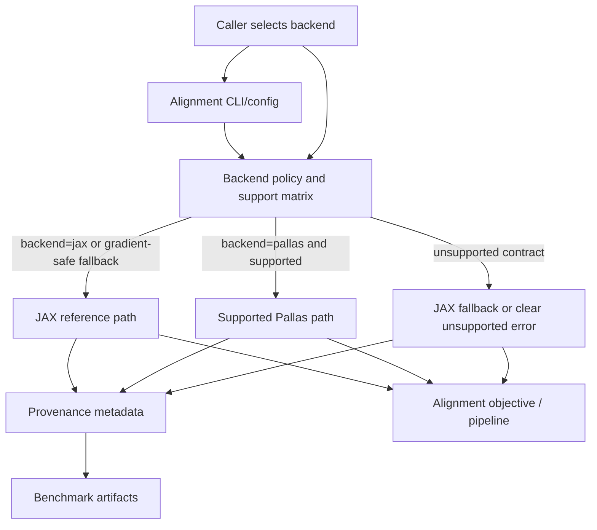

# feat: Promote Pallas alignment accelerators to supported APIs

## Summary

Promote a narrow, alignment-centered subset of the current Pallas acceleration work from
benchmark/research code into supported TomoJAX APIs. The plan keeps JAX as the default semantic
reference, adds explicit backend selection, preserves differentiability for alignment-critical
paths, and documents which Pallas paths are supported, performance-only, or still experimental.

---

## Problem Frame

Recent optimization work has produced meaningful speedups across general-pose projection,
forward-residual scoring, FISTA iteration, and specialized regular-z reconstruction helpers. The
branch is not mergeable as production code until the public contract is clear: users must know when
they are using supported Pallas acceleration, when they are using JAX fallback, and whether the path
is safe inside alignment gradients.

The production target is not "Pallas everywhere." It is a mergeable core where selected Pallas paths
support TomoJAX's main differentiator: fast, differentiable geometry and alignment workflows.

---

## Requirements

- R1. Keep `jax` as the default backend and numerical reference unless a caller explicitly requests
  a different supported backend.
- R2. Provide explicit backend selection for promoted alignment-relevant APIs, with accepted values
  limited to documented backends.
- R3. Preserve differentiability for alignment-critical paths: forward projection, residual/objective
  evaluation, and reconstruction inner-loop paths used by alignment.
- R4. If a requested Pallas path cannot satisfy the alignment differentiability contract, it must
  either fall back to JAX at a documented boundary or raise a clear unsupported-mode error.
- R5. Promote only the alignment accelerator slice first: general-pose forward projection,
  forward-residual/objective helpers, and FISTA core acceleration where it is used by alignment.
- R6. Keep specialized regular-z Pallas FBP outside the supported alignment API slice until its
  public reconstruction semantics, geometry limits, and quality tolerances are independently
  settled.
- R7. Record backend provenance in benchmark and workflow metadata: requested backend, actual
  backend, fallback reason, supported/experimental status, and eligibility for speed claims.
- R8. Add real regression coverage for promoted Pallas APIs, including CPU-friendly parity tests and
  GPU-marked lowered-mode tests for changed inputs, nondividing shapes, and fallback behavior.
- R9. Keep benchmark labels honest: public supported APIs, performance-only helpers, and internal
  benchmark helpers must not be conflated.
- R10. Document the supported geometry and dtype matrix for each promoted Pallas path, including
  known limitations and fallback behavior.
- R11. Preserve existing JAX public behavior for callers that do not opt into Pallas.
- R12. Keep Pallas imports and runtime checks safe on CPU-only, Apple Silicon, and unsupported GPU
  environments.
- R13. Expose backend selection through the alignment-facing user boundary, not only through
  benchmark scripts or private Python helpers.

---

## Scope Boundaries

- Do not make Pallas the global default backend in this production slice.
- Do not promote specialized regular-z FBP as a general `fbp()` replacement in this plan.
- Do not claim publication-grade performance from guard benchmark artifacts.
- Do not add support for every scan geometry or arbitrary detector configuration before the support
  matrix is explicit and tested.
- Do not introduce custom Pallas autodiff unless implementation proves it is needed for the promoted
  alignment contract and can be tested.
- Do not remove existing JAX projector, residual, or FISTA behavior.

### Deferred to Follow-Up Work

- Broad public FBP acceleration: separate plan after the alignment accelerator slice is mergeable.
- Automatic Pallas dispatch by default: separate rollout decision after explicit backend support has
  real user-facing coverage.
- Publication evidence package: separate article/evidence pass after the supported API contract is
  stable.
- Cross-machine benchmark dashboard or aggregation: separate tooling work after artifacts settle.

---

## Context & Research

### Relevant Code and Patterns

- `src/tomojax/core/projector.py` owns the JAX forward projector contract and existing geometry
  semantics.
- `src/tomojax/core/pallas_projector.py` contains the current Pallas forward, batched forward,
  residual, backprojection, and fused loss/gradient helpers.
- `src/tomojax/recon/fista_tv_core.py` already exposes array-level FISTA configuration with
  `forward_projector` and `backprojector` backend controls.
- `src/tomojax/align/objectives/fixed_volume.py` currently uses the JAX projector directly inside
  alignment objective scoring.
- `src/tomojax/align/_reconstruction_stage.py` uses the FISTA core path for alignment reconstruction
  stages.
- `src/tomojax/cli/align.py` and alignment config parsing are the user-facing boundary for
  alignment workflow options.
- `src/tomojax/bench/forward_projector.py`, `src/tomojax/bench/forward_residual.py`,
  `src/tomojax/bench/fista_iteration.py`, and `src/tomojax/bench/benchmark_suite.py` already record
  backend and benchmark metadata that should be promoted into production provenance fields where
  relevant.
- `tests/test_projector_pallas.py` has the strongest existing Pallas coverage, including parity,
  stale-input, dtype, invalid-shape, and GPU-marked lowered-mode tests.
- `tests/README.md` says tests should follow owned surfaces: core math tests for projector/recon
  contracts, alignment workflow tests for pipeline contracts, and benchmark tests for artifact
  schemas.
- `docs/plans/2026-05-01-001-fix-benchmark-fast-path-hardening-plan.md` already covers evidence
  hardening and should be treated as an input, not duplicated.

### Institutional Learnings

- `docs/solutions/architecture-patterns/reuse-align-multires-for-geometry-calibration-2026-04-25.md`
  reinforces that production alignment work should reuse the unified alignment system, keep loss
  semantics visible, and avoid private solver paths whose provenance is unclear.

### External References

- JAX Pallas documentation describes Pallas as an experimental custom-kernel extension for GPU and
  TPU; supported TomoJAX APIs therefore need explicit fallback and compatibility boundaries:
  https://docs.jax.dev/en/latest/pallas/index.html
- JAX `pallas_call` documentation notes `interpret=True` as the CPU-compatible execution mode;
  production confidence still needs GPU-lowered tests for GPU performance claims:
  https://docs.jax.dev/en/latest/_autosummary/jax.experimental.pallas.pallas_call.html
- JAX asynchronous dispatch and benchmarking docs require `block_until_ready()` at measurement
  boundaries when timing device work:
  https://docs.jax.dev/en/latest/async_dispatch.html and
  https://docs.jax.dev/en/latest/benchmarking.html

---

## Key Technical Decisions

- **Explicit backend selection first:** promoted APIs accept a documented backend choice rather than
  silently switching behavior. This keeps review, tests, and benchmark evidence honest.
- **Alignment-first differentiability:** APIs used by alignment gradients must remain
  gradient-safe. Pallas can be used when its derivative path is explicit and tested; otherwise the
  alignment path falls back to JAX or refuses the unsupported mode clearly.
- **JAX remains the oracle:** Pallas parity is measured against existing JAX behavior, not against
  benchmark speedups or ASTRA.
- **Support matrix over broad promises:** the first merge documents exactly which geometry, dtype,
  detector-grid, and backend combinations are supported. Unsupported combinations are normal
  fallback cases, not bugs.
- **Production provenance is part of the API:** callers and benchmark artifacts must expose
  requested vs actual backend and whether a speed claim is eligible.
- **Performance-only reconstruction helpers stay labeled:** FISTA and FBP acceleration may be useful
  without being generally differentiable, but those paths must not be confused with the
  alignment-gradient contract.
- **CLI/config follows the same contract:** alignment-facing flags or config values should select
  the same supported backend policy as Python APIs, not a separate benchmark-only mode.

---

## Open Questions

### Resolved During Planning

- Should selected Pallas paths remain experimental? No. The chosen target is supported API
  promotion for a narrow alignment accelerator slice.
- Should Pallas become the default backend? No. Explicit backend selection is the first production
  contract.
- Should all promoted paths be differentiable? No. Differentiability is required for
  alignment-critical paths; reconstruction-only accelerators can be performance-only when labeled.
- Should specialized FBP be promoted now? No. It remains outside this production slice until its
  public reconstruction contract is independently settled.

### Deferred to Implementation

- Exact public option names and object shapes for backend provenance should follow the local API
  style discovered while editing the concrete call sites.
- Whether any current Pallas helper can support autodiff directly, versus needing JAX fallback, must
  be proven with implementation-time tests on CPU/interpreter and GPU/lowered paths.
- Final geometry/dtype support rows should be derived from the current Pallas capability checks and
  regression results rather than guessed in the plan.

---

## High-Level Technical Design

> *This illustrates the intended approach and is directional guidance for review, not implementation
> specification. The implementing agent should treat it as context, not code to reproduce.*

The public contract is resolved before entering hot JAX-transformed regions where possible.
Alignment-critical callers get gradient-safe behavior; benchmarks and metadata report what actually
ran.

---

## Implementation Units

- U1. **Define the supported backend contract**

**Goal:** Establish the public backend vocabulary, support matrix, and provenance model for promoted
alignment accelerators.

**Requirements:** R1, R2, R4, R7, R10, R11, R12

**Dependencies:** None

**Files:**
- Modify: `src/tomojax/core/pallas_projector.py`
- Modify: `src/tomojax/core/projector.py`
- Modify: `src/tomojax/cli/align.py`
- Modify: `src/tomojax/bench/forward_projector.py`
- Modify: `src/tomojax/bench/forward_residual.py`
- Test: `tests/test_projector_pallas.py`
- Test: `tests/test_cli_entrypoints.py`
- Test: `tests/test_bench_forward_projector.py`
- Test: `tests/test_bench_forward_residual.py`

**Approach:**
- Define the supported backend vocabulary at the same conceptual boundary used by the projector and
  benchmark modules.
- Make capability checks return enough metadata to distinguish supported Pallas, unsupported
  fallback, and internal experimental helpers.
- Keep low-level array-returning functions usable inside JAX transforms; production provenance can
  be attached at Python/wrapper boundaries rather than returned from every traced numerical helper.
- Ensure unsupported hardware can import TomoJAX and run JAX paths without touching Pallas lowering.

**Patterns to follow:**
- Existing Pallas metadata helpers in `src/tomojax/core/pallas_projector.py`.
- Existing benchmark result dictionaries and eligibility fields in `src/tomojax/bench/forward_projector.py`.

**Test scenarios:**
- Happy path: requesting `jax` resolves to the existing JAX path with provenance marking JAX as both
  requested and actual backend.
- Happy path: requesting `pallas` for a supported GPU-lowered configuration marks Pallas as actual
  backend and eligible for Pallas speed claims.
- Edge case: requesting `pallas` on CPU or unsupported hardware does not fail at import time and
  resolves to fallback or unsupported status at the documented boundary.
- Error path: invalid backend names are rejected before numerical work starts.
- Integration: alignment CLI/config accepts only the documented backend values and leaves existing
  defaults unchanged.
- Integration: benchmark metadata distinguishes supported public Pallas APIs from internal helper
  paths.

**Verification:**
- Backend resolution is explicit, tested, and reusable by projector, residual, FISTA, and benchmark
  call sites.

---

- U2. **Promote general-pose forward projection behind explicit backend selection**

**Goal:** Make general-pose Pallas forward projection a supported opt-in API surface where parity,
fallback, changed-input behavior, and geometry limits are documented and tested.

**Requirements:** R1, R2, R3, R4, R5, R7, R8, R10, R11, R12

**Dependencies:** U1

**Files:**
- Modify: `src/tomojax/core/projector.py`
- Modify: `src/tomojax/core/pallas_projector.py`
- Modify: `src/tomojax/bench/forward_projector.py`
- Test: `tests/test_projector.py`
- Test: `tests/test_projector_pallas.py`
- Test: `tests/test_bench_forward_projector.py`

**Approach:**
- Add a public, opt-in way to request Pallas for general-pose forward projection without changing
  the default JAX behavior.
- Preserve current geometry semantics: pose transform convention, detector orientation, object-frame
  sampling, gather dtype handling, and support bounds.
- Keep JAX as the differentiable reference unless Pallas gradient behavior is explicitly proven for
  the call shape.
- Use support checks to reject or fall back for unsupported detector grids, invalid pose stacks,
  unsupported dtype modes, nondividing tile edge cases, or unsupported runtime backends.

**Execution note:** Characterization-first. Pin current JAX outputs and current Pallas parity before
altering public call boundaries.

**Patterns to follow:**
- `forward_project_view_T` and stack helpers in `src/tomojax/core/projector.py`.
- Existing Pallas stack tests in `tests/test_projector_pallas.py`.

**Test scenarios:**
- Happy path: JAX default output is unchanged when no backend is specified.
- Happy path: opt-in Pallas output matches JAX within declared tolerance for a general 5-DOF pose
  stack.
- Edge case: changed volume and changed pose both change Pallas output rather than reusing cached
  results.
- Edge case: non-cubic shapes and nondividing detector tile dimensions either pass parity or produce
  documented fallback.
- Error path: unsupported detector-grid or dtype combinations fail or fall back with provenance,
  never with silent wrong output.
- Integration: a small alignment-style projection stack can select backend explicitly while keeping
  JAX fallback available.
- GPU-marked integration: lowered Pallas output matches JAX and reacts to changed inputs on a real
  GPU backend.

**Verification:**
- General-pose Pallas forward projection has a clear public opt-in path, documented eligibility, and
  regression coverage beyond interpreter-mode parity.

---

- U3. **Promote forward-residual and alignment objective acceleration**

**Goal:** Make the residual/objective acceleration path useful for alignment while preserving the
alignment-first differentiability contract.

**Requirements:** R2, R3, R4, R5, R7, R8, R9, R10, R12

**Dependencies:** U1, U2

**Files:**
- Modify: `src/tomojax/core/pallas_projector.py`
- Modify: `src/tomojax/align/objectives/fixed_volume.py`
- Modify: `src/tomojax/align/objectives/loss_adapters.py`
- Modify: `src/tomojax/bench/forward_residual.py`
- Test: `tests/test_projector_pallas.py`
- Test: `tests/test_alignment_objectives.py`
- Test: `tests/test_bench_forward_residual.py`

**Approach:**
- Route alignment objective scoring through the same explicit backend policy as forward projection.
- Preserve the existing loss adapter semantics; acceleration should not introduce a private loss
  shape or bypass `l2`, `l2_otsu`, masks, view weights, or per-view indexing semantics.
- If the Pallas residual path is not gradient-safe with respect to the alignment parameters, ensure
  gradient-taking callers use JAX fallback or receive a clear unsupported-mode error.
- Keep performance-only residual helpers available for benchmark and non-gradient objective
  evaluation when they pass parity.

**Execution note:** Add gradient/fallback tests before wiring Pallas into objective call sites.

**Patterns to follow:**
- `project_and_score_stack` in `src/tomojax/align/objectives/fixed_volume.py`.
- Residual benchmark patterns in `src/tomojax/bench/forward_residual.py`.
- Loss adapter contract tests in `tests/test_alignment_objectives.py`.

**Test scenarios:**
- Happy path: JAX objective value is unchanged when no backend is specified.
- Happy path: Pallas residual SSE matches materialized JAX residual scoring for plain L2 cases.
- Edge case: masked or weighted losses either preserve loss-adapter semantics or refuse Pallas with
  fallback metadata.
- Integration: differentiating an alignment objective with respect to pose/setup parameters remains
  finite and uses the gradient-safe path.
- Error path: requesting Pallas for an unsupported loss adapter does not silently compute a different
  objective.
- GPU-marked integration: lowered Pallas residual changes when pose, volume, or targets change.

**Verification:**
- Alignment objective acceleration is explicit, semantically tied to existing loss adapters, and safe
  under the alignment differentiability contract.

---

- U4. **Promote FISTA core acceleration only where alignment uses it**

**Goal:** Support Pallas-accelerated FISTA core execution for alignment reconstruction stages without
turning it into a broad public reconstruction claim.

**Requirements:** R3, R4, R5, R6, R7, R8, R9, R11, R12

**Dependencies:** U1, U2

**Files:**
- Modify: `src/tomojax/recon/fista_tv_core.py`
- Modify: `src/tomojax/align/_reconstruction_stage.py`
- Modify: `src/tomojax/align/objectives/recon_layer.py`
- Modify: `src/tomojax/bench/fista_iteration.py`
- Test: `tests/test_recon_math_fixes.py`
- Test: `tests/test_bilevel_recon_layer.py`
- Test: `tests/test_bench_fista_iteration.py`

**Approach:**
- Treat the array-level FISTA core as the promoted alignment-adjacent surface, not the full public
  reconstruction CLI.
- Preserve current JAX behavior and output quality when no backend is specified.
- Allow Pallas forward/backprojection or fused loss-gradient execution only where parity and support
  checks pass.
- Ensure any performance-only behavior is labeled and does not break differentiable reference paths
  used by bilevel or alignment tests.

**Execution note:** Start with parity and differentiability characterization for existing
`fista_tv_core_arrays` before changing alignment reconstruction call sites.

**Patterns to follow:**
- `FistaCoreConfig` and `fista_tv_core_arrays` in `src/tomojax/recon/fista_tv_core.py`.
- Alignment reconstruction fallback behavior in `src/tomojax/align/_reconstruction_stage.py`.

**Test scenarios:**
- Happy path: default FISTA core output and loss history remain unchanged for a small JAX fixture.
- Happy path: Pallas-enabled FISTA core output matches JAX within declared tolerance for the
  alignment-sized benchmark fixture.
- Edge case: view batching and support masks preserve output shape and loss semantics with Pallas
  requested.
- Integration: alignment reconstruction stage records actual backend/provenance when Pallas is
  requested.
- Integration: differentiable reconstruction-layer tests keep using a gradient-safe path.
- Error path: unsupported Pallas backprojection or fused loss-gradient combinations fall back or
  refuse clearly.

**Verification:**
- Alignment can opt into FISTA acceleration with provenance and parity checks, while public
  reconstruction behavior remains stable.

---

- U5. **Fence specialized FBP as experimental/performance-only**

**Goal:** Preserve the useful regular-z FBP work without letting it become an unsupported public API
claim.

**Requirements:** R6, R7, R8, R9, R10, R11

**Dependencies:** U1

**Files:**
- Modify: `src/tomojax/recon/fbp.py`
- Modify: `src/tomojax/bench/astra_parallel.py`
- Modify: `src/tomojax/bench/benchmark_suite.py`
- Test: `tests/test_fbp_batching.py`
- Test: `tests/test_bench_astra_parallel.py`
- Test: `tests/test_bench_benchmark_suite.py`

**Approach:**
- Keep specialized regular-z Pallas FBP available only as an explicitly labeled helper or
  performance-only path until a separate FBP promotion plan exists.
- Ensure benchmark artifacts never label specialized helper timing as public `fbp()` timing unless
  the public API actually routes through that supported path.
- Add regression coverage for helper parity and changed-projection sanity so the helper can remain
  useful without overstating support.
- Document that this path is outside the alignment-first supported API slice.

**Patterns to follow:**
- Existing benchmark labels such as public API timing and specialized helper timing in
  `src/tomojax/bench/astra_parallel.py`.
- FBP direct-vs-generic parity tests in `tests/test_fbp_batching.py`.

**Test scenarios:**
- Happy path: benchmark summaries identify specialized Pallas FBP as specialized/performance-only.
- Happy path: helper output stays within declared tolerance against the chosen JAX/generic baseline
  for supported regular-z geometry.
- Edge case: changed projections change the helper reconstruction.
- Error path: unsupported geometry refuses the helper or falls back instead of silently producing an
  unsupported result.
- Integration: public `fbp()` timing and helper timing remain distinct fields in benchmark output.

**Verification:**
- The FBP work is preserved for evidence and future work, but cannot be mistaken for the promoted
  alignment accelerator API.

---

- U6. **Wire backend provenance through alignment and benchmark artifacts**

**Goal:** Make actual accelerated usage visible in alignment outputs and benchmark summaries.

**Requirements:** R7, R8, R9, R10

**Dependencies:** U1, U2, U3, U4, U5

**Files:**
- Modify: `src/tomojax/align/_results.py`
- Modify: `src/tomojax/align/io/params_export.py`
- Modify: `src/tomojax/bench/benchmark_suite.py`
- Modify: `src/tomojax/bench/sampled.py`
- Modify: `src/tomojax/bench/benchmark_targets.py`
- Test: `tests/test_align_params_export.py`
- Test: `tests/test_align_quick.py`
- Test: `tests/test_bench_benchmark_suite.py`
- Test: `tests/test_bench_sampled.py`

**Approach:**
- Add provenance fields to alignment summaries where accelerated paths can materially affect
  runtime, objective values, or benchmark interpretation.
- Keep metadata compact and structured: requested backend, actual backend, fallback reason,
  support status, and speed-claim eligibility.
- Ensure sampled benchmark outputs include enough backend metadata to detect accidental fallback or
  internal-helper-only wins.

**Patterns to follow:**
- Existing alignment result metadata in `src/tomojax/align/_results.py`.
- Existing suite and sampled benchmark summaries in `src/tomojax/bench/benchmark_suite.py` and
  `src/tomojax/bench/sampled.py`.

**Test scenarios:**
- Happy path: alignment summary reports JAX backend when no Pallas backend is requested.
- Happy path: alignment summary reports Pallas actual backend for an eligible accelerated path.
- Edge case: unsupported Pallas request records fallback reason without marking the run eligible for
  Pallas speed claims.
- Integration: sampled benchmark summary includes backend provenance for general forward, residual,
  FISTA, and FBP surfaces.
- Integration: a tiny alignment smoke run records backend provenance without changing existing
  success criteria.
- Regression: artifact text does not collapse public API timing and internal helper timing into one
  label.

**Verification:**
- A reviewer can inspect artifacts and tell which backend actually ran for every promoted surface.

---

- U7. **Expose alignment-facing backend selection**

**Goal:** Make the supported accelerator usable from the alignment workflow without turning
benchmark-only knobs into public product configuration.

**Requirements:** R1, R2, R3, R4, R7, R11, R12, R13

**Dependencies:** U1, U2, U3, U4, U6

**Files:**
- Modify: `src/tomojax/cli/align.py`
- Modify: `src/tomojax/align/_config.py`
- Modify: `src/tomojax/align/pipeline.py`
- Test: `tests/test_cli_entrypoints.py`
- Test: `tests/test_cli_config.py`
- Test: `tests/test_align_contracts.py`

**Approach:**
- Add alignment-facing backend selection at the same level as other workflow configuration, using
  the shared backend policy from U1.
- Keep the default as JAX and ensure old configs continue to run without new fields.
- Avoid exposing low-level Pallas tuning knobs as stable public API unless they are already part of
  the supported contract; benchmark tuning remains in benchmark modules.
- Thread backend choice into the objective and reconstruction stages through existing config objects
  rather than ad hoc environment variables.

**Patterns to follow:**
- Alignment CLI/config wiring in `src/tomojax/cli/align.py` and `src/tomojax/align/_config.py`.
- Pipeline orchestration boundaries in `src/tomojax/align/pipeline.py`.

**Test scenarios:**
- Happy path: default alignment CLI invocation still selects JAX behavior.
- Happy path: alignment CLI/config can request the supported Pallas backend and passes that request
  to objective/reconstruction configuration.
- Edge case: old config files without backend fields remain valid.
- Error path: unsupported backend values are rejected at config/CLI validation.
- Integration: alignment contract tests observe requested backend and actual fallback/provenance
  without requiring GPU in default CPU tests.

**Verification:**
- Users can opt into supported alignment acceleration from the alignment workflow, and unsupported
  environments degrade according to the documented policy.

---

- U8. **Document the supported Pallas API contract**

**Goal:** Give developers and users a concise, discoverable support matrix for promoted Pallas paths.

**Requirements:** R1, R2, R3, R4, R5, R6, R9, R10, R11, R12

**Dependencies:** U1, U2, U3, U4, U5, U6, U7

**Files:**
- Modify: `README.md`
- Modify: `bench/README.md`
- Create: `docs/pallas_supported_api.md`
- Test: `tests/test_public_facades.py`
- Test: `tests/test_bench_benchmark_suite.py`

**Approach:**
- Document supported, performance-only, experimental, and unsupported Pallas surfaces separately.
- Explain the alignment-first differentiability contract in user-facing terms.
- Document fallback behavior and how to verify requested vs actual backend from metadata.
- Document alignment CLI/config usage at the supported level, without freezing benchmark tuning
  knobs as public API.
- Keep benchmark guidance clear that guard results are optimization evidence, not publication
  evidence.

**Patterns to follow:**
- Existing benchmark documentation structure in `bench/README.md`.
- Existing public facade/importability checks in `tests/test_public_facades.py`.

**Test scenarios:**
- Documentation contract: public facade tests import the documented supported APIs without requiring
  GPU/Pallas lowering.
- Benchmark contract: suite summaries expose the documented provenance labels.
- Regression: docs identify specialized FBP as performance-only or experimental unless a separate
  promotion plan changes that status.

**Verification:**
- The support contract is discoverable without reading benchmark code, and docs match artifact
  labels.

---

## System-Wide Impact

- **Interaction graph:** The change touches core projector APIs, Pallas helpers, alignment
  objectives, FISTA core, alignment CLI/config, and benchmark artifact generation. Backend policy
  should be shared rather than reimplemented independently in each caller.
- **Error propagation:** Unsupported Pallas requests should resolve to documented fallback or clear
  unsupported errors at Python/wrapper boundaries. Hot numerical code should not emit incidental
  tracer or lowering errors as the user-facing contract.
- **State lifecycle risks:** Cached Pallas callables must keep pose, volume, target projections, and
  dtype-sensitive data as runtime inputs where appropriate; changed-input sanity remains mandatory.
- **API surface parity:** CLI and benchmark surfaces must not expose stronger claims than the Python
  APIs support.
- **Integration coverage:** Unit tests are not enough; alignment objective tests, FISTA core tests,
  benchmark artifact tests, and GPU-marked Pallas tests all protect different pieces of the contract.
- **Unchanged invariants:** Default JAX behavior, current geometry conventions, loss adapter
  semantics, and public reconstruction behavior remain intact unless a caller explicitly opts into a
  supported accelerator.

---

## Risks & Dependencies

| Risk | Likelihood | Impact | Mitigation |
|------|------------|--------|------------|
| Pallas support matrix remains too broad or implicit | Medium | High | Make support rows explicit and test unsupported fallbacks. |
| Differentiability silently breaks in alignment objectives | Medium | High | Require gradient/fallback tests before wiring Pallas into objective paths. |
| Benchmarks overclaim internal helper speedups | Medium | High | Keep public API, supported Pallas API, and internal helper labels distinct. |
| GPU-lowered behavior differs from interpreter-mode tests | Medium | High | Add GPU-marked lowered tests for promoted paths and changed-input sanity. |
| Runtime fallback hides failed Pallas acceleration | Medium | Medium | Record requested/actual backend and speed-claim eligibility in artifacts. |
| Public API churn grows during implementation | Medium | Medium | Keep exact names deferred, but constrain behavior through backend vocabulary and provenance requirements. |
| Pallas remains experimental upstream | High | Medium | Treat fallback and version/backend compatibility as part of the supported TomoJAX contract. |

---

## Documentation / Operational Notes

- The new documentation should make the article story safer: TomoJAX accelerates the differentiable
  alignment stack, while final reconstruction can still use ASTRA when that is the right tool.
- The benchmark runner on the laptop should keep using clean-worktree, commit-stamped artifacts, but
  the production API plan should not depend on laptop-local scripts.
- GPU-marked tests should be optional in default CPU CI but required for laptop validation before
  merging performance claims.
- Guard benchmark artifacts remain useful optimization checks; they should not be described as
  publication evidence.

---

## Success Metrics

- Default JAX projector, objective, FISTA, alignment, and benchmark behavior remains unchanged when
  no Pallas backend is requested.
- Alignment users can explicitly request the supported Pallas backend and receive provenance showing
  requested backend, actual backend, and fallback status.
- Alignment-critical gradient tests pass with backend selection enabled.
- Promoted Pallas forward/residual/FISTA surfaces match JAX parity tolerances on CPU-friendly tests
  and GPU-marked lowered tests.
- Benchmark summaries clearly separate supported public API timing from performance-only or internal
  helper timing.

---

## Phased Delivery

### Phase 1: Contract and characterization

- Land U1 and the characterization pieces of U2-U4 so backend vocabulary, support checks, and
  current JAX/Pallas behavior are pinned before public wiring expands.

### Phase 2: Alignment API integration

- Land U2, U3, U4, U6, and U7 so promoted acceleration is actually usable from alignment workflows
  with provenance and gradient-safe fallback behavior.

### Phase 3: Evidence, docs, and FBP fencing

- Land U5 and U8, then rerun the guard/publication-style validation needed for merge review and the
  article evidence package.

---

## Sources & References

- Related brainstorm: `docs/brainstorms/2026-04-27-pallas-forward-projector-requirements.md`
- Related benchmark requirements: `docs/brainstorms/2026-05-01-comprehensive-benchmark-requirements.md`
- Related hardening plan: `docs/plans/2026-05-01-001-fix-benchmark-fast-path-hardening-plan.md`
- Test strategy: `tests/README.md`
- Institutional learning: `docs/solutions/architecture-patterns/reuse-align-multires-for-geometry-calibration-2026-04-25.md`
- JAX Pallas docs: https://docs.jax.dev/en/latest/pallas/index.html
- JAX `pallas_call` docs: https://docs.jax.dev/en/latest/_autosummary/jax.experimental.pallas.pallas_call.html
- JAX async dispatch docs: https://docs.jax.dev/en/latest/async_dispatch.html
- JAX benchmarking docs: https://docs.jax.dev/en/latest/benchmarking.html
