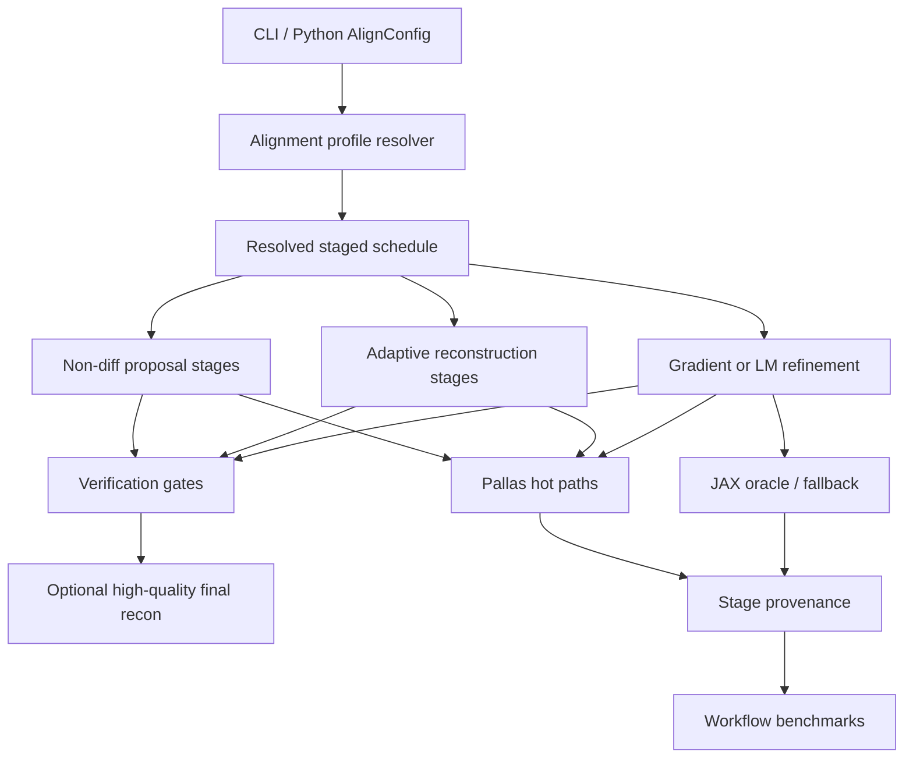
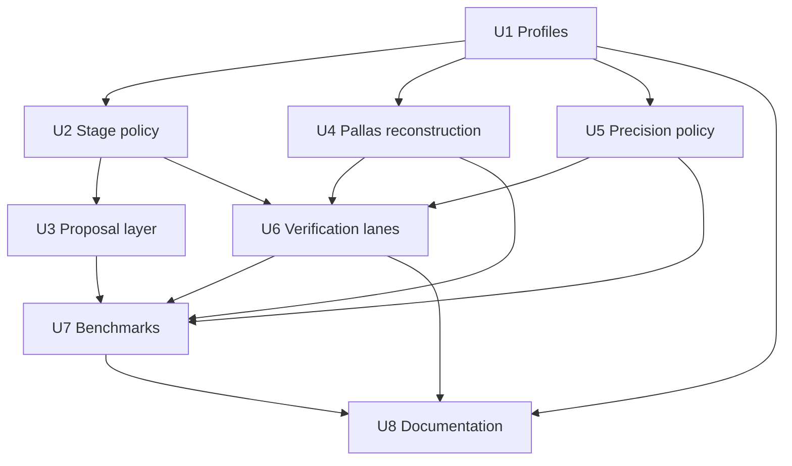

# feat: Build the lightning alignment engine

## Summary

Make the alignment stack default to a staged, Pallas-first, alignment-outcome-first engine while
retaining an explicit tortoise/reference lane and an optional high-quality final reconstruction lane.
The implementation should extend the existing alignment scheduler, backend provenance, motion-model,
FISTA-core, validation-LM, and benchmark surfaces rather than create a parallel private pipeline.

---

## Problem Frame

Recent Pallas work produced real operator and FISTA-core speedups, but the end-to-end laminography
run showed that cautious integration and unchanged stage behavior can leave the real workflow just as
slow. The requirements document changes the product center of gravity: TomoJAX should be an
experimental, aggressive geometry solver first, with reconstruction quality spent where it helps
alignment and reference behavior retained as an escape lane (see origin:
`docs/brainstorms/2026-05-05-lightning-alignment-engine-requirements.md`).

The plan therefore treats isolated kernel speedups as useful ingredients, not the product. The
implementation target is time-to-good-geometry with honest provenance, verification gates, and a
final reconstruction option that can still run slowly when the user wants quality after geometry is
solved.

---

## Requirements

- R1. Default alignment behavior must be `lightning`: aggressive, staged, and centered on fast
  geometry recovery.
- R2. Provide an explicit `tortoise` or reference-style path for slow, debuggable behavior.
- R3. Retain a high-quality final reconstruction lane after geometry is solved.
- R4. Allow the alignment engine to change algorithms by stage.
- R5. Permit non-differentiable proposal methods in stages where they recover geometry faster.
- R6. Treat differentiability as a tactic used where needed, not a universal lightning promise.
- R7. Prefer low-dimensional physical motion models before expanding to per-view five-DOF freedom.
- R8. Spend inner reconstruction quality adaptively by stage.
- R9. Use Pallas as the engine room for supported lightning hot paths.
- R10. Keep JAX as oracle, fallback, and tortoise/reference path rather than default center.
- R11. Make BF16 and mixed precision first-class lightning controls; leave INT8 exploratory and
  INT4 outside this milestone.
- R12. Record backend, precision, algorithm family, and verification provenance for every stage.
- R13. Accept fast paths because geometry and verification pass, not because intermediate images
  look reference-quality.
- R14. Guard against fast-but-wrong geometry with reprojection, geometry outcome, and final-quality
  checks where available.
- R15. Escalate suspicious or unsupported cases to tortoise/reference behavior, stricter refinement,
  or explicit unsupported status.
- R16. Center optimization benchmarks on time-to-good-geometry, wall time, residuals, final quality,
  and provenance.
- R17. Keep standalone kernel benchmarks only when tied to an alignment workflow hypothesis or
  regression guard.
- R18. Make benchmark outputs hard to game by labeling optimization guards, helper paths, and actual
  backends honestly.

**Origin actors:** A1 TomoJAX user, A2 Lightning solver, A3 Tortoise/reference solver, A4
Optimization agent, A5 Final reconstructor.

**Origin flows:** F1 Lightning geometry solve, F2 Tortoise/reference comparison, F3 Agent
optimization loop.

**Origin acceptance examples:** AE1 default lightning provenance, AE2 tortoise/reference behavior,
AE3 valid non-differentiable proposal stage, AE4 model escalation, AE5 final-quality guard, AE6
benchmark anti-gaming.

---

## Scope Boundaries

### Deferred for later

- Full autotuning that tries multiple strategies on every dataset before selecting a stage schedule.
- Publication-evidence packaging beyond the benchmark and provenance requirements needed to avoid
  misleading internal claims.
- INT8 as a broad reconstruction dtype, and INT4 as anything more than a research feature-volume
  experiment.
- Broad multi-user compatibility, stable backwards-compatible defaults, or enterprise-style API
  caution.
- Automatic handoff to external reconstructors as a polished user workflow.
- General-purpose reconstruction performance work that does not support faster or more trustworthy
  geometry solving.

### Outside this product's identity

- Treating TomoJAX primarily as a cautious general reconstructor with alignment as a secondary
  feature.
- Requiring every lightning stage to be differentiable.
- Requiring intermediate alignment reconstructions to match the visual or numerical quality of the
  final reconstruction lane.
- Making JAX/FP32/reference behavior the default center of gravity when a faster verified path works.
- Accepting specialized helper timings as product progress when they do not improve the alignment
  workflow.

### Deferred to Follow-Up Work

- Broad polished external-reconstructor handoff, beyond saving geometry/provenance in a form another
  tool can consume.
- INT8 feature-volume experiments after BF16/FP32 mixed precision has clear stage-level evidence.
- A full public article/evidence pack after the benchmark and verification contracts stabilize.
- General reconstruction acceleration that does not shorten alignment or verification workflows.

---

## Context & Research

### Relevant Code and Patterns

- `src/tomojax/align/_config.py` owns `AlignConfig`; it currently defaults
  `projector_backend` to `jax`, `gather_dtype` to `fp32`, `regulariser` to `tv`, and
  `pose_model` to `per_view`.
- `src/tomojax/cli/align.py` owns the user-facing alignment CLI and config-file bridge, including
  `--projector-backend`, `--gather-dtype`, `--regulariser`, `--schedule`, `--loss-schedule`, and
  `--pose-model`.
- `src/tomojax/core/backend_policy.py` already has `BackendProvenance`, requested/actual backend
  metadata, fallback reasons, differentiability class, and speed-claim eligibility.
- `src/tomojax/align/model/schedules.py` already models executable alignment stages with
  `objective_kind`, `optimizer`, active DOFs, max iteration budget, and gauge policy.
- `src/tomojax/align/_stage_loop.py` is the multires stage orchestrator and should remain the owner
  of stage sequencing; setup stages already route to validation-LM and pose stages route to
  fixed-volume alignment.
- `src/tomojax/align/_pose_stage.py` owns pose alignment, motion-model coefficient fitting,
  GN/L-BFGS/GD selection, and fixed-volume objective evaluation.
- `src/tomojax/align/model/motion_models.py` already supports `per_view`, `polynomial`, and `spline`
  pose models. Lightning should use this before inventing a second motion-model system.
- `src/tomojax/align/_setup_stage.py` and `src/tomojax/align/objectives/validation_residuals.py`
  implement the stopped train-fold reconstruction plus streamed validation-LM setup path.
- `src/tomojax/align/_reconstruction_stage.py` routes inner reconstruction and contains the current
  Huber-TV FISTA-core fast path. Its jitted helper passes detector-grid arrays dynamically, which is
  the key boundary that prevents the current Pallas core from being used cleanly in the real
  alignment pipeline.
- `src/tomojax/recon/fista_tv_core.py` already exposes an array-level FISTA core with selectable
  forward and backprojector backends, Pallas tile controls, and diagnostic toggles.
- `src/tomojax/align/objectives/fixed_volume.py` already has performance-only Pallas scoring for
  plain L2 when differentiability is not required, and gradient-safe JAX fallback when it is.
- `src/tomojax/core/pallas_projector.py` has support checks, cached traversal states, general-pose
  Pallas forward, residual SSE, backprojection, and fused loss/gradient helpers. It currently
  requires `det_grid` to be `None` or a canonical eager detector grid for Pallas paths.
- `src/tomojax/bench/sampled.py`, `src/tomojax/bench/alignment_smoke.py`,
  `src/tomojax/bench/fista_iteration.py`, and `src/tomojax/bench/benchmark_targets.py` already form
  the agent-facing benchmark surface that must be redirected toward workflow outcomes.
- `scripts/real_laminography/run_real_lamino_pallas_probe.py` is an untracked real-data probe that
  demonstrated Pallas wins for residual loss and FISTA core while also exposing the production
  alignment integration boundary.
- Relevant tests already exist under `tests/test_cli_config.py`, `tests/test_alignment_schedules.py`,
  `tests/test_align_motion_models.py`, `tests/test_alignment_objectives.py`,
  `tests/test_bench_alignment_smoke.py`, `tests/test_bench_sampled.py`,
  `tests/test_bench_fista_iteration.py`, and `tests/test_projector_pallas.py`.
- `docs/pallas_supported_api.md` and
  `docs/plans/2026-05-05-001-feat-supported-pallas-alignment-api-plan.md` document the previous
  caution-first stance. They are useful history, but the new plan intentionally supersedes their
  default-backend posture.

### Institutional Learnings

- `docs/solutions/architecture-patterns/reuse-align-multires-for-geometry-calibration-2026-04-25.md`
  says setup geometry belongs inside the unified alignment system, using stopped train-fold
  reconstruction plus streamed validation-LM rather than private solver paths or
  reconstruction-heavy scalar L-BFGS.
- The same solution doc stresses that setup and pose should share `AlignmentState`, active DOF
  views, bounds, whitening, gauge policy, loss adapters, diagnostics, manifests, and checkpoint
  provenance.
- Existing benchmark history shows isolated Pallas and FISTA wins can fail to translate into
  end-to-end alignment speedups. The benchmark plan must therefore distinguish helper speed from
  workflow speed.
- Seeded sampled benchmark cases should remain anti-overfitting guards. Fixed-case gains that fail
  sampled cases should not be framed as general improvement.
- Specialized helper timings must be labeled before results are interpreted, especially for
  parallel-z FBP and other narrow geometry paths.

### External References

- JAX Pallas is an experimental custom-kernel extension requiring lower-level memory and accelerator
  thinking, so TomoJAX should keep explicit support checks and fallback provenance for lightning
  paths: <https://docs.jax.dev/en/latest/pallas/quickstart.html>.
- `jax.experimental.pallas.pallas_call` documents `interpret=True` as CPU-compatible debug
  execution and GPU/TPU lowering as the real accelerator path, so tests need both CPU/interpreter
  coverage and GPU-marked lowered-mode coverage for performance claims:
  <https://docs.jax.dev/en/latest/_autosummary/jax.experimental.pallas.pallas_call.html>.
- JAX benchmarking guidance requires separating compile/first-call timing from warm timing and
  calling `.block_until_ready()` at measurement boundaries:
  <https://docs.jax.dev/en/latest/benchmarking.html>.
- JAX precision controls and GPU guidance support BF16 as a meaningful performance/precision tradeoff
  on recent accelerators, but the plan keeps solver state and acceptance math in FP32:
  <https://docs.jax.dev/en/latest/_autosummary/jax.default_matmul_precision.html> and
  <https://docs.jax.dev/en/latest/gpu_performance_tips.html>.

---

## Key Technical Decisions

- **Profile resolver over scattered flags:** introduce a single alignment profile layer that maps
  `lightning` and `tortoise` onto existing config fields, rather than making every caller manually
  coordinate backend, dtype, regulariser, levels, schedules, and diagnostics.
- **Lightning defaults are allowed to change behavior:** the default profile should prefer Pallas,
  Huber-TV/FISTA-core acceleration, BF16 gather where safe, low-dimensional motion models, and
  staged proposal/refinement behavior. This is a product decision from the origin, not an accident.
- **Tortoise is explicit and boring:** tortoise/reference mode should favor JAX, FP32, existing
  differentiable semantics, conservative schedule choices, and richer diagnostics, so it remains
  useful when lightning is suspicious.
- **Extend the existing scheduler:** proposal, reconstruction, refinement, and verification stages
  should be represented in `AlignmentSchedule`/resolved stage metadata instead of creating a new
  alignment pipeline.
- **Use existing motion models first:** low-dimensional `polynomial` and `spline` pose models are
  the first model-first mechanism; expansion to per-view five-DOF is a stage decision triggered by
  residual structure or verification failure.
- **Non-differentiable proposal stages are first-class:** proposal stages may use Pallas residual
  scoring, coordinate search, SPSA-like perturbations, or phase/projection cues without promising
  gradients, as long as their output is validated by downstream geometry checks.
- **Fix the Pallas detector-grid boundary before claiming pipeline speed:** canonical detector-grid
  decisions must happen outside hot jitted calls so the existing Pallas helper restrictions are
  respected or fallback provenance is honest.
- **BF16 is a stage policy, not a global dtype switch:** lightning may use BF16 for gather/storage
  heavy tensors, but optimizer state, accepted geometry parameters, reduction/acceptance metrics,
  and verification thresholds stay FP32 unless tests prove otherwise.
- **Verification gates decide acceptance:** speedups are not accepted unless reprojection,
  geometry-recovery, final-quality, and provenance gates pass for the relevant benchmark tier.
- **Benchmark outputs optimize the whole stack:** agent targets should include real alignment smoke,
  sampled cases, stage timings, provenance, and memory, while standalone kernels remain supporting
  regressions.

---

## Open Questions

### Resolved During Planning

- **What user-facing mode names should expose the behavior?** Use `lightning` as default and
  `tortoise` as reference. Treat final reconstruction quality and verification as profile/lane
  policy rather than separate product identities.
- **Which non-differentiable proposal stages come first?** Start with bounded low-dimensional
  candidate scoring over existing pose/setup DOFs and motion-model coefficients, because it reuses
  existing state, bounds, gauge policy, and Pallas residual scoring. Projection-shift and
  feature-volume methods are good second-stage additions after the candidate-scoring contract lands.
- **Which Pallas boundaries are hard unsupported versus fallback?** Lightning should fall back or
  escalate by default, while benchmark/profiling modes may request strict fast-path failure so
  optimization agents cannot miss an unsupported path.
- **Where should BF16 be mandatory versus optional?** BF16 should be a lightning default candidate
  for projector gather and long-lived image/projection intermediates; FP32 remains mandatory for
  geometry parameters, normal equations, acceptance checks, and final verification.
- **What defines good geometry?** The plan defines metric families now and defers exact numeric
  thresholds to benchmark calibration against current real/synthetic fixtures.
- **How should artifacts present provenance?** Every stage and benchmark row should report profile,
  requested/actual backend, support status, fallback reason, precision class, stage role, and
  eligibility for speed or workflow claims.

### Deferred to Implementation

- Exact threshold values for `good_geometry`, `suspicious`, and `fallback_required` should be derived
  from existing guard results, sampled cases, and the real laminography probe after implementation
  exposes the metrics consistently.
- Exact profile field and CLI flag names should follow the local CLI/config style while preserving
  the semantic names `lightning` and `tortoise`.
- Whether Pallas can support additional non-canonical detector-grid cases should be decided from
  implementation-time tests; this plan only requires honest support/fallback behavior.
- The first useful INT8 experiment should wait until BF16 profiling identifies the stage where
  memory traffic is the clear bottleneck.

---

## High-Level Technical Design

> *This illustrates the intended approach and is directional guidance for review, not implementation
> specification. The implementing agent should treat it as context, not code to reproduce.*



The important boundary is profile and stage policy before numerical work. A lightning run should
enter hot paths with resolved backend, precision, stage role, differentiability requirement, and
fallback policy already known. A tortoise run should enter the same orchestration with conservative
policy rather than a separate solver family.

---

## Implementation Units



- U1. **Add alignment profiles and policy resolution**

**Goal:** Make `lightning` the default alignment posture and add an explicit `tortoise` reference
posture without scattering behavior across unrelated flags.

**Requirements:** R1, R2, R3, R8, R10, R11, R12, R15; covers F1, F2, AE1, AE2.

**Dependencies:** None.

**Files:**
- Create: `src/tomojax/align/_profiles.py`
- Modify: `src/tomojax/align/_config.py`
- Modify: `src/tomojax/cli/align.py`
- Modify: `src/tomojax/core/backend_policy.py`
- Modify: `src/tomojax/align/_results.py`
- Test: `tests/test_align_profiles.py`
- Test: `tests/test_cli_config.py`
- Test: `tests/test_align_contracts.py`

**Approach:**
- Add a profile resolver that maps high-level posture to concrete defaults for backend, gather dtype,
  regulariser, reconstruction iteration policy, stage schedule preference, diagnostics level, and
  fallback strictness.
- Keep explicit user overrides stronger than profile defaults. A user who requests a specific
  backend, dtype, regulariser, schedule, or level should get that value, with provenance showing the
  profile and override.
- Default the public alignment path to lightning while making tortoise available through CLI,
  config files, and Python `AlignConfig`.
- Extend backend provenance with profile/stage context where needed, but keep numerical helpers free
  of Python metadata returns inside JAX transforms.
- Ensure checkpoint metadata, run manifests, and `AlignInfo` can explain the requested profile,
  effective profile, and any fallback/escalation.

**Execution note:** Start with config/CLI characterization tests so the default flip is deliberate
and not hidden in downstream alignment behavior.

**Patterns to follow:**
- Existing config normalization in `src/tomojax/align/_config.py`.
- Existing CLI/config override behavior in `src/tomojax/cli/align.py` and `tests/test_cli_config.py`.
- Existing requested/actual backend metadata in `src/tomojax/core/backend_policy.py`.

**Test scenarios:**
- Happy path: constructing default `AlignConfig` yields the lightning profile and effective defaults
  for aggressive alignment.
- Happy path: selecting tortoise yields JAX/FP32/reference-oriented effective policy while preserving
  existing schedule and loss semantics.
- Integration: CLI config values are merged so explicit `projector_backend`, `gather_dtype`,
  `regulariser`, `schedule`, and `levels` override profile defaults.
- Integration: checkpoint/run metadata records requested profile, effective profile, backend policy,
  precision policy, and fallback strictness.
- Edge case: invalid profile names fail during argument/config validation before data loading.
- Error path: a strict lightning-fast-path request on unsupported hardware reports unsupported
  status rather than silently presenting a speed-eligible run.
- Covers AE1. A normal alignment command records lightning profile and backend/precision/stage
  provenance.
- Covers AE2. A tortoise run records reference-oriented policy and comparable output metadata.

**Verification:**
- The default alignment policy is visibly lightning in config and metadata.
- Existing explicit JAX/tortoise-style runs remain selectable and distinguishable in outputs.

---

- U2. **Extend the stage scheduler for lightning roles**

**Goal:** Make proposal, adaptive reconstruction, refinement, escalation, and verification stages
first-class scheduler concepts while preserving the unified `align_multires` orchestration.

**Requirements:** R4, R5, R6, R7, R8, R12, R15; covers F1, F2, AE3, AE4.

**Dependencies:** U1.

**Files:**
- Modify: `src/tomojax/align/model/schedules.py`
- Modify: `src/tomojax/align/_stage_loop.py`
- Modify: `src/tomojax/align/_pose_stage.py`
- Modify: `src/tomojax/align/_setup_stage.py`
- Modify: `src/tomojax/align/model/motion_models.py`
- Test: `tests/test_alignment_schedules.py`
- Test: `tests/test_align_motion_models.py`
- Test: `tests/test_align_checkpoint.py`

**Approach:**
- Extend `AlignmentStage` and resolved-stage metadata with stage role, differentiability
  requirement, quality tier, profile intent, escalation policy, and whether a stage is speed-claim
  eligible.
- Add lightning presets that start with low-dimensional motion/setup stages, run cheap proposal or
  validation stages, refine locally, and escalate to per-view five-DOF only when verification or
  residual structure indicates the reduced model is insufficient.
- Keep existing setup validation-LM stages for setup discovery. Do not replace the successful
  stopped train-fold reconstruction architecture with scalar L-BFGS or fixed-volume same-data setup
  scoring.
- Let stage metadata determine whether `_stage_loop.py` routes to setup validation-LM, fixed-volume
  pose refinement, non-differentiable proposal scoring, or verification.
- Preserve resume/checkpoint semantics across stage roles by recording stage role and completion
  metadata in existing checkpoint structures.

**Technical design:** Directional stage lifecycle:

```text
profile -> schedule preset -> resolved stages
  -> proposal/model stage
  -> adaptive recon stage
  -> pose/setup refinement stage
  -> verification stage
  -> escalate, accept, or mark unsupported
```

**Patterns to follow:**
- `PUBLIC_SCHEDULE_PRESETS` and `ResolvedAlignmentStage` in
  `src/tomojax/align/model/schedules.py`.
- Current setup-safe sequence in `tests/test_alignment_schedules.py`.
- Resume/checkpoint enrichment in `src/tomojax/align/_stage_loop.py`.

**Test scenarios:**
- Happy path: resolving the default lightning schedule produces role-labeled stages with model-first
  and verification metadata.
- Happy path: resolving tortoise produces reference-oriented stages with no non-differentiable
  proposal requirement.
- Happy path: smooth pose models reduce variable count versus per-view models and can be expanded
  for later per-view polish.
- Integration: stage role/provenance survives multires checkpoint emission and resume.
- Edge case: an unsupported optimizer/stage-role combination fails with a schedule validation error.
- Edge case: gauge-coupled setup/pose DOFs remain rejected, anchored, or marked diagnose-only
  according to existing gauge policy.
- Covers AE4. A reduced model can mark escalation required when validation metadata says structured
  residuals remain.

**Verification:**
- `align_multires` remains the orchestrator for both lightning and tortoise.
- Stage metadata is rich enough for benchmarks and run artifacts to explain which tactic ran.

---

- U3. **Add non-differentiable proposal scoring for fast geometry entry**

**Goal:** Add a bounded proposal layer that can cheaply search setup or pose candidates without
requiring gradients, then hand accepted candidates back to the existing alignment state and scheduler.

**Requirements:** R5, R6, R7, R9, R12, R13, R15; covers F1, AE3, AE4.

**Dependencies:** U1, U2.

**Files:**
- Create: `src/tomojax/align/proposals.py`
- Modify: `src/tomojax/align/objectives/fixed_volume.py`
- Modify: `src/tomojax/align/_stage_loop.py`
- Modify: `src/tomojax/align/model/dofs.py`
- Modify: `src/tomojax/align/model/state.py`
- Test: `tests/test_align_proposals.py`
- Test: `tests/test_alignment_objectives.py`
- Test: `tests/test_bench_alignment_objective.py`

**Approach:**
- Implement proposal stages as state transformations over active DOFs, not as separate solver
  families. Candidate generation should consume the same active DOF views, bounds, whitening scales,
  motion-model coefficients, and gauge policy as gradient stages.
- Start with low-dimensional coordinate/candidate search over setup DOFs and smooth pose-model
  coefficients. Use Pallas performance-only residual scoring when supported and JAX fallback when
  not.
- Make the candidate scorer explicit about differentiability: proposal scoring is performance-only
  unless a stage declares otherwise.
- Provide acceptance metadata: candidate count, best candidate, loss before/after, backend
  provenance, precision, bounds/gauge handling, and whether downstream verification is required.
- Keep proposal output as an initialized state for refinement or verification, not as final
  geometry by itself.

**Patterns to follow:**
- Fixed-volume objective scoring in `src/tomojax/align/objectives/fixed_volume.py`.
- Active DOF and gauge conventions in `src/tomojax/align/model/dofs.py` and
  `src/tomojax/align/model/schedules.py`.
- Motion coefficient fitting/expansion in `src/tomojax/align/model/motion_models.py`.

**Test scenarios:**
- Happy path: a bounded proposal stage evaluates candidate geometry states and selects a lower-loss
  candidate.
- Happy path: proposal scoring uses Pallas residual scoring when plain L2/no-mask requirements are
  met and records performance-only provenance.
- Integration: accepted proposal state feeds into a later pose refinement stage with active DOFs,
  bounds, and gauge constraints preserved.
- Edge case: an empty candidate set or all-invalid candidates leaves state unchanged and records a
  clear no-improvement status.
- Error path: unsupported Pallas proposal scoring falls back or escalates according to profile
  strictness and is not eligible for a speed claim.
- Covers AE3. A non-differentiable proposal improvement followed by passing verification is treated
  as valid lightning behavior.

**Verification:**
- Proposal stages improve initialization on synthetic cases without needing gradients.
- Proposal metadata makes it clear that the stage is a geometry initializer/refiner, not a final
  proof of correctness.

---

- U4. **Wire Pallas-first reconstruction into the real alignment pipeline**

**Goal:** Make the FISTA-core Pallas wins reachable from actual alignment reconstruction stages, not
only standalone probes or benchmark helpers.

**Requirements:** R8, R9, R10, R12, R13, R15; covers F1, AE1, AE5.

**Dependencies:** U1.

**Files:**
- Modify: `src/tomojax/align/_reconstruction_stage.py`
- Modify: `src/tomojax/recon/fista_tv_core.py`
- Modify: `src/tomojax/core/pallas_projector.py`
- Modify: `src/tomojax/core/backend_policy.py`
- Test: `tests/test_bench_fista_iteration.py`
- Test: `tests/test_projector_pallas.py`
- Test: `tests/test_align_quick.py`
- Test: `tests/test_align_chunking.py`
- Test: `tests/test_alignment_objectives.py`

**Approach:**
- Resolve canonical detector-grid handling before entering jitted FISTA-core calls. The Pallas path
  should receive `None` or a canonical eager detector grid as required by `pallas_projector.py`; if
  calibrated/non-canonical detector grids are active, provenance should explain fallback or
  unsupported status.
- Keep the existing array-level `fista_tv_core_arrays` as the hot reconstruction core and add a
  production-facing wrapper that returns reconstruction provenance alongside the volume and timing
  stats at Python boundaries.
- Ensure Huber-TV lightning reconstruction uses Pallas forward and backprojection where support
  checks pass; tortoise/reference and unsupported cases use JAX.
- Preserve chunking/backoff semantics and avoid making `views_per_batch` a fake option. If a Pallas
  all-view path ignores chunking, record that fact or add chunked Pallas execution.
- Separate cold/first-call and warm execution timing in benchmark code; production alignment stats
  should still report meaningful per-stage wall time with device synchronization at boundaries.

**Patterns to follow:**
- `FistaCoreConfig` and `fista_tv_core_arrays` in `src/tomojax/recon/fista_tv_core.py`.
- Existing Pallas support checks and canonical detector-grid guard in
  `src/tomojax/core/pallas_projector.py`.
- Reconstruction stat recording in `src/tomojax/align/_reconstruction_stage.py`.

**Test scenarios:**
- Happy path: lightning Huber-TV reconstruction on canonical detector geometry uses Pallas core and
  records actual backend `pallas`.
- Happy path: tortoise reconstruction uses JAX and records actual backend `jax`.
- Integration: real alignment reconstruction stage receives Pallas backend through profile policy,
  not only through direct benchmark construction.
- Integration: Pallas FISTA-core output remains finite and close to JAX on small CPU/interpreter and
  GPU-lowered cases.
- Edge case: calibrated/non-canonical detector grid falls back or marks unsupported with the detector
  grid reason in provenance.
- Error path: simulated Pallas OOM or unsupported lowering falls back/escalates according to profile
  policy and does not report speed eligibility.
- Covers AE5. Fast reconstruction can be used inside alignment, but final-quality verification can
  reject the run if geometry or reconstruction quality degrades.

**Verification:**
- The real alignment path can exercise the Pallas FISTA core on supported geometry.
- Unsupported detector-grid cases are honest and visible rather than silently running the old path.

---

- U5. **Implement adaptive precision and reconstruction-quality policy**

**Goal:** Make precision, reconstruction quality, diagnostics, and final quality explicit per-stage
resources that lightning can spend aggressively.

**Requirements:** R3, R8, R11, R12, R13, R14; covers F1, F2, AE5.

**Dependencies:** U1, U2, U4.

**Files:**
- Create: `src/tomojax/align/_quality_policy.py`
- Modify: `src/tomojax/align/_config.py`
- Modify: `src/tomojax/align/_reconstruction_stage.py`
- Modify: `src/tomojax/recon/fista_tv_core.py`
- Modify: `src/tomojax/cli/align.py`
- Test: `tests/test_align_profiles.py`
- Test: `tests/test_align_quick.py`
- Test: `tests/test_bench_fista_iteration.py`
- Test: `tests/test_projector_pallas.py`

**Approach:**
- Add named quality tiers for alignment stages, such as cheap proposal volume, fast latent
  reconstruction, refinement reconstruction, verification reconstruction, and final reconstruction.
- Let profiles and stages map quality tiers to recon iterations, regulariser choice, gather dtype,
  diagnostic computation, support masks/crops, and whether final data loss/regulariser values are
  computed.
- Make BF16 the default lightning candidate for gather/storage-heavy projector work on GPU, with
  FP32 reductions and solver state retained for stability.
- Ensure tortoise/reference mode defaults to FP32 and richer diagnostics, even when it is slower.
- Keep final reconstruction policy optional but explicit. The final quality lane can use more
  iterations, stricter dtype, and more diagnostics than the alignment inner loop.

**Patterns to follow:**
- `default_gather_dtype` usage in `src/tomojax/cli/align.py`.
- FISTA-core diagnostic toggles in `src/tomojax/recon/fista_tv_core.py`.
- Existing `regulariser`, `huber_delta`, `recon_iters`, and `loss_schedule` config handling.

**Test scenarios:**
- Happy path: lightning profile resolves to fast-stage quality tiers with BF16 gather on supported
  accelerator environments.
- Happy path: tortoise profile resolves to FP32 and reference-oriented diagnostics.
- Integration: quality tier metadata appears in stage stats and run manifests.
- Edge case: explicit `gather_dtype=fp32` overrides lightning BF16 defaults.
- Edge case: CPU execution resolves to FP32 or documented fallback where BF16 is not useful.
- Error path: unsupported precision values fail before numerical work begins.
- Covers AE5. A fast inner reconstruction can pass alignment but still be rejected by final-quality
  verification if the high-quality lane degrades.

**Verification:**
- Precision and quality choices are auditable per stage.
- BF16 use is intentional and bounded, not a hidden global dtype drift.

---

- U6. **Add verification, escalation, and final reconstruction lanes**

**Goal:** Decide whether a lightning result is accepted, escalated, or marked suspicious using
geometry- and workflow-centered checks rather than intermediate visual quality alone.

**Requirements:** R3, R12, R13, R14, R15, R16; covers F1, F2, AE4, AE5.

**Dependencies:** U1, U2, U4, U5.

**Files:**
- Create: `src/tomojax/align/verification.py`
- Modify: `src/tomojax/align/_stage_loop.py`
- Modify: `src/tomojax/align/_results.py`
- Modify: `src/tomojax/cli/align.py`
- Modify: `src/tomojax/align/objectives/validation_residuals.py`
- Test: `tests/test_align_verification.py`
- Test: `tests/test_bilevel_setup_alignment.py`
- Test: `tests/test_align_params_export.py`
- Test: `tests/test_bench_alignment_smoke.py`

**Approach:**
- Add a verification result model that records reprojection loss, loss drop, residual structure,
  setup/pose estimates, model sufficiency, final-quality status when available, and acceptance
  status.
- Let verification produce one of a small set of outcomes: accepted, accepted-with-warning,
  escalate-to-refine, fallback-to-tortoise, unsupported, or failed.
- For model-first stages, check whether residuals or held-out validation indicate the model should
  expand from low-dimensional coefficients toward per-view five-DOF.
- Preserve stopped validation-LM as the setup geometry evidence path. Use final reconstruction
  quality only as an acceptance guard, not as the setup optimizer itself.
- Write verification metadata into normal CLI outputs, checkpoints, summaries, and benchmark
  artifacts.

**Patterns to follow:**
- Geometry calibration payloads and diagnostics in `src/tomojax/align/_setup_stage.py` and
  `src/tomojax/align/geometry/geometry_blocks.py`.
- Existing pose recovery metrics and success flags in `src/tomojax/bench/alignment_smoke.py`.
- Alignment result recording in `src/tomojax/align/_results.py`.

**Test scenarios:**
- Happy path: a synthetic alignment that improves loss and geometry metrics is accepted with
  verification metadata.
- Happy path: a final high-quality reconstruction lane can run after solved geometry and record
  quality metrics separately from inner alignment reconstruction.
- Integration: verification state is saved in CLI output metadata and benchmark JSON.
- Edge case: low-dimensional model residuals can trigger per-view escalation metadata.
- Edge case: missing ground truth still produces self-consistency/reprojection verification rather
  than requiring phantom quality metrics.
- Error path: non-finite residuals, failed final reconstruction, or unsupported fast paths mark the
  run suspicious/failed instead of accepted.
- Covers AE4. Reduced-model failure triggers expansion or escalation.
- Covers AE5. Final-quality degradation prevents a clean success label.

**Verification:**
- A lightning result cannot be called cleanly successful without passing the relevant verification
  gates.
- Tortoise/reference and final-quality lanes produce comparable artifacts for debugging.

---

- U7. **Recenter benchmark and agent targets on workflow speed**

**Goal:** Update the benchmark suite so optimization agents improve the full alignment stack and
cannot claim progress from isolated helper paths that do not affect time-to-good-geometry.

**Requirements:** R16, R17, R18; covers F3, AE6.

**Dependencies:** U1, U3, U4, U5, U6.

**Files:**
- Modify: `src/tomojax/bench/sampled.py`
- Modify: `src/tomojax/bench/alignment_smoke.py`
- Modify: `src/tomojax/bench/alignment_objective.py`
- Modify: `src/tomojax/bench/fista_iteration.py`
- Modify: `src/tomojax/bench/benchmark_targets.py`
- Modify: `src/tomojax/bench/benchmark_suite.py`
- Modify: `src/tomojax/bench/astra_parallel.py`
- Modify: `scripts/real_laminography/run_real_lamino_pallas_probe.py`
- Test: `tests/test_bench_sampled.py`
- Test: `tests/test_bench_alignment_smoke.py`
- Test: `tests/test_bench_alignment_objective.py`
- Test: `tests/test_bench_fista_iteration.py`
- Test: `tests/test_bench_benchmark_suite.py`
- Test: `tests/test_bench_astra_parallel.py`

**Approach:**
- Add benchmark rows for profile, stage role, actual backend, precision policy, verification status,
  model sufficiency, final-quality status, memory, and strict fast-path support.
- Promote `scripts/real_laminography/run_real_lamino_pallas_probe.py` from an untracked probe into a
  maintained real-data diagnostic script or fold it into the benchmark package with clear input/data
  assumptions.
- Add workflow targets around alignment wall time, time-to-good-geometry, successful verification,
  reprojection metrics, final-quality deltas, and memory. Keep FISTA, forward, residual, and FBP
  kernels as supporting metrics.
- Split timing fields into cold/first-call and warm steady-state where JAX/Pallas compilation or
  cached setup matters.
- Use strict labels for helper paths: public API, internal core, specialized helper,
  performance-only, gradient-safe, workflow-impacting, and speed-claim eligible.
- Preserve seeded sampled cases as anti-overfitting guards and record every sampled config for exact
  reproduction.
- Keep ASTRA comparisons geometry-correct and parallel-beam only; do not reintroduce cone-beam FDK
  references.

**Patterns to follow:**
- Existing sampled suite aggregation in `src/tomojax/bench/sampled.py`.
- Timing and quality metadata in `src/tomojax/bench/fista_iteration.py`.
- Pose recovery and success flags in `src/tomojax/bench/alignment_smoke.py`.
- Backend provenance conventions in `src/tomojax/bench/forward_projector.py`.

**Test scenarios:**
- Happy path: sampled representative output includes profile, stage provenance, verification status,
  memory fields, and reproducible sampled configs.
- Happy path: alignment smoke reports time-to-good-geometry and verification success in addition to
  wall time.
- Integration: benchmark target report distinguishes workflow targets from kernel regression guards.
- Integration: real-data probe output can be summarized without requiring ground truth geometry.
- Edge case: unsupported Pallas fast path makes the row ineligible for speed claims while preserving
  the fallback result.
- Edge case: sampled cases with awkward shapes still run and record actual backend/fallback status.
- Error path: benchmark summary refuses or clearly labels helper-only speedups as non-workflow
  claims.
- Covers AE6. An isolated Pallas speedup is accepted as supporting evidence only when benchmark
  artifacts show its workflow impact or explicitly mark it as helper-only.

**Verification:**
- The default benchmark surface rewards end-to-end alignment improvements.
- Kernel microbenchmarks remain useful without becoming misleading headline metrics.

---

- U8. **Update documentation and migration notes for the new product posture**

**Goal:** Make the bold default, fallback behavior, profile contract, benchmark interpretation, and
remaining limitations understandable from the docs.

**Requirements:** R1, R2, R3, R6, R10, R11, R12, R15, R18; covers F1, F2, F3.

**Dependencies:** U1, U6, U7.

**Files:**
- Modify: `docs/pallas_supported_api.md`
- Modify: `docs/cli/align.md`
- Modify: `docs/reference/config-files.md`
- Modify: `docs/reference/api.md`
- Modify: `docs/benchmarks/astra-comparison.md`
- Create: `docs/alignment_lightning_engine.md`
- Test: `tests/test_docs_inventory.py`

**Approach:**
- Reframe `docs/pallas_supported_api.md` from caution-first default to lightning-default with
  explicit tortoise/reference fallback. Preserve the old support-matrix clarity, but update the
  product stance.
- Add a dedicated lightning alignment engine document explaining profiles, stage roles,
  differentiability policy, proposal stages, precision, verification, and final reconstruction lane.
- Update CLI docs so default alignment behavior, tortoise/reference mode, quality policy, and
  benchmark interpretation are clear.
- Document that differentiability is guaranteed only where the stage declares it, not across every
  lightning tactic.
- Document benchmark tiers and language: optimization guard, sampled anti-overfitting guard,
  real-data diagnostic, and publication evidence.
- Keep limitations prominent: Pallas is experimental upstream, support checks matter, unsupported
  geometry may fallback, and final reconstruction quality is a separate lane.

**Patterns to follow:**
- Existing CLI doc structure in `docs/cli/align.md`.
- Existing config-file reference style in `docs/reference/config-files.md`.
- Benchmark caveats in `docs/benchmarks/astra-comparison.md`.

**Test scenarios:**
- Documentation inventory includes the new lightning engine doc.
- Documentation references use existing tracked files and do not point to generated run directories
  as required static docs.
- Config docs mention the same profile names accepted by the CLI/config parser.
- Benchmark docs distinguish helper-only and workflow-impacting metrics.

**Verification:**
- A future agent can read docs and know the new goal: optimize alignment outcome, not just helper
  throughput.
- A user can explicitly choose lightning, tortoise/reference, and final-quality behavior.

---

## System-Wide Impact

- **CLI/API defaults:** Default alignment behavior changes materially. The change is intentional and
  must be reflected in tests, docs, and metadata.
- **Alignment orchestration:** `align_multires` remains the execution spine, but stage roles become
  richer and more outcome-oriented.
- **Backend policy:** Pallas becomes central to lightning mode, while JAX remains oracle/fallback.
  Provenance must make this clear per stage.
- **Precision lifecycle:** BF16 can enter long-lived alignment tensors in lightning. FP32 remains
  the invariant for geometry parameters, acceptance math, and reference verification.
- **Checkpoint/resume:** Checkpoints need to preserve profile, stage role, stage policy, and
  verification/escalation state.
- **Benchmark interpretation:** Existing benchmark targets need migration from "2x every current
  best value" toward workflow-outcome gates and helper regression guards.
- **Error propagation:** Unsupported Pallas, suspicious geometry, non-finite metrics, and final
  quality failures should surface as structured status rather than ordinary success.
- **Unchanged invariants:** NXtomo data format, existing alignment state ownership, existing active
  DOF/gauge abstractions, and JAX reference paths remain in place.

---

## Success Metrics

- Default lightning alignment is faster than the current conservative pipeline on representative
  synthetic alignment smoke cases while passing verification gates.
- The real laminography diagnostic can exercise Pallas residual/FISTA infrastructure through the
  production alignment path where supported.
- Benchmark artifacts report time-to-good-geometry, alignment wall time, stage timings, memory,
  verification state, final-quality state, and backend/precision provenance.
- Tortoise/reference runs remain available and produce comparable metadata for the same datasets.
- Seeded sampled cases make benchmark overfitting visible.
- Helper-only speedups cannot be reported as public workflow improvements without explicit labels.

---

## Alternative Approaches Considered

- **Keep the previous caution-first Pallas API plan:** rejected because it makes Pallas opt-in and
  JAX-default by posture, which conflicts with the new alignment-first requirements.
- **Create a new lightning pipeline beside `align_multires`:** rejected because prior setup-geometry
  work showed private solver families cause provenance drift and duplicate state semantics.
- **Optimize only Pallas kernels and leave stage behavior unchanged:** rejected because recent
  end-to-end real-data runs showed isolated hot-path speedups do not guarantee workflow speed.
- **Make every lightning stage differentiable:** rejected because the requirements explicitly allow
  non-differentiable proposal stages when they solve geometry faster.
- **Drop final reconstruction quality from alignment acceptance:** rejected because high-quality
  reconstruction may still be needed to validate or use a high-quality alignment.

---

## Risk Analysis & Mitigation

| Risk | Likelihood | Impact | Mitigation |
|------|------------|--------|------------|
| Default behavior changes surprise future users | Medium | Medium | Make `lightning` explicit in docs, metadata, and CLI help; provide `tortoise`. |
| Pallas upstream/API churn breaks lightning | Medium | High | Keep support checks, JAX fallback, GPU-lowered tests, and clear unsupported statuses. |
| Fast proposals find a wrong basin | Medium | High | Require verification gates and escalation before clean success. |
| BF16 destabilizes geometry | Medium | High | Keep geometry/normal equations/acceptance in FP32 and gate BF16 by stage tests. |
| Pallas detector-grid restrictions make real scans fallback | High | Medium | Fix canonical handling before JIT and report unsupported detector grids honestly. |
| Benchmarks reward helper speed again | Medium | High | Separate workflow targets from kernel guards and require stage provenance. |
| Checkpoint compatibility becomes fragile | Medium | Medium | Add profile/stage metadata with compatibility defaults and targeted resume tests. |
| Scope expands into a general reconstructor rewrite | Medium | Medium | Keep active units tied to alignment speed, verification, and final recon handoff only. |

---

## Phased Delivery

### Phase 1. Profiles, provenance, and scheduler metadata

- Land U1 and the metadata portion of U2 first. This makes the default posture, tortoise path,
  stage policy, and artifact vocabulary explicit before hot paths change behavior.

### Phase 2. Production Pallas reconstruction and precision policy

- Land U4 and U5 next. This targets the known real integration blocker: the Pallas FISTA core must
  be reachable from actual alignment, and BF16/quality policy must be stage-aware.

### Phase 3. Proposal stages and verification gates

- Land U3 and U6 after stage policy and reconstruction plumbing are stable. Proposal stages become
  acceptable only with verification/escalation behavior present.

### Phase 4. Benchmarks and agent targets

- Land U7 once the workflow can report real profile/stage/verification provenance. This avoids
  creating benchmark fields that the production pipeline cannot honestly populate.

### Phase 5. Documentation and cleanup

- Land U8 with updated docs, benchmark interpretation, and migration notes. The old caution-first
  docs should be reframed rather than left to contradict the new default posture.

---

## Documentation Plan

- `docs/alignment_lightning_engine.md` should become the central conceptual doc for the new product
  posture.
- `docs/cli/align.md` should show lightning default, tortoise/reference mode, profile overrides,
  verification, and final reconstruction lane.
- `docs/reference/config-files.md` should document profile/config merge behavior.
- `docs/pallas_supported_api.md` should become the supported accelerator contract under the new
  lightning-default posture.
- `docs/benchmarks/astra-comparison.md` should document which metrics support workflow claims and
  which are helper-only guards.

---

## Operational / Rollout Notes

- GPU-lowered Pallas tests and heavy benchmarks should run on `vivobook-ts`, not the Mac CPU-only
  environment.
- CPU/interpreter tests should still cover import safety, config behavior, scheduler resolution,
  fallback provenance, and small numerical parity.
- Benchmark timings should record cold/first-call and warm steady-state separately and synchronize
  device work at timing boundaries.
- Results should be interpreted per machine and commit; artifact metadata must include commit,
  dirty status, device, JAX/JAXLIB versions where available, profile, and stage policy.
- Existing dirty or untracked benchmark artifacts should not be treated as evidence unless the
  benchmark runner records their provenance and eligibility explicitly.

---

## Sources & References

- **Origin document:** `docs/brainstorms/2026-05-05-lightning-alignment-engine-requirements.md`
- Related plan superseded in posture: `docs/plans/2026-05-05-001-feat-supported-pallas-alignment-api-plan.md`
- Setup-geometry architecture learning:
  `docs/solutions/architecture-patterns/reuse-align-multires-for-geometry-calibration-2026-04-25.md`
- Current supported Pallas contract doc: `docs/pallas_supported_api.md`
- Alignment config: `src/tomojax/align/_config.py`
- Alignment CLI: `src/tomojax/cli/align.py`
- Stage scheduler: `src/tomojax/align/model/schedules.py`
- Multires orchestration: `src/tomojax/align/_stage_loop.py`
- Pose alignment: `src/tomojax/align/_pose_stage.py`
- Reconstruction stage: `src/tomojax/align/_reconstruction_stage.py`
- FISTA core: `src/tomojax/recon/fista_tv_core.py`
- Fixed-volume objective: `src/tomojax/align/objectives/fixed_volume.py`
- Pallas projector: `src/tomojax/core/pallas_projector.py`
- Benchmarks: `src/tomojax/bench/sampled.py`, `src/tomojax/bench/alignment_smoke.py`,
  `src/tomojax/bench/fista_iteration.py`, `src/tomojax/bench/benchmark_targets.py`
- Real-data probe: `scripts/real_laminography/run_real_lamino_pallas_probe.py`
- JAX Pallas quickstart: <https://docs.jax.dev/en/latest/pallas/quickstart.html>
- JAX `pallas_call`: <https://docs.jax.dev/en/latest/_autosummary/jax.experimental.pallas.pallas_call.html>
- JAX benchmarking guide: <https://docs.jax.dev/en/latest/benchmarking.html>
- JAX precision controls: <https://docs.jax.dev/en/latest/_autosummary/jax.default_matmul_precision.html>
- JAX GPU performance tips: <https://docs.jax.dev/en/latest/gpu_performance_tips.html>
