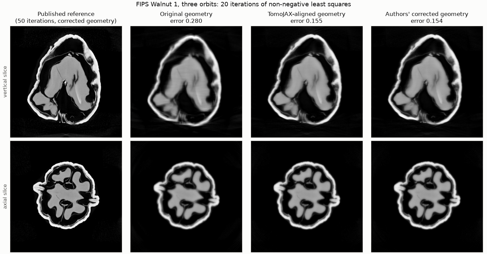
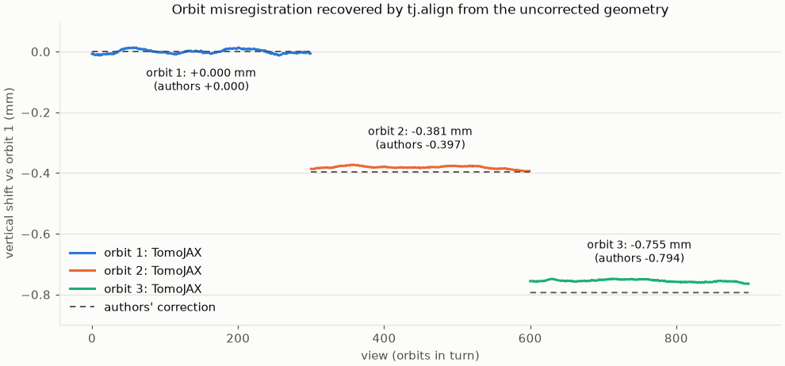

# Lab cone-beam CT

This guide takes a lab CT scan (a point source, a flat detector and a sample on
a turntable) from the scanner's files to a reconstruction: import, calibrate
the rotation axis, reconstruct with FDK or an iterative solver, and correct
per-view motion. Every step is one `tomojax` command; the Python calls are at
the end.

## Import

A Nikon (X-Tek) scan is an `.xtekct` parameter file beside its projection
TIFFs. `tomojax import` reads the source and detector distances, the detector
pixels and offsets, the reconstruction volume, the white level and the angles
(from `_ctdata.txt` when present), and `tomojax inspect` describes and checks
the result:

```bash
tomojax import scan/part.xtekct -o scan.nxs
tomojax inspect scan.nxs
```

Projections become absorption, `-log(I / WhiteLevel)` (`--transmission` keeps
intensities), with image rows flipped so that the detector's v axis points up.
Lengths stay in the scanner's units, millimetres for Nikon. The axis offset and
detector roll are left at zero for the next step. TomoJAX has not yet been
checked against a real Nikon scan: confirm the handedness of the first
reconstruction on a known sample, and use `--reverse-angles` if the stage
turns the other way.

For other scanners, import the TIFF stack with the angles and the geometry,
then flat- and dark-correct it:

```bash
tomojax import projections/ --angles angles.csv --geometry cone \
  --source-to-axis 120.5 --source-to-detector 980.0 --pixel-size 0.2 \
  -o raw.nxs
tomojax preprocess raw.nxs -o scan.nxs --config flat.toml
```

where `flat.toml` gives the constant flat and dark levels (expert settings
such as these are keys of a TOML file passed with `--config`;
`tomojax preprocess --config-keys` lists them):

```toml
assume_flat_field = 60000
assume_dark_field = 0
```

Use one length unit throughout (the pixel size and both distances).
`--pixel-size` takes one value for square pixels, or the u then v sizes.

`tomojax preprocess` also corrects two lab-CT artefacts in absorption data.
`--beam-hardening 1,0.05` linearises beam hardening, mapping each value p to
`p + 0.05 p²` (calibrate the coefficients on a single-material sample).
`--remove-stripes 9` removes rings: it subtracts each detector pixel's
constant offset, comparing its values sorted over views with those of its 9
neighbouring columns, so data without defects pass unchanged (a faint offset
on a steep gradient can remain).
`tomojax import --detector-roll`, `--detector-pitch`, `--detector-yaw` and
`--axis-offset` take values the scanner reports. `tomojax preprocess` also
takes measured flat and dark fields (`--flats`, `--darks`), but only for TIFF
input, and that path records parallel geometry with unit pixels. A TIFF import
records no grid: cone datasets without one reconstruct one voxel per detector
pixel at the axis, the pixel size divided by the magnification
`source_to_detector / source_to_axis`, and `tomojax recon --grid NX NY NZ`
sets the number of voxels.

## Calibrate the rotation axis

Scanners record the source and detector distances well but rarely the exact
position of the rotation axis. An axis offset from the central ray doubles
and blurs every slice; a rolled detector makes that offset change with height.

```bash
tomojax align scan.nxs -o calibrated.nxs --mode cor
```

On cone data `--mode cor` estimates the axis offset (`ConeBeam.axis_offset`,
the lab-CT centre of rotation) and the detector roll. It reconstructs thin
FDK slabs near the centre, top and bottom of the volume for trial offsets,
coarse to fine on binned data, and keeps the sharpest; the slabs' offsets
change linearly with height in proportion to the roll. The output records the
calibrated beam, so later commands on `calibrated.nxs` use it. On simulated
128³ and 256³ scans it recovers offsets to 0.08 voxels and rolls to 0.04°, in
about 4 s at 256³. It needs some in-plane structure at the slab heights and a
scan of at least 180° plus the fan angle. Detector pitch and yaw, the axis
direction and the source distances are not estimated.

## Reconstruct

FDK (the default `--method fbp` runs FDK on cone data) is the fast first
reconstruction:

```bash
tomojax recon calibrated.nxs -o fdk.nxs
```

It weights full turns, offset-detector full turns (the axis projecting near
one edge of the detector, which widens the field of view) and short scans of
at least 180° plus the fan angle (Parker weights). Like every FDK, it is exact
only in the orbit plane, with cone artefacts growing away from it.

The iterative solvers model the cone beam exactly, with any per-view poses.
CGLS suits low-noise data, and FISTA with total variation suits noisy or
sparse scans:

```bash
tomojax recon calibrated.nxs -o cgls.nxs --method cgls --iterations 20
tomojax recon calibrated.nxs -o tv.nxs --method fista --iterations 50 --tv-weight 0.002
```

Expert settings are fields of the method's configuration class in a
`--config` TOML file: `views_per_batch = 16`, say, or FISTA's
`regulariser = "huber_tv"` (see the
[quickstart](quickstart.md#reconstruct-and-inspect-slices)); in Python, pass
the class, `tj.reconstruct(scan, "fista", config=FistaConfig(...))`.

Their backprojection is the exact transpose of the projector, so CGLS stays
stable as it iterates; ASTRA's CGLS, whose backprojector is approximate,
diverges after about 20 iterations on the same scan (see
[measurements](measurements.md#cone-beam-projection-and-fdk)).

When the volume would not fit in device memory, `--method fbp` reconstructs it
in z-slabs on the host (`fdk_host`), so a 2000³ volume needs host RAM for the
projections and the volume but only a few slabs on the GPU.

## Export

Volume viewers and analysis packages read slice stacks or raw volumes:

```bash
tomojax export fdk.nxs -o fdk_slices/                 # 32-bit TIFF per z slice
tomojax export fdk.nxs -o fdk.raw --dtype uint16      # one raw file
```

An output ending in `.raw` is written as one raw file; any other output is a
directory of TIFF slices. TIFF slices have y rows and x columns, numbered from
the bottom of the volume; raw files are little-endian and z-major. A JSON
sidecar records the shape, the voxel size and, for `uint16`, the value range
mapped to 0–65535 (`--range`, by default the 0.1 and 99.9 percentiles). The
export reads one slice at a time.

## Correct per-view motion

Sample drift, stage wobble and thermal motion move the sample a little in
every view. Cone-beam alignment estimates all six pose parameters per view,
including `dy` along the beam, which changes the magnification:

```bash
tomojax align scan.nxs -o aligned.nxs --mode cor-then-pose
tomojax recon aligned.nxs -o recon.nxs --method cgls
```

`cor-then-pose` calibrates the axis as `--mode cor` does, then aligns the
poses; `--mode pose` aligns the poses alone, and also takes scans that already
carry poses (an ASTRA import, say, or an earlier alignment), which it corrects
on top of, and multi-orbit scans, whose orbits it brings into register (see
[the walnut](#bringing-the-orbits-into-register)). `tomojax recon` applies the
poses saved in `aligned.nxs`; with either command, `--no-poses` starts from the
nominal geometry instead. See
[cone-beam alignment](alignment-guide.md#align-cone-beam-scans-in-six-degrees-of-freedom)
for its accuracy and gauges.

## Speed

On a 256³, 360-view scan with a 384² detector on a laptop RTX 4070, forward
projection takes 0.093 s (ASTRA 0.17 s, TIGRE 0.48 s), the exact transpose
0.18 s (ASTRA's approximate backprojector 0.075 s) and FDK 0.048 s (ASTRA
0.29 s, TIGRE 0.51 s). A tilted axis or per-view poses take the transpose's
general kernel: 0.092 s forward and 0.23 s transpose. A 1024³ FDK of 1024 views takes
8.0 s in RAM, 11.1 s on the first call (ASTRA 20.3 s, TIGRE 30.7 s). Details are in the
[measurements](measurements.md#cone-beam-projection-and-fdk).

## Python

```python
import tomojax as tj

scan = tj.load("scan/part.xtekct")
calibrated = tj.align(scan, mode="cor").scan      # axis offset and detector roll
recon = tj.reconstruct(calibrated)                # FDK
tj.save("part-recon.nxs", recon)
```

The `tomojax` commands hold the projections and the volume in host memory.
For scans larger than that, `fdk_host` reconstructs in z-slabs from a
projection memmap into a volume memmap, reading only the detector rows each
slab needs.

## Coming from ASTRA

`tj.Scan.from_astra` takes projections and geometries exactly as an ASTRA
Toolbox script holds them: data in ASTRA's `(rows, views, columns)` layout, a
`cone` or `cone_vec` projection geometry and a 3-D volume geometry, as
`astra.create_proj_geom` and `astra.create_vol_geom` make them.

```python
import astra
import tomojax as tj

proj_geom = astra.create_proj_geom("cone_vec", rows, cols, vectors)
vol_geom = astra.create_vol_geom(501, 501, 501)  # with its window set as usual
scan = tj.Scan.from_astra(data, proj_geom, vol_geom)
volume = tj.reconstruct(scan).volume              # (x, y, z): ASTRA's (z, y, x) transposed
data, proj_geom, vol_geom = scan.to_astra()      # and back
```

ASTRA moves the source and detector around a fixed object; TomoJAX fixes them
and moves the object, so each ASTRA view becomes a rigid object pose. The
conversion fits a circular orbit (`scan.geometry`, with `scan.angles` running
the opposite way to ASTRA's) and keeps the scan's departure from it, such as a
tilted axis or per-view corrections, in `scan.poses`; a source raised above the
volume moves the grid instead. It requires the source and detector to keep
their arrangement over the scan and refuses vectors where they do not.
Projections of the converted scan agree with ASTRA's to 0.03% on tilted,
offset and jittered geometries.

Where the arrangement changes partway through, as in a multi-orbit scan with
the source at several heights or a tall sample scanned in stacked sections,
each run of views becomes a segment of a `ConeSegments` geometry, which the
iterative methods reconstruct together (`tj.Scan.combine([a, b, c])` builds one
from separate scans). FDK reconstructs one source-detector arrangement and refuses
them; views repeating an angle (several turns of one arrangement) share it.

### A real lab scan: the FIPS walnuts

`bench/walnut.py` reconstructs the walnut collection of Der Sarkissian et al.
(Scientific Data 6, 215, 2019; CC BY 4.0): three source orbits of 1200
projections each on a FleX-ray scanner, with per-view geometry vectors and a
reference reconstruction (50 iterations of non-negative least squares on all
three orbits, 501³ voxels of 0.1 mm). On Walnut 1, on a laptop RTX 4070:

| | TomoJAX | ASTRA |
| --- | --- | --- |
| Geometry from the vectors | source 66.0014 mm, detector 199.0062 mm (the scanner's log: 66.0014, 199.0062) | |
| FDK, one orbit (1200 views) | 1.7–1.9 s on the first call, compilation included; 1.55 s after; within 0.05% of ASTRA's volume and 0.6% of the authors' published FDK | 2.13 s |
| FDK error against the reference, in the walnut | 0.099 | 0.099 |
| FDK, detector binned 2 x 2 | 1.23 s on the first call, 1.05 s after; error 0.091 | 1.43 s; 0.091 |
| Non-negative least squares, three orbits, every 4th view, 20 iterations | 304 s; error 0.152 | 217 s (the reference's own solver); 0.147 |
| The same, detector binned 2 x 2 | 86 s; error 0.154 | 91 s; 0.152 |

Times start with the projections in host memory and end with the volume
there; JAX's GPU start-up (about 2 s, once per process) is not included. FDK
filters each row by a matrix product on the GPU and backprojects through the
texture unit from half floats, scaled per batch to their peak; like ASTRA's,
its interpolation weights are rounded to 1/256.

The volumes agree with ASTRA's to 0.05% (FDK) and 1.3% (least squares).
Unbinned, TomoJAX's least squares is still slower: this detector samples twice
as finely as the 0.1 mm voxels (a pixel spans 0.05 mm at the axis), so its
matched transpose, which follows every ray through every plane, does four
times the work the volume needs, while ASTRA's backprojector samples the
detector once per voxel. `scan.binned(2)` averages 2 x 2 pixels, matching the
detector to the grid: it costs nothing in accuracy here (the error even falls,
with the noise) and makes TomoJAX's reconstruction 3.5 times faster, ASTRA's
2.4 times, so binned TomoJAX is the faster. Bin a scan whenever its pixels,
divided by the magnification, are smaller than the voxels: `tj.reconstruct`
(iterative methods) and `tj.align` warn, with the factor to use, when they
are at least twice as fine.

The FleX-ray's rotation axis also leans 0.5° across the detector, so every
view takes the transpose's general kernel, about 1.3 times slower than its
path for an upright axis; kernels specialised to small leans were tried and
were slower still.

#### Bringing the orbits into register

Each walnut comes with two geometries: `scan_geom_original.geom`, as the
scanner recorded it, and `scan_geom_corrected.geom`, where the authors moved
orbits 2 and 3 up by 0.397 and 0.794 mm to bring them into register with
orbit 1. `bench/walnut_alignment.py` gives `tj.align` the original record
(three orbits, every 4th view, binned 2 x 2) and finds the correction itself,
in 4.4 minutes on the laptop GPU:

| | Orbit 2 | Orbit 3 |
| --- | --- | --- |
| Height relative to orbit 1, TomoJAX | -0.381 mm | -0.755 mm |
| The authors' correction | -0.397 mm | -0.794 mm |

Only the orbits' relative heights are observable: moving the whole object
predicts the same data. `tj.align` reports the least-motion estimate (here
0.38 mm above the authors', who keep orbit 1 where its record puts it), so to
compare volumes voxel by voxel the bench holds orbit 1 fixed as they do. Then
20 iterations of non-negative least squares reach the reference to an error
of 0.155 with TomoJAX's geometry, against 0.154 with the authors' and 0.280
with the original record:





A scan that already carries poses, like this ASTRA import (whose poses hold
each orbit's height), is aligned on top of them, and a multi-orbit
`ConeSegments` scan is aligned as one.

## Limitations

TomoJAX models a circular source orbit (no helical scans) and a flat
detector. Beam-hardening correction is a polynomial with given coefficients,
and scatter is not corrected.
[Known limitations](known-limitations.md) lists the rest.
