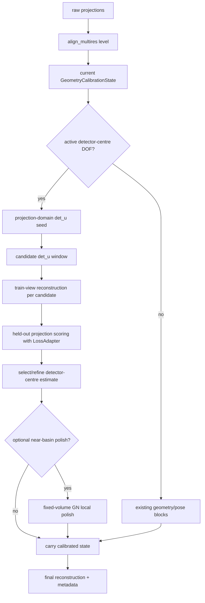
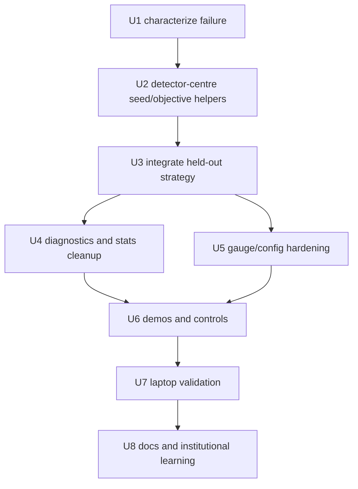

# Fix COR Calibration With Held-Out Detector-Centre Objective

## Overview

Replace detector-centre/COR discovery with an identifiable objective while keeping the public
workflow DRY through `align_multires`, unified DOFs, and the existing `LossAdapter` / `l2_otsu`
loss system.

The current branch now uses the shared loss adapter, but the detector-centre block still estimates
`det_u_px` against a volume reconstructed under the current detector centre. The 65^3 smoke run and
Oracle review both confirm that this fixed-volume same-data objective can become self-consistent at
nominal geometry: true-volume projection loss is minimized at the hidden correction, while
nominal-geometry FBP/FISTA volumes are minimized near `det_u_px=0`.

The fix is not more iterations, a sign flip, or a new standalone calibration pipeline. The fix is a
detector-centre strategy inside the same alignment system:

- characterize and lock down the self-consistency failure;
- seed `det_u_px` from projection-domain evidence;
- refine with a held-out-view reduced objective using the configured `LossAdapter`;
- use fixed-volume GN only as optional local polish after the estimate is already in the basin;
- clean up diagnostics and demos so evidence is auditable.

Heavy numerical validation and visual evidence runs must run on the Linux laptop, not on this Mac
CPU. Local work should stay limited to static checks and small CPU-friendly tests.

**Completed validation:** commit `4e10886` passed the focused local checks and the Linux laptop
smoke run in
`runs/alignment-smoke-65-cor-4e10886/`. The 65^3 `parallel_det_u_m004` case used
`heldout_reprojection` with `l2_otsu` and recovered `det_u_px=-4.0`. The supplied
known-correction control was later removed from the evidence suite because it only proves normal
reconstruction under already-correct geometry.

---

## Problem Frame

The origin requirements correctly require a unified alignment system: geometry and pose should be
scoped variables in the same state, selected by active/frozen DOFs, using the same configured
projection loss. The previous implementation plan completed much of that refactor, but the
detector-centre/COR solve still has a deeper identifiability problem.

The failing smoke run showed:

- estimated `parallel_det_u_m004` and `parallel_det_u_p004` move in the correct sign direction but
  recover only roughly 20-30% of the hidden offset.
- all geometry updates are accepted and use `l2_otsu`, so the failure is not a rejected-step issue
  or wrong loss selection.
- `+4 px` and `-4 px` are mirrored duplicates for expensive evidence runs; one sign is enough,
  with opposite-sign coverage kept in a cheap test.

The root cause is that COR-like detector-centre errors are gauge-coupled with object/volume
translation. A volume reconstructed under wrong geometry can absorb the error, so
`loss(A(det_u_candidate) x_current, y)` is a self-consistency objective rather than a reliable
calibration objective.

---

## Requirements Trace

- R1-R3. Preserve one alignment DOF namespace and COR-only `det_u_px` operation from the origin
  document.
- R8-R13. Continue using the configured loss system, especially `l2_otsu`, and report the actual
  loss/objective names.
- R14-R18. Keep block-coordinate geometry work inside `align_multires`, with diagnostics for weak
  or ill-conditioned solves.
- R19-R23. Preserve detector/ray-grid centre gauge semantics and reject or explicitly diagnose
  gauge-coupled active sets.
- R24-R27. Demo artifacts and manifests must prove the public solver path and distinguish
  estimated, supplied, frozen, derived, and evaluation-only values.
- R28-R31. Preserve pose-only compatibility and reduce solver duplication.

**Plan-local requirements:**

- LR1. Characterize the fixed-volume same-data detector-centre objective as invalid for COR
  discovery.
- LR2. Detector-centre discovery must use projection-domain and/or held-out projection evidence
  that cannot be satisfied by reconstructing the same scored data under wrong geometry.
- LR3. The held-out detector-centre objective must reuse `GeometryCalibrationState`,
  `level_detector_grid()`, `geometry_with_axis_state()`, `fista_tv`, and `LossAdapter` rather than
  creating a new solver product.
- LR4. Fixed-volume GN may remain as local polish, but it must not be the primary discovery or
  acceptance mechanism for detector-centre/COR calibration.
- LR5. Expensive smoke/evidence suites must stop duplicating `+4 px` and `-4 px` detector-centre
  scenarios.
- LR6. Heavy numerical tests and visual evidence runs must be performed on the Linux laptop; the
  Mac should not be used for 65^3 or 128^3 solver validation.

**Origin actors:** A1 TomoJAX user, A2 Alignment engine, A3 Planner/implementer, A4
Documentation/demo generator

**Origin flows:** F1 COR-only detector-centre alignment, F2 Pose-only alignment, F3 Staged
geometry plus pose alignment, F4 Demo/evidence generation

**Origin acceptance examples:** AE1 detector-centre uses `l2_otsu`, AE2 pose-only compatibility,
AE3 staged masks, AE4 public demo path, AE5 gauge diagnostics, AE6 geometry-state reporting

---

## Scope Boundaries

- Do not flip the sign of `det_u_px`; the true-volume sweep validates sign/units.
- Do not change away from `l2_otsu` to compensate for this failure; the loss is informative when
  the volume is not contaminated by the wrong inverse problem.
- Do not tune more outer iterations as the primary fix; more iterations only optimize the same
  biased fixed-volume objective.
- Do not use fixed-volume same-data GN as the primary COR discovery objective.
- Do not introduce a standalone `tomojax-calibrate-geometry` path, separate loss system, or
  demo-only solver.
- Do not implement full differentiation through FISTA/reconstruction in this phase.
- Do not make full coupled `det_u_px + dx/dz` optimization a default or silent path.
- Do not keep both `parallel_det_u_m004` and `parallel_det_u_p004` in expensive laptop suites.
- Do not run 65^3 or 128^3 numerical validation on the Mac CPU.

### Deferred to Follow-Up Work

- Held-out reduced objectives for detector roll and axis direction: this plan may keep current
  fixed-volume GN for those blocks while clearly labelling its objective; extending held-out
  scoring to those blocks should be planned separately after detector-centre is stable.
- Opposite-view mirror phase correlation for 360-degree scans: useful later, but the first
  detector-centre fix should work for the current 180-degree COR smoke case.
- Differentiable or implicit reconstruction-gradient geometry optimization: defer until the
  held-out scalar objective is proven insufficient.

---

## Context & Research

### Relevant Code and Patterns

- `src/tomojax/align/pipeline.py` owns `AlignConfig`, loss schedule resolution, `build_loss_adapter`,
  `align_multires`, checkpoints, observers, pose updates, and final `AlignMultiresInfo`.
- `src/tomojax/align/geometry_blocks.py` owns `GeometryCalibrationState`,
  `geometry_with_axis_state()`, `level_detector_grid()`, block stats, acquisition diagnostics, and
  the current fixed-volume `_optimize_one_block()` path.
- `src/tomojax/align/losses.py` owns `L2OtsuLossSpec`, soft Otsu masks, GN-compatible loss weights,
  and `LossAdapter`.
- `src/tomojax/calibration/detector_grid.py` owns detector-centre and detector-roll grid
  transforms.
- `src/tomojax/calibration/gauge.py` already documents gauge conflicts such as `det_u_px` versus
  world translation concepts.
- `scripts/generate_alignment_before_after_128.py` owns synthetic scenario taxonomy, phantom #94
  demos, manifests, rich panels, and current duplicated `+4/-4` detector-centre scenarios.
- `tests/test_align_quick.py` already checks scoped DOFs, geometry metadata, `l2_otsu` stat names,
  and small detector-centre movement, but it does not catch the wrong-volume objective failure.
- `tests/test_geometry_block_taxonomy_generator.py` protects generator metadata, profiles, and
  visual artifact paths.

### Institutional Learnings

- `docs/solutions/architecture-patterns/reuse-align-multires-for-geometry-calibration-2026-04-25.md`
  remains directionally right about avoiding standalone calibration pipelines, but it is now stale
  where it presents fixed-volume geometry blocks as sufficient. This plan should update it after
  the new detector-centre objective is implemented.

### Oracle / External Review

- `runs/alignment-smoke-65-cor-b7fe5a7/oracle-cor-rootcause.md` reviewed the code and smoke
  evidence and agreed with the diagnosis.
- Oracle recommended a projection-domain seed plus held-out-view reduced objective inside
  `align_multires`, using the existing `LossAdapter`, with fixed-volume GN only as local polish.
- Oracle explicitly rejected sign flips, loss changes, more iterations, standalone pipelines, and
  immediate differentiation through reconstruction as the primary response.

---

## Key Technical Decisions

| Decision | Rationale |
|---|---|
| Keep `align_multires` as the public orchestration path | Satisfies the origin DRY requirement and avoids reintroducing a second calibration product. |
| Make detector-centre discovery objective-specific but not pipeline-specific | COR needs a held-out/reduced objective for identifiability, but it can still use the same state, loss, recon, and metadata machinery. |
| Add characterization before behavioral changes | The current failure is subtle; tests must first prove why fixed-volume same-data COR discovery is invalid. |
| Use Otsu-weighted projection COM as the first seed | It uses raw projection evidence, is cheap at coarse levels, and separates detector-centre constant offset from sinusoidal object centroid terms. |
| Use deterministic held-out validation for refinement | Reconstructing on train views and scoring held-out views breaks the self-consistency loop while still using `fista_tv` and `LossAdapter`. |
| Keep fixed-volume GN only as optional polish | It can refine a near-correct detector-centre estimate but should not discover COR from nominal geometry. |
| Collapse expensive `+4/-4` duplication | The two cases test the same behavior at high cost; a cheap sign regression plus one expensive sign is enough. |
| Run heavy validation on the Linux laptop | 65^3 and 128^3 runs are too slow on the Mac CPU and should not shape the local development loop. |

---

## Open Questions

### Resolved During Planning

- Is this a sign convention bug? No. The true-volume sweep and mirrored movement rule that out.
- Is this a wrong-loss bug? No. The run used `l2_otsu`, and the true-volume sweep validates the
  loss minimum.
- Should more iterations be the fix? No. More iterations continue optimizing a biased objective.
- Should detector-centre use a standalone calibration command? No. Keep it inside `align_multires`.
- Should `+4 px` and `-4 px` both remain in expensive evidence suites? No. Keep one sign in the
  expensive suite and cover the opposite sign cheaply.
- Should heavy numerical validation run locally? No. Run 65^3 and 128^3 validation on the Linux
  laptop.

### Deferred to Implementation

- Exact coarse candidate window and spacing for held-out refinement: start with an implementation
  that can distinguish nominal from hidden `-4 px`; tune on laptop smoke data if necessary.
- Exact train/validation split ratio: use deterministic interleaving by angle; final cadence can be
  adjusted based on runtime and conditioning.
- Whether the projection COM seed is sufficient alone for small smoke cases: implementation should
  record both seed and held-out refinement so this can be measured.
- Whether to apply held-out scoring at every pyramid level or only coarse-plus-fine refinement:
  choose based on runtime and diagnostic evidence during implementation.
- Whether `det_v_px` should share the held-out detector-centre objective immediately or remain a
  documented later extension; COR evidence should focus on `det_u_px`.

---

## High-Level Technical Design

> *This illustrates the intended approach and is directional guidance for review, not
> implementation specification. The implementing agent should treat it as context, not code to
> reproduce.*



The detector-centre strategy is a scoped geometry block. It should not own CLI parsing,
loss selection, output metadata, or reconstruction algorithms. It receives those from
`align_multires` and returns calibrated state plus structured stats.

---

## Implementation Units



- U1. **Characterize the COR Self-Consistency Failure**

**Goal:** Add tests and documentation that prove fixed-volume same-data detector-centre GN is not a
valid COR discovery objective.

**Requirements:** LR1, LR2, R8-R13, R18

**Dependencies:** None

**Files:**
- Create: `tests/test_detector_center_objective.py`
- Modify: `tests/test_align_quick.py`
- Modify: `docs/solutions/architecture-patterns/reuse-align-multires-for-geometry-calibration-2026-04-25.md`

**Approach:**
- Add a small deterministic synthetic case that simulates hidden `det_u_px=-4` or a scaled-down
  equivalent at CPU-friendly size.
- Compare L2-Otsu projection loss over candidate `det_u_px` for:
  - the true phantom volume;
  - a nominal-geometry reconstruction;
  - the current fixed-volume objective state if practical at the chosen size.
- Assert the true-volume objective prefers the hidden correction, while the nominal reconstruction
  is allowed to prefer nominal or become materially biased.
- Update the architecture learning to state that fixed-volume same-data GN is a local polish tool,
  not a COR discovery objective.

**Execution note:** Characterization-first. This unit should land before any solver behavior is
changed.

**Patterns to follow:**
- Existing small synthetic setup in `tests/test_align_quick.py`
- Loss adapter use from `src/tomojax/align/losses.py`
- Detector-grid helper tests in `tests/test_calibration_detector_grid.py`

**Test scenarios:**
- Happy path: true phantom + L2-Otsu candidate sweep has its minimum near the hidden detector-centre
  correction.
- Characterization: nominal-geometry reconstruction + same candidate sweep does not reliably prefer
  the hidden correction.
- Regression: `loss_kind` used in the sweep is `l2_otsu`, not a private geometry objective.
- Edge case: candidate sweep bounds include nominal and hidden offsets so a false pass cannot occur
  from an incomplete candidate list.

**Verification:**
- The test captures the current root cause without requiring 65^3 data.
- The learning doc no longer implies fixed-volume geometry blocks are sufficient for COR discovery.

- U2. **Build Detector-Centre Seed And Held-Out Objective Helpers**

**Goal:** Create reusable detector-centre calibration helpers that use projection-domain evidence
and held-out scoring while reusing the existing alignment primitives.

**Requirements:** LR2, LR3, R8-R13, R15, R19-R20

**Dependencies:** U1

**Files:**
- Create: `src/tomojax/align/detector_center.py`
- Modify: `src/tomojax/align/geometry_blocks.py`
- Test: `tests/test_detector_center_objective.py`

**Approach:**
- Add a detector-centre-specific helper module under `src/tomojax/align/` rather than expanding
  `geometry_blocks.py` further.
- Implement an Otsu-weighted detector-u centre-of-mass seed over projections. Fit constant plus
  sinusoidal angle terms so object centroid motion is not mistaken for detector centre.
- Add deterministic interleaved train/held-out view selection.
- Add a held-out candidate scorer:
  - reconstruct from train views under candidate detector centre;
  - project held-out views under the same candidate geometry;
  - score held-out projections with the configured `LossAdapter`;
  - return candidate losses, selected estimate, and objective metadata.
- Keep all detector-grid and geometry construction through existing helpers.
- Make candidate generation configurable through internal profile parameters, but keep public API
  centered on `optimise_dofs=("det_u_px",)`.

**Technical design:** Directional sketch:

```text
seed = weighted_u_com_sinusoid_seed(projections, thetas, loss_adapter_state)
candidates = centered_window(seed or current_state.det_u_px)
for candidate in candidates:
    x_train = reconstruct(train_views, candidate_geometry)
    heldout_loss = score(heldout_views, x_train, candidate_geometry, LossAdapter)
select best candidate, optionally fit a local parabola over neighboring losses
```

**Patterns to follow:**
- `level_detector_grid()` and `geometry_with_axis_state()` from `src/tomojax/align/geometry_blocks.py`
- `fista_tv` invocation patterns in `src/tomojax/align/pipeline.py`
- `build_loss_adapter()` / `LossAdapter.per_view_loss()` from `src/tomojax/align/losses.py`

**Test scenarios:**
- Happy path: Otsu-weighted COM seed estimates the correct sign for hidden `det_u_px=-4` on a
  small parallel CT synthetic case.
- Happy path: held-out candidate scoring prefers a candidate closer to hidden `det_u_px` than
  nominal for the same small synthetic case.
- Integration: held-out scoring uses the provided loss adapter name and records `l2_otsu`.
- Edge case: if the COM seed is non-finite or projections are degenerate, the scorer falls back to a
  window around current detector centre and records a diagnostic warning.
- Error path: candidate scoring fails clearly if train/held-out split leaves too few views to
  reconstruct or score.

**Verification:**
- Helpers are reusable by `align_multires` without importing demo-generator code.
- The held-out score breaks the fixed-volume self-consistency failure captured in U1.

- U3. **Integrate Held-Out Detector-Centre Strategy Into `align_multires`**

**Goal:** Route detector-centre/COR discovery through the held-out objective inside the unified
alignment path.

**Requirements:** LR2, LR3, LR4, R1-R3, R8-R18, AE1, AE3

**Dependencies:** U2

**Files:**
- Modify: `src/tomojax/align/pipeline.py`
- Modify: `src/tomojax/align/geometry_blocks.py`
- Modify: `src/tomojax/align/detector_center.py`
- Test: `tests/test_align_quick.py`
- Test: `tests/test_detector_center_objective.py`
- Test: `tests/test_align_checkpoint.py`

**Approach:**
- When `det_u_px` is active and pose DOFs are frozen, call the detector-centre held-out strategy
  from the geometry block path instead of using fixed-volume same-data GN for discovery.
- Record stats with `geometry_block="detector_center"`,
  `geometry_objective="heldout_reprojection"`, and `loss_kind`/`geometry_loss_kind` equal to the
  configured loss.
- Carry the selected `GeometryCalibrationState` forward through the multires pyramid.
- Preserve `params5` as all zeros for COR-only runs.
- Optionally run fixed-volume GN after held-out selection only when the candidate is near-basin and
  only as local polish; record that as `geometry_objective="fixed_volume_polish"`.
- For combined geometry + pose runs, require an explicit gauge policy before using the detector
  centre strategy with active `dx`/`dz`; do not silently couple them.

**Patterns to follow:**
- Existing `align_multires` level loop and checkpoint state handling in `src/tomojax/align/pipeline.py`
- Existing geometry state serialization through `GeometryCalibrationState.to_calibration_state()`
- Current `det_grid_override` path for pose alignment under calibrated detector grids

**Test scenarios:**
- Covers AE1: COR-only hidden `det_u_px=-4` estimates the correct sign and a meaningful fraction of
  the hidden offset using `l2_otsu`, with `params5` remaining zero.
- Happy path: detector-centre held-out stats appear in `info["outer_stats"]` and
  `info["geometry_calibration_diagnostics"]`.
- Integration: checkpoint callback includes the updated geometry calibration state after held-out
  selection and resume does not reset detector centre to zero.
- Edge case: if held-out objective is flat or inconclusive, diagnostics mark the block
  `ill_conditioned` or `underconverged` rather than `converged`.
- Regression: pose-only alignment path is unchanged when no detector-centre DOFs are active.

**Verification:**
- `align_multires(... optimise_dofs=("det_u_px",) ...)` uses the new objective through the same
  public path users and demos call.
- Fixed-volume GN is no longer the acceptance gate for COR discovery.

- U4. **Repair Geometry Diagnostics And Stats Semantics**

**Goal:** Make diagnostics truthful after introducing multiple geometry objectives and
multiresolution levels.

**Requirements:** R13, R18, R25, R27, LR4

**Dependencies:** U3

**Files:**
- Modify: `src/tomojax/align/geometry_blocks.py`
- Modify: `src/tomojax/align/pipeline.py`
- Test: `tests/test_align_quick.py`
- Test: `tests/test_detector_center_objective.py`

**Approach:**
- Stop computing one global `loss_before/loss_after` across different pyramid levels.
- Summarize geometry stats by level factor, geometry block, active DOFs, and objective type.
- Report per-level relative improvement or objective-specific scalar summaries rather than mixing
  raw loss scales.
- Fix fixed-volume line search to evaluate candidate scales and choose the best finite improving
  scale if that path remains.
- Record geometry-only wall time in `AlignMultiresInfo` instead of returning `0.0`.
- Preserve acquisition diagnostics for axis-direction weak coverage.

**Patterns to follow:**
- Existing `summarize_geometry_calibration_stats()` contract
- Existing `outer_stats` enrichment in `align_multires`
- Existing rich loss panel grouping in `scripts/generate_alignment_before_after_128.py`

**Test scenarios:**
- Happy path: diagnostics for a multilevel detector-centre run contain separate level entries or
  scale-normalized summaries.
- Regression: accepted local fixed-volume updates do not produce a misleading cross-level negative
  `loss_drop`.
- Happy path: held-out detector-centre stats include candidate loss curve metadata and selected
  estimate.
- Edge case: fixed-volume polish stats are distinguishable from held-out discovery stats.
- Integration: `wall_time_total` is nonzero for geometry-only work.

**Verification:**
- Summary diagnostics explain what happened without requiring raw log inspection.
- Existing visual loss panels can plot held-out and polish objectives without mislabelling them.

- U5. **Harden Gauge And Active-DOF Validation**

**Goal:** Prevent users and demos from silently asking for gauge-coupled detector-centre and pose
translation solves.

**Requirements:** R18, R20, R23, AE5, LR3

**Dependencies:** U3

**Files:**
- Modify: `src/tomojax/align/dofs.py`
- Modify: `src/tomojax/align/pipeline.py`
- Modify: `src/tomojax/calibration/gauge.py`
- Modify: `src/tomojax/cli/align.py`
- Test: `tests/test_align_quick.py`
- Test: `tests/test_calibration_gauge.py`
- Test: `tests/test_cli_entrypoints.py`

**Approach:**
- Extend validation so active pose translations and active detector-centre geometry do not silently
  form an underdetermined gauge.
- Keep expert coupled solves possible only with an explicit documented gauge policy or diagnostic
  status.
- Make COR-only unambiguous: `optimise_dofs=("det_u_px",)` means no active pose DOFs.
- Keep the transitional `geometry_dofs` path from accidentally activating default pose DOFs.
- Ensure CLI help and config metadata make the active/frozen DOF decision inspectable.

**Patterns to follow:**
- `resolve_scoped_alignment_dofs()` in `src/tomojax/align/dofs.py`
- Gauge conflict representation in `src/tomojax/calibration/gauge.py`
- Existing CLI parse tests in `tests/test_cli_entrypoints.py`

**Test scenarios:**
- Happy path: COR-only config activates `det_u_px` and no pose translations.
- Error path: `optimise_dofs=("det_u_px","dx")` without explicit gauge policy is rejected or
  reported as gauge-coupled before optimization starts.
- Compatibility: legacy `geometry_dofs=("det_u_px",)` does not accidentally activate pose DOFs.
- CLI integration: help/config output lists detector-centre as a geometry DOF and records frozen
  pose DOFs in metadata.
- Covers AE5: gauge-coupled active sets do not appear as successful calibration.

**Verification:**
- A user cannot accidentally hide detector-centre error in active pose translation during COR-only
  calibration.
- Expert coupled behavior remains explicit rather than removed.

- U6. **Update Demo Generator, Controls, And Scenario Taxonomy**

**Goal:** Make demos and smoke scenarios prove the new public detector-centre objective without
duplicated sign cases or misleading reconstruction labels.

**Requirements:** R24-R27, R31, LR5, LR6, AE4

**Dependencies:** U3, U4, U5

**Files:**
- Modify: `scripts/generate_alignment_before_after_128.py`
- Modify: `tests/test_geometry_block_taxonomy_generator.py`
- Modify: `docs/brainstorms/geometry-calibration-solver-requirements.md`

**Approach:**
- Remove one of `parallel_det_u_m004` / `parallel_det_u_p004` from expensive default/evidence
  suites; keep one detector-centre sign.
- Keep cheap sign coverage in unit tests rather than laptop visual suites.
- Add manifest fields for detector-centre objective type, held-out split summary, candidate loss
  curve, projection-domain seed, optional polish step, and configured loss name.
- Ensure `inspection_panel.png`, `loss_panel.png`, `diagnostics_panel.png`, `summary.csv`, and
  `alignment_metadata.json` all remain compatible with current rich visualization output.

**Patterns to follow:**
- Existing rich visualization and metadata writer in `scripts/generate_alignment_before_after_128.py`
- Existing dry-run manifest assertions in `tests/test_geometry_block_taxonomy_generator.py`

**Test scenarios:**
- Happy path: dry-run default taxonomy contains one expensive detector-centre sign, not both
  mirrored signs.
- Happy path: detector-centre scenario manifest records `geometry_objective="heldout_reprojection"`
  and `loss_kind="l2_otsu"`.
- Regression: visual-stress axis cases retain explicit 360-degree acquisition spans.
- Naive-only mode still writes reduced rich panels without fake alignment stats.

**Verification:**
- Demo artifacts are auditable evidence for the public path, not a private or duplicated solver.
- Expensive laptop evidence time is spent on distinct scenarios.

- U7. **Remote Laptop Validation And Evidence Rerun**

**Goal:** Validate the corrected detector-centre path at meaningful sizes without overloading the
Mac CPU.

**Requirements:** LR6, R24-R28, AE1-AE4

**Dependencies:** U1-U6

**Files:**
- Test: `tests/test_align_quick.py`
- Test: `tests/test_align_chunking.py`
- Test: `tests/test_align_loss_logic.py`
- Test: `tests/test_detector_center_objective.py`
- Test: `tests/test_geometry_block_taxonomy_generator.py`
- Test: `tests/test_cli_entrypoints.py`
- Test: `tests/test_calibration_gauge.py`

**Approach:**
- Keep local validation to small CPU-friendly tests and static checks.
- Use the Linux laptop for:
  - focused test suite validation after implementation;
  - 65^3 detector-centre smoke with one hidden sign;
  - 128^3 phantom #94 evidence only after 65^3 smoke passes.
- Each remote run should record commit, profile, phantom metadata, active/frozen DOFs, objective
  type, loss kind, seed, held-out split, candidate losses, final estimate, and diagnostics.
- Sync remote run artifacts back under `runs/` for review.
- Attach a 5-minute heartbeat monitor only for long-running laptop jobs.

**Patterns to follow:**
- Existing laptop run layout under `runs/alignment-smoke-65-cor-b7fe5a7/`
- Existing rich visual evidence layout under `runs/alignment-full-good-phantom-128/`

**Test scenarios:**
- Remote smoke: 65^3 hidden detector-centre sign estimates near the hidden offset, improves
  calibrated/aligned reconstruction versus naive, and records `heldout_reprojection`.
- Remote regression: pose-only and existing geometry tests still pass on the laptop environment.
- Remote evidence: 128^3 phantom #94 master sheet and per-scenario inspection panels are generated
  only after smoke success.
- Failure path: inconclusive held-out objective marks diagnostics as `underconverged` or
  `ill_conditioned` and does not claim success.

**Verification:**
- Laptop smoke replaces the failed fixed-volume result with an auditable held-out detector-centre
  solve.
- Final 128^3 visuals are not published as evidence until metadata proves the corrected objective
  ran.

- U8. **Update Documentation And Institutional Memory**

**Goal:** Prevent future work from reintroducing fixed-volume same-data COR discovery or expensive
duplicated detector-centre scenarios.

**Requirements:** R20, R31, LR1-LR6

**Dependencies:** U7

**Files:**
- Modify: `docs/brainstorms/geometry-calibration-solver-requirements.md`
- Modify: `docs/solutions/architecture-patterns/reuse-align-multires-for-geometry-calibration-2026-04-25.md`
- Modify: `docs/cli/align.md`
- Modify: `docs/plans/2026-04-26-002-fix-cor-heldout-calibration-plan.md`

**Approach:**
- Update requirements and architecture notes to distinguish:
  - shared alignment path and shared loss system;
  - detector-centre held-out discovery objective;
  - fixed-volume GN local polish;
  - evaluation metrics versus training/validation losses.
- Document that `det_u_px` is detector/ray-grid centre under a gauge, not proof of physical COR
  separation.
- Document recommended scenario coverage: one detector-centre sign, one supplied correction
  control, cheap opposite-sign regression.
- Document that heavy evidence runs belong on the Linux laptop.

**Patterns to follow:**
- Current requirements style in `docs/brainstorms/geometry-calibration-solver-requirements.md`
- Current architecture-learning style in `docs/solutions/architecture-patterns/`
- Existing CLI geometry DOF docs in `docs/cli/align.md`

**Test scenarios:**
- Test expectation: none for prose-only docs, but generated docs references should not contradict
  manifest field names or CLI flags.

**Verification:**
- A future planner can read the docs and understand why detector-centre discovery is held-out, not
  fixed-volume same-data GN.
- CLI docs match implemented flags and objective labels.

---

## System-Wide Impact

- **Interaction graph:** `align_multires` remains the entry point; detector-centre strategy becomes
  a geometry block implementation detail that uses shared reconstruction, loss, and metadata.
- **Error propagation:** inconclusive seeds, invalid train/held-out splits, flat candidate curves,
  or gauge conflicts should produce clear diagnostics or config errors before a run claims success.
- **State lifecycle risks:** detector-centre estimates must carry across pyramid levels,
  checkpoints, resume, final reconstruction, and demo manifests without resetting to nominal.
- **API surface parity:** Python API, CLI `--optimise-dofs`, transitional `--optimise-geometry`,
  generator scenarios, and metadata output must describe the same active/frozen DOF behavior.
- **Integration coverage:** unit tests alone cannot prove the 65^3/128^3 behavior; laptop smoke and
  evidence runs are required for solver confidence.
- **Unchanged invariants:** pose-only alignment semantics, `params5` object-frame residuals,
  `l2_otsu` default, detector-grid sign convention, and phantom #94 visualization path remain
  unchanged unless explicitly covered by tests.

---

## Alternative Approaches Considered

- **More fixed-volume GN iterations:** rejected because the biased objective prefers nominal for
  wrong-geometry reconstructions.
- **Sign flip:** rejected because supplied correction and mirrored movement validate sign/units.
- **Switch loss away from `l2_otsu`:** rejected because true-volume sweeps show `l2_otsu` has the
  correct minimum.
- **Volume-centre anchoring as primary fix:** useful as gauge hygiene later, but insufficient because
  nominal FISTA volumes already produce a nominal detector-centre objective minimum.
- **Differentiate through reconstruction now:** deferred because same-data bilevel objectives can
  still be weakly identifiable and add major runtime/memory complexity.
- **Standalone COR calibration pipeline:** rejected because it violates the origin DRY requirement
  and would recreate the architectural mistake.

---

## Success Metrics

- Small characterization tests prove the old fixed-volume objective failure mode and the new
  held-out objective behavior.
- 65^3 laptop COR smoke recovers the detector-centre sign and a meaningful fraction of hidden
  `det_u_px`, improves reconstruction versus naive, and records `heldout_reprojection`.
- Supplied-correction control remains strong and honestly labelled.
- Expensive scenario taxonomy removes mirrored `+4/-4` duplication.
- Final 128^3 phantom #94 evidence contains rich panels, summary rows, and manifests showing
  `l2_otsu`, active DOFs, held-out split, candidate losses, final detector-centre estimate, and
  diagnostics.
- Pose-only tests and CLI behavior remain compatible.

---

## Risks & Dependencies

| Risk | Likelihood | Impact | Mitigation |
|---|---:|---:|---|
| Held-out candidate search is too slow at 128^3 | Medium | High | Use coarse-level seed/refinement, narrow candidate windows, deterministic subsets, and laptop-only heavy validation. |
| Projection COM seed is biased by asymmetric phantom content | Medium | Medium | Treat it as a seed, not final truth; held-out scoring is the acceptance mechanism. |
| Held-out split is too small to be stable | Medium | Medium | Use deterministic interleaved views and record split metadata; adjust cadence based on 65^3 laptop smoke. |
| Geometry diagnostics become harder to compare across objectives | Medium | Medium | Record `geometry_objective`, level, loss kind, candidate curve, and per-objective status explicitly. |
| Gauge-coupled pose translations hide detector-centre error | High if allowed silently | High | Validate active DOF sets and require explicit gauge policy for coupled expert solves. |
| Implementation drifts into a second solver product | Medium | High | Keep all helpers under `align_multires` ownership and reuse existing state/loss/recon helpers. |
| Local Mac validation gives false confidence due tiny sizes | Medium | Medium | Treat local tests as characterization/static gates; require laptop smoke and evidence for numerical claims. |

---

## Phased Delivery

### Phase 1: Lock Down The Failure

- U1 only. Add characterization coverage and update the stale architecture note so the root cause is
  explicit before code behavior changes.

### Phase 2: Implement Identifiable COR Discovery

- U2 and U3. Add projection-domain seed, held-out objective, and `align_multires` integration for
  COR-only `det_u_px`.

### Phase 3: Make The System Auditable

- U4, U5, and U6. Fix diagnostics, gauge validation, and demo artifacts so the solver cannot claim
  success from ambiguous or duplicated evidence.

### Phase 4: Prove It At Meaningful Size

- U7 and U8. Run focused tests and smoke/evidence runs on the Linux laptop, sync artifacts, then
  update docs with the proven behavior.

---

## Documentation / Operational Notes

- Heavy tests and evidence generation should run on the Linux laptop. The Mac is acceptable for
  editing, lint/static checks, and tiny CPU tests only.
- Long laptop jobs should get a 5-minute heartbeat monitor that syncs `runs/` artifacts back to the
  local repo.
- Do not publish new visual evidence unless manifests show `geometry_objective`, `loss_kind`,
  active/frozen DOFs, phantom metadata, and diagnostics.
- The first passing 65^3 COR smoke should be treated as smoke, not final proof; 128^3 phantom #94
  evidence is still required before claiming docs/demo success.

---

## Sources & References

- Origin document: `docs/brainstorms/geometry-calibration-solver-requirements.md`
- Previous plan: `docs/plans/2026-04-26-001-refactor-unified-alignment-state-plan.md`
- Oracle diagnosis: `runs/alignment-smoke-65-cor-b7fe5a7/oracle-cor-rootcause.md`
- Failed smoke artifacts: `runs/alignment-smoke-65-cor-b7fe5a7/artifacts/cor_smoke/artifacts/summary.csv`
- Architecture learning: `docs/solutions/architecture-patterns/reuse-align-multires-for-geometry-calibration-2026-04-25.md`
- Alignment pipeline: `src/tomojax/align/pipeline.py`
- Geometry helpers: `src/tomojax/align/geometry_blocks.py`
- Loss system: `src/tomojax/align/losses.py`
- DOF resolution: `src/tomojax/align/dofs.py`
- Detector-grid calibration: `src/tomojax/calibration/detector_grid.py`
- Gauge validation: `src/tomojax/calibration/gauge.py`
- Demo generator: `scripts/generate_alignment_before_after_128.py`
