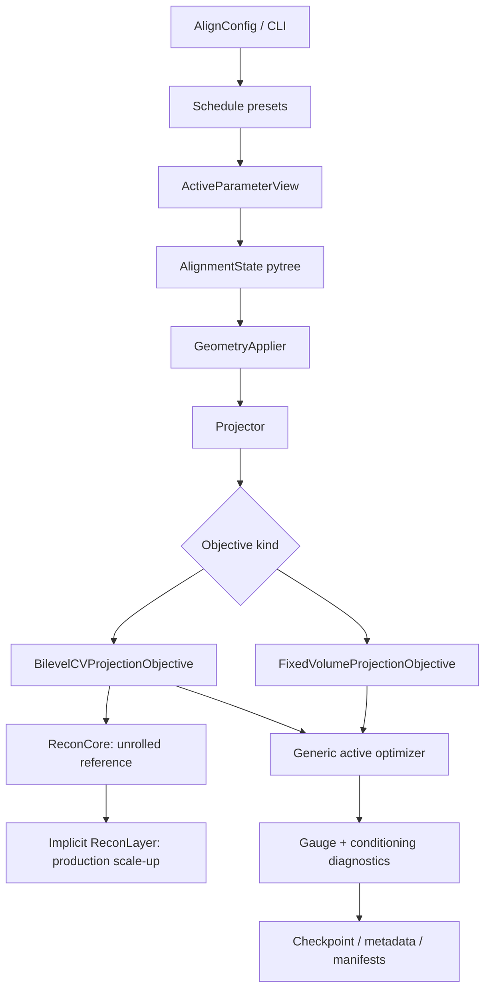
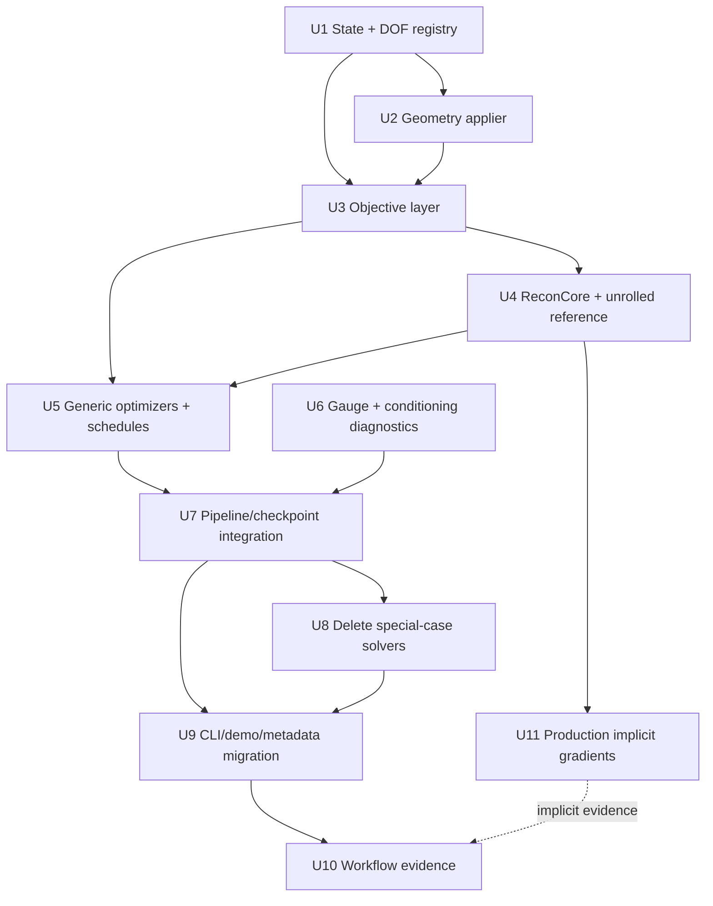
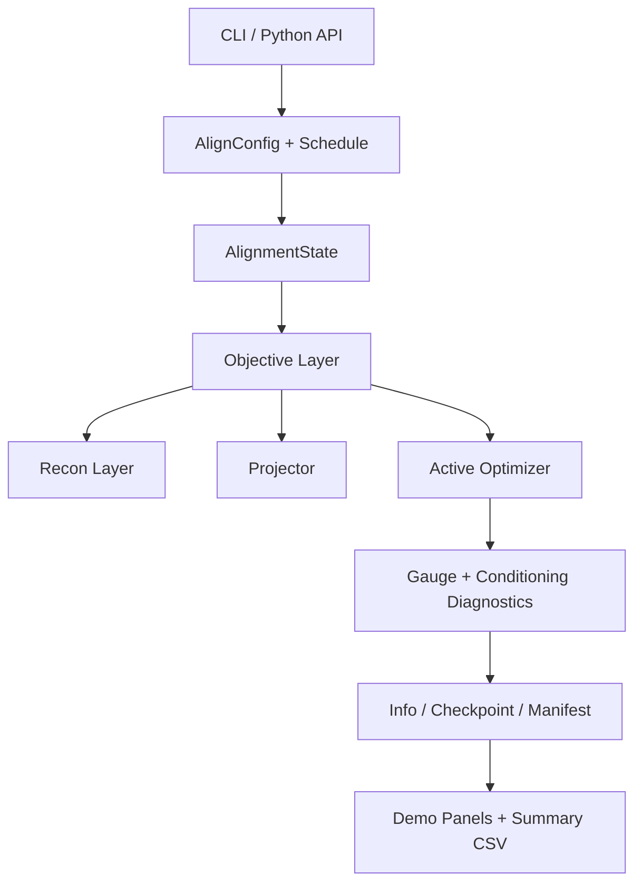

# Refactor TomoJAX Into Unified Bilevel Alignment Architecture

## Overview

Refactor TomoJAX alignment so per-view pose and setup geometry are optimized by one
JAX-native alignment architecture. The design replaces geometry-specific solver islands with a
single active-state system:

- one `AlignmentState` containing setup geometry, per-view pose, and optionally the current volume;
- one active DOF registry with scales, bounds, priors, units, and gauge metadata;
- one pure JAX geometry applier that turns base geometry plus alignment state into effective
  projector inputs;
- one objective layer with `fixed_volume` for pose/polish and `bilevel_cv` as the default setup
  geometry objective;
- one optimizer family over packed active variables;
- one gauge/conditioning diagnostic system;
- one `align_multires` orchestration path, checkpoint contract, metadata model, and demo evidence
  path.

This is a greenfield architecture refactor. The plan preserves durable semantics that matter for
the new programme, such as object-frame pose DOFs, `l2_otsu` loss semantics, detector/ray-grid
gauge wording, and multiresolution alignment. It does not preserve old helper boundaries, old CLI
aliases, candidate-search internals, or test snapshots.

The plan intentionally does not preserve the detector-centre candidate search as an architecture.
That work proved the important point: detector-centre/COR discovery needs an identifiable
held-out/reduced objective. The final TomoJAX design should keep that objective class and replace
the scalar search with differentiable, vectorized, JAX-native optimization.

---

## Problem Frame

The origin requirements document records the core product identity: geometry calibration is not a
separate product from alignment. A TomoJAX user should choose active/frozen DOFs, and the alignment
engine should optimize those variables through the same configured loss system, especially
`l2_otsu` (see origin: `docs/brainstorms/geometry-calibration-solver-requirements.md`).

The completed phase plans moved the branch away from a standalone calibration command and corrected
the immediate COR failure with a held-out detector-centre objective. That was the right diagnosis,
but the implementation is still not the elegant final programme:

- `src/tomojax/align/detector_center.py` owns a bespoke scalar candidate search.
- `src/tomojax/align/geometry_blocks.py` still behaves like a geometry mini-pipeline.
- setup geometry state is represented by Python-float metadata classes instead of a differentiable
  JAX pytree.
- detector centre, detector roll, axis direction, laminography tilt, and pose alignment are still
  split by solver concept rather than active state plus objective concept.

The architecture must now absorb the COR lesson into the general design: setup geometry should be
estimated by an identifiable differentiable objective, not by fixed-volume self-consistency and not
by one-off search.

---

## Requirements Trace

- R1-R7. Preserve one public alignment DOF namespace for pose and setup geometry, with scoped
  internals, active/frozen masks, and a clean replacement for `--optimise-geometry`.
- R8-R13a. Use the configured alignment loss system for setup geometry, defaulting docs/evidence to
  `l2_otsu`; detector-centre/COR discovery must break fixed-volume self-consistency.
- R14-R18. Keep geometry and pose inside one multiresolution alignment loop, with block/stage
  schedules and diagnostics for weak or gauge-coupled active sets.
- R19-R23. Preserve explicit detector/ray-grid, detector-plane, scan/axis, and pose-frame semantics;
  reject, anchor, or diagnose ambiguous gauges.
- R24-R27. Ensure demos and metadata prove the public solver path and distinguish estimated,
  supplied, frozen, derived, and evaluation-only values.
- R28-R31. Preserve the intended pose-only semantics while removing private geometry-objective code,
  stale solution guidance, and old scaffolding that conflicts with the greenfield design.

**Plan-local requirements:**

- LR1. Setup geometry defaults to a differentiable held-out/cross-validated bilevel reprojection
  objective, not same-data fixed-volume GN.
- LR2. `det_u_px`, detector roll, axis direction, laminography tilt, and expert setup combinations
  use the same active-state/objective/optimizer machinery; presets only choose active DOFs,
  objective, priors, bounds, and stage order.
- LR3. The objective hot path is pure JAX over arrays/pytrees; Python object construction,
  `np.asarray`, `.item()`, `.tolist()`, and host-side loops are kept at API, checkpoint, and
  metadata boundaries.
- LR4. Reconstruction-through-geometry gradients are supported through a `recon_layer` abstraction
  with unrolled differentiation as the reference path and implicit differentiation as the serious
  production path.
- LR5. The plan removes grid/candidate search as a setup-geometry solver pattern. Projection-domain
  COR/COM/Fourier evidence may seed or diagnose, but not own calibration.
- LR6. Full coupled setup-plus-pose optimization is possible for expert use only with explicit
  priors and gauge policy; safe presets are staged low-dimensional active sets.
- LR7. Tests must prove gradients, gauge handling, objective identifiability, pose semantics,
  checkpoint metadata, and laptop-scale workflow evidence.
- LR8. The implementation may break current branch APIs, filenames, and CLI aliases when doing so
  produces a cleaner architecture; the plan protects desired semantics, not old implementation
  surfaces.

**Origin actors:** A1 TomoJAX user, A2 Alignment engine, A3 Planner/implementer, A4
Documentation/demo generator.

**Origin flows:** F1 COR-only detector-centre alignment, F2 pose-only alignment, F3 staged geometry
plus pose alignment, F4 demo/evidence generation.

**Origin acceptance examples:** AE1 detector-centre uses `l2_otsu`, AE2 pose-only behavior,
AE3 staged active masks, AE4 public demo path, AE5 gauge diagnostics, AE6 geometry-state reporting.

---

## Scope Boundaries

- Do not keep scalar detector-centre candidate search as the final solver shape.
- Do not introduce grid search, broad multistart, or per-geometry bespoke solvers as the primary
  calibration strategy.
- Do not make fixed-volume same-data GN the default setup-geometry discovery objective.
- Do not make full 10-axis setup plus per-view pose the default workflow.
- Do not preserve old CLI aliases, helper modules, or return metadata solely because existing code
  happens to expose them.
- Do not redefine existing `alpha`, `beta`, `phi`, `dx`, or `dz` object-frame pose semantics.
- Do not claim physical separation of detector translation, rotation-axis intercept, and static
  sample translation when the selected gauge estimates detector/ray-grid centre.
- Do not add cone-beam, arbitrary ray bundle geometry, detector pitch/yaw, or angle schedule
  calibration as first-class presets in this plan unless the shared architecture makes them cheap
  metadata-only extensions.
- Do not let demos, scripts, or docs use optimization paths that real users cannot run.

### Deferred to Follow-Up Work

- Learned image-quality/autofocus terms: fit the objective layer, but are not part of the
  initial default because projection validation and `l2_otsu` must remain the primary signal.
- Bayesian posterior sampling for geometry uncertainty: borrow uncertainty diagnostics now, but do
  not implement MCMC or full posterior inference in this refactor.
- Multi-device sharding: design hot paths with stable pytrees and chunking so sharding can be added,
  but do not require distributed execution for this plan.

---

## Context & Research

### Relevant Code and Patterns

- `src/tomojax/align/pipeline.py` owns `AlignConfig`, `align`, `align_multires`, loss schedule
  resolution, checkpoint state, observer handling, reconstruction cadence, and final result
  metadata.
- `src/tomojax/align/dofs.py` already contains the public scoped DOF namespace, but still mixes
  pose-only bounds helpers with setup geometry names and does not expose a generic active pytree
  view.
- `src/tomojax/align/losses.py` owns `LossAdapter`, `L2OtsuLossSpec`, loss schedule parsing, soft
  Otsu masks, and GN loss weighting. This must remain the single alignment loss source.
- `src/tomojax/align/optimizers.py` contains a useful `BoundTransform` and Optax L-BFGS wrapper, but
  it is pose-specific and should become active-state generic.
- `src/tomojax/align/geometry_blocks.py` contains useful calibration state, detector-grid and axis
  helpers, acquisition diagnostics, and stats summarization, but also owns the split geometry block
  loop that this plan replaces.
- `src/tomojax/align/detector_center.py` contains useful projection-domain seed and held-out split
  ideas, but the scalar candidate loop must be removed as a solver.
- `src/tomojax/calibration/state.py`, `src/tomojax/calibration/gauge.py`,
  `src/tomojax/calibration/detector_grid.py`, and `src/tomojax/calibration/axis_geometry.py`
  provide metadata, gauge, detector-grid, and axis math to preserve and move behind cleaner
  optimizer boundaries.
- `src/tomojax/recon/fista_tv.py` already uses `jax.lax.scan` for view chunking and supports
  `huber_tv`; it is the natural public reconstruction adapter, but the bilevel hot path needs a
  stricter array-level reconstruction core underneath it.
- `scripts/generate_alignment_before_after_128.py` must continue to call the public alignment path
  and record objective/loss metadata for visual evidence.

### JAX Guidance

- JAX code should be pure functions over arrays and pytrees, with Python dataclasses used at API and
  serialization boundaries rather than in the compiled hot path.
- Long optimization loops and view/fold loops should be expressed with `lax.scan`; independent
  folds, views, finite-difference checks, and per-DOF sensitivities should use `vmap` when memory
  allows.
- `jit` boundaries should be coarse and stable: compile objective/gradient steps or stage kernels,
  not tiny helpers rebuilt inside Python loops.
- `value_and_grad(..., has_aux=True)` should return objective values plus diagnostics without
  forcing host synchronization.
- `custom_vjp` is appropriate for implicit differentiation through a converged reconstruction layer;
  JAX documentation describes using custom VJP for fixed-point solvers so reverse mode can apply the
  implicit function theorem instead of differentiating through every inner iteration.
- The static project scan found host conversion mostly in checkpoint/metadata and several runtime
  device-boundary calls. The plan keeps those at boundaries and explicitly prevents new host
  conversions in alignment objectives.

### Institutional Learnings

- `docs/solutions/architecture-patterns/reuse-align-multires-for-geometry-calibration-2026-04-25.md`
  correctly says geometry calibration belongs inside `align_multires`, not a standalone product.
  It is stale where it treats fixed-volume geometry blocks and detector-centre candidate search as
  acceptable architecture.
- `docs/plans/2026-04-26-001-refactor-unified-alignment-state-plan.md` completed the first cleanup:
  unified DOF names, configured loss use, and metadata.
- `docs/plans/2026-04-26-002-fix-cor-heldout-calibration-plan.md` completed the diagnostic fix for
  COR but deliberately deferred differentiating through reconstruction. This plan resumes that
  deferred architectural work as the main direction.

### External References

- van Leeuwen, Maretzke, and Batenburg, “Automatic alignment for three-dimensional tomographic
  reconstruction”: joint reconstruction/alignment framing. `https://arxiv.org/abs/1705.08678`
- Austin, Di, Leyffer, and Wild, “Simultaneous Sensing Error Recovery and Tomographic Inversion”:
  sensing error as part of the tomography inverse problem. `https://arxiv.org/abs/1902.02027`
- Gürsoy et al., “Rapid alignment of nanotomography data using joint iterative reconstruction and
  reprojection”: reconstruct/reproject alignment precedent.
  `https://doi.org/10.1038/s41598-017-12141-9`
- Pedersen, Jørgensen, and Andersen, “A Bayesian Approach to CT Reconstruction with Uncertain
  Geometry”: geometry uncertainty and identifiability framing. `https://arxiv.org/abs/2203.01045`
- Vo et al., “Reliable method for calculating the center of rotation in parallel-beam tomography”:
  projection-domain COR evidence as seed/diagnostic, not the final TomoJAX solver.
  `https://doi.org/10.1364/OE.22.019078`
- Thies et al., “Gradient-Based Geometry Learning for Fan-Beam CT Reconstruction”: differentiable CT
  geometry learning precedent. `https://arxiv.org/abs/2212.02177`
- JAX docs on custom VJP for fixed-point solvers, `lax.scan`, pytrees, `jit`, `vmap`, and `grad`.

---

## Key Technical Decisions

| Decision | Rationale |
|---|---|
| Use one `AlignmentState` pytree for setup, pose, and optional volume | This makes geometry and pose differ by parameterization, not by solver product. |
| Use an `ActiveParameterView` over a DOF registry | Presets become masks over a typed state; optimizer code no longer knows whether a variable is COR, roll, axis, or pose. |
| Make setup geometry default to `bilevel_cv` | Fixed-volume same-data objectives can be self-consistent at wrong setup geometry; validation reprojection breaks that loop. |
| Keep fixed-volume objective for pose and local polish | Pose alignment already works well with the current reconstruct/project/update loop; not every stage needs reconstruction hypergradients. |
| Split reconstruction differentiation into reference and production units | Unrolled gradients unblock the active-state/objective/schedule architecture; implicit gradients remain the production scale-up path and should not block the pipeline refactor. |
| Use `huber_tv` or smoothed TV in the differentiable inner reconstruction layer | Smooth inner optimality makes implicit differentiation and gradient checks tractable. |
| Use projection-domain COR/COM/Fourier evidence only as initializer/diagnostic | It is valuable physics evidence but should not create a separate calibration family. |
| Optimize bilevel-CV with active L-BFGS/Adam by default | The bilevel objective is scalar and already includes reconstruction response; GN belongs where a clean residual/JVP contract exists, mainly fixed-volume and polish stages. |
| Optimize whitened active variables | Mixed native pixels, radians, world translations, and coefficients need dimensionless scales for meaningful gradients, curvature, and diagnostics. |
| Centralize gauge rules and conditioning diagnostics | Ambiguous active sets are a modeling issue, not a line-search issue. |
| Keep metadata/manifest concepts but not old metadata surfaces as constraints | Serialization wants JSON-friendly Python data; optimization wants JAX arrays and stable pytrees. |
| Use laptop/GPU for heavy workflow validation | 65^3/128^3 evidence should not be shaped by Mac CPU runtime constraints. |

---

## Open Questions

### Resolved During Planning

- Should the final shape preserve detector-centre candidate search? No. Keep the held-out objective
  idea; replace the solver with differentiable active-state optimization.
- Should setup geometry and per-view pose live in one solver? Yes. Use one active-state system with
  separate scopes, scales, priors, and gauges.
- Should setup geometry use the same default objective as pose? No. The machinery is shared, but
  objective kind is a stage property: fixed-volume is appropriate for pose and polish; bilevel CV is
  the setup-geometry default.
- Should implicit differentiation be part of the plan? Yes. It is the best JAX-native endpoint for
  this architecture; unrolled differentiation exists to test and de-risk it.
- Should full coupled optimization exist? Yes, only as expert mode with explicit priors and gauge
  policy.

### Deferred to Implementation

- Exact names and file placement for internal helper classes may adapt to local style while keeping
  the boundaries in this plan.
- Exact implicit-gradient linear solver tolerances should be chosen from gradient-check and laptop
  workflow evidence.
- Whether `optax` L-BFGS or Adam is the better default for each bilevel stage should be decided from
  objective traces and laptop evidence after the generic active-state optimizer boundary exists.
- Whether the inner reconstruction layer uses FISTA-TV, SPDHG-TV, or both at first depends on which
  path can expose stable optimality residuals and HVPs earliest.
- Exact safe-preset stage counts and early-stop thresholds should be calibrated after the objective
  engine is in place.

---

## Output Structure

The final layout may adjust during implementation, but the intended new/reshaped modules are:

```text
src/tomojax/align/
  state.py                 # AlignmentState, SetupGeometryState, PoseState
  dof_specs.py             # DofSpec registry, ActiveParameterView, whitening/scales/bounds/priors
  geometry_applier.py      # pure JAX effective geometry and detector-grid application
  objectives.py            # fixed_volume, bilevel_cv, objective stats/folds
  recon_layer.py           # bilevel reconstruction layer wrappers
  schedules.py             # presets and stage schedules as data
  diagnostics.py           # conditioning/gauge/objective diagnostics
  initializers.py          # projection-domain seeds and non-solver diagnostics
  pipeline.py              # thinner align_multires orchestration
  optimizers.py            # generic active-state optimizers
src/tomojax/recon/
  fista_tv_core.py         # array-level FISTA/HUBER-TV core for compiled bilevel objectives
```

Existing metadata helpers under `src/tomojax/calibration/` remain, but optimizer-time state should
move into JAX-native alignment modules.

---

## High-Level Technical Design

> *This illustrates the intended approach and is directional guidance for review, not implementation
> specification. The implementing agent should treat it as context, not code to reproduce.*

### Core Objective Shape

```text
state s = {setup eta, pose xi, optional current volume x}

effective geometry:
  G_eff = apply_geometry(base_geometry, detector, grid, s.setup, s.pose)

pose/default fixed-volume stage:
  min_xi  L_align(project(G_eff(eta_fixed, xi), x_fixed), y) + priors(xi)

setup/default bilevel-CV stage:
  for fold k:
    x*_k(eta) = argmin_x D_recon(project(train_views, eta, x), y_train)
                         + lambda * R_smooth_TV(x)

  min_eta sum_k L_align(project(val_views, eta, x*_k(eta)), y_val)
          + priors(eta)
          + gauge penalties / anchors
```

### Component Flow



### Objective Mode Matrix

| Mode | Active state | Default objective | Notes |
|---|---|---|---|
| `pose_only` | per-view pose | `fixed_volume` | Preserve current semantics. |
| `cor` | `det_u_px` | `bilevel_cv` | Projection-domain seed allowed; no candidate search. |
| `detector_center_2d` | `det_u_px`, `det_v_px` | `bilevel_cv` | Strong gauge checks and priors. |
| `detector_roll` | `detector_roll_deg` | `bilevel_cv` | Fixed-volume polish only after validation objective. |
| `axis_direction` | `axis_rot_x_deg`, `axis_rot_y_deg` | `bilevel_cv` | Requires acquisition conditioning diagnostics. |
| `lamino_tilt` | tilt alias / scan-axis DOF | `bilevel_cv` | Alias resolves through DOF registry. |
| `setup_safe` | staged setup subsets then pose | mixed by stage | Recommended docs path. |
| `expert_coupled` | explicit arbitrary setup/pose subset | user-declared, usually `bilevel_cv` | Requires priors and gauge policy. |

### Bilevel Evaluation Invariants

These invariants are part of the architecture, not implementation detail:

- setup geometry discovery must score validation data not used to reconstruct the volume being
  scored;
- fold indices are static padded arrays plus masks, so objective shapes do not vary by fold or
  level;
- fold-specific `l2_otsu` loss adapters must use either local validation masks with local view
  indices or explicitly global masks with global view indices, never a mixture;
- the inner reconstruction initialization is fixed for a stage/line-search objective evaluation;
  warm starts may update only between stages or outer orchestration boundaries;
- `AlignmentState.setup.det_u_px` and `det_v_px` are always native/full-resolution detector pixels;
  only the geometry applier converts them to level pixels or physical detector coordinates.

---

## Implementation Units



- U1. **Create JAX-Native Alignment State And DOF Registry**

**Goal:** Introduce the optimizer-time state model and active-parameter view that all setup geometry
and pose stages use.

**Requirements:** R1-R7, R19-R23, R28, LR2, LR3, LR6.

**Dependencies:** None.

**Files:**
- Create: `src/tomojax/align/state.py`
- Create: `src/tomojax/align/dof_specs.py`
- Modify: `src/tomojax/align/dofs.py`
- Modify: `src/tomojax/align/parametrizations.py`
- Modify: `src/tomojax/calibration/state.py`
- Test: `tests/test_alignment_state.py`
- Test: `tests/test_calibration_state.py`
- Test: `tests/test_calibration_units.py`

**Approach:**
- Add `AlignmentState` as a JAX pytree with `setup`, `pose`, and optional `volume` leaves.
- Add `SetupGeometryState` with optimizer-native units: detector offsets in native pixels,
  detector/axis/tilt rotations in radians internally, plus conversion to/from user-facing degrees.
- Add `PoseState` wrapping existing per-view `params5` and smooth motion-model coefficients.
- Add `DofSpec` records for path, scope, unit, scale, default bounds, prior, display name, and gauge
  group.
- Add `ParameterScale` / whitening rules so the optimizer sees dimensionless active values rather
  than raw pixels, radians, world units, and coefficients.
- Add `ActiveParameterView` to pack/unpack active variables from the state into a whitened,
  optionally bounded JAX vector or pytree while preserving frozen state.
- Keep existing `CalibrationState` as metadata/serialization, not optimizer state.
- Reuse or replace existing `resolve_scoped_alignment_dofs()` as useful while moving richer
  behavior into the registry.

**Execution note:** Start with state roundtrip and active-pack characterization tests before moving
  pipeline code.

**Patterns to follow:**
- `src/tomojax/align/dofs.py` for public DOF parsing.
- `src/tomojax/align/optimizers.py` `BoundTransform` for bounded active values.
- `src/tomojax/calibration/state.py` for manifest-facing calibration variables.

**Test scenarios:**
- Happy path: `det_u_px` active packs one setup value and leaves pose values frozen.
- Happy path: `alpha,dx` active packs the expected pose columns and leaves setup frozen.
- Happy path: mixed `det_u_px,detector_roll_deg,phi` packs setup and pose values with stable
  deterministic ordering.
- Happy path: unpacking after a step updates only active leaves and preserves all frozen leaves.
- Edge case: `tilt_deg` resolves to the correct scan-axis DOF through the registry for
  laminography geometry.
- Edge case: degree-facing metadata converts to radian optimizer leaves and back without drift
  beyond tolerance.
- Edge case: whitened `z=0` maps to each DOF reference value and `z=1` maps to one configured scale
  in native units.
- Error path: duplicate or unknown active DOF names fail with a message listing valid setup and pose
  names.
- Integration: metadata exported from `AlignmentState` preserves status, unit, frame, and gauge
  fields required by `CalibrationState`.
- Integration: optimizer stats can report both `step_norm_whitened` and per-DOF native-unit steps.

**Verification:**
- All active/frozen DOF choices expressible today remain expressible through the new registry.
- No optimizer-time state depends on Python floats for differentiable setup geometry.

---

- U2. **Build Pure JAX Geometry Applier**

**Goal:** Replace Python-object geometry mutation inside objective code with a pure JAX applier that
maps base geometry arrays plus `AlignmentState` to effective projector inputs.

**Requirements:** R2, R4, R14, R19-R23, R28, LR2, LR3.

**Dependencies:** U1.

**Files:**
- Create: `src/tomojax/align/geometry_applier.py`
- Modify: `src/tomojax/core/geometry/views.py`
- Modify: `src/tomojax/calibration/detector_grid.py`
- Modify: `src/tomojax/calibration/axis_geometry.py`
- Modify: `src/tomojax/align/geometry_blocks.py`
- Test: `tests/test_geometry_applier.py`
- Test: `tests/test_calibration_axis_geometry.py`
- Test: `tests/test_calibration_detector_grid.py`

**Approach:**
- Define a base geometry array bundle containing `thetas`, nominal pose stack, detector grid,
  detector shape/spacing, nominal axis unit, and geometry family tags held as static config.
- Implement setup transforms for detector centre, detector roll, axis direction, and laminography
  tilt aliases using JAX array operations.
- Implement pose transforms by reusing existing object-frame right-multiplied residual semantics.
- Return effective pose stack and detector grid arrays for `forward_project_view_T` and
  reconstruction code.
- Enforce the invariant that detector-centre state is native/full-resolution pixels; factor-specific
  conversion happens only here.
- Keep Python `Geometry` dataclasses as API/loading/metadata objects; objective hot paths receive
  array bundles.
- Preserve non-JIT helper adapters for existing callers during migration.

**Execution note:** Treat this as correctness-first JAX work: eager pure functions, then `jit`,
  then `vmap`/`scan` where needed.

**Patterns to follow:**
- `src/tomojax/calibration/detector_grid.py` for differentiable detector-grid transforms.
- `src/tomojax/calibration/axis_geometry.py` for traced-safe axis pose stacks.
- `src/tomojax/core/geometry/views.py` for nominal pose stack conventions.

**Test scenarios:**
- Happy path: zero setup and zero pose state produces the same pose stack and detector grid as the
  current nominal geometry path.
- Happy path: `det_u_px` changes detector grid by native pixel spacing with expected sign.
- Happy path: the same `det_u_px=-4` state shifts detector coordinates by `-4`, `-2`, and `-1`
  level pixels at factors `1`, `2`, and `4`, while metadata still reports `-4 native_detector_px`.
- Happy path: detector roll rotates the detector grid around detector centre without changing
  centre offsets.
- Happy path: axis pitch/yaw produces nonzero local sensitivity at nominal parallel CT.
- Happy path: laminography `tilt_deg` alias updates the intended axis component.
- Edge case: static geometry family tags do not force recompilation when only active values change.
- Error path: invalid axis unit or incompatible geometry family fails at the API boundary, not
  inside compiled objective code.
- Integration: `forward_project_view_T` predictions match existing geometry-object predictions for
  controlled states.

**Verification:**
- A small `jax.jit` compile probe can lower the applier with dynamic setup values.
- No Python `Geometry` object construction is required inside differentiable objective functions.

---

- U3. **Introduce Objective Layer With Fixed-Volume And Bilevel-CV Modes**

**Goal:** Make objective kind explicit and generic so setup geometry and pose can share state,
losses, and optimizers without sharing the same identifiability assumptions.

**Requirements:** R8-R18, R24, R30, LR1, LR2, LR5.

**Dependencies:** U1, U2.

**Files:**
- Create: `src/tomojax/align/objectives.py`
- Modify: `src/tomojax/align/losses.py`
- Modify: `src/tomojax/align/detector_center.py`
- Modify: `src/tomojax/align/geometry_blocks.py`
- Test: `tests/test_alignment_objectives.py`
- Test: `tests/test_detector_center_objective.py`
- Test: `tests/test_align_loss_logic.py`

**Approach:**
- Add `FixedVolumeProjectionObjective` for pose-only and local-polish stages.
- Add `BilevelCVProjectionObjective` for setup geometry stages.
- Add `FoldSpec` / `FoldArrays` for deterministic interleaved view folds, represented as static
  padded index arrays plus masks and scored through the existing `LossAdapter`.
- Ensure the outer validation objective uses the configured alignment loss, normally `l2_otsu`.
- Keep inner reconstruction loss explicitly separate from outer alignment loss.
- Express fold and view scoring through `lax.scan` and/or `vmap`, not Python loops over
  candidates.
- Add `InnerInitPolicy` (`zeros`, current level volume, previous fold volume, previous stage volume)
  with a hard rule that the chosen inner initialization is fixed inside a stage objective and never
  mutated during line search.
- Add objective provenance metadata covering outer loss source/kind, inner data term, inner
  regularizer, validation split, differentiation mode, and initialization policy.
- Keep `AllDataBilevelObjective` only as expert/debug machinery and reject it from default setup
  presets.
- Return objective values with auxiliary diagnostics using `value_and_grad(..., has_aux=True)`.
- Move projection-domain detector-centre seed logic toward `initializers.py` or diagnostics and
  stop treating it as an objective implementation.

**Technical design:** Directional objective contract:

```text
Objective.evaluate(state, active_view, inputs) -> ObjectiveValue
Objective.value_and_grad(active_values, frozen_state) -> (value, aux), grad
Objective.residual_jvp(...) -> optional GN/Jacobian diagnostics
```

**Patterns to follow:**
- `src/tomojax/align/losses.py` `LossAdapter`.
- `src/tomojax/align/geometry_blocks.py` fixed-volume residual/JVP code, after removing
  geometry-specific ownership.
- `tests/test_detector_center_objective.py` self-consistency characterization.

**Test scenarios:**
- Covers AE1: COR objective with `det_u_px` active uses `l2_otsu` outer validation loss and leaves
  pose frozen.
- Happy path: `FixedVolumeProjectionObjective` produces the same loss as the existing pose path for
  a zero setup state.
- Happy path: `BilevelCVProjectionObjective` accepts different active setup DOFs without changing
  objective implementation.
- Happy path: fold splits are deterministic and non-empty for supported view counts.
- Happy path: fold arrays have static padded shapes and masks for uneven folds.
- Happy path: fold-specific `l2_otsu` adapters use local masks/local indices or global
  masks/global indices consistently.
- Edge case: too few views for held-out CV fails clearly at setup validation.
- Edge case: loss schedules propagate the resolved level loss into objective metadata.
- Edge case: default setup presets do not select `all_data_bilevel` or same-data fixed-volume
  discovery objectives.
- Error path: an objective requested for unsupported active DOFs fails before compiling.
- Regression: detector-centre self-consistency test remains, but the positive test checks continuous
  bilevel objective behavior rather than candidate enumeration.

**Verification:**
- Objective metadata records `objective_kind`, `objective_provenance`, `loss_kind`, active DOFs,
  fold policy, initialization policy, and whether the value came from fixed-volume, bilevel-CV, or
  polish scoring.

---

- U4. **Create Array-Level ReconCore And Unrolled Reference Path**

**Goal:** Provide a pure array-level reconstruction kernel and unrolled differentiable reference
path that `BilevelCVProjectionObjective` can use without depending on the public `fista_tv` API or
implicit differentiation.

**Requirements:** R13a, R14, R15, LR1, LR3, LR4.

**Dependencies:** U2, U3.

**Files:**
- Create: `src/tomojax/align/recon_layer.py`
- Create: `src/tomojax/recon/fista_tv_core.py`
- Modify: `src/tomojax/recon/fista_tv.py`
- Modify: `src/tomojax/recon/_tv_ops.py`
- Test: `tests/test_bilevel_recon_layer.py`
- Test: `tests/test_recon_fista_tv.py`

**Approach:**
- Add an array-level `fista_tv_core_arrays` or equivalent reconstruction core that receives `x0`,
  `T_all`, detector grid arrays, projections, static grid/detector config, static solver config,
  and optional support/masks.
- Keep public `fista_tv(...)` as an adapter that builds pose stacks, detector grids, static config,
  and JSON-friendly info, then delegates to the array-level core.
- Wrap the array-level core behind a `ReconLayer` interface that receives effective geometry arrays,
  projections, fold arrays, masks, inner initialization, and differentiability mode.
- Provide an unrolled mode that differentiates through a fixed number of inner iterations for small
  tests, gradient checks, and debugging.
- Prefer `huber_tv` or smoothed TV in bilevel calibration objectives so inner optimality is
  differentiable enough for stable implicit gradients.
- Express inner iterations with `lax.scan`/`fori_loop`; avoid Python loops in compiled recon steps.
- Return inner diagnostics: reconstruction loss, regularizer value, iteration count, and convergence
  status where available.

**Patterns to follow:**
- `src/tomojax/recon/fista_tv.py` `grad_data_term`, `data_term_value`, `lax.scan` chunking, and
  `FistaConfig`.
- JAX skill guidance on stable shapes, coarse `jit` boundaries, and no hot-path host conversion.

**Test scenarios:**
- Happy path: unrolled reconstruction layer output matches existing `fista_tv` for a small fixed
  iteration count.
- Happy path: `jax.grad` through unrolled mode returns finite gradients for `det_u_px` and detector
  roll on tiny data.
- Edge case: inner solve non-convergence returns diagnostics and does not silently report a
  trustworthy hypergradient.
- Edge case: shape-stable fold inputs do not trigger recompilation when active values change.
- Error path: exact nonsmooth TV with differentiable mode fails clearly or routes through documented
  smoothing settings.
- Integration: validation loss decreases under a few active-geometry optimizer steps on a tiny
  synthetic detector-centre case without candidate enumeration.

**Verification:**
- Objective-level unrolled gradient checks compare JAX gradients with finite differences for at
  least `det_u_px`, detector roll, axis pitch, and laminography tilt.
- No `.item()`, `.tolist()`, `np.asarray`, or Python-side candidate loop appears in the compiled
  reconstruction-through-objective path.

---

- U5. **Refactor Optimizers And Schedules Around Active State**

**Goal:** Replace pose-specific and geometry-specific optimizer entry points with generic active
state optimizers and declarative stage schedules.

**Requirements:** R14-R18, R28, R30, LR2, LR5, LR6.

**Dependencies:** U1, U3, U4.

**Files:**
- Create: `src/tomojax/align/schedules.py`
- Modify: `src/tomojax/align/optimizers.py`
- Modify: `src/tomojax/align/motion_models.py`
- Modify: `src/tomojax/align/pipeline.py`
- Test: `tests/test_alignment_schedules.py`
- Test: `tests/test_align_optimizers.py`
- Test: `tests/test_align_motion_models.py`

**Approach:**
- Generalize `run_pose_lbfgs()` into an active-state optimizer that operates on
  `ActiveParameterView`, `Objective`, bounds, priors, and stage config.
- Default bilevel-CV setup stages to active-state L-BFGS or Adam/Optax over the whitened active
  vector with bounds/scales/priors.
- Keep GN for objectives that expose a clean residual/JVP contract, primarily fixed-volume pose and
  fixed-volume setup polish.
- Make optimizer choice a stage property, never a geometry-type property.
- Add schedule presets as data: `pose_only`, `cor`, `detector_center_2d`, `detector_roll`,
  `axis_direction`, `lamino_tilt`, `setup_safe`, and `expert_coupled`.
- Keep per-view pose smooth-motion models as pose-state parameterizations, not separate solver
  concepts.
- Ensure no stage reconstructs, projects, or scores outside the objective layer.
- Ensure optimizer stats are common across setup and pose: accepted, whitened step norm, native-unit
  step by DOF, whitened gradient norm, native-unit gradient by DOF, objective before/after,
  line-search status, and prior contribution.

**Patterns to follow:**
- `src/tomojax/align/optimizers.py` `BoundTransform` and Optax L-BFGS handling.
- `src/tomojax/align/motion_models.py` coefficient expansion/fitting.
- Existing `AlignConfig.outer_iters`, early stopping, and level scheduling in
  `src/tomojax/align/pipeline.py`.

**Test scenarios:**
- Happy path: `pose_only` schedule preserves existing active pose mask and objective kind.
- Happy path: `cor` schedule activates only `det_u_px` and selects `bilevel_cv`.
- Happy path: `cor` and `setup_safe` bilevel stages default to active L-BFGS/Adam, not GN.
- Happy path: `setup_safe` stages detector centre, detector roll/axis as configured, and residual
  pose in declared order.
- Happy path: generic active optimizer updates setup-only, pose-only, and mixed active views without
  special-case code.
- Edge case: a stage with no active DOFs fails during schedule validation.
- Edge case: bounded active variables respect bounds through the generic transform.
- Error path: `expert_coupled` without required priors/gauge policy is rejected.
- Characterization: pose L-BFGS behavior remains covered through the generic optimizer.

**Verification:**
- There is no optimizer function whose name or contract is intrinsically tied to detector centre or
  geometry blocks as a solver family.

---

- U6. **Centralize Gauge Registry And Conditioning Diagnostics**

**Goal:** Make gauge ambiguity and weak conditioning explicit, named, and available before and
after optimization.

**Requirements:** R18, R20, R23, R27, LR6.

**Dependencies:** U1. U3 and U5 integrate the registry diagnostics once their contracts exist.

**Files:**
- Create: `src/tomojax/align/diagnostics.py`
- Modify: `src/tomojax/align/gauge.py`
- Modify: `src/tomojax/calibration/gauge.py`
- Modify: `src/tomojax/align/pipeline.py`
- Test: `tests/test_alignment_gauge_registry.py`
- Test: `tests/test_calibration_gauge.py`
- Test: `tests/test_geometry_validation.py`

**Approach:**
- Define a registry of gauge-coupled DOF groups across setup geometry, pose means, world residuals,
  volume centre, angle zero, and detector-plane orientation.
- Add explicit stage validation policies:
  `reject`, `anchor_mean`, `prior_required`, and `diagnose_only`.
- Require every expert-coupled active set to declare a gauge policy; expert mode never means "skip
  gauge validation."
- Compute local conditioning diagnostics from fixed-volume residual JVPs or bilevel validation
  hypergradient sensitivities when available.
- Report singular values, named near-null vectors, active bounds, prior strength, and whether the
  solution is data-identified or prior-identified.
- Preserve current hard failures for known invalid active sets while making the mechanism
  data-driven and extensible.

**Patterns to follow:**
- `src/tomojax/calibration/gauge.py` existing conflict records.
- `src/tomojax/align/gauge.py` pose gauge fixing and stats conversion.
- `src/tomojax/align/geometry_blocks.py` diagnostic summarization, after moving ownership.

**Test scenarios:**
- Covers AE5: `det_u_px + dx/dz` active set is rejected or requires an explicit gauge policy before
  optimization.
- Happy path: `cor` with pose frozen passes validation and records detector-centre gauge metadata.
- Happy path: `expert_coupled` with explicit priors and anchor policy passes validation but records
  warning diagnostics.
- Error path: `expert_coupled` without a declared `GaugePolicy` fails validation.
- Edge case: conditioning diagnostics identify a near-null vector involving detector centre and
  mean translation in a synthetic ambiguous case.
- Error path: conflicting calibration metadata statuses raise `GaugeValidationError`.
- Integration: final `info` includes gauge status, active gauge decisions, conditioning singular
  values, and warnings suitable for manifests.

**Verification:**
- Ambiguous active sets cannot silently run and claim convergence without a gauge decision.

---

- U7. **Integrate Unified Objective Engine Into `align_multires`**

**Goal:** Thin `align_multires` into a level/stage orchestrator that drives the unified state,
objectives, optimizers, checkpoints, and metadata.

**Requirements:** R14-R18, R24-R29, LR1-LR7.

**Dependencies:** U1-U6.

**Files:**
- Modify: `src/tomojax/align/pipeline.py`
- Modify: `src/tomojax/align/checkpoint.py`
- Modify: `src/tomojax/align/params_export.py`
- Modify: `src/tomojax/cli/align.py`
- Test: `tests/test_align_checkpoint.py`
- Test: `tests/test_align_quick.py`
- Test: `tests/test_cli_entrypoints.py`
- Test: `tests/test_align_params_export.py`

**Approach:**
- Convert `align_multires` to initialize `AlignmentState`, build per-level base geometry arrays,
  resolve schedules, and run stages.
- Return a coherent alignment result. Keeping volume and pose outputs is acceptable if it does not
  distort the architecture.
- Add richer internal `AlignmentResult` or equivalent info payload with full state, geometry
  calibration metadata, objective traces, and diagnostics.
- Keep checkpoint/resume support for volume, pose, setup state, motion coefficients, stage index,
  level index, fold metadata, optimizer state when practical, and objective traces.
- Ensure early stopping and observer semantics operate on stage/objective traces without confusing
  pose iterations with setup validation folds.
- Remove old `--optimise-geometry` handling from the core design. The user-facing surface is active
  DOFs plus schedule/objective presets.

**Patterns to follow:**
- Existing checkpoint and resume flow in `src/tomojax/align/pipeline.py`.
- `src/tomojax/align/checkpoint.py` JSON normalization at metadata boundaries.
- Existing CLI behavior tests where still useful; greenfield behavior tests take precedence.

**Test scenarios:**
- Covers AE2: pose-only workflow produces expected pose state, loss trace, and metadata.
- Covers AE3: staged setup-plus-pose preset runs through active masks inside one
  `align_multires` call.
- Happy path: checkpoint/resume of a setup stage preserves setup state and fold/objective metadata.
- Happy path: geometry-only run still returns a full volume, zero or frozen pose params, and
  objective trace.
- Edge case: observer stop/advance actions behave consistently during setup and pose stages.
- Error path: removed geometry-only CLI flags fail before expensive work with guidance toward
  active DOFs plus schedule presets.
- Error path: invalid schedule/fold/gauge config fails before expensive reconstruction.
- Integration: `info["active_dofs"]`, `active_pose_dofs`, `active_geometry_dofs`,
  `objective_kind`, `loss_kind`, and `geometry_calibration_state` are internally consistent.

**Verification:**
- `pipeline.py` no longer embeds detector-centre or geometry-block-specific optimization branches.

---

- U8. **Delete Special-Case Solver Islands And Move Seeds To Initializers**

**Goal:** Remove the architectural leftovers that would otherwise keep pulling TomoJAX back toward
custom per-geometry solvers.

**Requirements:** R24, R28-R31, LR2, LR5.

**Dependencies:** U3, U4, U5, U7.

**Files:**
- Create: `src/tomojax/align/initializers.py`
- Modify: `src/tomojax/align/detector_center.py`
- Modify: `src/tomojax/align/geometry_blocks.py`
- Modify: `docs/solutions/architecture-patterns/reuse-align-multires-for-geometry-calibration-2026-04-25.md`
- Test: `tests/test_detector_center_objective.py`
- Test: `tests/test_alignment_objectives.py`

**Approach:**
- Move projection-domain COM/COR seed utilities into `initializers.py` or equivalent.
- Delete `_candidate_values()` and scalar candidate scoring from the product path. If the
  self-consistency lesson needs to remain testable, keep it as a tiny characterization fixture, not
  as solver code.
- Replace `optimize_geometry_blocks_for_level()` with objective/stage adapters or delete it after
  pipeline migration.
- Keep metadata summarization only if it consumes generic stage/objective stats.
- Update the solution doc so future agents do not cite fixed-volume geometry blocks or
  detector-centre candidate search as the target architecture.

**Patterns to follow:**
- Existing projection-domain seed tests in `tests/test_detector_center_objective.py`.
- `docs/solutions/architecture-patterns/reuse-align-multires-for-geometry-calibration-2026-04-25.md`
  frontmatter and guidance style.

**Test scenarios:**
- Happy path: projection-domain seed returns finite diagnostic metadata for useful projections.
- Happy path: continuous `cor` objective runs without importing or calling detector-centre candidate
  search.
- Error path: test suite fails if candidate-search metadata such as candidate values/losses is
  reported as the solver result.
- Characterization: fixed-volume self-consistency remains documented as a failure mode, not the
  implementation.
- Documentation: solution doc says setup geometry uses active-state objectives and bilevel-CV by
  default.

**Verification:**
- No alignment path enumerates detector-centre candidates to choose the calibration result.

---

- U9. **Migrate CLI, Demo Generator, Manifests, And Visual Evidence**

**Goal:** Expose the unified architecture through user-facing commands and ensure evidence artifacts
show what actually ran.

**Requirements:** R6-R7, R13, R24-R27, R31, LR2, LR7.

**Dependencies:** U7, U8.

**Files:**
- Modify: `src/tomojax/cli/align.py`
- Modify: `scripts/generate_alignment_before_after_128.py`
- Modify: `src/tomojax/calibration/manifest.py`
- Modify: `docs/brainstorms/geometry-calibration-solver-requirements.md`
- Test: `tests/test_cli_entrypoints.py`
- Test: `tests/test_geometry_block_taxonomy_generator.py`
- Test: `tests/test_alignment_manifest.py`

**Approach:**
- Make `--optimise-dofs` and `--freeze-dofs` the primary CLI surface for both setup and pose.
- Remove `--optimise-geometry`; document active DOFs and schedule presets as the setup-geometry
  surface.
- Add schedule preset selection without requiring users to know objective internals.
- Ensure generated manifests record active DOFs, frozen DOFs, objective kind, loss kind, fold
  policy, inner reconstruction config, setup state, pose state, gauge status, conditioning
  diagnostics, and evaluation-only truth metrics.
- Ensure visual demo scripts use only public alignment machinery and no special optimizer path.
- Update requirements/solution docs to mark the unified bilevel architecture as the current target.

**Patterns to follow:**
- Current CLI option normalization in `src/tomojax/cli/align.py`.
- Rich visualization metadata from `scripts/generate_alignment_before_after_128.py`.
- Calibration manifest helpers in `src/tomojax/calibration/manifest.py`.

**Test scenarios:**
- Covers AE4: demo manifest proves panels came from the public active DOF, objective, and loss path.
- Happy path: `--optimise-dofs det_u_px --schedule cor` resolves to `bilevel_cv` with `l2_otsu`.
- Happy path: `--optimise-dofs alpha,dx,dz` remains pose-only and fixed-volume.
- Edge case: manifest distinguishes estimated, supplied, frozen, derived, gauge, and evaluation-only
  metrics.
- Error path: unsupported preset/DOF combinations fail with a gauge/objective explanation.
- Integration: summary CSV and case manifests include objective diagnostics required for visual
  evidence triage.

**Verification:**
- Docs and demos no longer describe setup geometry as geometry blocks with private search.

---

- U10. **Build Characterization, Workflow, And Laptop Evidence Suite**

**Goal:** Prove the architecture works at small test scale and produces trustworthy 65^3/128^3
evidence on the Linux laptop.

**Requirements:** AE1-AE6, R24-R31, LR1-LR7.

**Dependencies:** U1-U9.

**Files:**
- Create: `tests/test_bilevel_setup_alignment.py`
- Create: `tests/test_alignment_diagnostics.py`
- Modify: `tests/test_detector_center_objective.py`
- Modify: `tests/test_align_quick.py`
- Modify: `tests/test_geometry_block_taxonomy_generator.py`
- Modify: `scripts/generate_alignment_before_after_128.py`

**Approach:**
- Add tiny gradient and finite-difference tests for setup DOFs.
- Add characterization tests that preserve the known fixed-volume self-consistency failure.
- Add positive bilevel-CV tests showing continuous optimization recovers the sign and meaningful
  magnitude of hidden setup perturbations without candidate enumeration.
- Add workflow tests for `cor`, detector roll, axis direction, laminography tilt, pose-only, and
  staged setup-plus-pose.
- Add laptop smoke/evidence protocols for 65^3 and 128^3 phantom #94 or successor good phantom,
  with objective traces and rich panels synced back into `runs/`.
- Keep heavy runs out of the Mac CPU loop; local validation remains static checks and small
  CPU-friendly tests.

**Test scenarios:**
- Happy path: `det_u_px` bilevel-CV optimization recovers correct sign and reduces validation
  reprojection loss on tiny data.
- Happy path: detector roll bilevel-CV optimization recovers correct sign and reduces validation
  loss.
- Happy path: 360-degree axis pitch/yaw tests recover correct sign and report improved validation
  loss.
- Happy path: pose-only test preserves the intended loss behavior and pose-state expectations.
- Edge case: 180-degree arbitrary-axis setup reports weak/ill-conditioned diagnostics rather than
  successful calibration.
- Edge case: fold splits remain deterministic across runs and checkpoint/resume.
- Edge case: default setup presets reject `all_data_bilevel` and fixed-volume discovery objectives.
- Edge case: objective tracing/jitting works for changing active values without Python geometry
  object construction or candidate loops.
- Error path: invalid active gauge sets fail before reconstruction.
- Integration: laptop 65^3 smoke and 128^3 evidence runs produce manifests, objective traces,
  diagnostics, and visual panels that match public CLI configuration.

**Verification:**
- There is a clear evidence chain from tiny gradient tests through workflow smoke tests to 128^3
  visual panels, all using the public unified alignment path.

---

- U11. **Add Production Implicit Reconstruction Gradients**

**Goal:** Add the production-scale implicit differentiation path for bilevel setup geometry after
the unrolled reference path, objective layer, optimizer layer, and pipeline integration are already
working.

**Requirements:** R13a, R14, R15, LR1, LR3, LR4.

**Dependencies:** U3, U4, U5.

**Files:**
- Modify: `src/tomojax/align/recon_layer.py`
- Modify: `src/tomojax/recon/fista_tv_core.py`
- Test: `tests/test_bilevel_recon_layer.py`
- Test: `tests/test_bilevel_setup_alignment.py`

**Approach:**
- Implement an implicit reconstruction mode using a custom VJP over a converged or sufficiently
  stationary inner solve.
- Use HVP/VJP and CG for the adjoint solve rather than materializing image Hessians or storing all
  inner iterates.
- Require smoothed inner regularization, normally `huber_tv`, unless an exact-TV implicit path is
  explicitly supported and tested.
- Add optimality residual, CG residual, adjoint iteration count, and implicit-gradient status to
  objective provenance and diagnostics.
- Keep unrolled mode as the reference implementation for gradient comparisons and small tests.

**Technical design:** Directional implicit-gradient relationship:

```text
x*(theta) solves grad_x Phi_train(x, theta) = 0

outer loss Psi_val(x*(theta), theta)

hypergradient uses:
  solve H_xx^T v = grad_x Psi
  grad_theta Psi - H_theta_x^T v
```

**Patterns to follow:**
- U4 array-level recon core and unrolled reference path.
- JAX custom VJP fixed-point solver guidance.
- JAX skill guidance on stable shapes, coarse `jit` boundaries, no hot-path host conversion, and
  honest compile/runtime benchmarking.

**Test scenarios:**
- Happy path: implicit gradient matches unrolled gradient within tolerance on tiny smoothed-TV
  detector-centre, detector-roll, and axis-direction cases.
- Happy path: implicit mode reports finite optimality and CG residual diagnostics.
- Edge case: nonconverged inner solves mark hypergradient diagnostics as weak instead of reporting
  success.
- Error path: requesting implicit mode with unsupported nonsmooth regularization fails clearly.
- Integration: the same `cor` workflow can switch from unrolled to implicit differentiation without
  changing active DOFs, folds, loss, or schedule semantics.

**Verification:**
- Implicit mode improves memory/scale viability without changing the objective definition or
  optimizer contract.

---

## System-Wide Impact

- **Interaction graph:** CLI config flows into schedules, schedules into active-state objectives,
  objectives into reconstruction/projector code, results into checkpoint/metadata/demo artifacts.
- **Error propagation:** Invalid active DOFs, fold specs, gauge conflicts, unsupported objectives,
  and failed inner solves must fail before expensive GPU work where possible; runtime numerical
  weakness must surface as diagnostics rather than false convergence.
- **State lifecycle risks:** Checkpoint/resume now needs setup state, pose state, fold/stage
  position, objective traces, and possibly optimizer/reconstruction diagnostics; stale checkpoint
  formats may be discarded or migrated only if cheap.
- **API surface parity:** Python API, CLI, demo generator, manifests, and docs must all report the
  same active DOFs, objective kind, loss kind, and gauge semantics.
- **Integration coverage:** Unit tests alone will not prove the bilevel objective at realistic
  scale; laptop GPU smoke/evidence runs are part of acceptance.
- **Unchanged invariants:** Existing pose `alpha,beta,phi,dx,dz` semantics, public alignment result
  semantics, existing loss adapter names, and calibration metadata vocabulary remain intact.



---

## Risks & Dependencies

| Risk | Likelihood | Impact | Mitigation |
|---|---|---|---|
| Implicit differentiation through TV reconstruction is numerically fragile | Medium | High | Use smoothed `huber_tv`, unrolled reference gradients, finite-difference tests, and inner optimality diagnostics. |
| Bilevel-CV objective is expensive at 128^3 | High | High | Use multires stages, deterministic folds, chunking, `scan`, stable `jit` boundaries, and laptop GPU validation. |
| Active-state abstraction becomes too generic to debug | Medium | Medium | Keep presets and stage stats explicit; every result reports active DOFs, objective kind, gauge status, and per-DOF movement. |
| Gauge ambiguity still fools expert coupled solves | Medium | High | Require explicit priors/gauge policy and report local near-null vectors. |
| Pipeline refactor breaks intended pose-only semantics | Medium | High | Preserve semantic tests for pose DOFs and loss behavior, not old helper/API shape. |
| Host conversions sneak into hot objective paths | Medium | Medium | Add static checks/reviews and keep metadata conversion outside compiled objective/recon functions. |
| Demo artifacts drift from public solver path | Low | High | Manifest tests assert public CLI-equivalent config, objective kind, and loss kind for every scenario. |

---

## Alternative Approaches Considered

| Approach | Why Not Chosen |
|---|---|
| Keep detector-centre held-out candidate search and add similar searches per geometry type | Violates the DRY programme, does not scale to coupled setup geometry, and underuses JAX. |
| Use fixed-volume GN for all setup geometry | Known to fail for COR-like gauges because the volume can absorb setup error. |
| Full joint optimization over volume, setup, and pose in one unconstrained objective | Mathematically neat but too gauge-ambiguous as a default; the volume can still absorb geometry without validation/priors. |
| Projection-domain COR/registration as the primary solver | Useful for seeds and diagnostics, but geometry-family-specific and not a unified TomoJAX alignment architecture. |
| Standalone geometry calibration command | Already rejected by the origin requirements and completed plans; duplicates alignment orchestration and evidence paths. |
| Pallas/custom kernels now | Premature. The current challenge is objective/state architecture; kernel work only follows profiler evidence. |

---

## Success Metrics

- The codebase has one active-state alignment architecture for setup geometry and pose.
- No public setup-geometry solver depends on scalar candidate enumeration or all-data bilevel
  self-consistency.
- `cor`, detector roll, axis direction, laminography tilt, pose-only, and safe staged presets all
  run through the same objective/optimizer/schedule framework.
- Setup geometry defaults to `bilevel_cv` with configured outer loss, normally `l2_otsu`.
- Pose-only semantics remain correct in the new architecture.
- Gauge-coupled active sets are rejected, anchored, or diagnosed before false convergence.
- Tiny tests prove setup DOF gradients; workflow tests prove objective behavior; laptop evidence
  proves realistic reconstruction improvements.
- Manifests and visual panels make objective kind, loss kind, active DOFs, folds, priors, and
  diagnostics auditable.
- Result metadata includes objective provenance: outer loss source/kind, inner data term, inner
  regularizer, validation split, differentiation mode, and initialization policy.

---

## Phased Delivery

This sequence is dependency order, not a compromise architecture.

### Foundation

- U1. JAX-native alignment state and DOF registry.
- U2. Pure JAX geometry applier.
- U6. Gauge registry and diagnostics can begin once U1 exists.

### Objective Engine

- U3. Objective layer.
- U4. Array-level reconstruction core and unrolled reference path.
- U5. Generic optimizers and schedules.

### Pipeline Migration

- U7. `align_multires` integration and checkpoint/result contract.
- U8. Delete/demote special-case solver islands.
- U9. CLI, manifests, demo generator, and docs migration.

### Production Scale-Up

- U11. Production implicit reconstruction gradients.

### Evidence

- U10. Gradient, workflow, and laptop-scale evidence suite. U11 is required for implicit-mode
  evidence, but the unrolled reference evidence can run before production implicit gradients land.

---

## Documentation / Operational Notes

- Update `docs/brainstorms/geometry-calibration-solver-requirements.md` after implementation to
  reflect that the target architecture is no longer phase-0 geometry blocks but unified bilevel
  setup alignment.
- Update `docs/solutions/architecture-patterns/reuse-align-multires-for-geometry-calibration-2026-04-25.md`
  so future agents do not resurrect fixed-volume geometry blocks or candidate search.
- Demo artifacts should label training objectives, validation objectives, and synthetic truth
  evaluation metrics separately.
- Heavy workflow verification should run on the Linux laptop/GPU; local Mac work should remain
  small tests, static checks, and plan/code review.

---

## Sources & References

- **Origin document:** `docs/brainstorms/geometry-calibration-solver-requirements.md`
- Prior completed plan: `docs/plans/2026-04-26-001-refactor-unified-alignment-state-plan.md`
- Prior completed plan: `docs/plans/2026-04-26-002-fix-cor-heldout-calibration-plan.md`
- Institutional learning:
  `docs/solutions/architecture-patterns/reuse-align-multires-for-geometry-calibration-2026-04-25.md`
- Related code: `src/tomojax/align/pipeline.py`
- Related code: `src/tomojax/align/dofs.py`
- Related code: `src/tomojax/align/losses.py`
- Related code: `src/tomojax/align/optimizers.py`
- Related code: `src/tomojax/align/geometry_blocks.py`
- Related code: `src/tomojax/align/detector_center.py`
- Related code: `src/tomojax/recon/fista_tv.py`
- Related code: `src/tomojax/calibration/state.py`
- Related code: `src/tomojax/calibration/gauge.py`
- Related code: `src/tomojax/calibration/detector_grid.py`
- Related code: `src/tomojax/calibration/axis_geometry.py`
- External reference: `https://arxiv.org/abs/1705.08678`
- External reference: `https://arxiv.org/abs/1902.02027`
- External reference: `https://doi.org/10.1038/s41598-017-12141-9`
- External reference: `https://arxiv.org/abs/2203.01045`
- External reference: `https://doi.org/10.1364/OE.22.019078`
- External reference: `https://arxiv.org/abs/2212.02177`
- JAX docs via Context7: `/jax-ml/jax` custom VJP fixed-point solver, `lax.scan`, `vmap`,
  `jit`, `grad`, and pytrees guidance.
