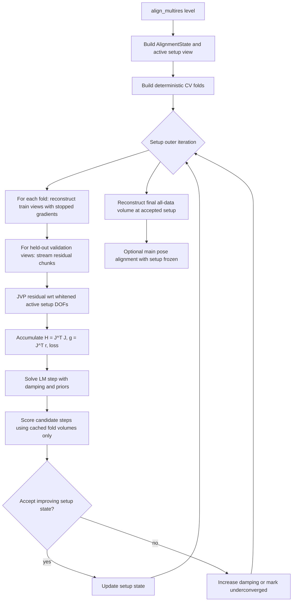

# Refactor Setup Geometry Into Cross-Validated Validation-LM Alignment

## Overview

Replace the current product setup-geometry optimizer with a memory-shaped,
cross-validated Gauss-Newton/Levenberg-Marquardt path.

The current branch took the right scientific direction, but the wrong execution
shape. It wraps a reconstruction-heavy bilevel CV scalar objective in Optax
L-BFGS line search. Even after chunking and finite-difference active gradients,
a 64³ one-DOF COR smoke run used about 5.5 GB GPU memory and grew to about
7.5 GB host RSS before being killed. That is not comparable to main's proven
per-view pose alignment, which keeps 128³ five-axis alignment around the
1-2 GB class by reconstructing once, freezing the volume, and streaming
fixed-volume residual/JVP work through small normal equations.

The replacement keeps the important identifiability property from the bilevel
plan: setup geometry is scored on validation projections that were not used to
reconstruct the volume being scored. It does not differentiate through
reconstruction in the product path. Instead, each setup outer iteration
reconstructs train-fold volumes with stopped gradients, then runs streamed
validation residual/JVP accumulation over those fixed fold volumes to solve a
small LM system in whitened active setup variables.

The result should be continuous, JAX-native, DRY with the existing active-state
and loss systems, and memory-shaped like the main per-view alignment path.

---

## Problem Frame

The origin requirements require one alignment-state system for pose and setup
geometry, `l2_otsu` as the default setup loss, and setup discovery that avoids
fixed-volume same-data self-consistency (see origin:
`docs/brainstorms/geometry-calibration-solver-requirements.md`).

The existing broad plan in
`docs/plans/2026-04-26-003-refactor-unified-bilevel-alignment-plan.md` correctly
introduced unified `AlignmentState`, active DOF views, pure geometry appliers,
and a `bilevel_cv` objective. The failure is the product optimizer shape:

- `_optimize_setup_geometry_bilevel_for_level` builds a
  `BilevelCVProjectionObjective`.
- Each objective value loops over CV folds.
- Each fold reconstructs a train-fold volume.
- Optax L-BFGS and its zoom line search repeatedly evaluate that objective.
- Central finite-difference gradients remove reverse-mode through the active
  setup vector, but still multiply reconstruction-heavy objective evaluations.

This is fundamentally unlike main's per-view path. Main reconstructs outside the
alignment optimizer, then uses streamed fixed-volume residual/JVP updates. Setup
geometry should follow the same memory discipline while preserving held-out
validation scoring.

---

## Requirements Trace

- R1. Keep setup geometry and pose inside one active-state alignment model.
- R2. Preserve `l2_otsu` as the default setup geometry outer loss through the
  existing loss adapter system.
- R3. Setup discovery must score validation projections not used to reconstruct
  the scored fold volume.
- R4. Product setup optimization must not use grid search, scalar candidate
  enumeration, or per-geometry solver islands.
- R5. Product setup optimization must not wrap train-fold reconstruction inside
  Optax L-BFGS line search.
- R6. Setup optimization must use the same memory principles as main's per-view
  pose alignment: streamed view chunks, explicit residual/JVP accumulation, and
  small normal equations for low-dimensional active setup DOFs.
- R7. GN/LM is the default optimizer for residual-compatible setup losses such
  as `l2_otsu`, with a clearly defined residual/JVP contract in whitened active
  coordinates.
- R8. Full reconstruction-differentiated bilevel objectives remain reference or
  future research paths, not the normal product path until implicit sensitivity
  is proven memory-safe.
- R9. Diagnostics must expose objective provenance, reconstruction sensitivity
  mode, folds, normal-equation conditioning, damping, step sizes, and memory
  budget indicators.
- R10. Laptop verification must prove the 64³ COR smoke no longer approaches
  the 5.5 GB/7.5 GB behavior and returns aligned inspection artifacts before
  larger scenario suites resume.

**Origin actors:** A1 TomoJAX user, A2 Alignment engine, A3 Planner/implementer,
A4 Documentation/demo generator.

**Origin flows:** F1 COR-only detector-centre alignment, F2 pose-only alignment,
F3 staged geometry plus pose alignment, F4 demo/evidence generation.

**Origin acceptance examples:** AE1 detector-centre uses `l2_otsu`, AE2 pose-only
behavior, AE3 staged active masks, AE4 public demo path, AE5 gauge diagnostics,
AE6 geometry-state reporting.

---

## Scope Boundaries

- Do not restore detector-centre candidate search as the product solver.
- Do not use fixed-volume same-data setup discovery as the default setup
  objective.
- Do not put train-fold reconstruction inside Optax L-BFGS, Optax line search,
  or any optimizer callback that can repeatedly reconstruct during step search.
- Do not require differentiating through reconstruction for the product setup
  path in this phase.
- Do not rewrite main's proven per-view pose alignment unless a shared helper can
  be extracted without changing behavior.
- Do not make full setup-plus-per-view-pose coupled solves the default workflow.

### Deferred to Follow-Up Work

- Production implicit reconstruction sensitivity for full hypergradient bilevel
  setup optimization.
- Structured coupled setup-plus-pose LM systems for expert active sets.
- Multi-device/sharded setup alignment.
- Non-residual setup losses that cannot expose a GN-compatible residual or IRLS
  approximation.

---

## Context & Research

### Relevant Code and Patterns

- `src/tomojax/align/pipeline.py` contains both the proven `align`/`align_multires`
  pose flow and the current `_optimize_setup_geometry_bilevel_for_level` path to
  replace.
- `src/tomojax/align/objectives.py` contains the current
  `BilevelCVProjectionObjective`, fold splitting, chunked projection scoring, and
  finite-difference active-gradient helpers. The fold split and scoring pieces
  are useful; the product value/gradient API is not.
- `src/tomojax/align/optimizers.py` contains `BoundTransform`,
  `ActiveParameterView` integration, and the current `run_active_lbfgs` wrapper.
  The bound/whitening pieces are useful; Optax L-BFGS is not the product setup
  optimizer.
- `src/tomojax/recon/fista_tv.py` is the memory-disciplined public reconstruction
  path: streamed view batches, explicit backprojection gradients, FISTA/TV
  controls, and established GPU behavior.
- `src/tomojax/recon/fista_tv_core.py` and `src/tomojax/align/recon_layer.py`
  contain the new differentiable reference reconstruction layer. Keep this
  reference path tiny and guarded; do not make it the default setup engine.
- `src/tomojax/align/losses.py` owns `L2OtsuLossSpec`, `LossAdapter`, per-view
  loss behavior, and GN weighting semantics. The validation residual path should
  consume this layer instead of inventing another loss.
- `src/tomojax/align/geometry_applier.py`, `src/tomojax/align/state.py`, and
  `src/tomojax/align/dof_specs.py` provide the unified state, setup/pose
  application, active DOF packing, native units, and whitening layer to keep.
- `scripts/generate_alignment_before_after_128.py` must keep using the public
  alignment path and record the new objective/optimizer provenance in manifests.

### Institutional Learnings

- `docs/plans/2026-04-26-002-fix-cor-heldout-calibration-plan.md` proved that
  COR needs held-out scoring; fixed-volume same-data setup discovery is not
  identifiable enough.
- `docs/plans/2026-04-26-003-refactor-unified-bilevel-alignment-plan.md` remains
  correct about unified state/objective architecture, but its product solver
  choice is too expensive.
- The oracle review `tomojax-gn-bilevel-setup` concluded that the product path
  should use stopped train-fold reconstruction plus streamed validation LM/GN,
  while demoting reconstruction-differentiated bilevel hypergradients to
  reference/future work.

### External References

- Existing origin and prior planning references in
  `docs/plans/2026-04-26-003-refactor-unified-bilevel-alignment-plan.md` remain
  relevant for joint reconstruction/alignment and geometry uncertainty framing.
- This plan's new design decision comes from local runtime evidence and the
  oracle review: the product path must separate reconstruction from optimizer
  step search to recover main-style memory behavior.

---

## Key Technical Decisions

| Decision | Rationale |
|---|---|
| Use cross-validated stopped-reconstruction LM as the product setup solver | It preserves held-out validation scoring without differentiating through reconstruction or putting reconstruction inside line search. |
| Keep `bilevel_cv` provenance, but report `recon_sensitivity="stopped"` | The objective is still train/reconstruct then held-out score; metadata must honestly state that the product gradient treats fold volumes as fixed during each LM step. |
| Form residuals in validation projection space | `l2_otsu` is residual-compatible and already supplies masks/weights through the loss adapter system. |
| Accumulate GN/LM normals chunk-by-chunk | Avoid global residual/Jacobian materialization and match main's memory discipline. |
| Solve in whitened active setup coordinates | Native pixels, radians, and tilt aliases need scale-invariant gradient, step, and condition diagnostics. |
| Keep fold reconstruction outside optimizer step search | Candidate scoring may reuse cached fold volumes, but must not reconstruct during a line search. |
| Demote Optax L-BFGS for setup discovery to reference/testing only | It is inappropriate for reconstruction-heavy product objectives and caused the memory blow-up. |
| Use public `fista_tv` or an equivalent no-gradient fold recon engine first | The fastest path to stability is to reuse the memory-disciplined recon path; differentiable recon core is not the product default. |
| Record normal-equation conditioning as first-class diagnostics | Ill-conditioning is common for setup geometry and should be visible rather than hidden as optimizer failure. |

---

## High-Level Technical Design

> *This illustrates the intended approach and is directional guidance for review,
> not implementation specification. The implementing agent should treat it as
> context, not code to reproduce.*



The core residual contract is:

```text
state(z) = active_view.unpack(frozen_state, z)
r_fold_view(z) = otsu_weight(target) * (project(effective_geometry(state(z)), x_train_fold) - target)
F(z) = 1/2 * sum ||r_fold_view(z)||^2 + priors
```

The product setup update differentiates only `r_fold_view(z)` with respect to
the active setup vector `z` while `x_train_fold` is fixed. Full
`dx_train_fold/dz` hypergradients remain reference/future work.

---

## Implementation Units

- U1. **Demote Reconstruction-Heavy Bilevel L-BFGS From Product Setup Path**

**Goal:** Remove the current memory-heavy optimizer shape from normal setup
geometry alignment while preserving tiny reference tests for future
hypergradient work.

**Requirements:** R4, R5, R8, R10

**Dependencies:** None

**Files:**
- Modify: `src/tomojax/align/pipeline.py`
- Modify: `src/tomojax/align/objectives.py`
- Modify: `src/tomojax/align/optimizers.py`
- Test: `tests/test_bilevel_setup_alignment.py`
- Test: `tests/test_alignment_objectives.py`

**Approach:**
- Stop selecting `run_active_lbfgs` around `BilevelCVProjectionObjective` from
  `_optimize_setup_geometry_bilevel_for_level`.
- Keep `BilevelCVProjectionObjective.evaluate`, fold splitting, and tiny
  finite-difference helpers only as reference utilities.
- Add an explicit guard/metadata path so any reference unrolled/finite-difference
  objective must opt in and stay tiny.
- Remove product diagnostics that imply central finite difference is the normal
  setup gradient mode.

**Patterns to follow:**
- Existing `align` path keeps reconstruction and alignment update conceptually
  separate.
- Existing `losses.py` remains the loss source of truth.

**Test scenarios:**
- Happy path: running normal setup geometry alignment with active `det_u_px`
  never calls `run_active_lbfgs`; monkeypatch it to fail and assert the product
  path still completes the setup stage.
- Error path: requesting the old reconstruction-heavy reference mode at a
  non-tiny size raises a clear error or requires an explicit debug flag.
- Integration: case manifests for product setup runs no longer report
  `fold_eval_mode=sequential_finite_difference_value_and_grad`.

**Verification:**
- Normal setup runs select the new validation-LM path.
- Existing reference objective unit tests still prove tiny finite-difference
  behavior without being reachable from default demos.

---

- U2. **Add Stopped Train-Fold Reconstruction Engine**

**Goal:** Reconstruct train-fold volumes for setup CV using main-style
low-memory reconstruction, with no active-parameter differentiation and no
optimizer-line-search coupling.

**Requirements:** R3, R6, R8, R10

**Dependencies:** U1

**Files:**
- Create: `src/tomojax/align/fold_recon.py`
- Modify: `src/tomojax/recon/fista_tv.py`
- Modify: `src/tomojax/align/pipeline.py`
- Test: `tests/test_fold_recon.py`
- Test: `tests/test_bilevel_setup_alignment.py`

**Approach:**
- Add a small fold reconstruction adapter that accepts `AlignmentState`,
  `BaseGeometryArrays`, train indices/masks, projections, and an init volume.
- Reuse public `fista_tv` where possible because it already has streamed
  gradients, explicit adjoints, `views_per_batch`, positivity, TV controls, and
  proven GPU behavior.
- Apply the effective setup geometry to train-fold inputs before reconstruction.
- Treat the returned train-fold volume as fixed for setup update computations.
- Record whether the volume was reconstructed from zero, previous level, previous
  stage, or current level init.

**Patterns to follow:**
- `src/tomojax/recon/fista_tv.py` for memory-shaped reconstruction.
- `src/tomojax/align/geometry_applier.py` for applying setup state without
  Python geometry mutation where feasible.

**Test scenarios:**
- Happy path: a tiny train fold reconstructs with `views_per_batch=1` and returns
  a finite volume plus metadata.
- Edge case: train masks with padded indices ignore padded views and do not
  change reconstruction results compared with the unpadded equivalent.
- Integration: a setup stage reconstructs one train-fold volume per fold per
  setup outer iteration, not during candidate step scoring.
- Regression: fold reconstruction metadata records `recon_sensitivity=stopped`.

**Verification:**
- Fold reconstruction uses the same memory knobs as public reconstruction and
  does not allocate AD tapes for setup parameters.

---

- U3. **Implement Streamed Validation Residual And Normal Accumulation**

**Goal:** Expose a residual/JVP contract for held-out validation projections and
accumulate GN/LM normal equations in whitened active setup coordinates.

**Requirements:** R2, R3, R6, R7, R9

**Dependencies:** U2

**Files:**
- Create: `src/tomojax/align/validation_residuals.py`
- Modify: `src/tomojax/align/losses.py`
- Modify: `src/tomojax/align/objectives.py`
- Test: `tests/test_validation_residuals.py`
- Test: `tests/test_alignment_objectives.py`

**Approach:**
- Define a validation residual function over a chunk of held-out views:
  active setup vector in, weighted projection residual out.
- Use `jax.linearize` or repeated `jax.jvp` to compute residual columns for the
  small active setup vector.
- Stream validation chunks with `lax.scan`, accumulating:
  - scalar validation loss;
  - gradient `g = J^T r`;
  - Hessian approximation `H = J^T J`;
  - count and conditioning diagnostics.
- Use `LossAdapter`/`L2OtsuLossSpec` to produce the same weighting semantics as
  main alignment. Do not add a private normalized-MSE setup objective.
- Prefer global validation indices and target-derived masks over fold-local
  adapter confusion.

**Technical design:** Directional residual/JVP contract:

```text
accumulate_validation_normals(
  frozen_state, active_view, z, fold_volume, val_idx, val_mask, loss_adapter
) -> loss, grad_z, hess_z, diagnostics
```

The implementation should avoid materializing all validation residuals at once;
only a chunk residual and its active-DOF JVP columns should exist at a time.

**Patterns to follow:**
- Chunk scheduling in `src/tomojax/align/pipeline.py`.
- `LossAdapter.per_view_loss` and GN-compatible weighting behavior in
  `src/tomojax/align/losses.py`.
- Main pose path's fixed-volume residual/JVP discipline.

**Test scenarios:**
- Happy path: for `l2_otsu`, the residual norm from one validation chunk matches
  the existing loss adapter's per-view loss for the same target and prediction.
- Happy path: validation normal accumulation returns finite `loss`, `g`, and `H`
  for active `det_u_px`.
- Edge case: `views_per_batch=1` and `views_per_batch=N` produce numerically
  close loss and normal equations on a tiny case.
- Regression: fixed-volume validation gradient from `J^T r` matches finite
  differences of validation loss for `det_u_px` on a tiny 6³ or 8³ case.
- Error path: a non-residual loss either raises a clear unsupported error for
  validation-LM or selects an explicitly named fallback mode.

**Verification:**
- The validation residual module can compute setup normal equations without
  reconstructing any train fold inside the residual/JVP path.

---

- U4. **Add Active-State Validation-LM Optimizer**

**Goal:** Solve low-dimensional setup updates from streamed validation normal
equations with damping, bounds, candidate scoring, and diagnostics.

**Requirements:** R6, R7, R9

**Dependencies:** U3

**Files:**
- Modify: `src/tomojax/align/optimizers.py`
- Modify: `src/tomojax/align/dof_specs.py`
- Test: `tests/test_align_optimizers.py`
- Test: `tests/test_validation_lm_optimizer.py`

**Approach:**
- Add an optimizer that consumes accumulated `loss`, `g`, and `H` in whitened
  active coordinates.
- Solve `(H + damping * diag(max(diag(H), eps)) + prior) dz = -g`.
- Apply bounds and gauge constraints through the existing active-state view.
- Score a small fixed set of candidate step scales, such as `1`, `1/2`, `1/4`,
  and `0`, using cached fold volumes only.
- Adapt damping based on acceptance and predicted/actual reduction.
- Record native-unit step per DOF, whitened step norm, gradient norm, singular
  values, condition number, damping, predicted reduction, actual reduction,
  candidate losses, and acceptance reason.

**Patterns to follow:**
- `BoundTransform` and `optimizer_step_stats` in
  `src/tomojax/align/optimizers.py`.
- Existing GN candidate acceptance philosophy in `src/tomojax/align/pipeline.py`,
  but without reconstruction-heavy line search.

**Test scenarios:**
- Happy path: a positive definite tiny normal system returns a finite accepted
  step that lowers a supplied validation scoring function.
- Edge case: singular or near-singular `H` uses damping/SVD fallback and records
  condition diagnostics rather than failing silently.
- Edge case: bounds clip a candidate update and diagnostics report the clipped
  native-unit step.
- Error path: non-finite loss/gradient rejects the step and preserves the input
  state.
- Integration: candidate scoring callback is invoked with cached fold volumes
  and never requests train reconstruction.

**Verification:**
- The optimizer can update any `ActiveParameterView` setup subset without knowing
  the physical DOF names.

---

- U5. **Replace Setup Pipeline With Cross-Validated Validation-LM**

**Goal:** Rewire `align_multires` setup geometry stages to reconstruct folds
outside optimizer steps, accumulate validation normals, solve LM, then
reconstruct the accepted all-data volume.

**Requirements:** R1, R2, R3, R5, R6, R7, R9, R10

**Dependencies:** U2, U3, U4

**Files:**
- Modify: `src/tomojax/align/pipeline.py`
- Modify: `src/tomojax/align/checkpoint.py`
- Modify: `src/tomojax/align/schedules.py`
- Test: `tests/test_bilevel_setup_alignment.py`
- Test: `tests/test_align_quick.py`
- Test: `tests/test_cli_entrypoints.py`

**Approach:**
- Rename or replace `_optimize_setup_geometry_bilevel_for_level` with a product
  setup function whose body is:
  - build base arrays, active setup view, and deterministic folds;
  - for each setup outer iteration, reconstruct train-fold volumes with stopped
    gradients;
  - accumulate validation `H`, `g`, and loss over held-out folds;
  - solve and candidate-score LM using the cached fixed fold volumes;
  - accept/reject and update setup state;
  - reconstruct final all-data volume at the accepted setup.
- Keep `objective_kind="bilevel_cv"` or a similarly explicit cross-validated
  provenance, but record `optimizer_kind="validation_lm"` and
  `recon_sensitivity="stopped"`.
- Keep pose-only and pose-polish behavior on the main fixed-volume path.
- Support deterministic fold cycling or `folds_per_outer` if full folds are too
  expensive at fine levels, while preserving validation-set separation.

**Patterns to follow:**
- `align_multires` level orchestration and checkpoint state shape.
- Existing geometry diagnostics summarization in `src/tomojax/align/geometry_blocks.py`
  where still relevant.

**Test scenarios:**
- Happy path: 32³ or smaller active `det_u_px` setup stage reduces held-out
  validation loss and moves the estimate with the correct sign.
- Happy path: detector roll setup stage reduces validation loss and reports
  `optimizer_kind=validation_lm`.
- Edge case: `outer_iters=0` or no active setup DOFs bypasses setup LM and
  preserves pose-only behavior.
- Integration: staged setup-plus-pose schedule runs setup LM first, then main
  pose alignment with setup frozen.
- Regression: setup stage metadata records `l2_otsu`, fold counts,
  `views_per_batch`, `validation_projection_chunked=true`,
  `train_reconstruction_gradient=false`, and no finite-difference active
  gradient mode.
- Error path: gauge-coupled active sets still reject before optimization or
  require an explicit gauge policy.

**Verification:**
- `align_multires` no longer calls product L-BFGS for setup discovery.
- Setup stages return aligned geometry state, final all-data volume, and
  diagnostics suitable for manifests.

---

- U6. **Fix Setup Geometry Semantics Exposed By The New Solver**

**Goal:** Correct latent setup-state/applier issues before using the new solver
as evidence for detector roll, axis direction, and laminography tilt.

**Requirements:** R1, R7, R9

**Dependencies:** U5

**Files:**
- Modify: `src/tomojax/align/state.py`
- Modify: `src/tomojax/align/dof_specs.py`
- Modify: `src/tomojax/align/geometry_applier.py`
- Modify: `src/tomojax/align/geometry_blocks.py`
- Test: `tests/test_alignment_state.py`
- Test: `tests/test_geometry_applier.py`
- Test: `tests/test_bilevel_setup_alignment.py`

**Approach:**
- Verify whether `tilt_deg` is meant to alias `axis_rot_x_deg`, a laminography
  geometry field, or another setup transform. Wire it through the actual
  geometry applier rather than storing an unused state leaf.
- Ensure `AlignmentState` initialization from existing geometry state carries all
  active setup variables, including tilt aliases.
- Confirm `apply_alignment_state` does not unintentionally discard
  geometry-family-specific nominal pose transforms when constructing effective
  pose stacks.
- Keep detector centre offsets in native detector pixels and convert by level
  only in the geometry applier.

**Patterns to follow:**
- Existing detector-grid scale invariants in `src/tomojax/align/geometry_applier.py`.
- Requirements wording for detector/ray-grid centre and setup-vs-pose semantics.

**Test scenarios:**
- Happy path: changing `det_u_px` shifts the level detector grid by `native_px / factor`.
- Happy path: changing `detector_roll_deg` rotates detector-plane coordinates
  without changing object-frame pose variables.
- Happy path: changing `tilt_deg` changes effective geometry in the same way as
  its declared alias/semantic target.
- Regression: `apply_alignment_state` preserves nominal geometry-family behavior
  for parallel CT and laminography cases.
- Error path: unsupported aliases fail during active DOF resolution, not midway
  through optimization.

**Verification:**
- Every setup DOF used in demos has observable geometry effect and metadata
  reports the native physical unit.

---

- U7. **Update Demo Generator And Metadata For Validation-LM Evidence**

**Goal:** Make generated artifacts show the new product solver path clearly and
prevent stale L-BFGS/bilevel-hypergradient metadata from polluting evidence.

**Requirements:** R2, R9, R10

**Dependencies:** U5, U6

**Files:**
- Modify: `scripts/generate_alignment_before_after_128.py`
- Modify: `src/tomojax/align/diagnostics.py`
- Test: `tests/test_geometry_block_taxonomy_generator.py`
- Test: `tests/test_bilevel_setup_alignment.py`

**Approach:**
- Record objective provenance fields:
  - `objective_kind`;
  - `optimizer_kind`;
  - `outer_loss_kind`;
  - `recon_sensitivity`;
  - `inner_recon_algo`;
  - fold counts and folds used;
  - normal-equation diagnostics;
  - candidate losses;
  - memory/chunking metadata.
- Ensure `summary.csv`, `case_manifest.json`, and `alignment_metadata.json`
  distinguish `validation_lm` product setup runs from reference unrolled or
  implicit bilevel experiments.
- Keep rich inspection panels unchanged except for metadata text/sidecar fields.
- Run one scenario per process during memory debugging to avoid conflating JAX
  compile/cache growth with solver memory.

**Patterns to follow:**
- Existing rich visualization and manifest fields in
  `scripts/generate_alignment_before_after_128.py`.
- Existing geometry diagnostics summarization where still accurate.

**Test scenarios:**
- Happy path: a generated COR case manifest reports `optimizer_kind=validation_lm`,
  `outer_loss_kind=l2_otsu`, and `recon_sensitivity=stopped`.
- Regression: `summary.csv` contains validation-LM diagnostics and no stale
  `central_finite_difference` product fields.
- Integration: `inspection_panel.png`, `loss_panel.png`, and metadata sidecars
  are still produced for a tiny setup run.

**Verification:**
- Demo artifacts make it obvious that panels came from the same public
  validation-LM setup path a user can run.

---

- U8. **Laptop Smoke And Memory Verification**

**Goal:** Prove the new product path solves the immediate problem on the Linux
laptop before any 128³ suite is restarted.

**Requirements:** R6, R9, R10

**Dependencies:** U5, U7

**Files:**
- Modify: `scripts/generate_alignment_before_after_128.py`
- Test: `tests/test_bilevel_setup_alignment.py`

**Approach:**
- First run a single boring GPU smoke:
  - 32³, 32 views;
  - active `det_u_px`;
  - two folds;
  - one setup outer iteration;
  - two or three reconstruction iterations;
  - `views_per_batch=1`.
- Then run the target 64³ smoke:
  - 64³, 64 views;
  - active `det_u_px`;
  - levels `4 2 1`;
  - `outer_iters=3`;
  - `recon_iters=3`;
  - `views_per_batch=1`;
  - `l2_otsu`;
  - one scenario per process while debugging.
- Only after COR memory and alignment quality are proven, run detector roll and
  laminography tilt smoke scenarios.
- Keep the 5-minute monitor active until the laptop returns aligned examples and
  synced artifacts.

**Patterns to follow:**
- Existing laptop runner scripts and sync directories, but update status text to
  require `validation_lm` and stopped reconstruction provenance.

**Test scenarios:**
- Workflow: 32³ COR smoke returns finite estimate, validation loss reduction,
  and no OOM/HLO footprint near previous failures.
- Workflow: 64³ COR smoke peak memory is materially below the previous 5.5 GB
  GPU / 7.5 GB RSS behavior and produces inspection panels.
- Workflow: detector roll smoke uses validation-LM, reduces validation loss, and
  produces artifacts.
- Workflow: laminography tilt smoke first verifies that the active tilt DOF
  affects geometry, then runs validation-LM if semantics are correct.

**Verification:**
- Laptop results are synced locally with `summary.csv`, manifests, diagnostics,
  and inspection panels.
- The heartbeat automation is deleted only after the memory fix and aligned
  examples are genuinely returned.

---

## System-Wide Impact

- **Interaction graph:** `align_multires` becomes the orchestrator for
  validation-LM setup stages, no-gradient fold reconstruction, validation normal
  accumulation, final all-data reconstruction, and optional main pose alignment.
- **Error propagation:** unsupported losses, singular normal equations, gauge
  conflicts, and invalid setup aliases should fail with explicit diagnostics
  before expensive laptop runs.
- **State lifecycle risks:** fold volumes are fixed only within a candidate
  setup step. They must be recomputed after accepted setup updates and never
  silently reused across changed setup states.
- **API surface parity:** CLI presets, demo scripts, manifests, and checkpoint
  metadata must all report the same product solver path.
- **Integration coverage:** unit tests prove residual/JVP math; laptop smoke
  proves memory shape and practical artifacts.
- **Unchanged invariants:** pose-only alignment keeps the main fixed-volume
  per-view semantics; `l2_otsu` remains the loss system source of truth; native
  detector pixels remain native until converted by level geometry application.

---

## Risks & Dependencies

| Risk | Likelihood | Impact | Mitigation |
|---|---:|---:|---|
| Stopped train-fold reconstruction gives biased setup steps on large geometry errors | Medium | Medium | Use multiresolution, small LM step ladders, fold recomputation after each accepted step, and projection-domain initializers only as seeds/diagnostics. |
| Validation residual JVP through projector geometry is still memory-heavy | Medium | High | Stream one validation chunk at a time, vmap only over active DOF columns, and test `views_per_batch=1` vs larger batches. |
| `l2_otsu` residual weighting does not exactly match scalar loss semantics | Medium | Medium | Add residual-norm-vs-loss-adapter tests and document any IRLS-style approximation. |
| Fold reconstruction via public `fista_tv` requires Python geometry adapters | Medium | Low | Accept initially for memory stability, then move to pure array adapters once behavior is proven. |
| Tilt/axis setup DOFs are under-wired | High | High | Make semantic geometry-applier tests a prerequisite before using those scenarios as evidence. |
| LM normal equations are ill-conditioned for coupled active sets | High | Medium | Start with safe low-dimensional stages, record singular values, and require priors/gauge policy for expert coupling. |
| Scenario suites hide JAX cache growth by running many cases in one process | Medium | Medium | Run one scenario per process while debugging and record process/GPU memory diagnostics. |

---

## Documentation / Operational Notes

- Update `docs/brainstorms/geometry-calibration-solver-requirements.md` only if
  terminology needs to distinguish "full reconstruction-differentiated bilevel"
  from "cross-validated stopped-reconstruction setup LM".
- Update CLI/docs wording so setup discovery provenance is described as
  cross-validated validation-LM with stopped train-fold reconstruction, not as a
  generic L-BFGS bilevel hypergradient.
- Record laptop run commands, peak memory, commit/working-tree status, and synced
  artifact paths in the run manifest.

---

## Alternative Approaches Considered

- **Keep Optax L-BFGS and tune batching:** rejected because the objective still
  reconstructs train folds inside every value, gradient, and line-search
  evaluation. Chunking does not change the optimizer/objective shape.
- **Use central finite differences over the full bilevel scalar objective:**
  rejected as product default because it avoids reverse-mode but still multiplies
  train-fold reconstruction calls.
- **Use fixed-volume same-data GN for setup discovery:** rejected because the
  reconstructed volume can be self-consistent under wrong setup geometry.
- **Implement full implicit hypergradient before product setup works:** deferred
  because it is mathematically attractive but should not block the memory-shaped
  validation-LM solver.
- **Restore candidate/grid search for COR:** rejected because the product
  direction is continuous active-state JAX optimization, not per-geometry search
  islands.

---

## Success Metrics

- A 64³ single-COR laptop smoke returns aligned artifacts without approaching the
  previous 5.5 GB GPU / 7.5 GB RSS behavior.
- The target 64³ COR smoke reduces held-out validation loss and moves `det_u_px`
  with the correct sign.
- Product setup metadata reports `optimizer_kind=validation_lm`,
  `outer_loss_kind=l2_otsu`, and `recon_sensitivity=stopped`.
- Product setup tests prove no call to `run_active_lbfgs` is made for normal
  setup discovery.
- Detector roll and laminography tilt smokes run only after their geometry DOFs
  have semantic tests showing real geometry effect.

---

## Sources & References

- Origin document: `docs/brainstorms/geometry-calibration-solver-requirements.md`
- Prior plan: `docs/plans/2026-04-26-003-refactor-unified-bilevel-alignment-plan.md`
- Related plan: `docs/plans/2026-04-26-002-fix-cor-heldout-calibration-plan.md`
- Main implementation files: `src/tomojax/align/pipeline.py`,
  `src/tomojax/align/objectives.py`, `src/tomojax/align/optimizers.py`,
  `src/tomojax/recon/fista_tv.py`, `src/tomojax/align/losses.py`
- Oracle advisory session: `tomojax-gn-bilevel-setup`
