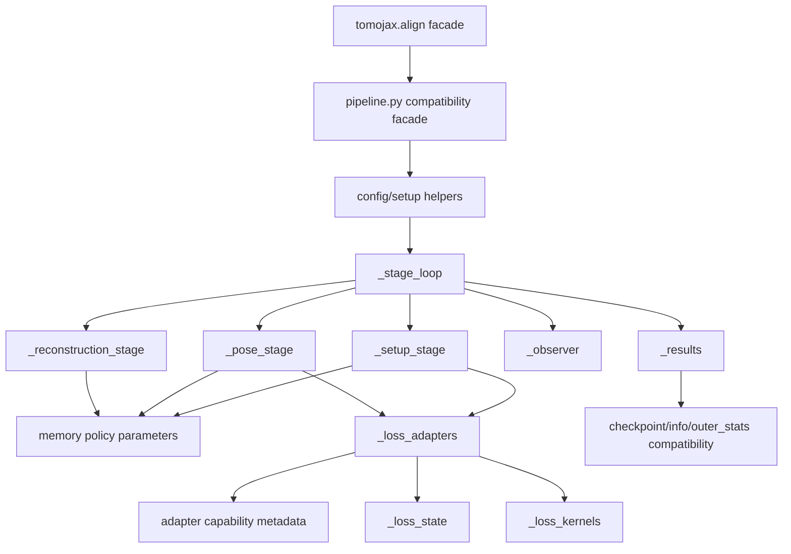
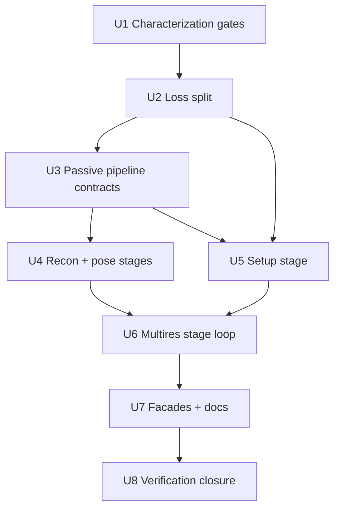
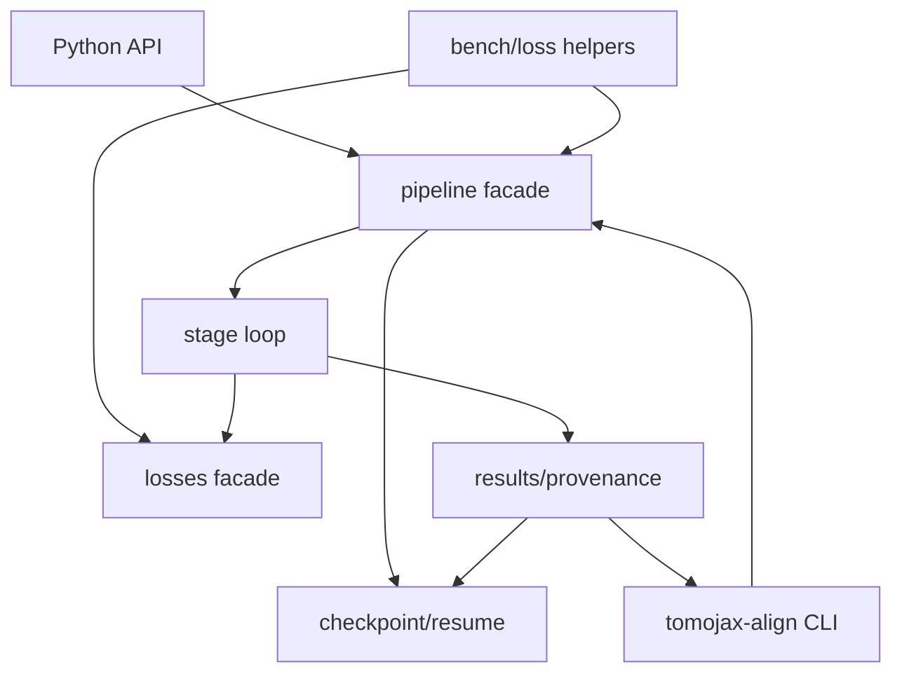

# refactor: Decompose alignment pipeline and losses

## Overview

This plan decomposes the production alignment stack in one aggressive internal
refactor. The target is to shrink `src/tomojax/align/pipeline.py` and
`src/tomojax/align/losses.py` from monoliths into compatibility facades backed by
private, responsibility-owned modules.

The refactor may temporarily break imports or tests during implementation, but the
finished state must preserve public behavior and production semantics except for
one intentional behavior tightening: invalid setup-stage loss combinations now
fail fast across Python and CLI entry points before fold reconstruction starts.

- `tomojax.align` keeps exporting `AlignConfig`, `align`, and `align_multires`.
- `src/tomojax/align/pipeline.py` remains an import-compatible facade for current
  callers and tests.
- `src/tomojax/align/losses.py` remains an import-compatible facade for current
  loss specs, parsing, adapters, and transitional private helper imports.
- Setup geometry calibration stays inside the unified alignment state, loss, and
  multiresolution system.
- Setup stages continue using stopped train-fold reconstruction plus streamed
  validation-LM normal equations through `LossAdapter`.
- Existing stats, checkpoint, and result payload keys remain compatible unless
  explicitly added to. Compatibility means preserving observable import and
  runtime behavior; stable `__module__` metadata for moved public dataclasses is
  not a first-pass requirement unless an existing test or caller proves it matters.

This is not a package split. The goal is a modular monolith with real internal
contracts, not more directory structure.

---

## Problem Frame

`src/tomojax/align/pipeline.py` is about 3,015 lines and currently owns too many
production responsibilities: public result contracts, `AlignConfig`, setup/run
preparation, reconstruction stepping, single-level pose optimization,
setup-geometry validation-LM, multiresolution stage orchestration, observer
handling, checkpoint payloads, stat enrichment, and final result assembly.

`src/tomojax/align/losses.py` is about 1,128 lines and mixes loss spec classes,
aliases, parsing, loss scheduling, target-derived precompute state, pure loss
kernels, adapter construction, and Gauss-Newton capability logic.

That shape makes the codebase vulnerable to AI-generated debt: new behavior has no
obvious owner, so future changes are likely to keep appending logic to the two
largest files. The refactor should make ownership clear enough that later work can
land in the right module without re-reading the entire alignment system.

The plan is grounded in `docs/ideation/2026-04-27-alignment-stack-decomposition-ideation.md`
and must preserve the unified alignment requirements from
`docs/brainstorms/geometry-calibration-solver-requirements.md`.

---

## Requirements Trace

- R1. Preserve the public alignment facade: `tomojax.align.AlignConfig`,
  `tomojax.align.align`, and `tomojax.align.align_multires`.
- R2. Preserve module-level compatibility for current callers of
  `tomojax.align.pipeline` and `tomojax.align.losses` during this refactor.
- R3. Split loss ownership into a small number of earned private modules:
  specs/parsing/schedules, kernels, adapters/registry/capabilities, and optional
  precompute state if the moved block is large enough to stand alone.
- R4. Keep setup geometry calibration inside unified alignment; do not introduce a
  separate calibration solver, separate loss path, or separate command path.
- R5. Preserve stopped train-fold validation-LM setup semantics:
  `objective_kind="bilevel_cv"`, `optimizer_kind="validation_lm"`,
  `recon_sensitivity="stopped"`,
  `fold_eval_mode="stopped_train_recon_validation_lm"`, and
  `active_gradient_mode="validation_residual_jvp"`.
- R6. Preserve memory contracts: `views_per_batch`, fold chunking, validation
  chunking, checkpointing, gather dtype, and avoidance of materialized fold-wide
  residual/Jacobian stacks.
- R7. Preserve pose semantics: per-view `alpha,beta,phi,dx,dz` remain object-frame,
  right-multiplied residual pose parameters.
- R8. Preserve setup geometry semantics: setup DOFs remain native/full-resolution
  values in state, checkpoints, results, and manifests; level scaling belongs only
  in geometry application.
- R9. Preserve observer, checkpoint, resume, and `outer_stats` compatibility,
  including stage counters and partial-resume behavior.
- R10. Add or refresh fast characterization tests before and during the split so
  lightweight checks can guide the aggressive refactor without running the heavy
  suite.
- R11. Add fail-fast validation for setup stages whose scheduled loss lacks setup
  validation-LM capability, not merely pose-GN weighting support.
- R12. Keep first-pass changes private. Do not create public internal APIs or
  subpackages unless a compatibility facade requires the symbol.

---

## Scope Boundaries

- No standalone `tomojax.align.calibration` runtime solver namespace.
- No new public Python or CLI behavior except fail-fast errors for invalid
  setup/loss combinations.
- No formula changes to loss kernels.
- No replacement of stopped validation-LM with reconstruction-heavy bilevel
  hypergradients.
- No package-level split of `src/tomojax/align/` into subpackages in this pass.
- No broad CLI orchestration cleanup outside what is needed to preserve imports and
  result payloads.
- No cleanup of `scripts/generate_alignment_before_after_128.py`; it remains out
  of scope for this production-code refactor.
- No heavy test-suite requirement during implementation; the user will run heavier
  validation later.

### Deferred to Follow-Up Work

- Remove transitional private re-exports from `pipeline.py` and `losses.py` after
  downstream tests and internal callers have moved to the new module paths.
- Decide whether the flat private module layout should later become
  `align/losses/` or `align/stages/` subpackages.
- Refresh user-facing alignment docs after the refactor settles and behavior is
  production-verified.
- Add or update a durable ownership note under `docs/solutions/` after the code
  structure has settled.
- Remove or simplify any new private module that does not receive an existing
  cohesive block from `pipeline.py` or `losses.py` and does not have a concrete
  caller in this refactor.
- Retire transitional compatibility re-exports in a later cleanup once current
  in-repo importers have moved.
- Add import-boundary linting if the new internal ownership model proves stable.

---

## Context & Research

### Relevant Code and Patterns

- `src/tomojax/align/__init__.py` currently exports only `AlignConfig`, `align`,
  and `align_multires`; `tests/test_public_facades.py` locks that facade.
- `src/tomojax/align/state.py` already owns `SetupGeometryState`, `PoseState`, and
  `AlignmentState`.
- `src/tomojax/align/dof_specs.py` already owns DOF specs, whitening, active views,
  and optimizer-step stats.
- `src/tomojax/align/schedules.py` already owns stage/schedule resolution and
  gauge-aware active/frozen DOF policy.
- `src/tomojax/align/objectives.py` already owns `ObjectiveProvenance`,
  `FixedVolumeProjectionObjective`, and `project_and_score_stack`.
- `src/tomojax/align/fold_recon.py` and
  `src/tomojax/align/validation_residuals.py` already own key pieces of the
  stopped validation-LM memory contract.
- `src/tomojax/align/geometry_applier.py` already owns setup-state application to
  geometry and detector grids.
- `src/tomojax/align/checkpoint.py` owns checkpoint serialization and resume-state
  loading.
- `src/tomojax/cli/align.py`, `bench/fitness.py`, and several tests import
  directly from `tomojax.align.pipeline` and `tomojax.align.losses`, so those
  module paths must remain compatibility surfaces during this refactor.

### Institutional Learnings

- `docs/solutions/architecture-patterns/reuse-align-multires-for-geometry-calibration-2026-04-25.md`
  is the canonical production lesson: setup geometry calibration must reuse the
  unified alignment system with stopped train-fold reconstruction and streamed
  validation-LM.
- `docs/brainstorms/geometry-calibration-solver-requirements.md` requires one DOF
  namespace, scoped internal state, one configured projection loss, one
  multiresolution loop, gauge diagnostics, honest provenance, and no private
  geometry-only objective.
- `docs/ideation/2026-04-27-alignment-stack-decomposition-ideation.md` recommends
  an in-place modular-monolith refactor rather than a package split.
- Earlier bilevel/L-BFGS or fixed-volume same-data setup-calibration plans are
  useful as failure analysis, but not as product architecture.

### External References

- The prior ideation pass already incorporated JAX state/pytree guidance,
  scientific workflow decomposition patterns, ML technical-debt literature, and
  branch-by-abstraction guidance. No fresh external research is needed for this
  plan because local architecture and institutional docs are current and specific.

---

## Key Technical Decisions

- Preserve `pipeline.py` and `losses.py` as compatibility facades while moving
  canonical definitions into private modules. This reduces downstream churn while
  still achieving the internal split.
- Split `losses.py` first. It is bounded, capability-oriented, and lower blast
  radius than the full stage orchestration split.
- Preserve mutable `LossState` behavior in the first pass. Immutable precompute
  payloads are attractive later, but changing mutability while moving modules
  would mix decomposition with semantic redesign.
- Fail fast when a setup stage resolves to a scheduled loss without setup
  validation-LM capability.
  Silent fallback to `l2_otsu` would hide user intent and provenance.
- Keep `_setup_stage.py` as an orchestrator over `fold_recon.py` and
  `validation_residuals.py`; do not duplicate memory-sensitive residual/JVP math.
- Preserve existing stat key names verbatim at public boundaries. Structured
  result builders may exist internally, but serialized `info`, `outer_stats`,
  checkpoints, and manifest-facing dictionaries should remain compatible.
- Keep transitional private helper re-exports from facades for this aggressive
  pass. Removing those can happen in a later cleanup once tests target the new
  modules directly.
- Keep `AlignConfig.__post_init__` behavior and schedule resolution semantics
  backward compatible, including legacy `geometry_dofs` behavior.
- Prefer explicit function parameters over generic context/spec objects. A new
  private module is justified only when it receives an existing cohesive block from
  `pipeline.py` or `losses.py`, has a named ownership invariant, and simplifies at
  least one concrete caller boundary in this refactor.
- Treat edits outside `pipeline.py` and `losses.py` as import-only or
  behavior-preserving retargeting unless a focused characterization test proves a
  semantic adjustment is required. Semantic changes outside the two monoliths need
  a follow-up plan.

### Compatibility Matrix

| Surface | Required final behavior |
|---|---|
| `tomojax.align` | Exports `AlignConfig`, `align`, `align_multires` only unless a deliberate public API change happens later. |
| `tomojax.align.pipeline` | Re-exports the compatibility symbols in the snapshot below. Facade compatibility is about imports and object identity where callers use the symbol, not about keeping implementation logic in the facade. |
| `tomojax.align.losses` | Re-exports the compatibility symbols in the snapshot below. Transitional private `_loss_*` re-exports remain only for current tests and can be retired later. |
| `src/tomojax/cli/align.py` | Continues importing the public alignment and checkpoint surfaces without behavior changes. |
| `src/tomojax/cli/loss_bench.py` | Continues resolving loss specs and alignment entry points without module-path churn. |
| `bench/fitness.py` | Continues resolving loss specs and alignment entry points without module-path churn. |

### Compatibility Symbol Snapshot

U1 should turn this snapshot into tests before module movement. The list is based
on current in-repo imports and known test-visible helpers; implementation may add
symbols if inventory finds additional current imports, but should not silently drop
any listed name.

| Module | Symbols to preserve during this pass | Current importers |
|---|---|---|
| `tomojax.align` | `AlignConfig`, `align`, `align_multires` | `src/tomojax/align/__init__.py`, `tests/test_public_facades.py` |
| `tomojax.align.pipeline` | `AlignConfig`, `AlignResumeState`, `AlignMultiresResumeState`, `align`, `align_multires`, `_normalize_observer_action`, `adapt_legacy_observer`, `_should_prefer_gn_candidate`, `_select_gn_candidate`, `_is_expected_align_eval_failure` | `src/tomojax/cli/align.py`, `src/tomojax/cli/loss_bench.py`, `bench/fitness.py`, `scripts/generate_alignment_before_after_128.py`, `tests/test_align_checkpoint.py`, `tests/test_align_gn_candidates.py`, `tests/test_align_quick.py`, `tests/test_align_loss_logic.py`, `tests/test_align_chunking.py`, `tests/test_integration.py` |
| `tomojax.align.losses` | `AlignmentLossConfig`, `LossState`, `LossAdapter`, `L2OtsuLossSpec`, `parse_loss_spec`, `parse_loss_schedule`, `resolve_loss_for_level`, `validate_loss_schedule_levels`, `loss_spec_name`, `loss_is_within_relative_tolerance`, `build_loss`, `build_loss_adapter`, `_loss_cauchy`, `_loss_chamfer_edge`, `_loss_l2_otsu_soft`, `_loss_mi_kde`, `_loss_renyi_mi`, `_loss_ssim_otsu`, `_loss_tversky`, `_loss_welsch` | `src/tomojax/cli/align.py`, `src/tomojax/cli/loss_bench.py`, `src/tomojax/align/objectives.py`, `src/tomojax/align/initializers.py`, `src/tomojax/align/validation_residuals.py`, `bench/fitness.py`, `tests/test_align_loss_logic.py`, `tests/test_align_quick.py`, `tests/test_cli_config.py`, `tests/test_detector_center_objective.py`, `tests/test_bilevel_setup_alignment.py` |

---

## Open Questions

### Resolved During Planning

- Should `pipeline.py` and `losses.py` remain compatibility surfaces?
  Resolution: yes, for at least this refactor.
- Should setup stages with scheduled losses that lack setup validation-LM
  capability fail fast or override to `l2_otsu`?
  Resolution: fail fast during setup-stage validation before fold reconstruction.
- Should `_setup_stage.py` own fold reconstruction and validation residual math?
  Resolution: no. It orchestrates `fold_recon.py` and `validation_residuals.py`.
- Should `_results.py` normalize result payloads into a new schema?
  Resolution: no public schema replacement in this pass. Preserve current keys and
  add structured internals only when they serialize back to compatible payloads.
- Should setup stages support observer/checkpoint/resume at every internal setup
  iteration?
  Resolution: not as a first-pass requirement. The refactor preserves current
  setup-stage boundary behavior unless implementation explicitly introduces a
  tested `SetupStageProgress` callback/yield contract. Mid-setup observer,
  checkpoint, and resume support is deferred rather than implied.
- Are `_run_spec.py`, `_memory_plan.py`, and `_stage_loop.py` mandatory modules?
  Resolution: no. They are candidate ownership modules only if implementation
  proves they simplify concrete caller boundaries. Mechanical extraction is allowed
  to keep these concerns adjacent temporarily.

### Deferred to Implementation

- Exact helper names inside each private module: implementation can adjust names as
  long as module ownership and compatibility surfaces hold.
- Whether `_pose_stage.py` should initially wrap all of `align()` or only extract
  optimizer strategy helpers: decide while moving code and preserving tests.
- How small `pipeline.py` should become in the first pass: target removing
  canonical implementation logic, but keep explicit compatibility re-export blocks
  and stop short of creating circular imports or hiding lifecycle clarity.
- Whether some tests should be retargeted from facade-private helpers to the new
  private modules: do it opportunistically, but do not block the refactor on a full
  test import cleanup.
- Whether moved public dataclasses should preserve `__module__`: not required for
  the first pass unless a current caller or test depends on it. Import identity and
  runtime behavior are the required compatibility surfaces.

---

## Output Structure

Expected private module layout, split into required first-pass owners and
candidate owners that must earn their existence:

```text
src/tomojax/align/
  # Required if the corresponding existing block moves:
  _loss_adapters.py
  _loss_kernels.py
  _loss_specs.py
  _observer.py
  _pose_stage.py
  _reconstruction_stage.py
  _results.py
  _setup_stage.py
  _stage_loop.py

  # Candidate modules; create only if they remove concrete duplication:
  _config.py
  _loss_state.py
  _memory_plan.py
  _run_spec.py
  losses.py
  pipeline.py
```

Do not create a private module simply because the plan names it. A module should
receive an existing cohesive block from `pipeline.py` or `losses.py`, have a named
ownership invariant, and have at least one concrete caller in this refactor. If a
candidate module fails that test, keep the concern local to the stage or facade and
defer the split.

---

## High-Level Technical Design

> *This illustrates the intended approach and is directional guidance for review,
> not implementation specification. The implementing agent should treat it as
> context, not code to reproduce.*



### Multires Stage State Transitions

| State/event | Required transition |
|---|---|
| Level start | Build level-specific run spec, level-scaled geometry application, resolved loss adapter, memory plan, and stage list. |
| Setup stage start | Validate adapter supports setup validation-LM before fold reconstruction; reject unsupported scheduled losses with level/stage/loss in the message. |
| Setup stage complete | Persist native/full-resolution setup state, setup diagnostics, objective provenance, fold metadata, and stage stats. |
| Pose stage start | Apply setup state to geometry once, preserve object-frame right-multiplied pose semantics, and run fixed-volume pose optimization. |
| Pose stage partial resume | Use `completed_outer_iters_in_stage`, preserved loss history, preserved outer stats, `L`, and optional `motion_coeffs` without replaying completed iterations. |
| Observer `advance_level` | Emit/checkpoint enriched partial-level stats, stop remaining stages for the level, and continue to the next level. This is required for pose-stage boundaries; setup-stage support requires an explicit progress callback contract before implementation claims it. |
| Observer `stop_run` | Emit/checkpoint enriched partial-run state and return current state without pretending the run completed. This is required for single-level `align()` and pose-stage boundaries; setup-stage mid-iteration support is deferred unless explicitly implemented and tested. |
| Level complete | Carry setup state, pose params, loss history, stats, and reconstruction state forward to the next level. |
| Single-level run complete | Emit compatible `AlignInfo` through `align()`. |
| Multires run complete | Emit final run-complete checkpoint with compatible payload shape and final `AlignMultiresInfo`. |

### Resume Boundary Matrix

| Input condition | Expected outcome |
|---|---|
| `run_complete=True` | Return compatible completed state without rerunning levels or stages. |
| Completed setup stage, pose pending | Skip setup, preserve setup diagnostics and native setup state, run pending pose stage. |
| Mid-pose stage with `completed_outer_iters_in_stage>0` | Resume remaining pose iterations without duplicating preserved loss history or `outer_stats`. |
| Setup stage marked incomplete | Either rerun setup from the stage boundary with preserved prior stages or resume through an explicitly implemented `SetupStageProgress` contract; do not silently claim partial setup resume without tests. |
| Mismatched stage index/name metadata | Reject checkpoint as incompatible before mutating runtime state. |
| Legacy checkpoint missing staged metadata | Reject clearly or route through an explicit compatibility adapter; do not infer ambiguous stage state. |

---

## Implementation Units



- U1. **Add characterization and compatibility gates**

**Goal:** Lock the behavior that the aggressive refactor must preserve before
moving the largest code paths.

**Requirements:** R1, R2, R5, R6, R7, R8, R9, R10, R11

**Dependencies:** None

**Files:**
- Modify: `tests/test_public_facades.py`
- Modify: `tests/test_align_loss_logic.py`
- Modify: `tests/test_alignment_schedules.py`
- Create: `tests/test_align_contracts.py`

**Approach:**
- Add a small contract-oriented test file for facade exports, direct module imports,
  and the compatibility symbol snapshot.
- Add or strengthen loss tests around aliases, loss schedule parsing, global
  `view_indices` precompute indexing, pose/setup capability exposure, `l2_otsu` target
  masks, and unsupported-loss behavior.
- Add the missing fail-fast case: a setup schedule at a level whose resolved loss
  lacks setup validation-LM capability should fail before fold reconstruction
  begins.
- Keep test inputs CPU-friendly and avoid heavy reconstruction quality assertions.

**Execution note:** Characterization-first. These tests should be added before the
module movement they protect.

**Patterns to follow:**
- `tests/test_public_facades.py`
- `tests/test_align_loss_logic.py`
- `tests/test_align_quick.py`
- `tests/test_bilevel_setup_alignment.py`
- `tests/README.md`

**Test scenarios:**
- Happy path: importing `AlignConfig`, `align`, and `align_multires` from
  `tomojax.align` and `tomojax.align.pipeline` yields callable/current objects.
- Happy path: importing current loss specs, parsing helpers, `LossState`,
  `LossAdapter`, `build_loss_adapter`, and existing test-visible `_loss_*` helpers
  from `tomojax.align.losses` continues to work.
- Happy path: a tiny `l2_otsu` adapter built from targets preserves global
  precompute indexing when chunk-local indices differ from global view indices.
- Error path: setup schedule plus level loss schedule resolving to a loss without
  setup validation-LM capability fails before fold reconstruction and names the
  level, stage, and loss.
- Integration: one tiny `align()` smoke path and one tiny `align_multires()` smoke
  path preserve return tuple shape and basic info keys.

**Verification:**
- Focused contract tests fail on current unsupported behavior where intended and
  pass after the relevant refactor units land.
- Test coverage protects observable compatibility rather than incidental helper
  bodies.

---

- U2. **Split loss ownership behind `losses.py` facade**

**Goal:** Move canonical loss definitions and construction into concern-owned
private modules while preserving `tomojax.align.losses` compatibility.

**Requirements:** R2, R3, R4, R5, R10, R11, R12

**Dependencies:** U1

**Files:**
- Create: `src/tomojax/align/_loss_specs.py`
- Create: `src/tomojax/align/_loss_kernels.py`
- Create: `src/tomojax/align/_loss_adapters.py`
- Create if earned: `src/tomojax/align/_loss_state.py`
- Modify: `src/tomojax/align/losses.py`
- Modify import-only unless a focused test proves behavior-preserving adjustment is required: `src/tomojax/align/objectives.py`
- Modify import-only unless a focused test proves behavior-preserving adjustment is required: `src/tomojax/align/validation_residuals.py`
- Modify import-only unless a focused test proves behavior-preserving adjustment is required: `src/tomojax/align/initializers.py`
- Modify import-only unless a focused test proves behavior-preserving adjustment is required: `src/tomojax/cli/align.py`
- Modify import-only unless a focused test proves behavior-preserving adjustment is required: `src/tomojax/cli/loss_bench.py`
- Modify import-only unless a focused test proves behavior-preserving adjustment is required: `bench/fitness.py`
- Test: `tests/test_align_loss_logic.py`
- Test: `tests/test_loss_bench.py`
- Test: `tests/test_cli_config.py`
- Test: `tests/test_public_facades.py`

**Approach:**
- First extract leaf spec/schedule code into `_loss_specs.py`: spec dataclasses,
  canonical names, parameter extraction, `parse_loss_spec`, loss schedule entry
  types, and loss-schedule parsing/resolution. This should be importable without
  adapters, objectives, or `pipeline.py`.
- Move `LossState` and target-precompute helpers to `_loss_state.py` only if the
  moved block is large enough to stand alone; otherwise keep state next to adapters
  for the first pass without changing its mutability model.
- Move pure numeric `_loss_*` functions to `_loss_kernels.py`.
- Move `LossAdapter`, `build_loss_adapter`, `build_loss`, builder registry,
  canonicalization, aliases, and capability metadata to `_loss_adapters.py`.
- Introduce target-free capability metadata before U3 uses it. The capability
  should distinguish pose GN weighting from setup validation-LM support.
- Keep `losses.py` as the import-compatible facade. It should re-export canonical
  objects defined in the private modules, not define duplicate classes.

**Execution note:** Move behavior mechanically first. Do not rewrite loss formulas,
device placement behavior, or `LossState` mutability while splitting files.

**Patterns to follow:**
- Current `src/tomojax/align/losses.py`
- `src/tomojax/align/objectives.py` for pure JAX helper style
- `docs/reference/loss-functions.md` for user-facing parsing and alias contracts

**Test scenarios:**
- Happy path: every documented loss alias parses to the same canonical spec as
  before.
- Happy path: loss schedules parse from string/list forms and resolve per level
  with unchanged semantics.
- Happy path: `build_loss_adapter` for `l2`, `grad_l1`, and `l2_otsu` returns
  adapters with the same canonical names and pose/setup capability metadata.
- Happy path: `l2_otsu` masks and thresholds are indexed by global view index in
  chunked per-view calls.
- Edge case: optional chamfer loss still raises the same error when SciPy distance
  transform support is unavailable.
- Error path: unknown loss names and invalid loss schedule levels produce
  comparable error messages.
- Error path: a loss that can score projections but does not support setup
  validation-LM is rejected by target-free capability validation.
- Integration: `tomojax-loss-bench` and CLI config parsing can still resolve loss
  specs through the facade.

**Verification:**
- `losses.py` is a small compatibility facade.
- Loss tests and CLI config tests pass without downstream import churn.
- No private setup-geometry loss path is introduced.

---

- U3. **Extract passive pipeline contracts**

**Goal:** Move passive pipeline surfaces out of `pipeline.py` before moving
algorithm loops, without introducing unearned cross-cutting context objects.

**Requirements:** R1, R2, R5, R6, R8, R9, R10, R12

**Dependencies:** U1, U2

**Files:**
- Create if earned: `src/tomojax/align/_config.py`
- Create: `src/tomojax/align/_observer.py`
- Create: `src/tomojax/align/_results.py`
- Create only if concrete duplication appears: `src/tomojax/align/_memory_plan.py`
- Create only if concrete caller boundaries require it: `src/tomojax/align/_run_spec.py`
- Modify: `src/tomojax/align/pipeline.py`
- Modify: `src/tomojax/align/__init__.py`
- Modify import-only unless a focused test proves behavior-preserving adjustment is required: `src/tomojax/cli/align.py`
- Modify import-only unless a focused test proves behavior-preserving adjustment is required: `src/tomojax/align/checkpoint.py`
- Test: `tests/test_align_contracts.py`
- Test: `tests/test_public_facades.py`
- Test: `tests/test_cli_config.py`
- Test: `tests/test_align_checkpoint.py`
- Test: `tests/test_alignment_schedules.py`

**Approach:**
- Move `AlignConfig` normalization helpers to `_config.py` if that removes a
  cohesive block. Moving the `AlignConfig` class itself is allowed only if import
  identity is preserved through facades and `__module__` change is accepted by the
  compatibility tests.
- Move observer types, `_normalize_observer_action`, and `adapt_legacy_observer`
  to `_observer.py`; keep transitional re-exports from `pipeline.py`.
- Move `AlignInfo`, `AlignMultiresInfo`, stat enrichment, geometry calibration
  payload helpers, and final result assembly helpers to `_results.py`.
- Keep memory facts as explicit parameters passed to extracted stage functions
  unless duplication or test failures prove a small `_memory_plan.py` carrier is
  needed. Do not invent auto-tuning.
- Put setup-stage loss capability validation in the existing schedule/setup-stage
  path first. Create `_run_spec.py` only if resolved inputs become duplicated
  across multiple extracted callers.
- Keep `pipeline.py` re-exporting compatibility names during this pass.

**Execution note:** Characterization-first for `AlignConfig`, observer behavior,
result keys, and checkpoint metadata before moving definitions.

**Patterns to follow:**
- `src/tomojax/align/schedules.py` for frozen dataclass style and schedule
  resolution.
- `src/tomojax/align/dof_specs.py` for active-parameter view ownership.
- `src/tomojax/align/checkpoint.py` for serialization-compatible payloads.

**Test scenarios:**
- Happy path: constructing `AlignConfig` with legacy `geometry_dofs` still avoids
  activating default pose DOFs.
- Happy path: `--schedule` and `--optimise-dofs` semantics remain delegated to the
  existing schedule resolver.
- Happy path: observer bool callbacks adapt to `stop_run`, explicit
  `advance_level` survives normalization, and invalid actions raise.
- Happy path: native/full-resolution setup values serialize to result/checkpoint
  payloads while level factor remains an application concern.
- Error path: setup-stage loss without setup validation-LM capability fails from
  schedule/setup-stage validation before reconstruction helpers are called.
- Integration: CLI config tests still construct the same `AlignConfig` behavior and
  loss schedule semantics.

**Verification:**
- `AlignConfig` lives outside `pipeline.py` but object identity through public
  facades remains compatible.
- `_results.py` preserves existing public key names and only adds structured
  internals additively.
- Memory/chunking policy remains explicit and testable without forcing a top-level
  memory-plan abstraction.

---

- U4. **Extract reconstruction and pose stage internals**

**Goal:** Move fixed-volume reconstruction and pose optimization mechanics out of
`pipeline.py` while preserving single-level `align()` semantics.

**Requirements:** R1, R2, R6, R7, R9, R10

**Dependencies:** U1, U3

**Files:**
- Create: `src/tomojax/align/_reconstruction_stage.py`
- Create: `src/tomojax/align/_pose_stage.py`
- Modify: `src/tomojax/align/pipeline.py`
- Modify import-only unless a focused test proves behavior-preserving adjustment is required: `src/tomojax/align/objectives.py`
- Modify import-only unless a focused test proves behavior-preserving adjustment is required: `src/tomojax/align/optimizers.py`
- Modify import-only unless a focused test proves behavior-preserving adjustment is required: `src/tomojax/align/recon_layer.py`
- Test: `tests/test_align_quick.py`
- Test: `tests/test_align_chunking.py`
- Test: `tests/test_align_optimizers.py`
- Test: `tests/test_align_gn_candidates.py`
- Test: `tests/test_align_roi.py`
- Test: `tests/test_alignment_objectives.py`

**Approach:**
- Move `_run_reconstruction_step` and reconstruction info recording to
  `_reconstruction_stage.py`, keeping batching/checkpointing facts explicit as
  parameters unless a small local carrier becomes necessary.
- Move GD/GN/L-BFGS pose-step orchestration, GN candidate preference logic,
  smooth-motion projection, gauge reapplication, and optimizer stat normalization
  to `_pose_stage.py`.
- Keep JAX-hot scoring logic explicit and pure. Do not hide traced arrays behind a
  mutable host context.
- Centralize pose-stack construction so `T_nom @ se3_from_5d(params5)` remains the
  single object-frame residual pose convention.
- Keep `align()` signature and return shape unchanged. It may become a facade over
  setup preparation, reconstruction stage, and pose stage without requiring a
  top-level run-spec abstraction.

**Execution note:** Preserve behavior first; do not introduce new optimizer
strategies or change loss formulas.

**Patterns to follow:**
- `src/tomojax/align/objectives.py`
- `src/tomojax/align/optimizers.py`
- Existing `PoseOptimizationContext`
- Existing tests around chunking and GN candidate preference

**Test scenarios:**
- Happy path: a tiny single-level pose alignment still improves/updates parameters
  as existing quick tests expect.
- Happy path: GN, GD, and L-BFGS strategy paths preserve optimizer stat keys and
  fallback behavior.
- Happy path: chunked manual gradient/scoring matches streamed reference behavior
  for `views_per_batch=1` and a multi-view batch.
- Edge case: smooth pose model coefficients still map to constrained params and
  completed runs still return `params5`.
- Error path: explicit ROI or volume-mask failures still raise rather than silently
  falling back.
- Integration: pose object-frame composition remains consistent for nominal CT and
  laminography/sample-frame geometry paths.

**Verification:**
- `align()` remains import-compatible and returns the same observable `AlignInfo`
  shape.
- Reconstruction and pose mechanics no longer dominate `pipeline.py`.
- Memory/chunking parameters are threaded through reconstruction and pose scoring
  without duplicating chunking policy.

---

- U5. **Extract setup validation-LM stage**

**Goal:** Move setup geometry calibration stage orchestration out of `pipeline.py`
while preserving the production stopped validation-LM path.

**Requirements:** R4, R5, R6, R8, R9, R10, R11

**Dependencies:** U1, U2, U3

**Files:**
- Create: `src/tomojax/align/_setup_stage.py`
- Modify: `src/tomojax/align/pipeline.py`
- Modify import-only unless a focused test proves behavior-preserving adjustment is required: `src/tomojax/align/fold_recon.py`
- Modify import-only unless a focused test proves behavior-preserving adjustment is required: `src/tomojax/align/validation_residuals.py`
- Modify import-only unless a focused test proves behavior-preserving adjustment is required: `src/tomojax/align/geometry_applier.py`
- Modify import-only unless a focused test proves behavior-preserving adjustment is required: `src/tomojax/align/geometry_blocks.py`
- Modify import-only unless a focused test proves behavior-preserving adjustment is required: `src/tomojax/align/optimizers.py`
- Test: `tests/test_bilevel_setup_alignment.py`
- Test: `tests/test_alignment_objectives.py`
- Test: `tests/test_geometry_applier.py`
- Test: `tests/test_alignment_state.py`
- Test: `tests/test_align_gauge.py`
- Test: `tests/test_alignment_schedules.py`

**Approach:**
- Move `_optimize_setup_geometry_bilevel_for_level` orchestration into
  `_setup_stage.py`.
- `_setup_stage.py` should orchestrate fold reconstruction and validation residual
  accumulation through existing `fold_recon.py` and `validation_residuals.py`
  helpers rather than duplicating JVP/residual logic.
- Require target-free loss capability metadata to support setup validation-LM
  before reconstructing folds; pose-GN support alone is not sufficient.
- Keep candidate scoring on cached stopped train-fold volumes; do not reconstruct
  inside optimizer probes.
- Preserve native/full-resolution setup state in outputs, checkpoints, and
  manifests. `level_factor` only affects geometry/detector-grid application.
- Preserve gauge rejection/diagnostic behavior for mixed setup+pose DOFs by
  delegating to schedule/DOF/gauge modules.

**Execution note:** Treat memory behavior and provenance as correctness, not
performance polish.

**Patterns to follow:**
- `src/tomojax/align/fold_recon.py`
- `src/tomojax/align/validation_residuals.py`
- `src/tomojax/align/dof_specs.py`
- `docs/solutions/architecture-patterns/reuse-align-multires-for-geometry-calibration-2026-04-25.md`

**Test scenarios:**
- Happy path: COR/setup-only tiny fixture records `objective_kind`,
  `optimizer_kind`, `recon_sensitivity`, `fold_eval_mode`,
  `active_gradient_mode`, loss kind, fold count, and native setup estimate.
- Happy path: validation-LM uses concrete validation-target precomputes from
  `LossAdapter`, including `l2_otsu` masks.
- Happy path: `views_per_batch` propagates to train-fold reconstruction and
  validation residual scoring.
- Happy path: validation residual/JVP normal accumulation is streamed through
  chunked updates rather than fold-wide residual/Jacobian materialization.
- Happy path: a two-level setup fixture stores native/full-resolution setup state
  at every checkpoint/result and applies level scaling exactly once per level,
  including resume after setup complete and pose pending.
- Edge case: singular or ill-conditioned normal equations report diagnostics
  instead of claiming clean success.
- Error path: direct mixed setup+pose active DOFs reject under default gauge policy.
- Error path: setup stage with a scheduled loss lacking setup validation-LM
  capability fails before fold reconstruction.
- Integration: setup state carries forward into a later pose stage without being
  stored as pose `params5`.

**Verification:**
- Setup-stage code no longer lives in `pipeline.py`.
- Production setup path still uses unified alignment loss adapters and stopped
  validation-LM.
- No private normalized-L2 or fixed-volume same-data setup solver is introduced.

---

- U6. **Extract multires stage loop and resume state machine**

**Goal:** Mechanically move resolved-stage execution, partial resume, observer
action handling, checkpoint emission, and stage stat enrichment out of
`align_multires()` without inventing a new state-machine framework.

**Requirements:** R1, R2, R5, R6, R8, R9, R10

**Dependencies:** U3, U4, U5

**Files:**
- Create: `src/tomojax/align/_stage_loop.py`
- Modify: `src/tomojax/align/pipeline.py`
- Modify import-only unless a focused test proves behavior-preserving adjustment is required: `src/tomojax/align/checkpoint.py`
- Modify import-only unless a focused test proves behavior-preserving adjustment is required: `src/tomojax/align/_observer.py`
- Modify import-only unless a focused test proves behavior-preserving adjustment is required: `src/tomojax/align/_results.py`
- Modify import-only unless a focused test proves behavior-preserving adjustment is required: `src/tomojax/align/schedules.py`
- Modify import-only unless a focused test proves behavior-preserving adjustment is required: `src/tomojax/cli/align.py`
- Test: `tests/test_align_quick.py`
- Test: `tests/test_align_checkpoint.py`
- Test: `tests/test_alignment_schedules.py`
- Test: `tests/test_multires.py`
- Test: `tests/test_integration.py`

**Approach:**
- Move the existing multires stage loop into `_stage_loop.py` with existing
  argument shapes and dictionaries where practical.
- Do not introduce new generic stage input/result abstraction types unless two
  extracted stages already share the same handoff shape after the mechanical move.
- Make `_stage_loop.py` preserve the state-transition table from this plan.
- Preserve `completed_outer_iters_in_stage`, `schedule_stage_index`,
  `stage_completed`, `global_outer_idx`, preserved loss histories, and preserved
  outer stats during resume.
- Observer callbacks should always see enriched stats. `advance_level` should be
  valid only in multires context and should checkpoint partial-level state. For
  setup stages, preserve current stage-boundary observer/checkpoint behavior unless
  a per-iteration setup progress contract is explicitly added and tested.
- `align_multires()` should remain the public facade that resolves levels and
  delegates stage execution; it should not re-own stage internals.

**Execution note:** This is the highest-risk state-machine extraction. Keep
compatibility re-exports and run focused resume/checkpoint tests before broad
cleanup.

**Patterns to follow:**
- Current `align_multires` behavior in `src/tomojax/align/pipeline.py`
- `src/tomojax/align/checkpoint.py`
- `tests/test_align_quick.py` resume regression
- `tests/test_align_checkpoint.py`

**Test scenarios:**
- Happy path: two-level staged alignment preserves stage ordering and final result
  shape.
- Happy path: resuming mid-pose stage uses `completed_outer_iters_in_stage` and
  does not duplicate prior stats.
- Happy path: resuming after completed setup stage skips that stage and preserves
  setup diagnostics.
- Happy path: CLI checkpoint metadata round-trips `schedule_state`,
  `geometry_calibration_state`, `stage_completed`,
  `completed_outer_iters_in_stage`, `level_complete`, and `run_complete` through
  `src/tomojax/cli/align.py`.
- Happy path: final run-complete checkpoint preserves the existing smooth-pose
  `motion_coeffs`/`params5` behavior.
- Edge case: observer `advance_level` from a setup or pose stage checkpoints the
  partial level and continues at the next level only where the stage actually
  exposes a boundary callback; setup mid-iteration support is not assumed.
- Error path: incompatible legacy checkpoint metadata is rejected clearly rather
  than resumed ambiguously.
- Integration: CLI checkpoint/resume flow still loads through
  `src/tomojax/align/checkpoint.py` and returns compatible payloads.

**Verification:**
- `align_multires()` no longer owns the moved stage-loop implementation logic and
  delegates resolved stage execution.
- Resume, checkpoint, observer, loss-history, and `outer_stats` semantics match the
  characterization tests.

---

- U7. **Tighten facades, imports, and documentation**

**Goal:** Make the new module layout understandable and keep compatibility surfaces
deliberate rather than accidental.

**Requirements:** R1, R2, R3, R4, R12

**Dependencies:** U2, U3, U4, U5, U6

**Files:**
- Modify: `src/tomojax/align/pipeline.py`
- Modify: `src/tomojax/align/losses.py`
- Modify: `src/tomojax/align/__init__.py`
- Modify only if user-visible loss behavior changed: `docs/reference/loss-functions.md`
- Test: `tests/test_public_facades.py`
- Test: `tests/test_importability.py`

**Approach:**
- Make `pipeline.py` and `losses.py` compatibility facades with clear comments
  naming their compatibility purpose and canonical owner modules. Success means no
  canonical implementation logic remains in the facades, not that the files are
  artificially tiny while compatibility re-exports still exist.
- Add concise module headers to new private modules explaining ownership, forbidden
  shortcuts, and compatibility expectations.
- Update loss docs only if import paths, error messages, or loss compatibility
  behavior changed in user-visible ways.

**Execution note:** Avoid over-documenting implementation details that may still
shift; document ownership and product invariants.

**Patterns to follow:**
- `docs/solutions/architecture-patterns/reuse-align-multires-for-geometry-calibration-2026-04-25.md`
- `docs/reference/loss-functions.md`
- Existing public facade tests

**Test scenarios:**
- Happy path: public facade tests confirm `tomojax.align` has the intended small
  export set.
- Happy path: direct imports from `tomojax.align.pipeline` and
  `tomojax.align.losses` continue for compatibility names listed in the matrix.
- Error path: no import cycles occur when importing CLI, bench, and tests that use
  alignment surfaces.

**Verification:**
- New private modules have clear ownership comments.
- Compatibility facades are intentional and contain explicit compatibility
  re-export blocks.
- Any documentation change is limited to user-visible behavior changed by this pass;
  durable ownership docs are deferred until the code structure settles.

---

- U8. **Close the verification ladder**

**Goal:** Bring the aggressive refactor back to production-readiness confidence
with focused light tests now and explicit heavier validation later.

**Requirements:** R1, R2, R3, R4, R5, R6, R7, R8, R9, R10, R11, R12

**Dependencies:** U7

**Files:**
- Modify: `tests/test_align_contracts.py`
- Modify: `tests/test_align_loss_logic.py`
- Modify: `tests/test_align_quick.py`
- Modify: `tests/test_align_checkpoint.py`
- Modify: `tests/test_bilevel_setup_alignment.py`
- Modify: `tests/test_alignment_objectives.py`
- Modify: `tests/test_alignment_state.py`
- Modify: `tests/test_cli_config.py`
- Modify: `tests/test_cli_entrypoints.py`
- Modify: `tests/test_loss_bench.py`

**Approach:**
- Use the test surfaces as gates for the finished refactor:
  public facade/imports, loss contracts, schedule/gauge semantics, unified state,
  objective/setup validation-LM, pipeline behavior, checkpoint/resume, and CLI
  boundaries.
- Keep local verification light enough for the user’s Mac during refactoring.
- Record the heavier final validation set as manual follow-up rather than trying
  to run it during this planning/execution window.
- Ensure `ruff` remains part of final readiness because the split introduces many
  imports and can easily create unused or cyclic imports.

**Execution note:** Do not run the heavy suite during normal refactor iterations
unless the user explicitly permits it. Keep fast targeted tests as the working
feedback loop.

**Patterns to follow:**
- `tests/README.md`
- Existing targeted test commands used earlier in this branch

**Test scenarios:**
- Happy path: facade/import, loss, schedule, checkpoint, setup validation-LM, and
  pose quick tests all pass after the split.
- Happy path: CLI config and entrypoint tests still construct the same alignment
  behavior.
- Edge case: setup loss fail-fast path prevents expensive fold reconstruction.
- Error path: legacy/incompatible staged checkpoints fail with clear messaging.
- Integration: a tiny staged setup-plus-pose flow returns compatible `info`,
  geometry calibration state, diagnostics, loss history, and `outer_stats`.

**Verification:**
- The plan’s targeted light verification passes locally.
- Remaining heavy validation is documented for manual execution before production
  readiness.
- `pipeline.py` and `losses.py` contain no canonical implementation logic for the
  moved concerns, even if they retain compatibility re-export blocks.

---

## System-Wide Impact

- **Interaction graph:** Python API, CLI, bench helpers, checkpoint/resume, loss
  benchmark, evidence scripts, and tests all touch alignment module paths.
- **Error propagation:** setup-stage losses without setup validation-LM capability
  should fail during setup-stage validation, before fold reconstruction. Legacy
  checkpoint incompatibility should fail clearly before partial state mutation.
- **State lifecycle risks:** stage resume must not replay completed stages, duplicate
  `global_outer_idx`, drop completed stats, or serialize level-scaled setup state.
- **API surface parity:** `tomojax.align` remains the narrow public facade with
  exactly three exports; `tomojax.align.pipeline` and `tomojax.align.losses` are
  broader compatibility facades for transitional imports during this pass.
- **Integration coverage:** unit tests alone will not prove CLI, checkpoint/resume,
  loss schedule, and staged setup-plus-pose behavior; targeted workflow tests must
  remain in the ladder.
- **Unchanged invariants:** pose object-frame composition, unified setup/pose state,
  configured loss adapters, stopped validation-LM memory behavior, and public return
  shapes do not intentionally change.



---

## Risks & Dependencies

| Risk | Likelihood | Impact | Mitigation |
|------|------------|--------|------------|
| Import cycles among new private modules | Medium | High | Extract passive modules first; keep JAX kernels and host orchestration separated; use importability tests as early gates. |
| Loss split changes numerical behavior | Medium | High | Move formulas mechanically; preserve mutable `LossState`; add adapter/precompute/GN parity tests before behavior changes. |
| Stage-loop replay or resume regression | Medium | High | Use explicit stage transition contract; preserve `completed_outer_iters_in_stage`, `schedule_stage_index`, and preserved stats tests. |
| Dropped provenance/stat keys | High | High | Centralize `_results.py` but serialize existing key names verbatim; add contract tests for required keys. |
| Memory contract regression | Medium | High | Keep memory/chunking facts explicit; create `_memory_plan.py` only if it removes concrete duplication; keep setup stage orchestrating existing streamed validation helpers; test `views_per_batch` propagation and streamed accumulation. |
| Geometry semantic drift | Medium | High | Keep schedule/gauge/geometry applier ownership; test native setup DOF serialization and mixed DOF rejection. |
| Refactor grows into redesign | Medium | Medium | Treat formulas, public behavior, solver semantics, and CLI behavior as unchanged; document deferred cleanup separately. |
| Heavy tests not run during refactor | High | Medium | Use focused CPU-friendly gates now; record manual heavy validation before production readiness. |

---

## Documentation / Operational Notes

- Defer a durable `docs/solutions/architecture-patterns/` ownership note until the
  code structure settles.
- Keep `docs/reference/loss-functions.md` aligned with any user-visible loss
  compatibility/error-message changes.
- Do not mention desloppify in committed docs or code comments; it is an internal
  quality tool for this work.
- Heavy validation should be run manually later on the user’s machine or GPU-capable
  environment before production readiness is claimed.

---

## Alternative Approaches Considered

- **Immediate package split:** rejected. The current problem is ownership and
  contract concentration, not Python package hierarchy.
- **Compiler-style alignment program/pass runner:** rejected for this pass. It is a
  useful analogy but would add a framework before concrete contracts settle.
- **Pure mechanical file slicing only:** rejected. It would reduce line counts while
  preserving hidden coupling.
- **Rewrite `LossState` into immutable precompute payloads during the split:**
  deferred. Directionally good, but too much semantic change while moving files.
- **Silent setup-loss override to `l2_otsu`:** rejected. It would hide user intent
  and make provenance misleading.

---

## Success Metrics

- `src/tomojax/align/pipeline.py` and `src/tomojax/align/losses.py` no longer own
  canonical implementation logic for moved concerns; compatibility re-export
  blocks are allowed.
- New private modules have earned ownership, at least one concrete caller, and
  limited import coupling.
- Existing public imports and compatibility module imports continue to work.
- Fast targeted tests cover loss adapter behavior, setup loss validation,
  checkpoint/resume, observer actions, result/provenance keys, and staged
  setup-plus-pose flow.
- No private geometry-only loss, fixed-volume same-data setup solver, or
  reconstruction-heavy optimizer loop is introduced.

---

## Sources & References

- **Origin document:** `docs/ideation/2026-04-27-alignment-stack-decomposition-ideation.md`
- **Requirements context:** `docs/brainstorms/geometry-calibration-solver-requirements.md`
- **Institutional learning:** `docs/solutions/architecture-patterns/reuse-align-multires-for-geometry-calibration-2026-04-25.md`
- **Prior plan context:** `docs/plans/2026-04-27-001-refactor-production-ready-unified-alignment-plan.md`
- **Primary code:** `src/tomojax/align/pipeline.py`
- **Primary code:** `src/tomojax/align/losses.py`
- **Testing guidance:** `tests/README.md`
