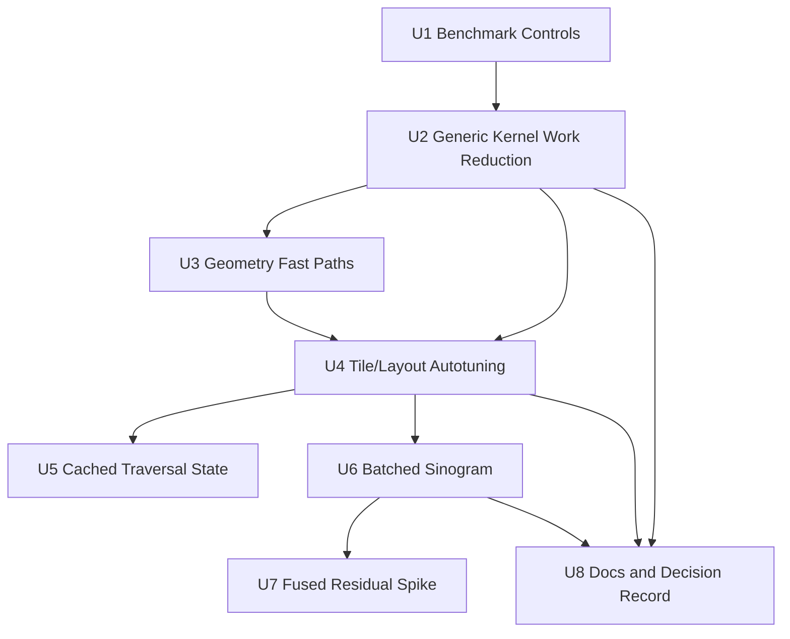

# feat: Optimize Pallas Forward Projector V2

## Summary

Build the next Pallas forward-projector iteration as a gated optimization series:
first strengthen benchmark controls and metadata, then reduce generic per-view
work, then add geometry-specific fast paths and tuning, and only then attempt
batched sinogram or fused residual kernels. The default JAX projector remains
the oracle and fallback throughout.

---

## Problem Frame

The first experimental Pallas kernel proved the basic bet only for high-ray
single-view cases: it ran real Pallas on the RTX 4070 Laptop GPU, matched JAX
exactly, and reached about `1.24x` on `quick`, but `confirm` and `stress`
geomeans stayed below `1.0x`. The full sinogram suite also showed that a
Python loop over single-view Pallas calls is not workflow-relevant against JAX
`vmap`.

V2 should therefore change the kernel work, not just tune the current `8x8`
Triton tile indefinitely. The plan preserves the original spike boundaries
while sequencing the improvements so each one can be accepted, rejected, or
rolled back independently.

---

## Requirements

- R1. Preserve the original experimental contract: Pallas remains opt-in,
  JAX remains the default projector, and JAX remains the correctness oracle
  (see origin: `docs/brainstorms/2026-04-27-pallas-forward-projector-requirements.md`).
- R2. Preserve the current geometry contract for `T` as `world_from_object`,
  world `+y` rays, object-frame sampling, detector orientation, volume origin,
  support bounds, flat volume layout, and `(nv, nu)` output shape.
- R3. Keep all Pallas benchmark speed claims gated by actual backend
  eligibility, finite outputs, parity, and same-fixture JAX comparison.
- R4. Record enough Pallas variant metadata to make benchmark results
  reproducible: tile shape, layout variant, kernel variant, `num_warps`,
  resolved JAX traversal count, effective Pallas traversal count, and support
  or fallback reason.
- R5. Improve the generic per-view kernel first by eliminating provably zero
  loop work and masking inactive loads before introducing geometry-specific
  fast paths.
- R6. Add conservative geometry-specific fast paths only when a host-side
  predicate proves they preserve the JAX oracle semantics; unsupported geometry
  must fall back to the generic Pallas kernel, not silently switch to JAX.
- R7. Add benchmark-controlled tuning knobs so tile shape, layout orientation,
  `num_warps`, kernel variant, and state mode can be measured without manual
  code edits.
- R8. Treat cached traversal state as a separate benchmark mode with inclusive
  and cached timings, not as a hidden drop-in speed claim.
- R9. Add a batched-view Pallas sinogram path only after the per-view body is
  faster on `confirm` and `stress`; judge batched sinogram only against the
  best JAX sinogram median, not against the weaker JAX loop.
- R10. Keep fused residual/reduction work separate from the forward-image API
  and require its own benchmark evidence before it is used for workflow claims.
- R11. Add or extend CPU `interpret=True` tests for each Pallas variant and
  benchmark-harness tests for every new metadata field or mode.
- R12. Preserve the original non-goals: no Pallas default backend, no
  backprojection replacement, no custom VJP/JVP, no differentiated alignment
  hot-path claims, and no broad geometry support before one common profile-like
  shape is clearly faster.

**Origin actors:** A1 TomoJAX developer, A2 benchmark harness, A3 existing JAX
projector, A4 Pallas runtime/backend.

**Origin flows:** F1 forward-kernel parity check, F2 quick microbenchmark, F3
profile-level benchmark.

**Origin acceptance examples:** AE1 parity on a small uniform fixture, AE2 clean
fallback on unsupported hardware, AE3 benchmark metadata and timings, AE4
microbenchmark-only wins remain inconclusive.

---

## Scope Boundaries

- Do not replace `forward_project_view_T`, `backproject_view_T`,
  `_trilinear_scatter_add`, or `sum_backproject_views_T`.
- Do not make Pallas the default backend.
- Do not claim a full sinogram or workflow speedup from `pallas_loop`; only a
  batched-view Pallas mode can compete with JAX `vmap`.
- Do not hide cached-state preparation cost inside a generic Pallas result.
- Do not support arbitrary calibrated or traced detector grids in fast paths
  unless a support predicate proves they are equivalent to the current oracle
  semantics.
- Do not broaden `gather_dtype` support beyond `fp32` in this plan unless a
  later implementation unit explicitly adds tests and benchmark gates for it.
- Do not introduce custom derivative support or use Pallas in differentiated
  alignment objectives.
- Do not fold fused residual/reduction work into the forward-image API.

### Deferred to Follow-Up Work

- Pallas backprojection kernels and adjoint parity: separate plan after the
  forward-image and batched-sinogram results justify deeper investment.
- Pallas custom VJP/JVP or differentiated alignment support: separate
  derivative-design plan.
- Native `bf16` / `fp16` Pallas gather modes: attempted after V2 fp32
  performance was understood; see the mixed-precision result below.
- Lower-level Mosaic GPU pipelining or `core_map`: defer unless Triton-backed
  Pallas hits a proven ceiling that the current benchmark suite can expose.

---

## Context & Research

### Relevant Code and Patterns

- `src/tomojax/core/projector.py` is the geometry and numerical oracle.
  `_projector_traversal_state`, `_resolve_n_steps`, and `_trilinear_gather`
  define traversal bounds, sample counts, flat indexing, clipped loads, and
  masks.
- `src/tomojax/core/pallas_projector.py` currently implements the experimental
  single-view Pallas path with Pallas Triton `plt.load(...)`, an `8x8` default
  tile, `fp32`-only support, CPU `interpret=True` tests, and CPU fallback for
  real Pallas lowering.
- `src/tomojax/bench/forward_projector.py` owns `quick`, `confirm`, `stress`,
  and `sinogram` suites plus backend fallback and parity metadata.
- `bench/forward_projector.py` is the CLI wrapper around the shared benchmark
  helpers. New benchmark modes should be exposed here only after the reusable
  config and runner support exists under `src/tomojax/bench/`.
- `tests/test_projector_pallas.py` contains the Pallas parity surface. It
  should grow by variant and mode rather than duplicating broad projector tests.
- `tests/test_bench_forward_projector.py` owns benchmark-harness regressions
  for suite structure, metadata, fallback behavior, and summaries.
- The v1 laptop measurements are the baseline for V2 decisions:
  - `quick`: exact parity, Pallas eligible, `1.24x` on `high-ray-count-128`.
  - `confirm`: exact parity, Pallas eligible for all cases, geomean about
    `0.96x`, with smaller/profile cases slower.
  - `stress`: exact parity, Pallas eligible for all cases, geomean about
    `0.97x`, with only `high-ray-count-192` faster.
  - `sinogram`: exact parity and eligibility, but `pallas_loop` loses badly to
    JAX `vmap`; high-ray sinogram was about `0.049x` versus best JAX median.

### Institutional Learnings

- `docs/solutions/architecture-patterns/reuse-align-multires-for-geometry-calibration-2026-04-25.md`
  shows that optimization work should preserve streamed/chunked caller
  contracts, report solver/backend provenance, and avoid self-consistent local
  wins that fail at workflow scale.
- The same learning applies here: Pallas variant metadata and actual-backend
  fields are correctness evidence, not reporting polish.

### External References

- Official JAX Pallas `pallas_call` documentation for refs, `BlockSpec`,
  `grid`, `interpret`, and backend compiler params.
- Official JAX Pallas Grid/BlockSpec documentation for program grids and
  block ownership.
- Oracle kernel-candidate review from this planning session, which ranked
  tighter loop bounds, z-locked fast paths, tile/layout autotuning, batched
  sinogram, cached traversal state, and fused residual/reduction in that order.

---

## Key Technical Decisions

- **Use gated optimization units rather than one broad rewrite.** Each V2
  candidate should produce a benchmarkable diff with an explicit keep/reject
  criterion.
- **Keep the generic Pallas kernel as the fallback inside Pallas.** Geometry
  fast paths should fall back to generic Pallas when unsupported, while direct
  Pallas eligibility checks still control JAX fallback for unsupported devices
  or public-call options.
- **Record variant metadata before trusting speed numbers.** The benchmark JSON
  must identify which Pallas body actually ran so later tuning does not compare
  unlike kernels.
- **Prefer host-side support classification for v2.** `T`, `Grid`, `Detector`,
  and canonical detector-grid checks are already Python-bound in the public
  wrapper; v2 fast-path predicates should stay outside JAX transforms and avoid
  traced dynamic control.
- **Treat JAX `vmap` as the sinogram bar.** Beating the JAX loop is not enough;
  the sinogram suite already defines workflow relevance as beating the best JAX
  warm median.
- **Keep fused residual/reduction out of the projector API.** It may be useful,
  but it answers a different product question than forward-image projection.

---

## Open Questions

### Resolved During Planning

- **Should V2 keep tuning the current `8x8` kernel only?** No. The measured
  mixed results and Oracle review both point to reducing work and adding
  geometry-specific kernels before further broad tuning.
- **Should batched sinogram be next?** No. The single-view body should first
  pass `confirm` and `stress` as a general win; otherwise batching a slow body
  risks building a larger dispatch shape around the wrong kernel.
- **Should cached traversal state be hidden inside the main Pallas timing?** No.
  Cached-state prep changes benchmark semantics and must be reported separately.

### Deferred to Implementation

- **Exact guard for tightened loop bounds:** Choose the smallest guard that
  preserves parity across CPU tests and GPU `stress`; the plan requires a guard
  but leaves the value to implementation evidence.
- **Exact z-integer tolerance:** Determine the alignment tolerance from
  detector/grid fp32 behavior during variant tests.
- **Winning tile/layout defaults:** Select from benchmarked variants after U4
  records reproducible metadata.
- **Whether cached traversal state is worth carrying:** Decide from U5 inclusive
  and cached benchmarks, not from planning intuition.

---

## High-Level Technical Design

> *This illustrates the intended approach and is directional guidance for
> review, not implementation specification. The implementing agent should treat
> it as context, not code to reproduce.*

The plan intentionally makes U6 and U7 gated follow-ons. U6 starts only after
the per-view body is faster enough to justify competing with JAX `vmap`. U7
starts only if forward-image and/or batched sinogram evidence shows
materialization or downstream reduction is the next bottleneck.

---

## Implementation Units

- U1. **Add Pallas Variant Controls and Benchmark Metadata**

**Goal:** Make every later kernel experiment reproducible and comparable by
threading Pallas tuning controls through the benchmark config and reporting the
actual Pallas variant that ran.

**Requirements:** R3, R4, R7, R11

**Dependencies:** None

**Files:**
- Modify: `src/tomojax/core/pallas_projector.py`
- Modify: `src/tomojax/bench/forward_projector.py`
- Modify: `bench/forward_projector.py`
- Test: `tests/test_bench_forward_projector.py`
- Test: `tests/test_projector_pallas.py`

**Approach:**
- Add benchmark-visible Pallas controls for tile shape, `num_warps`, kernel
  variant, layout variant, and state mode while keeping public JAX projector
  APIs unchanged.
- Extend the Pallas support checker so unsupported controls return a fallback
  reason before timing begins.
- Record requested and actual Pallas variant metadata in benchmark rows and
  fixture metadata where appropriate.
- Keep CLI additions focused on benchmark-only controls; product APIs should not
  gain tuning flags unless a later unit proves they are needed outside the
  benchmark harness.

**Patterns to follow:**
- Existing `ForwardProjectorBenchmarkConfig` and suite summary fields in
  `src/tomojax/bench/forward_projector.py`.
- Existing Pallas fallback handling in `_pallas_unsupported_reason`.
- Existing CLI override pattern in `bench/forward_projector.py`.

**Test scenarios:**
- Happy path: a benchmark config with explicit Pallas tile shape and `num_warps`
  records those values in the Pallas result row.
- Happy path: default benchmark config records the same default Pallas variant
  currently used by `forward_project_view_T_pallas`.
- Error path: unsupported tile shape, invalid state mode, or unknown kernel
  variant produces a controlled fallback reason and does not mark the row
  eligible for a Pallas speed claim.
- Integration: suite summaries still count Pallas eligibility and parity from
  result rows after new metadata fields are added.

**Verification:**
- Benchmark JSON is sufficient to reproduce which Pallas variant was measured.
- Existing JAX-only benchmark behavior remains unchanged.

---

- U2. **Tighten Generic Kernel Loop Work**

**Goal:** Improve the generic Pallas body by reducing provably inactive
iterations and avoiding inactive memory loads while preserving the current
eight-load trilinear semantics.

**Requirements:** R1, R2, R3, R5, R11

**Dependencies:** U1

**Files:**
- Modify: `src/tomojax/core/pallas_projector.py`
- Modify: `src/tomojax/bench/forward_projector.py`
- Test: `tests/test_projector_pallas.py`
- Test: `tests/test_bench_forward_projector.py`

**Approach:**
- Compute an effective Pallas loop bound from the support width along the
  object-frame ray direction, clamped by the current `_resolve_n_steps` result.
- Keep explicit positive `n_steps` semantics conservative: the generic Pallas
  path may reduce work only when skipped steps are guaranteed inactive for every
  ray in the tile.
- Pass per-step activity into the trilinear load mask so inactive rays avoid
  unnecessary neighbour loads where the Pallas backend honors masks.
- Record both the oracle resolved traversal count and the effective Pallas
  traversal count in benchmark metadata.

**Execution note:** Start with CPU `interpret=True` parity tests before running
GPU quick/confirm. The core risk is a boundary miss that only appears at
rotated or remainder-tile edges.

**Patterns to follow:**
- `_resolve_n_steps` and `_projector_traversal_state` in
  `src/tomojax/core/projector.py`.
- Current `_trilinear_load` mask structure in `src/tomojax/core/pallas_projector.py`.

**Test scenarios:**
- Happy path: identity pose on a uniform `16^3` volume still returns the same
  path-length image after tightening the loop bound.
- Happy path: `step_size=0.5` with explicit `n_steps` still matches
  `forward_project_view_T`.
- Edge case: rotated non-cubic volume with detector dimensions not divisible by
  tile shape matches the JAX oracle.
- Edge case: fine-step fixture with long resolved JAX traversal count records a
  smaller or equal effective Pallas count without parity drift.
- Error path: non-finite or non-positive `step_size` remains rejected before
  Pallas lowering.

**Verification:**
- `quick` should improve on the current Pallas median by at least 10% while
  retaining exact or existing-threshold parity.
- `confirm` should move `profile-128` and `noncubic-align-128` toward at least
  parity with JAX; if it does not, the plan proceeds to U3 rather than trying
  arbitrary loop-bound tuning.

**Result, 2026-04-29:** Kept the tightened effective loop bound, but rejected
threading per-step activity into every trilinear load mask. The isolated
active-mask sweep, pinned to commit `e683fcb`, was parity-clean on the RTX 4070
Laptop GPU but did not improve enough to justify the extra mask/register
pressure. Against the accepted `auto` baseline, `quick` regressed from
`1.5713x` to `1.5390x`, `confirm` improved only from `1.2588x` to `1.2640x`,
and `stress` was effectively flat (`1.2550x` to `1.2551x`). Residual results
were mixed: fused geomean dipped from `0.4354x` to `0.4343x`, while
materialized residual moved from `0.4863x` to `0.4889x`. Decision: revert the
active-load-mask change and keep the simpler clipped in-bounds loads.

---

- U3. **Add z-Locked Fast Paths**

**Goal:** Add conservative Pallas variants for canonical parallel geometry that
avoid unnecessary z-neighbour work, including a high-upside z-integer four-load
path when detector rows align with voxel z centres.

**Requirements:** R2, R3, R6, R11, R12

**Dependencies:** U1, U2

**Files:**
- Modify: `src/tomojax/core/pallas_projector.py`
- Modify: `src/tomojax/bench/forward_projector.py`
- Test: `tests/test_projector_pallas.py`
- Test: `tests/test_bench_forward_projector.py`

**Approach:**
- Add host-side classification for generic eight-load, z-constant eight-load,
  and z-integer four-load variants.
- Require canonical detector grid, host-convertible pose, stable z mapping, and
  strict voxel-centre alignment before selecting the four-load path.
- Keep `kernel_variant="auto"` as the normal Pallas path and expose explicit
  variant requests only for tests and benchmarks.
- Fall back from unsupported fast-path variants to generic Pallas when `auto`
  is requested; explicit unsupported fast-path requests should return a clear
  fallback or unsupported reason.
- Preserve flat volume indexing and explicit in-bounds zeroing.

**Execution note:** Implement the support predicate and its tests before adding
the optimized load body. This prevents accidentally benchmarking an unsafe fast
path.

**Patterns to follow:**
- Canonical detector-grid validation in `_ensure_canonical_detector_grid`.
- Localized voxel and `vol_center` parity tests in `tests/test_projector_pallas.py`.

**Test scenarios:**
- Happy path: canonical identity geometry classifies as a z-locked variant and
  matches the JAX oracle.
- Happy path: canonical rotated z-axis parallel geometry selects the fast path
  when z is invariant along the ray and still matches JAX.
- Edge case: detector rows outside the volume support produce zeros matching
  the JAX oracle.
- Edge case: `Grid.vol_center` shifts z alignment and still either selects a
  safe fast path or falls back to generic Pallas with parity.
- Error path: a shifted noncanonical detector grid cannot select the
  z-integer fast path.
- Integration: benchmark JSON records both requested and actual kernel variant.

**Verification:**
- `confirm` should pass all parity checks and reach at least `1.05x` on each
  case before the fast path is considered a general win.
- `stress` should show the high-ray cases clearly faster and no lower-workload
  regression large enough to erase geomean improvement.

**Result, 2026-04-29:** Accepted `kernel_variant="auto"` as the experimental
default. On the RTX 4070 Laptop GPU, the variant sweep compared `generic`,
`auto`, and explicit `z_integer4` across `quick`, `confirm`, `stress`,
`sinogram`, and `residual`. All completed rows were eligible and parity-clean.
`generic` remained mixed: `quick` `1.2344x`, `confirm` `0.9940x` geomean with
worst case `0.8788x`, and `stress` `0.9785x` geomean with worst case
`0.9054x`. `auto` selected the safe z-integer four-load path for the benchmark
geometry and moved the single-view suites into clear win territory: `quick`
`1.5713x`, `confirm` `1.2588x` geomean with worst case `1.0977x`, and
`stress` `1.2550x` geomean with worst case `1.1298x`. Explicit `z_integer4`
was similar, with slightly lower `confirm` geomean (`1.2400x`) but slightly
higher `stress` geomean (`1.2648x`) and worst case (`1.1503x`). The default is
`auto`, not explicit `z_integer4`, because unsupported geometry must fall back
inside Pallas to the generic eight-load body instead of raising or requiring
callers to classify geometry manually. Sinogram and residual still do not clear
workflow-level gates: even with `auto`/`z_integer4`, the geomeans remain below
`0.5x` because small cases lose badly while high-ray cases win.

---

- U4. **Add Tile, Layout, and Warp Autotuning**

**Goal:** Make tile orientation and Pallas Triton compiler parameters
benchmarkable so the chosen default follows observed workload behavior rather
than the current hand-picked `8x8` tile.

**Requirements:** R4, R7, R11

**Dependencies:** U1, U2, U3

**Files:**
- Modify: `src/tomojax/core/pallas_projector.py`
- Modify: `src/tomojax/bench/forward_projector.py`
- Modify: `bench/forward_projector.py`
- Test: `tests/test_projector_pallas.py`
- Test: `tests/test_bench_forward_projector.py`
- Modify: `bench/README.md`

**Approach:**
- Add benchmark modes for current `v,u` internal layout and a transposed
  `u,v` internal compute layout that stores back to `(nv, nu)`.
- Restrict tuning presets to power-of-two operation sizes that are reasonable
  for Pallas Triton loads and stores.
- Let benchmark config select `num_warps`, layout variant, and tile shape; keep
  defaults conservative until the suite chooses a better winner.
- Add an aggregate comparison helper or report section that identifies the best
  variant per suite without hiding individual case regressions.

**Patterns to follow:**
- Existing suite summary functions in `src/tomojax/bench/forward_projector.py`.
- Benchmark ownership guidance in `bench/README.md`.

**Test scenarios:**
- Happy path: benchmark config can request a non-default tile and layout
  variant and records it in result rows.
- Happy path: transposed internal layout returns output with the same `(nv, nu)`
  shape and matches the JAX oracle.
- Edge case: remainder detector dimensions still store correctly for both
  layout variants.
- Error path: invalid or non-power-of-two tuning presets are rejected or marked
  unsupported with clear fallback metadata.
- Integration: suite summaries remain stable when multiple Pallas variants are
  measured or compared.

**Verification:**
- Keep a tuned default only if it improves the best U2/U3 kernel by at least 5%
  on `quick` or 3% geomean on `confirm` without materially worsening the worst
  case.
- Reject variants that improve one high-ray case but regress ordinary profile
  cases enough to keep `confirm` geomean below `1.05x`.

**Result, 2026-04-29:** Accepted `detector_vu`, tile `8x16`, `num_warps=4` as
the tuned experimental default. Quick autotune tested 24 variants across
`detector_vu` / `detector_uv`, `8x8` / `8x16` / `16x8` / `16x16`, and
`num_warps` `2` / `4` / `8`; all were eligible and parity-clean. Confirm then
compared the leading candidates against the previous `detector_vu 8x8
num_warps=4` default. The accepted candidate improved confirm geomean from
`1.2722x` to `1.3128x`, improved the worst confirm case from `1.1326x` to
`1.1637x`, and improved every confirm case. Stress compared the accepted
candidate, the previous default, and `detector_vu 8x8 num_warps=2`; the accepted
candidate kept parity, improved stress geomean from `1.3180x` to `1.3318x`,
and improved the worst stress case from `1.2036x` to `1.2250x`. The slight
stress dip on `large-cubic-192` versus the previous default (`1.2250x` vs
`1.2332x`) was treated as non-material because the aggregate and worst-case
stress metrics improved. `detector_uv` was rejected for now: its best confirm
candidate, `8x8 num_warps=2`, reached only `1.2154x` geomean and trailed the
`detector_vu` candidates.

---

- U5. **Evaluate Cached Traversal State**

**Goal:** Determine whether precomputing traversal state is useful for
fixed-geometry iterative workflows without conflating cached timing with
single-call projector timing.

**Requirements:** R3, R4, R8, R11

**Dependencies:** U1, U2, U4

**Files:**
- Modify: `src/tomojax/core/pallas_projector.py`
- Modify: `src/tomojax/core/projector.py` or create: `src/tomojax/core/projector_state.py`
- Modify: `src/tomojax/bench/forward_projector.py`
- Modify: `bench/forward_projector.py`
- Test: `tests/test_projector_pallas.py`
- Test: `tests/test_projector.py`
- Test: `tests/test_bench_forward_projector.py`

**Approach:**
- Add a reusable traversal-state representation for per-ray initial voxel
  coordinates, increments, step counts, and shape metadata.
- Add two benchmark modes: one that includes state preparation in timing and
  one that prepares state outside warm repeats for fixed-geometry workflows.
- Keep state objects tied to grid, detector, pose, and traversal controls so
  they cannot be reused silently with incompatible volumes or detectors.
- Do not replace the inline Pallas path unless cached-state results prove a
  broad enough win.

**Patterns to follow:**
- `_projector_traversal_state` in `src/tomojax/core/projector.py`.
- Existing benchmark distinction between first-call and warm-call timing.

**Test scenarios:**
- Happy path: state-prepared Pallas output matches `forward_project_view_T` for
  identity and rotated non-cubic fixtures.
- Edge case: explicit `step_size` and explicit `n_steps` are represented in the
  state and match the JAX oracle.
- Error path: using state with a mismatched volume shape or detector metadata
  raises a controlled error.
- Integration: benchmark JSON distinguishes inline, precompute-inclusive, and
  cached-state modes and does not mark cached timing as generic projector
  timing.

**Verification:**
- Keep cached state only if `cached_state` improves ordinary `confirm` cases
  without hiding large preparation cost in inclusive timing.
- Treat this as optional if U2-U4 already make the inline kernel a strong
  general win.

**Result, 2026-04-29:** Accepted cached traversal state as a retained
benchmark-controlled mode for fixed-geometry reuse, but not as the public Pallas
default. The implementation adds `precompute_inclusive` and `cached`
`state_mode` variants, reuses the existing JAX traversal-state helper as the
oracle for prepared per-ray state, and restricts cached state to the tuned
`detector_vu` layout. CPU `interpret=True` tests cover cached-state parity, and
benchmark JSON records `pallas_state_timing_mode` plus cached setup cost.

Laptop verification on the RTX 4070 Laptop GPU used the current tuned
`detector_vu 8x16 num_warps=4` kernel. On `confirm`, inline Pallas stayed mixed
at `0.9885x` geomean versus JAX with worst case `0.8788x`. The
precompute-inclusive cached path reached `1.3232x` geomean, worst case
`1.1551x`, and best case `1.6104x`. The cached-only fixed-geometry path reached
`1.4448x` geomean, worst case `1.2612x`, and best case `1.8121x`, with mean
state setup cost about `0.0199s` per case. On `stress`, inline Pallas reached
`1.0059x` geomean with worst case `0.9025x`; precompute-inclusive cached state
reached `1.3360x` geomean, worst case `1.2156x`; cached-only reached `1.4835x`
geomean, worst case `1.3323x`, with mean setup cost about `0.0213s`.

Decision: carry U5 forward as an explicit fixed-geometry mode and use it when
the caller can prepare traversal once and project repeated volumes with the same
pose/grid/detector/traversal controls. Do not replace `inline` as the default
until there is a separate API decision about state lifetime and invalidation.
U6 remains the next workflow-relevance step because cached single-view calls do
not address the Python-loop-vs-`vmap` sinogram gap by themselves.

**Follow-up result, 2026-04-29:** Accepted a bound fixed-geometry callable for
the repeated-volume form of cached state. The first cached implementation still
rebuilt the `pallas_call` wrapper on every timed call, so it mixed useful kernel
work with Python/Pallas call construction overhead. The bound callable prepares
the traversal state and the Pallas callable once, then projects each new volume
through the same fixed-geometry launch. A sanity check on the RTX 4070 Laptop
GPU verified that output changes when the volume changes, parity remains exact,
and the bound call removes the wrapper overhead: for a `128^3` confirm-like
case, bound cached median time was about `0.00027s`, compared with `0.055s` for
the older `with_state` helper and `0.098s` for the JAX oracle. The queued
confirm/stress bound-cached sweep was also parity-clean. This is not a general
single-call projector claim; it is evidence that fixed-geometry iterative
workflows should bind once and reuse the callable for repeated volumes.

---

- U6. **Add Batched-View Pallas Sinogram Mode**

**Goal:** Replace the Python loop over single-view Pallas calls with a
view-batched Pallas sinogram kernel that can fairly compete with JAX `vmap`.

**Requirements:** R3, R4, R9, R11, R12

**Dependencies:** U1, U2, U3, U4

**Files:**
- Modify: `src/tomojax/core/pallas_projector.py`
- Modify: `src/tomojax/bench/forward_projector.py`
- Modify: `bench/forward_projector.py`
- Test: `tests/test_projector_pallas.py`
- Test: `tests/test_bench_forward_projector.py`
- Modify: `bench/README.md`

**Approach:**
- Add a batched Pallas function that takes a stack of poses and writes a
  `(n_views, nv, nu)` output stack.
- Use a Pallas grid with an explicit view dimension plus detector tile
  dimensions, reusing the best per-view body from U2-U4.
- Keep `pallas_loop` in the benchmark as a control mode and add a new
  batched-mode result row with its own eligibility and fallback metadata.
- Support chunking by view count at the Python wrapper level if output memory
  or compile behavior becomes problematic.

**Execution note:** Do not start this unit until U2-U4 have a per-view body that
is a credible general win. A batched dispatch shape around a slow body is not
useful.

**Patterns to follow:**
- JAX `vmap` sinogram callable in `_make_jax_sinogram_vmap_callable`.
- Existing sinogram suite summary and best-JAX comparison fields.

**Test scenarios:**
- Happy path: small pose stack returns `(n_views, nv, nu)` and matches the JAX
  loop oracle.
- Edge case: one view behaves identically to single-view Pallas for the same
  pose and fixture.
- Edge case: detector remainder dimensions and multiple views store all output
  planes without overlap.
- Error path: unsupported pose stack shape or unsupported Pallas options
  produce fallback metadata.
- Integration: sinogram suite reports JAX loop, JAX vmap, Pallas loop, and
  Pallas batched modes without changing the best-JAX comparison semantics.

**Verification:**
- Accept only if `pallas_batched` passes parity and reaches at least `1.10x`
  geomean versus best JAX median on the sinogram suite, with no individual
  sinogram case below `1.00x`.
- If it only beats JAX loop and still loses to JAX `vmap`, record it as a
  dispatch improvement but not a workflow-relevant win.

**Result, 2026-04-29:** Rejected as a workflow-relevant replacement for JAX
`vmap`, but retained as useful dispatch evidence. The U6 implementation adds a
single batched Pallas launch over `(view, detector_v_tile, detector_u_tile)` and
the benchmark now reports both `pallas_loop` and `pallas_batched` against the
best JAX median. CPU `interpret=True` tests covered multi-view parity,
single-view equivalence, and sinogram benchmark metadata.

Laptop verification on the RTX 4070 Laptop GPU was parity-clean and eligible
for all three sinogram cases. `pallas_batched` was dramatically better than the
old Python `pallas_loop`, but it did not clear the U6 gate versus JAX `vmap`:
`sinogram-64` reached only `0.0290x` versus best JAX, `sinogram-128` reached
`0.7617x`, and `high-ray-sinogram-128` reached `2.8135x`. The batched-mode
geomean was therefore about `0.3960x`, with two individual cases below `1.00x`.
The result is important because high-ray full-sinogram work can benefit from
batched Pallas dispatch, but ordinary sinogram workloads remain better served
by JAX `vmap`.

Decision: do not promote U6 as workflow-relevant. Keep `pallas_batched` as an
experimental benchmark mode and use it as evidence that future Pallas work
should focus on higher arithmetic intensity, fused scoring, or high-ray
workloads rather than a generic forward-sinogram replacement.

**Follow-up result, 2026-04-29:** Accepted a benchmark-only high-ray dispatch
policy for sinogram projection. The policy mirrors residual dispatch: it
estimates workload size from `n_views * nu * nv * n_steps`, reuses the best JAX
baseline for ordinary cases, and selects `pallas_batched` only above a
`1_000_000_000` ray-step threshold. The verified GPU run, pinned to commit
`3828640` and archived on `vivobook`, was parity-clean. Dispatch selected JAX
`vmap` for `sinogram-64` and `sinogram-128`, giving `1.000x` for both ordinary
cases, and selected batched Pallas for `high-ray-sinogram-128`, reaching
`3.3494x` versus the best JAX median. Dispatch geomean was `1.4962x`, worst
case `1.000x`, and best case `3.3494x`, clearing the selective-dispatch gate.
This does not make batched Pallas a generic sinogram replacement; it confirms
that a workload-aware policy can capture the high-ray win without regressing
ordinary JAX-vmap workloads.

---

- U7. **Plan and Spike Fused Residual Reduction**

**Goal:** Explore a separate Pallas kernel for non-differentiated residual or
loss reductions only if forward-image and/or batched-sinogram evidence shows
projection materialization is the next bottleneck.

**Requirements:** R1, R3, R10, R12

**Dependencies:** U4, U6

**Files:**
- Create or modify: `src/tomojax/core/pallas_projector.py`
- Modify: `src/tomojax/bench/forward_projector.py` or create a dedicated
  benchmark helper under `src/tomojax/bench/`
- Modify: `bench/forward_projector.py` or create a dedicated benchmark entry
  under `bench/`
- Test: `tests/test_projector_pallas.py`
- Test: `tests/test_bench_forward_projector.py`

**Approach:**
- Keep fused residual/reduction as an explicitly experimental API separate from
  `forward_project_view_T_pallas`.
- Start with non-differentiated scoring only, such as scalar residual sums or
  simple weighted reductions, not alignment gradient objectives.
- Define a benchmark that compares end-to-end residual/reduction timing against
  materialized projection plus JAX reduction.
- Preserve provenance fields showing whether the call used fused Pallas,
  forward-image Pallas, or JAX fallback.

**Execution note:** Treat this as a gated follow-up. If U6 fails to get near
JAX `vmap`, fused residual may still be useful, but it should get its own small
requirements pass before implementation expands.

**Patterns to follow:**
- Existing forward-projector benchmark fixture creation and parity reporting.
- Loss-adapter and alignment provenance lessons from `docs/solutions/`.

**Test scenarios:**
- Happy path: fused residual over a small fixed image equals materialized
  Pallas or JAX projection followed by the same reduction.
- Edge case: zero residual and all-zero target produce the expected scalar.
- Error path: differentiated caller paths remain JAX-only or explicitly
  unsupported.
- Integration: benchmark metadata distinguishes fused residual from
  forward-image projection timing.

**Verification:**
- Keep only if it reduces the relevant non-differentiated objective timing by
  at least 10% while preserving parity and provenance.
- Do not use it to claim alignment hot-path speedup without a separate
  derivative design.

**Result, 2026-04-29:** Rejected as a fused-reduction optimization, but kept as
benchmark evidence. The U7 spike added a separate forward-residual benchmark
that compares JAX materialized projection plus SSE reduction, Pallas batched
materialized projection plus SSE reduction, and a fused Pallas SSE kernel that
writes per-tile partial reductions instead of materializing the projection
stack. CPU `interpret=True` tests covered parity against materialized JAX
projection and benchmark metadata.

Laptop verification on the RTX 4070 Laptop GPU was parity-clean and eligible
for all residual cases. On `residual-64`, JAX materialized took `0.00452s`,
Pallas materialized took `0.13024s` (`0.0347x`), and fused Pallas took
`0.13939s` (`0.0325x`). On `residual-128`, JAX materialized took `0.17498s`,
Pallas materialized took `0.17727s` (`0.9871x`), and fused Pallas took
`0.21950s` (`0.7972x`). On `high-ray-residual-128`, JAX materialized took
`0.70930s`, Pallas materialized took `0.20298s` (`3.4944x`), and fused Pallas
took `0.23148s` (`3.0641x`). The fused-mode geomean was only `0.4296x`, with
two ordinary cases far below `1.00x`.

Decision: do not promote the fused SSE kernel. The high-ray residual result
confirms that Pallas remains valuable for high-ray projection-heavy objectives,
but the first fused reduction is slower than materializing the batched Pallas
projection and reducing in JAX. The final JAX reduction is not the bottleneck in
this benchmark; the next useful direction is improving the projection body or
specializing for high-ray workloads, not carrying this fused-reduction variant
as a performance path.

**Follow-up result, 2026-04-29:** Accepted a benchmark-only high-ray dispatch
policy for residual objectives. The policy estimates workload size from
`n_views * nu * nv * n_steps` and selects materialized Pallas only above a
`1_000_000_000` ray-step threshold; below that threshold it reuses the measured
JAX materialized baseline. The first implementation re-timed a duplicate JAX
call for JAX-selected cases and missed the low-case guard (`0.904x` on
`residual-64`), so it was corrected to model the policy rather than a redundant
call. The verified dispatch run, pinned to commit `df9a1b2` and archived on
`vivobook`, was parity-clean on all cases. It selected JAX for `residual-64`
and `residual-128`, giving `1.000x` for both ordinary cases, and selected
materialized Pallas for `high-ray-residual-128`, reaching `4.2197x` versus JAX
materialized. Dispatch geomean was `1.6159x`, worst case `1.000x`, and best
case `4.2197x`, clearing the gate. This remains benchmark-only evidence for
selective objective dispatch, not a product alignment-path default.

---

- U8. **Document Results and Promotion Criteria**

**Goal:** Keep the Pallas optimization line auditable by documenting variant
results, accepted defaults, rejected candidates, and the next gate.

**Requirements:** R3, R4, R11, R12

**Dependencies:** U2, U4; U6 when batched sinogram is attempted

**Files:**
- Modify: `bench/README.md`
- Modify or create: `docs/plans/2026-04-29-001-feat-pallas-v2-optimization-plan.md`
- Modify or create: `docs/solutions/architecture-patterns/`
- Test expectation: none -- documentation and planning artifact updates only.

**Approach:**
- Update benchmark docs when new modes or metadata fields are added.
- Record accepted and rejected Pallas variants with device, suite, parity, and
  speedup summaries in a durable doc or plan update.
- Keep promotion language honest: per-view wins, sinogram wins, and workflow
  wins are different claims.

**Patterns to follow:**
- Benchmark reporting language in `bench/README.md`.
- Existing `docs/solutions/` frontmatter and lesson style.

**Test scenarios:**
- Test expectation: none -- this unit updates documentation and planning
  artifacts rather than feature-bearing runtime code.

**Verification:**
- A future implementer can tell which Pallas variant is the default, why it was
  selected, which variants were rejected, and which benchmark gate comes next.

---

- U9. **Evaluate Mixed-Precision Pallas Gather**

**Goal:** Test whether loading the Pallas volume in `bf16` or `fp16`, while
retaining fp32 accumulation and fp32 outputs, reduces memory traffic enough to
improve the retained Pallas kernels.

**Requirements:** R1, R2, R3, R4, R11, R12

**Dependencies:** U3, U4, U6, U7

**Files:**
- Modify: `src/tomojax/core/pallas_projector.py`
- Test: `tests/test_projector_pallas.py`

**Approach:**
- Keep the public Pallas input volume contract at fp32, then cast the flattened
  gather volume to the requested gather dtype before passing it to
  `pallas_call`.
- Preserve fp32 accumulation, fp32 outputs, and the same JAX gather dtype as
  the parity oracle.
- Thread the selected gather dtype through cached traversal state and the bound
  fixed-geometry callable so fixed-geometry benchmarking does not silently drop
  the precision mode.
- Keep `fp32` as the default unless lower precision clears a measured
  performance gate.

**Verification gate:**
- Lower-precision gather must preserve parity versus the same JAX gather dtype.
- It must improve geomean versus fp32 Pallas by at least `1.05x` on at least
  one important suite or mode.
- It must avoid material regressions on ordinary cases.

**Result, 2026-04-29:** Rejected as a performance optimization, but retained
as controlled experimental API support. Commit `f5f4a5c` added Pallas
`gather_dtype` support for `bf16`, `fp16`, aliases such as `bfloat16` and
`half`, and `auto`, with CPU `interpret=True` parity tests against the same JAX
gather dtype. The full vivobook sweep on the RTX 4070 Laptop GPU was archived
at `/home/tristan/projects/tomojax-benchmark-archive/pallas/pallas-mixed-gather-20260429T122458Z`.
All `fp32`, `bf16`, and `fp16` rows completed with exit code `0`, Pallas
eligibility, and parity.

The lower-precision modes did not clear the speed gate. On single-view suites,
`bf16` reached `1.0179x` versus fp32 Pallas on `quick`, but regressed to
`0.9705x` on `confirm` and `0.9663x` on `stress`. `fp16` reached `0.9877x` on
`quick`, `0.9717x` on `confirm`, and `0.9578x` on `stress`. Sinogram dispatch
also favored fp32: `pallas_dispatch` geomean was `1.4929x` for fp32,
`1.4558x` for `bf16`, and `1.4865x` for `fp16` versus best JAX. Residual
dispatch was similar: fp32 `1.5560x`, `bf16` `1.5318x`, and `fp16` `1.5442x`
versus JAX materialized. Materialized and fused residual modes also regressed
under lower precision.

Decision: keep the dtype support because it is correct, explicit, and useful
for future memory-pressure experiments, but do not change defaults or claim a
mixed-precision performance win. The result suggests the current Pallas body is
not memory-bandwidth limited in a way that lower-precision volume loads can
exploit on this GPU; conversion and/or vectorization effects likely dominate.

---

- U10. **Probe Canonical Analytic Traversal Fast Paths**

**Goal:** Determine whether a very narrow analytic shortcut, such as an
axis-aligned column-sum style path, applies often enough in the benchmark suite
to justify kernel implementation.

**Requirements:** R2, R3, R4, R6, R11, R12

**Dependencies:** U3, U6, U9

**Approach:**
- Classify the current `quick`, `confirm`, `stress`, and `sinogram` geometry
  before implementing a new kernel.
- Count how many single-view cases and sinogram views meet a strict
  axis-aligned ray predicate with integer detector lattice mapping in both
  object `x` and `z`.
- Preserve the existing `z_integer4` result as the broader geometry fast path;
  only implement an additional analytic path if the predicate covers a
  meaningful part of the measured workloads.

**Probe result, 2026-04-29:** Rejected the narrow axis-aligned column-sum
candidate. The vivobook probe was archived at
`/home/tristan/projects/tomojax-benchmark-archive/pallas/pallas-analytic-probe-20260429T131328Z`.
All eight single-view suite cases already select `z_integer4`, but none have an
axis-aligned object-space ray with integer `x` and `z` detector lattice mapping.
The sinogram suites contain only three qualifying axis-aligned views out of
`360` total views: one each in `sinogram-64`, `sinogram-128`, and
`high-ray-sinogram-128`. That coverage is too small to justify another
specialized forward kernel.

Decision: do not implement a column-sum or axis-y-only forward fast path for
the current benchmark suite. The useful analytic specialization remains the
already accepted `z_integer4` path. The next broader candidate should be
designed separately, with voxel-owned backprojection as the likely next
planning target because it addresses the adjoint/reconstruction side rather
than another low-coverage forward-projector special case.

---

## System-Wide Impact

- **Interaction graph:** The work touches only the experimental Pallas module,
  forward-projector benchmark harness, and Pallas parity tests unless a gated
  later unit adds batched sinogram or fused residual surfaces.
- **Error propagation:** Unsupported Pallas variants should surface as
  controlled unsupported or fallback reasons before benchmark timing. Direct
  Pallas calls may raise `PallasProjectorUnsupported`; benchmark routes should
  record fallback metadata.
- **State lifecycle risks:** Cached traversal state introduces reuse hazards.
  State objects must be tied to shape and metadata, and cached timings must not
  be confused with single-call timings.
- **API surface parity:** `forward_project_view_T` and existing JAX projector
  callers remain unchanged. New Pallas controls belong to the experimental
  function and benchmark configs.
- **Integration coverage:** Unit parity tests prove small CPU semantics; GPU
  quick/confirm/stress/sinogram suite JSON proves actual backend eligibility,
  performance, and parity.
- **Unchanged invariants:** JAX remains the oracle, default backend, and
  differentiated path. Pallas remains opt-in and benchmark-proven before any
  workflow claim.

---

## Risks & Dependencies

| Risk | Mitigation |
|------|------------|
| A fast path silently changes interpolation semantics | Use host-side support predicates, CPU parity tests, and JAX oracle comparison for every variant. |
| Tuning produces a high-ray win while ordinary cases regress | Require `confirm` and `stress` geomean and worst-case gates, not only `quick`. |
| Benchmark metadata becomes insufficient to reproduce results | Add variant metadata before new kernels, and include actual versus requested variant in result rows. |
| Cached traversal state creates misleading speed claims | Report inclusive and cached timings separately and keep state mode in result metadata. |
| Batched Pallas still loses to JAX `vmap` | Treat this as a reject signal for workflow relevance; keep the result as evidence, not a claim. |
| Pallas API instability across JAX versions | Keep backend-specific code localized in `pallas_projector.py` and preserve JAX fallback. |

---

## Alternative Approaches Considered

- **Continue tuning only tile shape and warps:** Rejected as the primary path.
  The v1 `8x8` tuning already found a high-ray win, but ordinary `confirm` and
  `stress` cases remain slower; changing the work is more likely to move
  geomean.
- **Build batched sinogram immediately:** Rejected for sequencing. The current
  per-view body is not a general win, and JAX `vmap` is very strong.
- **Jump straight to fused residual/loss:** Deferred. It may be useful, but it
  is not a forward-image projector replacement and should not be mixed into the
  projector API.
- **Use lower-level Mosaic GPU APIs now:** Deferred. Earlier Mosaic attempts hit
  shared-memory and layout constraints; Triton-backed Pallas currently compiles
  and provides a known baseline.

---

## Success Metrics

- U2 success: `quick` remains eligible and parity-passing, current Pallas median
  improves by at least 10%, and `confirm` ordinary cases move toward JAX parity.
- U3/U4 success: `confirm` geomean reaches at least `1.05x`, no confirm case is
  below `1.00x`, and `stress` has no material worst-case regression.
- U6 success: batched Pallas sinogram reaches at least `1.10x` geomean versus
  best JAX median, with no individual sinogram case below `1.00x`.
- U7 success: fused residual/reduction reduces a non-differentiated objective
  timing by at least 10% versus materialized projection plus reduction.
- Overall success: every retained optimization has exact or thresholded parity,
  actual Pallas eligibility, and reproducible metadata in benchmark JSON.

---

## Phased Delivery

### Phase 1: Measurement and Generic Kernel Work

- U1 establishes benchmark controls and metadata.
- U2 tightens loop bounds and masks inactive loads.

### Phase 2: Per-View Kernel Specialization

- U3 adds z-locked and z-integer fast paths.
- U4 tunes tile, layout, and warp defaults.
- U5 evaluates cached traversal state only if inline per-view results remain
  mixed or fixed-geometry workflow evidence warrants it.

### Phase 3: Sinogram Relevance

- U6 adds batched-view Pallas only after the per-view body clears the single-view
  gates.

### Phase 4: Workflow-Specific Escape Hatch

- U7 explores fused residual/reduction only if forward-image work shows the
  next bottleneck is materialization or downstream reduction.
- U8 documents accepted defaults, rejected variants, and promotion criteria
  throughout the sequence.

---

## Documentation / Operational Notes

- Keep benchmark JSON artifacts from `vivobook` or other GPU machines outside
  the repository unless a small summary is intentionally promoted into docs.
- Record device kind, JAX/JAXLIB versions, and actual backend in any
  performance note.
- Do not update product-facing docs until Pallas has a stable supported
  contract beyond benchmark-only usage.

---

## Sources & References

- **Origin document:** `docs/brainstorms/2026-04-27-pallas-forward-projector-requirements.md`
- Prior plan: `docs/plans/2026-04-27-002-feat-pallas-forward-projector-plan.md`
- Current Pallas implementation: `src/tomojax/core/pallas_projector.py`
- JAX projector oracle: `src/tomojax/core/projector.py`
- Benchmark harness: `src/tomojax/bench/forward_projector.py`
- Benchmark CLI and docs: `bench/forward_projector.py`, `bench/README.md`
- Pallas parity tests: `tests/test_projector_pallas.py`
- Benchmark tests: `tests/test_bench_forward_projector.py`
- Institutional learning: `docs/solutions/architecture-patterns/reuse-align-multires-for-geometry-calibration-2026-04-25.md`
- External docs: [JAX Pallas `pallas_call`](https://docs.jax.dev/en/latest/_autosummary/jax.experimental.pallas.pallas_call.html), [JAX Pallas Grid and BlockSpec](https://docs.jax.dev/en/latest/pallas/grid_blockspec.html)
