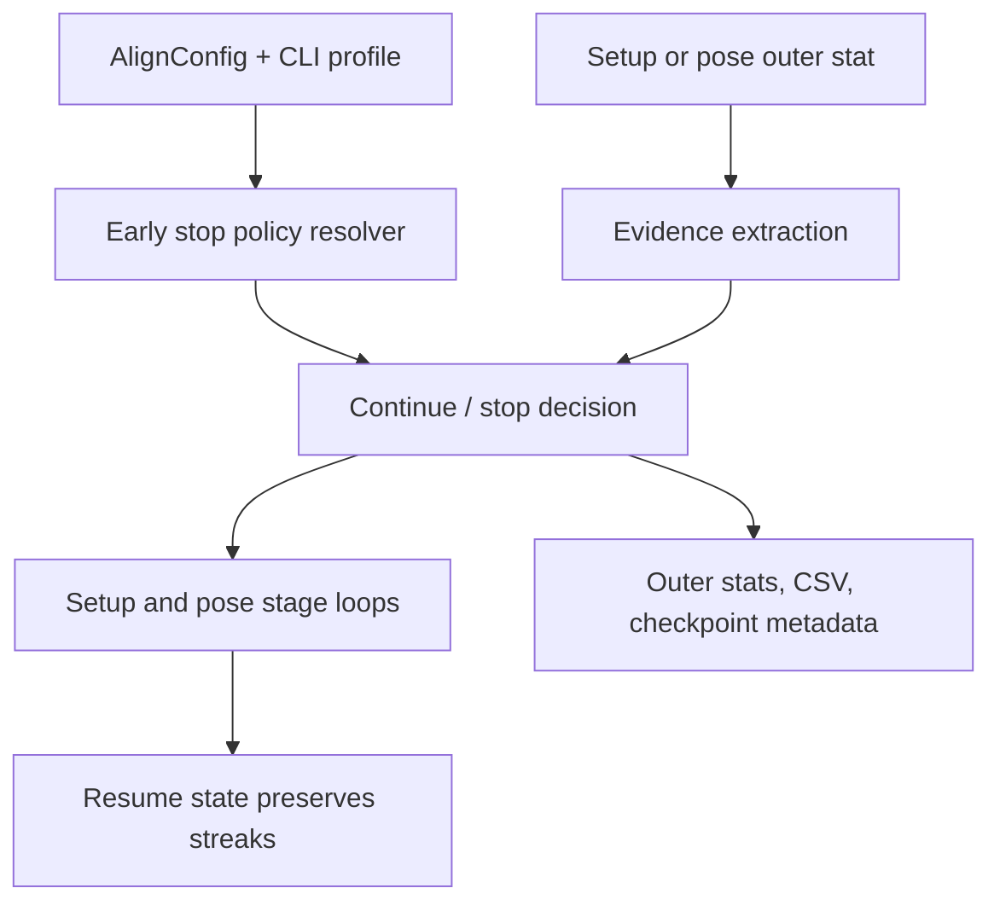
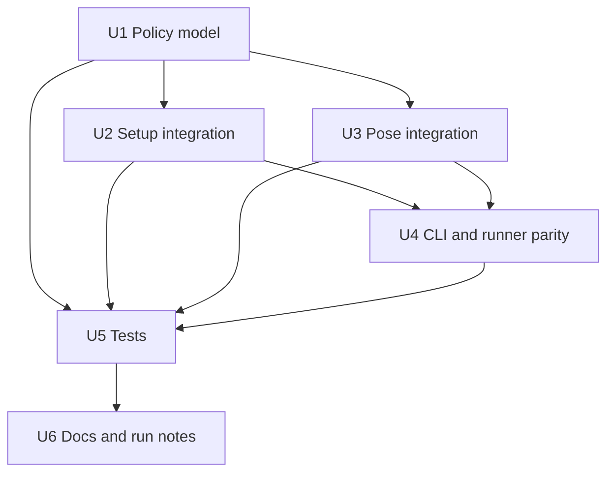

# feat: Add Alignment Early Stop Profiles

## Summary

Add a shared early-stop policy layer for alignment setup and pose stages, with a compute-saving default profile and a conservative `robust` profile for runs where false stopping is more expensive than extra iterations. The policy should stop on multi-signal evidence from accepted optimizer gain, step size, optimizer health, and stage-specific tolerances instead of comparing drift in total loss across outer iterations.

---

## Problem Frame

The recent real laminography runs show setup stages where the loss continues drifting by tiny amounts while checkpoint previews barely change. COR stages can justify small continued movement, but detector roll and later polish stages can spend long periods chasing numerical improvement that is not visually or physically meaningful. The current setup early stop is also not aligned with the validation-LM contract: it compares one outer's `geometry_loss_after` to the next outer's `geometry_loss_after`, so reconstruction refresh drift can keep a marginal geometry stage alive even when accepted geometry updates are tiny.

This plan extends the unified alignment-state requirement that geometry and pose share multiresolution execution semantics, early stopping, checkpointing, and diagnostics (see origin: `docs/brainstorms/geometry-calibration-solver-requirements.md`).

---

## Requirements

- R1. Early stopping must be implemented as shared alignment policy behavior, not as runner-only logic, so setup geometry and pose stages follow one auditable contract.
- R2. The default early-stop profile must be compute-saving: marginal stages should stop when accepted optimizer gain and parameter movement are both too small for the active DOFs.
- R3. A conservative profile, exposed as `robust` or a similarly clear name, must be available for production or expensive real-data runs where uncertain stages should continue longer.
- R4. Setup geometry early stopping must evaluate accepted validation-LM step evidence within the same objective context, using `geometry_loss_before`, `geometry_loss_after`, `geometry_accepted`, step norms, selected LM scale, and optimizer conditioning.
- R5. Pose early stopping must keep using same-volume pre/post alignment improvement, but should also consider pose movement magnitude and optimizer acceptance where available.
- R6. Stage stats, manifests, checkpoints, and runner CSV summaries must record enough early-stop telemetry to explain why a stage continued or stopped.
- R7. Existing `--early-stop`, `--no-early-stop`, `--early-stop-rel`, and `--early-stop-patience` behavior must remain backward-compatible, with new profile controls layered on top.
- R8. The real-laminography runner must use the same policy semantics as the package alignment path, or explicitly call into the shared policy helper, so laptop runs do not diverge from `tomojax-align`.
- R9. Tests must cover plateau, accepted-small-step, rejected-update, optimizer-health, profile-default, and checkpoint/resume bookkeeping cases.

**Origin actors:** A1 TomoJAX user, A2 Alignment engine, A3 Planner/implementer, A4 Documentation/demo generator.
**Origin flows:** F1 COR-only detector-centre alignment, F2 Pose-only alignment, F3 Staged geometry plus pose alignment, F4 Demo/evidence generation.
**Origin acceptance examples:** AE1, AE2, AE3, AE4, AE5, AE6.

---

## Scope Boundaries

- This plan does not change reconstruction or FISTA-TV early stopping in `src/tomojax/recon/`.
- This plan does not alter alignment loss definitions such as `l2_otsu`, `phasecorr`, or their adapter semantics.
- This plan does not introduce image-preview-based early stopping; preview and ROI metrics may be logged later, but the stop decision should remain optimizer/objective based.
- This plan does not change gauge policy decisions or allow unsafe coupled setup/pose solves.
- This plan does not tune a final set of universal numeric thresholds from first principles; implementation should define reasonable defaults and make the thresholds profile/config driven.

### Deferred to Follow-Up Work

- Preview-derived quality metrics for dashboards: defer until the optimizer-level policy is stable.
- Per-dataset auto-tuning from historical run logs: defer until the new telemetry exists across several runs.
- A separate run-comparison report generator for early-stop diagnostics: defer to a later visualization/reporting task.

---

## Context & Research

### Relevant Code and Patterns

- `src/tomojax/align/_config.py` owns `AlignConfig.early_stop`, `early_stop_rel_impr`, and `early_stop_patience`; this is the right public config surface to extend.
- `src/tomojax/cli/align.py` exposes `--early-stop`, `--no-early-stop`, `--early-stop-rel`, and `--early-stop-patience`; new profile flags should preserve these options.
- `src/tomojax/align/_setup_stage.py` currently performs setup early stopping by comparing previous `geometry_loss_after` to current `geometry_loss_after`, which is the main bug-shaped behavior to replace.
- `src/tomojax/align/_pose_stage.py` currently tracks `rel_impr` and `small_impr_streak`; this should be adapted rather than discarded.
- `src/tomojax/align/optimizers.py` already emits validation-LM evidence such as `optimizer_accepted`, `optimizer_actual_reduction`, `optimizer_selected_scale`, `optimizer_condition_number`, `step_norm_whitened`, and native step stats.
- `src/tomojax/align/geometry/geometry_blocks.py` already summarizes accepted geometry updates, total step norms, gradients, and block status; the new policy should reuse this diagnostic vocabulary where possible.
- `src/tomojax/align/_results.py` and `src/tomojax/align/io/checkpoint.py` carry `small_impr_streak` through result/checkpoint state; any new early-stop state must preserve resume behavior.
- `scripts/real_laminography/run_real_lamino_native_setup_pose_256.py` has runner-local setup early stopping and `stage_summary.csv` fields; it should stop duplicating divergent logic.

### Institutional Learnings

- `docs/solutions/architecture-patterns/reuse-align-multires-for-geometry-calibration-2026-04-25.md`: setup geometry belongs inside the unified alignment system, with stopped train-fold reconstruction and validation-LM evidence, not a private solver or private objective.
- `docs/solutions/logic-errors/fista-square-artifacts-from-uncentered-lamino-projections-2026-04-29.md`: real-data runs can look numerically alive while previews are clearly wrong, so telemetry must make optimizer behavior explainable and should not hide preprocessing/config problems behind loss drift.

### External References

- None used. The codebase already has the relevant optimizer diagnostics, stage loop structure, and institutional learnings; external research would add little compared with aligning the implementation to local contracts.

---

## Key Technical Decisions

- Use profile names rather than a single stricter threshold: `compute_saving` as the default and `robust` as the conservative option give users intent-level control while preserving low-level threshold overrides.
- Put policy evaluation in a small shared module under `src/tomojax/align/`, not inside `_setup_stage.py` or `_pose_stage.py`, so setup, pose, CLI, runner scripts, and tests use the same stop-state vocabulary.
- Treat accepted step evidence as primary for setup stages: `geometry_loss_before - geometry_loss_after` measures the candidate validation-LM update under the same fold volumes, while cross-outer `geometry_loss_after` drift can include reconstruction refresh effects.
- Keep pose loss improvement as a valid signal, but augment it with movement and acceptance evidence; pose updates still operate in a fixed-volume local objective where pre/post step loss has useful semantics.
- Log stop decisions every outer, not only when stopping, so a live run can explain why early stopping is not firing.
- Preserve legacy flags by mapping `--early-stop-rel` and `--early-stop-patience` into the selected profile's threshold fields rather than removing them.

### Profile Comparison

| Profile | Intended use | Stop posture | Typical behavior |
|---|---|---|---|
| `compute_saving` | Default exploratory and iterative real-data runs | Stop when accepted gain and active-step movement are both small for the stage | Detector roll and light polish stop earlier; COR still gets enough warmup to move if meaningful |
| `robust` | Production, final evidence runs, or uncertain real data | Require more patience and stronger agreement before stopping | More likely to complete allowed outers when optimizer evidence is ambiguous |
| `off` | Debugging or forced full schedules | Disable early-stop decisions | Existing `--no-early-stop` behavior remains available |

---

## Open Questions

### Resolved During Planning

- Should there be two profiles? Yes. The user chose two profiles, with compute-saving as default and a conservative `robust` option.
- Should `robust` be the default? No. The default should save compute; `robust` is opt-in for conservative runs.
- Should image previews drive stopping? No. Recent previews motivated the work, but optimizer and objective evidence should remain the stop authority.

### Deferred to Implementation

- Exact threshold values for per-stage movement and accepted gain: choose initial values during implementation using existing units/scales and keep them configurable.
- Exact flag spelling: `--early-stop-profile robust` is the likely shape, but implementation should choose the smallest backward-compatible CLI surface that fits parser conventions.
- Whether to persist early-stop state as a richer dataclass or continue through result dictionaries: choose based on the smallest change that preserves checkpoint compatibility.

---

## High-Level Technical Design

> *This illustrates the intended approach and is directional guidance for review, not implementation specification. The implementing agent should treat it as context, not code to reproduce.*

The policy should evaluate one outer iteration at a time and return a decision object with at least: `should_stop`, `reason`, profile name, streak counters, active evidence values, and thresholds used. Setup and pose stages should differ only in evidence extraction and profile thresholds, not in ad hoc control flow.

---

## Implementation Units

- U1. **Define Shared Early-Stop Policy Model**

**Goal:** Introduce a reusable policy/evidence model that can evaluate setup and pose outer stats without depending on a specific stage loop.

**Requirements:** R1, R2, R3, R4, R5, R6, R7

**Dependencies:** None

**Files:**
- Create: `src/tomojax/align/early_stop.py`
- Modify: `src/tomojax/align/_config.py`
- Modify: `src/tomojax/align/_results.py`
- Modify: `src/tomojax/align/io/checkpoint.py`
- Test: `tests/test_align_early_stop.py`

**Approach:**
- Add an early-stop profile config field to `AlignConfig`, with a default compute-saving profile and an opt-in robust profile.
- Model stop evidence separately from stop state. Evidence should include accepted relative gain, total relative gain when meaningful, whitened/native step size, active DOF names, optimizer acceptance, selected scale, condition number, and non-finite status.
- Model state as named streak counters rather than a single `small_impr_streak`: for example gain plateau, tiny step, rejected update, unhealthy optimizer, and non-finite loss. The final implementation can keep one serialized dict if that is lighter than adding several checkpoint fields.
- Preserve backward compatibility by allowing existing `early_stop_rel_impr` and `early_stop_patience` to override profile thresholds.
- Make profile resolution deterministic and serializable so manifests/checkpoints can record the resolved policy.

**Execution note:** Start with unit tests for pure policy evaluation before wiring it into JAX-heavy alignment paths.

**Patterns to follow:**
- `src/tomojax/align/model/schedules.py` for small serializable config objects and preset/profile resolution.
- `src/tomojax/align/_results.py` for defensive conversion of stats into serializable values.
- `src/tomojax/align/io/checkpoint.py` for backward-compatible checkpoint metadata defaults.

**Test scenarios:**
- Happy path: compute-saving setup evidence with accepted gain above threshold and meaningful step returns continue and resets plateau counters.
- Happy path: robust setup evidence with the same marginal gain that compute-saving stops on returns continue until the robust patience is reached.
- Edge case: missing optional fields such as condition number or selected scale do not crash policy evaluation and produce explicit `unknown` evidence values.
- Edge case: `early_stop=False` or profile `off` returns continue with reason `disabled`.
- Error path: non-finite loss or non-finite gain increments the non-finite counter and stops with a clear reason after the configured patience.
- Integration: checkpoint serialization can load older checkpoints without early-stop policy state and resume with default counters.

**Verification:**
- Policy tests pass without invoking GPU/JAX-heavy reconstruction.
- Resolved profile settings are serializable and appear in stats or metadata in a stable form.

---

- U2. **Replace Setup Geometry Early Stop With Accepted-Step Evidence**

**Goal:** Update setup geometry stages to stop based on validation-LM evidence within the same objective context, eliminating cross-outer loss drift as the primary signal.

**Requirements:** R1, R2, R4, R6, R8, R9

**Dependencies:** U1

**Files:**
- Modify: `src/tomojax/align/_setup_stage.py`
- Modify: `src/tomojax/align/_stage_loop.py`
- Modify: `src/tomojax/align/geometry/geometry_blocks.py`
- Test: `tests/test_bilevel_setup_alignment.py`
- Test: `tests/test_align_early_stop.py`

**Approach:**
- Build setup evidence from `_build_geometry_stage_stat` output, using `geometry_loss_before`, `geometry_loss_after`, `geometry_accepted`, `geometry_step_norm`, `geometry_gradient_norm`, `optimizer_selected_scale`, `optimizer_actual_reduction`, and `optimizer_condition_number`.
- Compute `accepted_geometry_rel_impr` from the same stat's before/after loss when the update was accepted. Do not use previous outer `geometry_loss_after` as the main plateau signal.
- Keep optional `loss_drift_from_prev_after` as telemetry, because it is useful for diagnosing reconstruction refresh effects, but do not let that drift alone keep a stage alive.
- Record `early_stop_profile`, `early_stop_decision`, `early_stop_reason`, `early_stop_gain_streak`, `early_stop_step_streak`, and thresholds in each setup stat.
- Ensure setup-level early-stop state resets at appropriate boundaries: new stage, new level, or explicit stage resume. It should not accidentally carry detector-roll plateau into COR refresh.
- Feed the richer decision status into geometry calibration summaries where useful, without changing the existing high-level diagnostics contract.

**Patterns to follow:**
- Existing `_build_geometry_stage_stat` stat enrichment in `src/tomojax/align/_setup_stage.py`.
- Validation-LM optimizer stats from `src/tomojax/align/optimizers.py`.
- Geometry summary status aggregation in `src/tomojax/align/geometry/geometry_blocks.py`.

**Test scenarios:**
- Happy path: accepted setup update with meaningful `optimizer_actual_reduction` and `geometry_step_norm` continues and records `early_stop_decision=continue`.
- Happy path: repeated accepted setup updates with tiny accepted relative gain and tiny step stop under compute-saving profile after patience.
- Edge case: repeated rejected validation-LM updates stop with reason indicating no accepted update, not generic low improvement.
- Edge case: a new level resets setup early-stop streaks even if the previous level stopped early.
- Error path: ill-conditioned validation-LM evidence increments optimizer-health streak and eventually stops or marks the reason according to policy.
- Integration: `align_multires(... optimise_dofs=("det_u_px",), early_stop=True)` emits setup stats with the new early-stop telemetry and still preserves AE1 setup provenance.

**Verification:**
- Setup stages no longer depend on previous outer `geometry_loss_after` drift to decide plateau.
- Existing setup validation-LM tests still confirm `active_gradient_mode=validation_residual_jvp` and `schedule_stage_name` provenance.

---

- U3. **Augment Pose Early Stop With Movement And Acceptance Evidence**

**Goal:** Keep pose early stopping compatible with existing loss-improvement semantics while making it more robust for polish stages and smooth pose models.

**Requirements:** R1, R2, R5, R6, R7, R9

**Dependencies:** U1

**Files:**
- Modify: `src/tomojax/align/_pose_stage.py`
- Modify: `src/tomojax/align/_results.py`
- Test: `tests/test_align_quick.py`
- Test: `tests/test_align_early_stop.py`
- Test: `tests/test_align_checkpoint.py`

**Approach:**
- Extract pose evidence after `_run_alignment_step`: `rel_impr`, `loss_before`, `loss_after`, `step_kind`, `rot_mean`, `trans_mean`, `rot_rms`, `trans_rms`, LBFGS acceptance, and gauge-fix stats when available.
- Normalize movement evidence by active DOF type so translation-only stages are not judged by absent rotation stats and phi-only stages are not judged by absent translation stats.
- Keep `early_stop_rel_impr` as a legacy gain threshold, but require movement/acceptance evidence to agree before stopping under compute-saving profile.
- Under `robust`, require either longer patience or stronger evidence agreement before stopping pose stages.
- Preserve observer stop behavior: observer actions should still be able to stop a level/run independently of early-stop policy.

**Patterns to follow:**
- Existing `rel_impr` and `small_impr_streak` logic in `src/tomojax/align/_pose_stage.py`.
- Existing gauge-fix stats emitted by pose constraints.
- Checkpoint resume state in `src/tomojax/align/_stage_loop.py`.

**Test scenarios:**
- Happy path: pose stage with meaningful relative improvement continues and resets gain plateau streak.
- Happy path: pose polish with tiny gain and tiny active movement stops under compute-saving profile.
- Edge case: translation-only active DOFs use translation movement evidence and do not require rotation stats.
- Edge case: phi-only active DOF uses rotational movement evidence and does not require translation stats.
- Error path: LBFGS rejected update with no movement increments the rejected-update streak and stops after patience.
- Integration: observer stop still wins when observer requests stop before early-stop patience is reached.
- Integration: checkpoint/resume carries the new early-stop state or safely maps old `small_impr_streak` into the new state.

**Verification:**
- Pose-only alignment behavior remains backward-compatible when early stopping is disabled.
- Existing pose tests continue to pass with `early_stop=False`.

---

- U4. **Expose Profiles Through CLI, Manifests, And Real-Laminography Runner**

**Goal:** Make the new policy usable and inspectable from `tomojax-align`, evidence scripts, and the real laminography runner used for laptop jobs.

**Requirements:** R2, R3, R6, R7, R8, R9

**Dependencies:** U1, U2, U3

**Files:**
- Modify: `src/tomojax/cli/align.py`
- Modify: `scripts/generate_alignment_before_after_128.py`
- Modify: `scripts/real_laminography/run_real_lamino_native_setup_pose_256.py`
- Modify: `scripts/alignment_visuals.py`
- Test: `tests/test_align_contracts.py`
- Test: `tests/test_geometry_block_taxonomy_generator.py`

**Approach:**
- Add a CLI flag such as `--early-stop-profile {compute_saving,robust}` while keeping `--early-stop`, `--no-early-stop`, `--early-stop-rel`, and `--early-stop-patience` working.
- Record the resolved profile and thresholds in alignment info, run manifests, and stage manifests.
- Replace the real-laminography runner's local stale-loss calculation with shared policy evaluation or a thin adapter over the shared policy module.
- Expand `stage_summary.csv` fields to include accepted gain, step evidence, stop reason, decision, profile, and relevant streak counters.
- Update evidence/demo profile dataclasses so generated manifests preserve the selected profile.

**Patterns to follow:**
- Existing CLI parser defaults and `AlignConfig` construction in `src/tomojax/cli/align.py`.
- Existing manifest profile fields in `scripts/generate_alignment_before_after_128.py`.
- Existing runner `stage_summary.csv` append pattern in `scripts/real_laminography/run_real_lamino_native_setup_pose_256.py`.

**Test scenarios:**
- Happy path: default CLI construction resolves to compute-saving profile with early stopping enabled.
- Happy path: `--early-stop-profile robust` reaches `AlignConfig` and is serialized into metadata.
- Edge case: `--no-early-stop` disables policy decisions even when a profile is also configured.
- Edge case: `--early-stop-rel` and `--early-stop-patience` override the profile's gain threshold and patience without changing the profile name.
- Integration: real-laminography runner stage summaries include new policy columns for setup stages.
- Integration: evidence generator manifests record the selected profile and remain backward-compatible with existing profile fixtures.

**Verification:**
- Users can see which profile was used from artifacts alone.
- Laptop runner behavior matches package alignment behavior for the same setup stats.

---

- U5. **Add Characterization And Regression Coverage**

**Goal:** Ensure the policy catches the failure modes observed in recent runs while protecting existing alignment contracts.

**Requirements:** R1, R4, R5, R6, R7, R8, R9

**Dependencies:** U1, U2, U3, U4

**Files:**
- Create: `tests/test_align_early_stop.py`
- Modify: `tests/test_bilevel_setup_alignment.py`
- Modify: `tests/test_align_quick.py`
- Modify: `tests/test_align_checkpoint.py`
- Modify: `tests/test_align_contracts.py`

**Approach:**
- Keep most tests pure and CPU-friendly by testing policy decisions with small dictionaries rather than full reconstructions.
- Add focused integration tests only where policy wiring could diverge: one setup validation-LM run, one pose run, one checkpoint/resume metadata case, and one CLI/config mapping case.
- Use synthetic stats that mirror the recent real-run pattern: total level loss drifts down across outers, but accepted geometry step improvements are microscopic. The expected result should be stop under compute-saving and continue longer under robust.
- Include coverage for profile/metadata fields so future runs explain why early stopping did or did not fire.

**Patterns to follow:**
- CPU-sized synthetic geometry helpers in `tests/test_bilevel_setup_alignment.py`.
- Alignment config contract tests in `tests/test_align_contracts.py`.
- Checkpoint metadata tests in `tests/test_align_checkpoint.py`.

**Test scenarios:**
- Happy path: compute-saving profile stops detector-roll-like setup evidence with sub-threshold accepted gains despite cross-outer loss drift.
- Happy path: robust profile does not stop the same evidence until its larger patience requirement is met.
- Edge case: COR-like setup evidence with small but still meaningful active step continues under compute-saving until movement becomes tiny.
- Edge case: stage and level transitions reset policy streaks.
- Error path: missing legacy checkpoint fields load with default early-stop state rather than raising.
- Integration: `tomojax-align` config construction preserves existing defaults when no new flags are passed.

**Verification:**
- The test suite proves the precise regression from recent runs: total loss drift alone cannot keep a setup stage alive.
- Feature-bearing units have both pure policy coverage and at least one end-to-end wiring check.

---

- U6. **Document Policy Semantics And Run Interpretation**

**Goal:** Capture the operational meaning of the profiles so future run monitoring can interpret loss curves and early-stop decisions correctly.

**Requirements:** R3, R6, R7, R8

**Dependencies:** U1, U2, U3, U4, U5

**Files:**
- Modify: `docs/brainstorms/geometry-calibration-solver-requirements.md`
- Create: `docs/solutions/architecture-patterns/alignment-early-stop-policy-profiles-2026-04-29.md`
- Modify: `README.md`

**Approach:**
- Update the requirements doc's implementation-state notes only if the implementation changes the durable architecture.
- Add a solution note explaining why setup stages should stop on accepted validation-LM step evidence and why cross-outer loss drift is diagnostic rather than authoritative.
- Document the default compute-saving profile and the robust profile in user-facing CLI docs.
- Include guidance for run monitoring: report accepted gain, step norm, selected scale, condition number, and early-stop reason instead of only total loss.

**Patterns to follow:**
- Existing solution-note structure in `docs/solutions/architecture-patterns/reuse-align-multires-for-geometry-calibration-2026-04-25.md`.
- Existing README CLI examples and option descriptions.

**Test scenarios:**
- Test expectation: none -- documentation-only unit, covered by review and by the implementation tests in U1-U5.

**Verification:**
- A user reading artifacts and docs can explain why a stage continued despite tiny visual change, or why it stopped early.

---

## System-Wide Impact

- **Interaction graph:** `AlignConfig` and CLI parsing feed setup and pose stage loops; stage loops emit stats into multires results, checkpoints, manifests, real-laminography CSVs, and monitoring scripts.
- **Error propagation:** Non-finite losses or malformed stats should produce explicit policy reasons in telemetry and stop safely according to profile thresholds, not crash in reporting code.
- **State lifecycle risks:** Early-stop streaks must reset across stages and levels, but checkpoint/resume must preserve in-stage streaks. Old checkpoints without policy state must remain loadable.
- **API surface parity:** `tomojax-align`, generated evidence scripts, and the real-laminography runner should expose and record the same profile semantics.
- **Integration coverage:** Unit policy tests are insufficient by themselves; at least one setup integration and one pose integration should prove wiring.
- **Unchanged invariants:** Loss adapters, gauge policy validation, setup validation-LM objective provenance, and pose DOF semantics must not change.

---

## Risks & Dependencies

| Risk | Mitigation |
|---|---|
| Thresholds stop a COR stage too early | Use stage/DOF-specific thresholds and make `robust` available; require meaningful movement evidence as well as gain evidence. |
| Thresholds keep detector roll running too long | Compute-saving profile should stop when accepted gain and active step are both microscopic, even if total loss drifts. |
| New checkpoint state breaks resume compatibility | Default missing fields when loading old checkpoints and test that path explicitly. |
| Runner and package behavior diverge again | Make the runner call the shared policy helper or a thin shared adapter; test the fields it writes. |
| Telemetry becomes noisy and hard to monitor | Use stable field names and group all policy fields under an obvious `early_stop_*` prefix. |
| Profile overrides confuse legacy users | Keep legacy flags valid, document override precedence, and record resolved thresholds in metadata. |

---

## Documentation / Operational Notes

- Run monitoring should report accepted step improvement and policy reason alongside total loss. For recent TEM-grid runs, the important distinction is "loss still drifting" versus "accepted geometry step is too small to matter".
- The default should be compute-saving because exploratory real-data work needs fast feedback. Use `robust` for final evidence runs, ambiguous setup stages, or when a false stop would be more expensive than extra GPU time.
- Do not remove `--no-early-stop`; it remains useful for debugging solver behavior and generating full loss traces.

---

## Sources & References

- **Origin document:** [docs/brainstorms/geometry-calibration-solver-requirements.md](docs/brainstorms/geometry-calibration-solver-requirements.md)
- Related learning: [docs/solutions/architecture-patterns/reuse-align-multires-for-geometry-calibration-2026-04-25.md](docs/solutions/architecture-patterns/reuse-align-multires-for-geometry-calibration-2026-04-25.md)
- Related learning: [docs/solutions/logic-errors/fista-square-artifacts-from-uncentered-lamino-projections-2026-04-29.md](docs/solutions/logic-errors/fista-square-artifacts-from-uncentered-lamino-projections-2026-04-29.md)
- Related code: `src/tomojax/align/_config.py`
- Related code: `src/tomojax/align/_setup_stage.py`
- Related code: `src/tomojax/align/_pose_stage.py`
- Related code: `src/tomojax/align/optimizers.py`
- Related code: `scripts/real_laminography/run_real_lamino_native_setup_pose_256.py`
