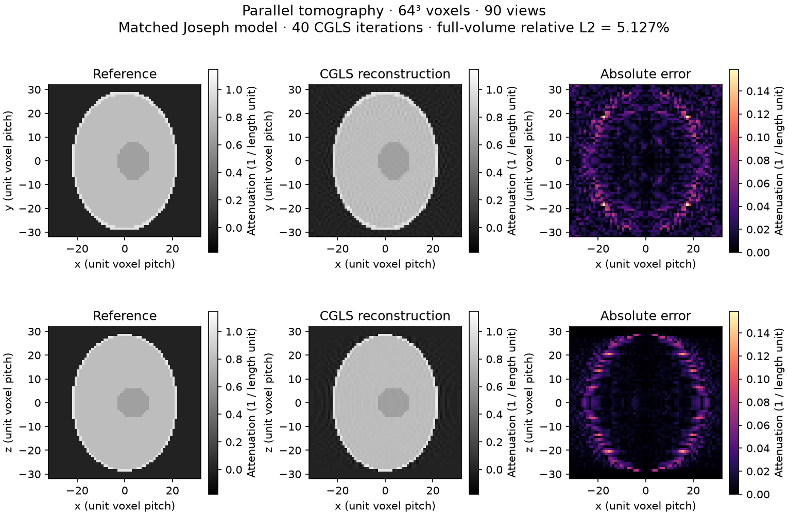
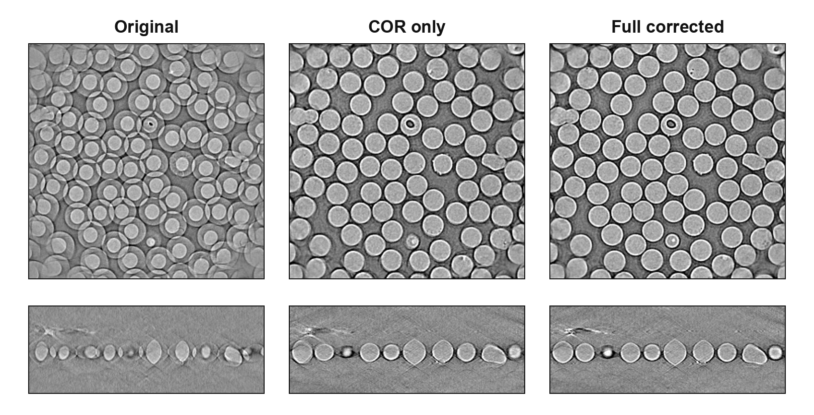

# Image provenance

The README uses a reproducible synthetic reconstruction. Other assets are kept
as historical illustrations and are not presented as current validation.
Large GIFs are linked here rather than loaded automatically on the project page.

## Reproducible synthetic reconstruction

[reconstruction-example.png](reconstruction-example.png) comes from
[the public Python example](../examples/simulate_and_reconstruct.py) and
[its plotting script](../examples/plot_reconstruction.py). It uses a 64³
Shepp–Logan phantom, 90 uniform half-turn parallel views, unit voxel/detector
pitch, and 40 Joseph-model CGLS iterations on CUDA/Pallas. Full-volume relative
L2 error is about 5.13%; termination is the iteration limit. Simulation and
reconstruction share the same model, so this does not measure independent
forward-model accuracy.

The adjacent [JSON record](reconstruction-example.json) contains exact settings,
versions, display ranges, and hashes. Reference and reconstruction use one
attenuation scale; both error panels use one absolute-error scale. No volume
crop, intensity fit, or display clipping of negative values is used. Follow
[reproduction instructions](../examples/README.md#reproduce-the-readme-figure)
to regenerate the image on CPU or CUDA.

## Historical real-data illustrations

The existing project description identifies these as DIAD beamline data of
100 µm ruby spheres. The raw acquisition and complete processing configuration
are not bundled. These panels illustrate qualitative reconstruction changes;
they do not establish current pose accuracy, absolute attenuation accuracy, or
runtime. Their original display scaling is retained.

[Per-projection pose-adjustment plot](projection_pose_corrections_3d_zoomed.png)
accompanied this illustration. Treat it as historical context with the same
reproduction limitation.

## Other historical assets

These assets predate the current reproducible example. No complete generation
recipe or measured source snapshot has been established for them in this
cleanup. They remain available without being used to support current metrics.

| Group | Files |
| --- | --- |
| Synthetic alignment panels | [Canonical misalignments](tomojax-canonical-misalignment-grid.png), [before/after alignment](tomojax-alignment-before-after.png), [phantom orthoslices](tomojax-phantom94-orthoslices.png) |
| Static phantom and reconstruction | [Phantom slice](phantom_slice.png), [phantom volume](phantom_volume.png), [reconstruction slice](recon_slice.png), [reconstruction volume](recon_volume.png) |
| Sinograms | [Original](sinogram.png), [misaligned](misaligned_sinogram.png), [noisy](noisy_sinogram.png) |
| Alignment animations | [Misaligned](alignment_process_misaligned.gif), [noisy](alignment_process_noisy.gif) |
| Projection animations | [Projections](projections.gif), [misaligned spin](spin_projections_misaligned.gif), [noisy spin](spin_projections_noisy.gif) |
| Slice animation | [Montage](montage_scroll.gif) |
